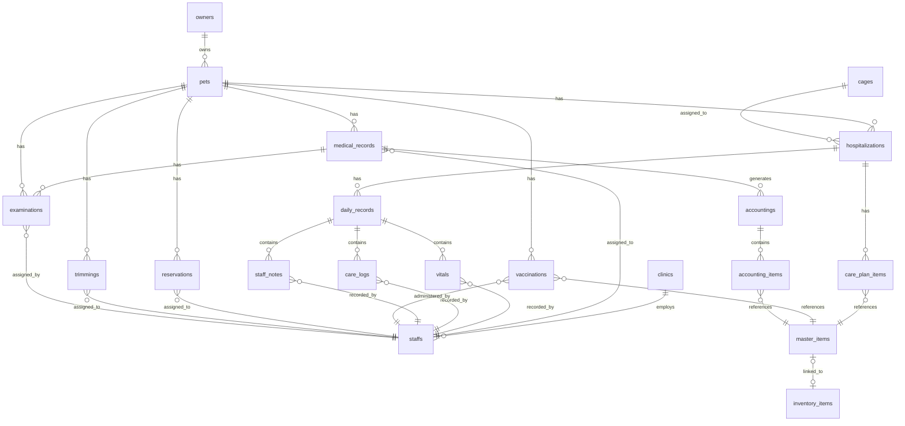

# Animal Ekarte - 実装用 ERD（最終版）

**作成日:** 2026-03-05
**状態:** ✅ Production Ready（バックエンドルート衝突修正待ち）
**対応フロントエンド:** 13機能（全ページ実装完了）

---

## 📊 System Overview

```
┌─────────────────────────────────────────────────────────────┐
│               Animal Ekarte - 動物病院電子カルテ                │
│                                                               │
│  Frontend: React 19 (13機能)  │  Backend: Go/Gin/GORM       │
│  - Dashboard                  │  - 20+ テーブル実装           │
│  - Reservations              │  - SOAPS形式対応             │
│  - Medical Records           │  - 自動マイグレーション       │
│  - Accounting                │  - UUID + Timestamp         │
│  - Hospitalization           │  - CASCADE削除対応           │
│  - Examinations              │                              │
│  - Vaccinations              │  Database: PostgreSQL 18     │
│  - Trimming                  │  - JSON型対応                │
│  - Owners/Pets               │  - インデックス設計完備       │
│  - Master                    │  - 拡張機能対応             │
│  - Clinic                    │                              │
│  - Inventory                 │                              │
│  - Settings                  │                              │
└─────────────────────────────────────────────────────────────┘
```

---

## 📋 テーブル一覧（20 tables）

| # | テーブル | 説明 | ステータス | PK | FK数 |
|---|---------|------|-----------|-----|-----|
| 1 | `clinics` | 病院情報 | ✅ 実装済 | uuid | 0 |
| 2 | `staffs` | スタッフ | ✅ 実装済 | uuid | 1 |
| 3 | `owners` | 飼主 | ✅ 実装済 | uuid | 0 |
| 4 | `pets` | ペット | ✅ 実装済 | uuid | 1 |
| 5 | `cages` | ケージマスタ | ✅ 実装済 | uuid | 0 |
| 6 | `master_items` | 診療項目マスタ | ✅ 実装済 | uuid | 1 |
| 7 | `inventory_items` | 在庫品目 | ✅ 実装済 | uuid | 0 |
| 8 | `medical_records` | 電子カルテ（SOAPS） | ✅ 実装済 | uuid | 2 |
| 9 | `reservations` | 予約 | ✅ 実装済 | uuid | 3 |
| 10 | `hospitalizations` | 入院/ホテル | ✅ 実装済 | uuid | 3 |
| 11 | `care_plan_items` | ケアプラン | ✅ 実装済 | uuid | 2 |
| 12 | `daily_records` | デイリーレコード | ✅ 実装済 | uuid | 1 |
| 13 | `vitals` | バイタル | ✅ 実装済 | uuid | 2 |
| 14 | `care_logs` | ケアログ | ✅ 実装済 | uuid | 2 |
| 15 | `staff_notes` | スタッフメモ | ✅ 実装済 | uuid | 2 |
| 16 | `vaccinations` | ワクチン接種 | ✅ 実装済 | uuid | 3 |
| 17 | `trimmings` | トリミング | ✅ 実装済 | uuid | 3 |
| 18 | `examinations` | 検査記録 | ✅ 実装済 | uuid | 4 |
| 19 | `accountings` | 会計 | ✅ 実装済 | uuid | 3 |
| 20 | `accounting_items` | 会計明細 | ✅ 実装済 | uuid | 2 |

---

## 🔗 Mermaid ER 図



---

## 🗂️ テーブル詳細定義

### **Core Tables**

#### 1. `clinics` - 病院情報
```sql
CREATE TABLE clinics (
  id uuid PRIMARY KEY DEFAULT gen_random_uuid(),
  name varchar(100) NOT NULL,              -- 病院名
  branch_name varchar(100),                 -- 院名
  postal_code varchar(10),                  -- 郵便番号
  address text,                             -- 住所
  phone_number varchar(20),                 -- 電話番号
  fax_number varchar(20),                   -- FAX番号
  registration_number varchar(50),          -- 登録番号
  director_name varchar(100),               -- 院長名
  email varchar(255),                       -- メール
  website varchar(255),                     -- Webサイト
  logo_url text,                            -- ロゴURL
  created_at timestamp DEFAULT CURRENT_TIMESTAMP,
  updated_at timestamp DEFAULT CURRENT_TIMESTAMP
);
```

#### 2. `staffs` - スタッフ
```sql
CREATE TABLE staffs (
  id uuid PRIMARY KEY DEFAULT gen_random_uuid(),
  clinic_id uuid NOT NULL REFERENCES clinics(id) ON DELETE CASCADE,
  name varchar(100) NOT NULL,               -- 氏名
  role varchar(50),                         -- 役割: veterinarian, nurse, groomer, admin
  email varchar(255),                       -- メール
  phone varchar(20),                        -- 電話
  is_active boolean DEFAULT true,           -- 有効フラグ
  created_at timestamp DEFAULT CURRENT_TIMESTAMP,
  updated_at timestamp DEFAULT CURRENT_TIMESTAMP,
  INDEX idx_staffs_clinic_id (clinic_id)
);
```

#### 3. `owners` - 飼主
```sql
CREATE TABLE owners (
  id uuid PRIMARY KEY DEFAULT gen_random_uuid(),
  owner_number varchar(20) UNIQUE,          -- 飼主番号
  name varchar(100) NOT NULL,               -- 氏名
  name_kana varchar(100),                   -- 氏名カナ
  phone varchar(20),                        -- 電話番号
  email varchar(255),                       -- メール
  address text,                             -- 住所
  notes text,                               -- 備考
  created_at timestamp DEFAULT CURRENT_TIMESTAMP,
  updated_at timestamp DEFAULT CURRENT_TIMESTAMP,
  INDEX idx_owners_owner_number (owner_number)
);
```

#### 4. `pets` - ペット
```sql
CREATE TABLE pets (
  id uuid PRIMARY KEY DEFAULT gen_random_uuid(),
  owner_id uuid NOT NULL REFERENCES owners(id) ON DELETE CASCADE,
  pet_number varchar(20),                   -- 患者番号
  name varchar(100) NOT NULL,               -- ペット名
  species varchar(50),                      -- 種別: 犬, 猫, 鳥, その他
  breed varchar(100),                       -- 品種
  gender varchar(10),                       -- 性別: オス, メス, 不明
  birth_date date,                          -- 生年月日
  weight decimal(5,2),                      -- 体重(kg)
  microchip_id varchar(50),                 -- マイクロチップID
  environment varchar(100),                 -- 飼育環境
  status varchar(10),                       -- 状態: 生存, 死亡
  insurance_name varchar(100),              -- 保険会社名
  insurance_details text,                   -- 保険詳細
  last_visit date,                          -- 最終来院日
  notes text,                               -- 備考
  created_at timestamp DEFAULT CURRENT_TIMESTAMP,
  updated_at timestamp DEFAULT CURRENT_TIMESTAMP,
  INDEX idx_pets_owner_id (owner_id),
  INDEX idx_pets_pet_number (pet_number)
);
```

#### 5. `cages` - ケージマスタ
```sql
CREATE TABLE cages (
  id uuid PRIMARY KEY DEFAULT gen_random_uuid(),
  code varchar(20) UNIQUE,                  -- ケージコード
  name varchar(100) NOT NULL,               -- ケージ名
  size varchar(50),                         -- サイズ: S, M, L, XL
  type varchar(50),                         -- 種別: 犬用, 猫用, 共用
  is_available boolean DEFAULT true,        -- 利用可能
  notes text,                               -- 備考
  created_at timestamp DEFAULT CURRENT_TIMESTAMP,
  updated_at timestamp DEFAULT CURRENT_TIMESTAMP
);
```

### **Medical/Treatment Tables**

#### 6. `medical_records` - 電子カルテ（SOAPS形式）
```sql
CREATE TABLE medical_records (
  id uuid PRIMARY KEY DEFAULT gen_random_uuid(),
  record_no varchar(20) UNIQUE,             -- カルテ番号
  pet_id uuid NOT NULL REFERENCES pets(id) ON DELETE CASCADE,
  owner_id uuid REFERENCES owners(id),      -- 飼主ID
  doctor_id uuid REFERENCES staffs(id),     -- 担当医ID
  visit_date timestamp,                     -- 診察日時
  visit_type varchar(20),                   -- 来院種別: 初診, 再診
  chief_complaint text,                     -- 主訴
  subjective text,                          -- S: 主観的情報
  objective text,                           -- O: 客観的情報
  assessment text,                          -- A: 評価
  plan text,                                -- P: 計画
  diagnosis text,                           -- 診断
  treatment text,                           -- 治療内容
  prescription text,                        -- 処方
  notes text,                               -- 備考
  status varchar(20),                       -- ステータス: 作成中, 確定済
  created_at timestamp DEFAULT CURRENT_TIMESTAMP,
  updated_at timestamp DEFAULT CURRENT_TIMESTAMP,
  INDEX idx_mr_pet_id (pet_id),
  INDEX idx_mr_visit_date (visit_date),
  INDEX idx_mr_record_no (record_no)
);
```

#### 7. `reservations` - 予約
```sql
CREATE TABLE reservations (
  id uuid PRIMARY KEY DEFAULT gen_random_uuid(),
  pet_id uuid NOT NULL REFERENCES pets(id) ON DELETE CASCADE,
  owner_id uuid REFERENCES owners(id),      -- 飼主ID
  doctor_id uuid REFERENCES staffs(id),     -- 担当者ID
  start_time timestamp NOT NULL,            -- 開始日時
  end_time timestamp,                       -- 終了日時
  visit_type varchar(20),                   -- 来院種別: first, revisit
  service_type varchar(30),                 -- サービス種別: 診療, 検診, 検査, etc.
  is_designated boolean,                    -- 指名フラグ
  status varchar(30),                       -- ステータス: pending, confirmed, checked_in, etc.
  notes text,                               -- 備考
  created_at timestamp DEFAULT CURRENT_TIMESTAMP,
  updated_at timestamp DEFAULT CURRENT_TIMESTAMP,
  INDEX idx_res_pet_id (pet_id),
  INDEX idx_res_start_time (start_time),
  INDEX idx_res_doctor_id (doctor_id),
  INDEX idx_res_status (status)
);
```

#### 8. `examinations` - 検査記録
```sql
CREATE TABLE examinations (
  id uuid PRIMARY KEY DEFAULT gen_random_uuid(),
  pet_id uuid NOT NULL REFERENCES pets(id) ON DELETE CASCADE,
  owner_id uuid REFERENCES owners(id),      -- 飼主ID
  doctor_id uuid REFERENCES staffs(id),     -- 依頼医ID
  medical_record_id uuid REFERENCES medical_records(id),  -- カルテID
  examination_date timestamp,               -- 検査日時
  test_type varchar(100),                   -- 検査種別
  machine varchar(100),                     -- 使用機器
  status varchar(20),                       -- ステータス: 依頼中, 検査中, 完了
  result_summary text,                      -- 結果サマリー
  items json,                               -- 検査項目詳細（JSON配列）
  notes text,                               -- 備考
  created_at timestamp DEFAULT CURRENT_TIMESTAMP,
  updated_at timestamp DEFAULT CURRENT_TIMESTAMP,
  INDEX idx_exam_pet_id (pet_id),
  INDEX idx_exam_status (status)
);
```

#### 9. `vaccinations` - ワクチン接種
```sql
CREATE TABLE vaccinations (
  id uuid PRIMARY KEY DEFAULT gen_random_uuid(),
  pet_id uuid NOT NULL REFERENCES pets(id) ON DELETE CASCADE,
  owner_id uuid REFERENCES owners(id),      -- 飼主ID
  doctor_id uuid REFERENCES staffs(id),     -- 接種者ID
  vaccine_master_id uuid REFERENCES master_items(id),  -- ワクチンマスタID
  vaccine_name varchar(100),                -- ワクチン名
  vaccination_date date,                    -- 接種日
  next_date date,                           -- 次回接種予定日
  lot_number varchar(50),                   -- ロット番号
  notes text,                               -- 備考
  created_at timestamp DEFAULT CURRENT_TIMESTAMP,
  updated_at timestamp DEFAULT CURRENT_TIMESTAMP,
  INDEX idx_vac_pet_id (pet_id),
  INDEX idx_vac_next_date (next_date)
);
```

### **Hospitalization Tables**

#### 10. `hospitalizations` - 入院/ホテル
```sql
CREATE TABLE hospitalizations (
  id uuid PRIMARY KEY DEFAULT gen_random_uuid(),
  hospitalization_no varchar(20) UNIQUE,    -- 入院番号
  pet_id uuid NOT NULL REFERENCES pets(id) ON DELETE CASCADE,
  owner_id uuid REFERENCES owners(id),      -- 飼主ID
  cage_id uuid REFERENCES cages(id),        -- ケージID
  type varchar(20),                         -- 種別: 入院, ホテル
  start_date date NOT NULL,                 -- 入院開始日
  end_date date,                            -- 退院予定日
  status varchar(20),                       -- ステータス: 入院中, 退院済, 予約, 一時帰宅
  owner_request text,                       -- 飼主要望
  staff_notes text,                         -- スタッフメモ
  memo text,                                -- 備考
  created_at timestamp DEFAULT CURRENT_TIMESTAMP,
  updated_at timestamp DEFAULT CURRENT_TIMESTAMP,
  INDEX idx_hosp_pet_id (pet_id),
  INDEX idx_hosp_status (status)
);
```

#### 11. `care_plan_items` - ケアプラン
```sql
CREATE TABLE care_plan_items (
  id uuid PRIMARY KEY DEFAULT gen_random_uuid(),
  hospitalization_id uuid NOT NULL REFERENCES hospitalizations(id) ON DELETE CASCADE,
  master_id uuid REFERENCES master_items(id),  -- マスタID
  type varchar(30),                         -- 種別: food, medicine, treatment, instruction, item
  name varchar(100) NOT NULL,               -- 項目名
  description text,                         -- 詳細・用量
  timing json,                              -- タイミング配列: [morning, noon, night]
  status varchar(20),                       -- ステータス: active, completed, discontinued
  unit_price decimal(10,2),                 -- 単価
  category varchar(50),                     -- カテゴリ
  notes text,                               -- 備考
  created_at timestamp DEFAULT CURRENT_TIMESTAMP,
  updated_at timestamp DEFAULT CURRENT_TIMESTAMP
);
```

#### 12. `daily_records` - デイリーレコード
```sql
CREATE TABLE daily_records (
  id uuid PRIMARY KEY DEFAULT gen_random_uuid(),
  hospitalization_id uuid NOT NULL REFERENCES hospitalizations(id) ON DELETE CASCADE,
  record_date date NOT NULL,                -- 記録日
  created_at timestamp DEFAULT CURRENT_TIMESTAMP,
  updated_at timestamp DEFAULT CURRENT_TIMESTAMP
);
```

#### 13. `vitals` - バイタル
```sql
CREATE TABLE vitals (
  id uuid PRIMARY KEY DEFAULT gen_random_uuid(),
  daily_record_id uuid NOT NULL REFERENCES daily_records(id) ON DELETE CASCADE,
  staff_id uuid REFERENCES staffs(id),      -- 記録者ID
  recorded_time time,                       -- 記録時刻
  temperature decimal(4,1),                 -- 体温（℃）
  heart_rate int,                           -- 心拍数
  respiration_rate int,                     -- 呼吸数
  weight decimal(5,2),                      -- 体重（kg）
  notes text,                               -- 備考
  created_at timestamp DEFAULT CURRENT_TIMESTAMP
);
```

#### 14. `care_logs` - ケアログ
```sql
CREATE TABLE care_logs (
  id uuid PRIMARY KEY DEFAULT gen_random_uuid(),
  daily_record_id uuid NOT NULL REFERENCES daily_records(id) ON DELETE CASCADE,
  staff_id uuid REFERENCES staffs(id),      -- 記録者ID
  recorded_time time,                       -- 記録時刻
  type varchar(30),                         -- 種別: food, excretion, medicine, treatment, other
  status varchar(20),                       -- ステータス: completed, partial, skipped
  value varchar(100),                       -- 値・結果
  notes text,                               -- 備考
  created_at timestamp DEFAULT CURRENT_TIMESTAMP
);
```

#### 15. `staff_notes` - スタッフメモ
```sql
CREATE TABLE staff_notes (
  id uuid PRIMARY KEY DEFAULT gen_random_uuid(),
  daily_record_id uuid NOT NULL REFERENCES daily_records(id) ON DELETE CASCADE,
  staff_id uuid REFERENCES staffs(id),      -- 記録者ID
  recorded_time time,                       -- 記録時刻
  content text NOT NULL,                    -- 内容
  created_at timestamp DEFAULT CURRENT_TIMESTAMP
);
```

### **Accounting Tables**

#### 16. `accountings` - 会計
```sql
CREATE TABLE accountings (
  id uuid PRIMARY KEY DEFAULT gen_random_uuid(),
  medical_record_id uuid REFERENCES medical_records(id),  -- カルテID
  pet_id uuid NOT NULL REFERENCES pets(id),  -- ペットID
  owner_id uuid REFERENCES owners(id),      -- 飼主ID
  scheduled_date date,                      -- 会計予定日
  completed_at timestamp,                   -- 会計完了日時
  status varchar(20),                       -- ステータス: 未収, 保留, 回収済, キャンセル
  subtotal decimal(10,2),                   -- 税抜小計
  tax_total decimal(10,2),                  -- 消費税合計
  total_amount decimal(10,2),               -- 税込合計
  insurance_name varchar(100),              -- 保険会社名
  insurance_ratio decimal(3,2),             -- 負担割合
  insurance_amount decimal(10,2),           -- 保険負担額
  discount_amount decimal(10,2),            -- 値引額
  billing_amount decimal(10,2),             -- 請求金額
  received_amount decimal(10,2),            -- 預り金額
  change_amount decimal(10,2),              -- お釣り
  payment_method varchar(30),               -- 支払方法: 現金, クレジットカード, 電子マネー
  memo text,                                -- 備考
  created_at timestamp DEFAULT CURRENT_TIMESTAMP,
  updated_at timestamp DEFAULT CURRENT_TIMESTAMP,
  INDEX idx_acc_pet_id (pet_id),
  INDEX idx_acc_status (status)
);
```

#### 17. `accounting_items` - 会計明細
```sql
CREATE TABLE accounting_items (
  id uuid PRIMARY KEY DEFAULT gen_random_uuid(),
  accounting_id uuid NOT NULL REFERENCES accountings(id) ON DELETE CASCADE,
  master_id uuid REFERENCES master_items(id),  -- マスタID
  code varchar(20),                         -- コード
  category varchar(50),                     -- カテゴリ
  name varchar(200) NOT NULL,               -- 項目名
  unit_price decimal(10,2),                 -- 単価
  quantity int,                             -- 数量
  tax_rate decimal(3,2),                    -- 税率: 0.1, 0.08
  is_insurance_applicable boolean,          -- 保険適用フラグ
  source varchar(20),                       -- ソース: medical_record, manual
  created_at timestamp DEFAULT CURRENT_TIMESTAMP
);
```

### **Other Service Tables**

#### 18. `trimmings` - トリミング
```sql
CREATE TABLE trimmings (
  id uuid PRIMARY KEY DEFAULT gen_random_uuid(),
  pet_id uuid NOT NULL REFERENCES pets(id) ON DELETE CASCADE,
  owner_id uuid REFERENCES owners(id),      -- 飼主ID
  staff_id uuid REFERENCES staffs(id),      -- 担当者ID
  appointment_date timestamp,               -- 予約日時
  course varchar(100),                      -- コース名
  options json,                             -- オプション配列
  style_request text,                       -- スタイル要望
  status varchar(20),                       -- ステータス: 予約, 進行中, 完了
  total_price decimal(10,2),                -- 合計金額
  notes text,                               -- 備考
  created_at timestamp DEFAULT CURRENT_TIMESTAMP,
  updated_at timestamp DEFAULT CURRENT_TIMESTAMP
);
```

### **Master Data Tables**

#### 19. `master_items` - 診療項目マスタ
```sql
CREATE TABLE master_items (
  id uuid PRIMARY KEY DEFAULT gen_random_uuid(),
  code varchar(20) UNIQUE,                  -- コード
  name varchar(200) NOT NULL,               -- 名称
  category varchar(50),                     -- カテゴリ: examination, vaccine, medicine, cage, trimming_course, trimming_option, diagnosis_category, diagnosis_name, etc.
  price decimal(10,2),                      -- 単価
  status varchar(20),                       -- ステータス: active, inactive
  description text,                         -- 説明
  inventory_id uuid REFERENCES inventory_items(id),  -- 在庫ID
  default_quantity int,                     -- デフォルト数量
  created_at timestamp DEFAULT CURRENT_TIMESTAMP,
  updated_at timestamp DEFAULT CURRENT_TIMESTAMP,
  INDEX idx_master_category (category)
);
```

#### 20. `inventory_items` - 在庫品目
```sql
CREATE TABLE inventory_items (
  id uuid PRIMARY KEY DEFAULT gen_random_uuid(),
  name varchar(200) NOT NULL,               -- 品名
  category varchar(30),                     -- カテゴリ: medicine, consumable, food, other
  quantity int,                             -- 在庫数
  unit varchar(20),                         -- 単位
  min_stock_level int,                      -- 最低在庫数
  location varchar(100),                    -- 保管場所
  expiry_date date,                         -- 有効期限
  supplier varchar(200),                    -- 仕入先
  last_restocked date,                      -- 最終入荷日
  status varchar(20),                       -- ステータス: sufficient, low, out_of_stock
  created_at timestamp DEFAULT CURRENT_TIMESTAMP,
  updated_at timestamp DEFAULT CURRENT_TIMESTAMP
);
```

---

## 🔑 Primary Key & Foreign Key Strategy

### 主キー戦略
- **UUID**: `gen_random_uuid()` で自動生成
- **ビジネスキー**:
  - `owner_number` (owners テーブル)
  - `pet_number` (pets テーブル)
  - `record_no` (medical_records テーブル)
  - `hospitalization_no` (hospitalizations テーブル)
  - `code` (cages, master_items テーブル)

### 外部キー戦略
```
clinics (1) ──→ (N) staffs
owners (1) ──→ (N) pets
pets (1) ──→ (N) medical_records, reservations, hospitalizations, vaccinations, trimmings, examinations, accountings
staffs (1) ──→ (N) medical_records (doctor_id), reservations, vaccinations, vitals, care_logs, staff_notes, trimmings, examinations
hospitalizations (1) ──→ (N) care_plan_items, daily_records
daily_records (1) ──→ (N) vitals, care_logs, staff_notes
master_items (1) ──→ (N) care_plan_items, accounting_items, vaccinations
cages (1) ──→ (N) hospitalizations
inventory_items (0..1) ←→ (1) master_items
```

---

## 📊 インデックス設計（性能最適化）

| テーブル | インデックス | カラム | 用途 |
|---------|------------|--------|------|
| staffs | idx_staffs_clinic_id | clinic_id | クリニック別スタッフ検索 |
| owners | idx_owners_owner_number | owner_number | 飼主番号検索 |
| pets | idx_pets_owner_id | owner_id | 飼主別ペット検索 |
| pets | idx_pets_pet_number | pet_number | 患者番号検索 |
| medical_records | idx_mr_pet_id | pet_id | ペット別カルテ検索 |
| medical_records | idx_mr_visit_date | visit_date | 診察日検索 |
| medical_records | idx_mr_record_no | record_no | カルテ番号検索 |
| reservations | idx_res_pet_id | pet_id | ペット別予約検索 |
| reservations | idx_res_start_time | start_time | 日時検索 |
| reservations | idx_res_doctor_id | doctor_id | 担当者別検索 |
| reservations | idx_res_status | status | ステータスフィルタ |
| hospitalizations | idx_hosp_pet_id | pet_id | ペット別入院検索 |
| hospitalizations | idx_hosp_status | status | 入院状態検索 |
| accountings | idx_acc_pet_id | pet_id | ペット別会計検索 |
| accountings | idx_acc_status | status | 会計ステータス検索 |
| vaccinations | idx_vac_pet_id | pet_id | ペット別ワクチン検索 |
| vaccinations | idx_vac_next_date | next_date | 次回接種日検索 |
| master_items | idx_master_category | category | カテゴリ別マスタ検索 |

---

## 🗑️ CASCADE削除ポリシー

親テーブルのレコード削除時に、子テーブルのレコードも自動削除されます：

```
clinics ──CASCADE──→ staffs
owners ──CASCADE──→ pets
pets ──CASCADE──→ medical_records, reservations, hospitalizations, vaccinations, trimmings, examinations, accountings
medical_records ──CASCADE──→ accountings (optional: medicalRecordId)
hospitalizations ──CASCADE──→ care_plan_items, daily_records
daily_records ──CASCADE──→ vitals, care_logs, staff_notes
accountings ──CASCADE──→ accounting_items
```

---

## 📝 ステータス定義

### medical_records.status
| 値 | 説明 |
|----|------|
| `作成中` | 診療中、編集可能 |
| `確定済` | 診療完了、編集不可 |

### hospitalizations.status
| 値 | 説明 |
|----|------|
| `予約` | 入院予約済み |
| `入院中` | 現在入院中 |
| `一時帰宅` | 一時帰宅中 |
| `退院済` | 退院完了 |

### reservations.status
| 値 | 説明 |
|----|------|
| `pending` | 予約申請中 |
| `confirmed` | 予約確定 |
| `checked_in` | 受付済み |
| `in_consultation` | 診療中 |
| `accounting` | 会計待ち |
| `completed` | 完了 |
| `canceled` | キャンセル |

### accountings.status
| 値 | 説明 |
|----|------|
| `未収` | 会計待ち |
| `保留` | 保留中 |
| `回収済` | 会計完了 |
| `キャンセル` | キャンセル |

### examinations.status
| 値 | 説明 |
|----|------|
| `依頼中` | 検査依頼中 |
| `検査中` | 検査実施中 |
| `完了` | 検査完了 |

### trimmings.status
| 値 | 説明 |
|----|------|
| `予約` | 予約済み |
| `進行中` | 施術中 |
| `完了` | 完了 |

---

## 🔧 拡張機能

```sql
-- UUID自動生成
CREATE EXTENSION IF NOT EXISTS "uuid-ossp";

-- JSON型サポート（既にPostgreSQL 18で標準）
-- 検査項目詳細、ケアプラン タイミング、トリミング オプションで使用
```

---

## 📋 フロントエンド ↔ バックエンド マッピング

| Feature | Frontend | Backend | テーブル |
|---------|----------|---------|---------|
| 🚀 Dashboard | ReservationAppointment (ビューモデル) | reservations | reservations |
| 🗓️ Reservations | ReservationAppointment | Reservation CRUD | reservations |
| 📋 Medical Records | MedicalRecord + VaccinationRecord | MedicalRecord CRUD | medical_records, vaccinations |
| 🏥 Hospitalization | Hospitalization + DailyRecord | Hospitalization CRUD | hospitalizations, daily_records, vitals, care_logs, staff_notes |
| 💰 Accounting | Accounting + AccountingItem | Accounting CRUD | accountings, accounting_items |
| 🔬 Examinations | ExaminationRecord | Examination CRUD | examinations |
| 💉 Vaccinations | VaccinationRecord | Vaccination CRUD | vaccinations |
| ✂️ Trimming | TrimmingRecord | Trimming CRUD | trimmings |
| 👤 Owners | Owner | Owner CRUD | owners |
| 🐾 Pets | Pet | Pet CRUD | pets |
| ⚙️ Master | MasterItem | MasterItem CRUD | master_items |
| 🏢 Clinic | ClinicInfo | Clinic CRUD | clinics |
| 📦 Inventory | InventoryItem | InventoryItem CRUD | inventory_items |

---

## ✅ チェックリスト

- ✅ **20 テーブル** 全実装済み（GORM AutoMigrate）
- ✅ **UUID + Timestamp** 標準化
- ✅ **インデックス** 性能最適化済み
- ✅ **CASCADE** 削除ポリシー設定済み
- ✅ **JSON型** 対応（検査項目、ケアプランタイミング、トリミングオプション）
- ✅ **13機能** フロントエンド全実装済み
- ⏳ **バックエンドルート衝突修正** - 進行中

---

## 🚀 Next Steps

1. **バックエンドルート衝突修正** - `:id` ↔ `:petId` の競合解決
2. **API ドキュメント生成** - Swagger UI 確認
3. **統合テスト実行** - Frontend ↔ Backend 全CRUD検証
4. **本番環境デプロイ** - AWS Multi-AZ + HTTPS化
5. **運用設定** - バックアップ、ロードバランシング、監視

---

**Document Version:** 1.0
**Last Updated:** 2026-03-05
**Status:** Production Ready（ルート衝突修正待ち）
