# Entity Relationship Diagram (ERD)

## 概要

Animal Ekarte（動物病院電子カルテシステム）の完全なデータベース設計です。
本ドキュメントは `spec.md` および `ui-sample/` のフロントエンド実装から導出されています。

> **Note**: 本ドキュメントは**目標設計（Target Design）**です。
> 現在実装されているテーブルは `backend/migrations/001_init.sql` を参照してください。

### 実装状況

| 状態 | テーブル |
|------|---------|
| ✅ 実装済 | owners, pets, medical_records |
| 📋 設計のみ | その他19テーブル |

---

## ER図 (Mermaid)

```mermaid
erDiagram
    %% Core Entities
    clinics ||--o{ staffs : "employs"
    owners ||--o{ pets : "owns"
    pets ||--o{ medical_records : "has"
    pets ||--o{ hospitalizations : "has"
    pets ||--o{ reservations : "has"
    pets ||--o{ vaccinations : "has"
    pets ||--o{ trimmings : "has"
    pets ||--o{ examinations : "has"
    pets ||--o{ accountings : "has"

    %% Hospitalization relationships
    hospitalizations ||--o{ care_plan_items : "has"
    hospitalizations ||--o{ daily_records : "has"
    daily_records ||--o{ vitals : "contains"
    daily_records ||--o{ care_logs : "contains"
    daily_records ||--o{ staff_notes : "contains"
    cages ||--o{ hospitalizations : "assigned_to"

    %% Accounting relationships
    medical_records ||--o| accountings : "generates"
    accountings ||--o{ accounting_items : "contains"

    %% Master relationships
    master_items ||--o{ care_plan_items : "references"
    master_items ||--o{ accounting_items : "references"
    inventory_items ||--o| master_items : "linked_to"

    %% ==================== Entity Definitions ====================

    clinics {
        uuid id PK
        varchar(100) name "病院名"
        varchar(100) branch_name "院名"
        varchar(10) postal_code "郵便番号"
        text address "住所"
        varchar(20) phone_number "電話番号"
        varchar(20) fax_number "FAX番号"
        varchar(50) registration_number "登録番号"
        varchar(100) director_name "院長名"
        varchar(255) email "メール"
        varchar(255) website "Webサイト"
        text logo_url "ロゴURL"
        timestamp created_at
        timestamp updated_at
    }

    staffs {
        uuid id PK
        uuid clinic_id FK
        varchar(100) name "氏名"
        varchar(50) role "役割 (veterinarian, nurse, groomer, admin)"
        varchar(255) email "メール"
        varchar(20) phone "電話"
        boolean is_active "有効フラグ"
        timestamp created_at
        timestamp updated_at
    }

    owners {
        uuid id PK
        varchar(100) name "氏名"
        varchar(100) name_kana "氏名カナ"
        varchar(20) phone "電話番号"
        varchar(255) email "メール"
        text address "住所"
        text notes "備考"
        timestamp created_at
        timestamp updated_at
    }

    pets {
        uuid id PK
        uuid owner_id FK "飼い主ID"
        varchar(20) pet_number "患者番号"
        varchar(100) name "ペット名"
        varchar(50) species "種別 (犬, 猫, etc.)"
        varchar(100) breed "品種"
        varchar(10) gender "性別 (オス, メス)"
        date birth_date "生年月日"
        decimal(5_2) weight "体重(kg)"
        varchar(50) microchip_id "マイクロチップID"
        varchar(50) environment "飼育環境"
        varchar(10) status "状態 (生存, 死亡)"
        varchar(100) insurance_name "保険会社名"
        text insurance_details "保険詳細"
        date last_visit "最終来院日"
        text notes "備考"
        timestamp created_at
        timestamp updated_at
    }

    medical_records {
        uuid id PK
        varchar(20) record_no "カルテ番号"
        uuid pet_id FK "ペットID"
        uuid owner_id FK "飼い主ID"
        uuid doctor_id FK "担当医ID"
        timestamp visit_date "診察日時"
        varchar(10) visit_type "来院種別 (初診, 再診)"
        text chief_complaint "主訴"
        text subjective "S: 主観的情報"
        text objective "O: 客観的情報"
        text assessment "A: 評価"
        text plan "P: 計画"
        text surgery_notes "S: 手術・特記事項"
        text diagnosis "診断"
        text treatment "治療内容"
        text prescription "処方"
        text notes "備考"
        varchar(20) status "ステータス (作成中, 確定済)"
        timestamp created_at
        timestamp updated_at
    }

    reservations {
        uuid id PK
        uuid pet_id FK "ペットID"
        uuid owner_id FK "飼い主ID"
        uuid doctor_id FK "担当者ID"
        timestamp start_time "開始日時"
        timestamp end_time "終了日時"
        varchar(20) visit_type "来院種別 (first, revisit)"
        varchar(30) service_type "サービス種別"
        boolean is_designated "指名"
        varchar(30) status "ステータス"
        text notes "備考"
        timestamp created_at
        timestamp updated_at
    }

    hospitalizations {
        uuid id PK
        varchar(20) hospitalization_no "入院番号"
        uuid pet_id FK "ペットID"
        uuid owner_id FK "飼い主ID"
        uuid cage_id FK "ケージID"
        varchar(20) type "種別 (入院, ホテル)"
        date start_date "入院開始日"
        date end_date "退院予定日"
        varchar(20) status "ステータス (入院中, 退院済, 予約, 一時帰宅)"
        text owner_request "飼い主要望"
        text staff_notes "スタッフメモ"
        text memo "備考"
        timestamp created_at
        timestamp updated_at
    }

    cages {
        uuid id PK
        varchar(20) code "ケージコード"
        varchar(100) name "ケージ名"
        varchar(50) size "サイズ (S, M, L, XL)"
        varchar(50) type "種別 (犬用, 猫用, 共用)"
        boolean is_available "利用可能"
        text notes "備考"
        timestamp created_at
        timestamp updated_at
    }

    care_plan_items {
        uuid id PK
        uuid hospitalization_id FK "入院ID"
        uuid master_id FK "マスタID"
        varchar(30) type "種別 (food, medicine, treatment, instruction, item)"
        varchar(100) name "項目名"
        text description "詳細・用量"
        json timing "タイミング配列"
        varchar(20) status "ステータス (active, completed, discontinued)"
        decimal(10_2) unit_price "単価"
        varchar(50) category "カテゴリ"
        text notes "備考"
        timestamp created_at
        timestamp updated_at
    }

    daily_records {
        uuid id PK
        uuid hospitalization_id FK "入院ID"
        date record_date "記録日"
        timestamp created_at
        timestamp updated_at
    }

    vitals {
        uuid id PK
        uuid daily_record_id FK "デイリーレコードID"
        uuid staff_id FK "記録者ID"
        time recorded_time "記録時刻"
        decimal(4_1) temperature "体温"
        int heart_rate "心拍数"
        int respiration_rate "呼吸数"
        decimal(5_2) weight "体重"
        text notes "備考"
        timestamp created_at
    }

    care_logs {
        uuid id PK
        uuid daily_record_id FK "デイリーレコードID"
        uuid staff_id FK "記録者ID"
        time recorded_time "記録時刻"
        varchar(30) type "種別 (food, excretion, medicine, treatment, other)"
        varchar(20) status "ステータス (completed, partial, skipped)"
        varchar(100) value "値・結果"
        text notes "備考"
        timestamp created_at
    }

    staff_notes {
        uuid id PK
        uuid daily_record_id FK "デイリーレコードID"
        uuid staff_id FK "記録者ID"
        time recorded_time "記録時刻"
        text content "内容"
        timestamp created_at
    }

    vaccinations {
        uuid id PK
        uuid pet_id FK "ペットID"
        uuid owner_id FK "飼い主ID"
        uuid doctor_id FK "接種者ID"
        uuid vaccine_master_id FK "ワクチンマスタID"
        varchar(100) vaccine_name "ワクチン名"
        date vaccination_date "接種日"
        date next_date "次回接種予定日"
        varchar(50) lot_number "ロット番号"
        text notes "備考"
        timestamp created_at
        timestamp updated_at
    }

    trimmings {
        uuid id PK
        uuid pet_id FK "ペットID"
        uuid owner_id FK "飼い主ID"
        uuid staff_id FK "担当者ID"
        timestamp appointment_date "予約日時"
        varchar(100) course "コース名"
        json options "オプション配列"
        text style_request "スタイル要望"
        varchar(20) status "ステータス (予約, 進行中, 完了)"
        decimal(10_2) total_price "合計金額"
        text notes "備考"
        timestamp created_at
        timestamp updated_at
    }

    examinations {
        uuid id PK
        uuid pet_id FK "ペットID"
        uuid owner_id FK "飼い主ID"
        uuid doctor_id FK "依頼医ID"
        uuid medical_record_id FK "カルテID"
        timestamp examination_date "検査日時"
        varchar(100) test_type "検査種別"
        varchar(100) machine "使用機器"
        varchar(20) status "ステータス (依頼中, 検査中, 完了)"
        text result_summary "結果サマリー"
        json items "検査項目詳細"
        text notes "備考"
        timestamp created_at
        timestamp updated_at
    }

    accountings {
        uuid id PK
        uuid medical_record_id FK "カルテID"
        uuid pet_id FK "ペットID"
        uuid owner_id FK "飼い主ID"
        date scheduled_date "会計予定日"
        timestamp completed_at "会計完了日時"
        varchar(20) status "ステータス (未収, 保留, 回収済, キャンセル)"
        decimal(10_2) subtotal "税抜小計"
        decimal(10_2) tax_total "消費税合計"
        decimal(10_2) total_amount "税込合計"
        varchar(100) insurance_name "保険会社名"
        decimal(3_2) insurance_ratio "負担割合"
        decimal(10_2) insurance_amount "保険負担額"
        decimal(10_2) discount_amount "値引額"
        decimal(10_2) billing_amount "請求金額"
        decimal(10_2) received_amount "預り金額"
        decimal(10_2) change_amount "お釣り"
        varchar(30) payment_method "支払方法 (現金, クレジットカード, 電子マネー)"
        text memo "備考"
        timestamp created_at
        timestamp updated_at
    }

    accounting_items {
        uuid id PK
        uuid accounting_id FK "会計ID"
        uuid master_id FK "マスタID"
        varchar(20) code "コード"
        varchar(50) category "カテゴリ"
        varchar(200) name "項目名"
        decimal(10_2) unit_price "単価"
        int quantity "数量"
        decimal(3_2) tax_rate "税率 (0.1, 0.08)"
        boolean is_insurance_applicable "保険適用"
        varchar(20) source "ソース (medical_record, manual)"
        timestamp created_at
    }

    master_items {
        uuid id PK
        varchar(20) code "コード"
        varchar(200) name "名称"
        varchar(50) category "カテゴリ"
        decimal(10_2) price "単価"
        varchar(20) status "ステータス (active, inactive)"
        text description "説明"
        uuid inventory_id FK "在庫ID"
        int default_quantity "デフォルト数量"
        timestamp created_at
        timestamp updated_at
    }

    inventory_items {
        uuid id PK
        varchar(200) name "品名"
        varchar(30) category "カテゴリ (medicine, consumable, food, other)"
        int quantity "在庫数"
        varchar(20) unit "単位"
        int min_stock_level "最低在庫数"
        varchar(100) location "保管場所"
        date expiry_date "有効期限"
        varchar(200) supplier "仕入先"
        date last_restocked "最終入荷日"
        varchar(20) status "ステータス (sufficient, low, out_of_stock)"
        timestamp created_at
        timestamp updated_at
    }
```



---

## テーブル一覧

### コアテーブル

| テーブル名 | 説明 | 主要なリレーション |
|-----------|------|-------------------|
| `clinics` | クリニック情報 | 1:N staffs |
| `staffs` | スタッフ（獣医師、看護師、トリマー等） | N:1 clinics |
| `owners` | 飼い主情報 | 1:N pets |
| `pets` | ペット情報 | N:1 owners, 1:N medical_records, hospitalizations, etc. |

### 診療関連テーブル

| テーブル名 | 説明 | 主要なリレーション |
|-----------|------|-------------------|
| `medical_records` | 電子カルテ（SOAPS形式） | N:1 pets, 1:1 accountings |
| `reservations` | 予約管理 | N:1 pets, N:1 staffs |
| `examinations` | 検査記録 | N:1 pets, N:1 medical_records |
| `vaccinations` | ワクチン接種記録 | N:1 pets |

### 入院関連テーブル

| テーブル名 | 説明 | 主要なリレーション |
|-----------|------|-------------------|
| `hospitalizations` | 入院/ホテル記録 | N:1 pets, N:1 cages, 1:N care_plan_items |
| `cages` | ケージマスタ | 1:N hospitalizations |
| `care_plan_items` | ケアプラン項目 | N:1 hospitalizations |
| `daily_records` | 日次記録 | N:1 hospitalizations |
| `vitals` | バイタル記録 | N:1 daily_records |
| `care_logs` | ケアログ | N:1 daily_records |
| `staff_notes` | スタッフメモ | N:1 daily_records |

### 会計関連テーブル

| テーブル名 | 説明 | 主要なリレーション |
|-----------|------|-------------------|
| `accountings` | 会計情報 | N:1 pets, N:1 medical_records |
| `accounting_items` | 会計明細 | N:1 accountings |

### その他

| テーブル名 | 説明 | 主要なリレーション |
|-----------|------|-------------------|
| `trimmings` | トリミング記録 | N:1 pets |
| `master_items` | 診療項目マスタ | 1:N care_plan_items, accounting_items |
| `inventory_items` | 在庫管理 | 1:1 master_items |

---

## ステータス定義

### medical_records.status
| 値 | 説明 |
|----|------|
| `作成中` | 診療中、編集可能 |
| `確定済` | 診療完了、編集不可 |

### hospitalizations.status
| 値 | 説明 |
|----|------|
| `予約` | 入院予約済み |
| `入院中` | 現在入院中 |
| `一時帰宅` | 一時帰宅中 |
| `退院済` | 退院完了 |

### hospitalizations.type
| 値 | 説明 |
|----|------|
| `入院` | 医療入院 |
| `ホテル` | ペットホテル |

### reservations.status
| 値 | 説明 |
|----|------|
| `pending` | 予約申請中 |
| `confirmed` | 予約確定 |
| `checked_in` | 受付済み |
| `in_consultation` | 診療中 |
| `accounting` | 会計待ち |
| `completed` | 完了 |
| `canceled` | キャンセル |

### reservations.service_type
| 値 | 説明 |
|----|------|
| `診療` | 通常診療 |
| `検診` | 定期検診 |
| `検査` | 検査 |
| `手術` | 手術 |
| `トリミング` | トリミング |
| `ワクチン` | ワクチン接種 |
| `入院` | 入院手続き |
| `ホテル` | ペットホテル |

### accountings.status
| 値 | 説明 |
|----|------|
| `未収` | 会計待ち |
| `保留` | 保留 |
| `回収済` | 会計完了 |
| `キャンセル` | キャンセル |

### trimmings.status
| 値 | 説明 |
|----|------|
| `予約` | 予約済み |
| `進行中` | 施術中 |
| `完了` | 完了 |

### examinations.status
| 値 | 説明 |
|----|------|
| `依頼中` | 検査依頼中 |
| `検査中` | 検査実施中 |
| `完了` | 検査完了 |

### master_items.category
| 値 | 説明 |
|----|------|
| `examination` | 診察料 |
| `vaccine` | ワクチン |
| `medicine` | 薬剤 |
| `staff` | スタッフ |
| `insurance` | 保険 |
| `cage` | ケージ |
| `serviceType` | サービス種別 |
| `trimming_course` | トリミングコース |
| `trimming_option` | トリミングオプション |

### inventory_items.status
| 値 | 説明 |
|----|------|
| `sufficient` | 十分 |
| `low` | 残少 |
| `out_of_stock` | 在庫切れ |

---

## インデックス設計

| テーブル | インデックス | カラム | 用途 |
|---------|------------|--------|------|
| pets | idx_pets_owner_id | owner_id | 飼い主別ペット検索 |
| pets | idx_pets_pet_number | pet_number | 患者番号検索 |
| medical_records | idx_mr_pet_id | pet_id | ペット別カルテ検索 |
| medical_records | idx_mr_visit_date | visit_date | 日付検索 |
| medical_records | idx_mr_record_no | record_no | カルテ番号検索 |
| reservations | idx_res_pet_id | pet_id | ペット別予約検索 |
| reservations | idx_res_start_time | start_time | 日時検索 |
| reservations | idx_res_doctor_id | doctor_id | 担当者別検索 |
| hospitalizations | idx_hosp_pet_id | pet_id | ペット別入院検索 |
| hospitalizations | idx_hosp_status | status | ステータス検索 |
| accountings | idx_acc_pet_id | pet_id | ペット別会計検索 |
| accountings | idx_acc_status | status | ステータス検索 |
| vaccinations | idx_vac_pet_id | pet_id | ペット別ワクチン検索 |
| vaccinations | idx_vac_next_date | next_date | 次回接種日検索 |

---

## 削除時の動作（CASCADE）

| 親テーブル | 子テーブル | 動作 |
|-----------|-----------|------|
| owners | pets | CASCADE |
| pets | medical_records | CASCADE |
| pets | hospitalizations | CASCADE |
| pets | reservations | CASCADE |
| pets | vaccinations | CASCADE |
| pets | trimmings | CASCADE |
| pets | examinations | CASCADE |
| pets | accountings | CASCADE |
| hospitalizations | care_plan_items | CASCADE |
| hospitalizations | daily_records | CASCADE |
| daily_records | vitals | CASCADE |
| daily_records | care_logs | CASCADE |
| daily_records | staff_notes | CASCADE |
| accountings | accounting_items | CASCADE |

---

## 拡張機能

```sql
-- UUID自動生成
CREATE EXTENSION IF NOT EXISTS "uuid-ossp";

-- 全文検索（日本語対応時）
-- CREATE EXTENSION IF NOT EXISTS "pgroonga";
```
