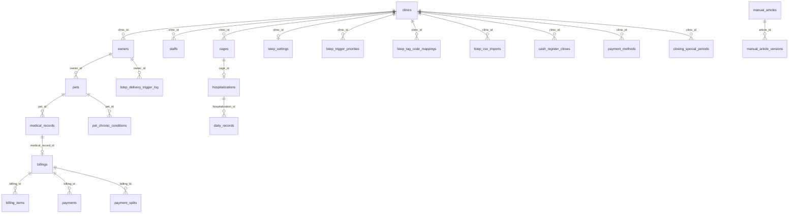

# データベース設計書 (Entity Relationship Diagram)

> **Animal Ekarte**: 高精度・高整合な動物病院データモデル
> **バージョン**: v31.18 | **最新更新**: 2026-05-27 | **状態**: Production Ready (96 Tables Verified)

---

## 1. データモデルの全体像 (全 96 テーブル)

本システムは、臨床・経営・外部連携を支える 96 のテーブルが高度に正規化され、臨床的整合性を維持するリレーショナルモデルを採用しています。

### 1.1 主要ドメイン別構成

| 区分 | 管理対象（物理テーブル名抜粋） |
|:---|:---|
| **システム基盤 (12)** | `accounts`, `clinics`, `clinic_settings`, `clinic_holidays`, `closing_special_periods`, `staffs`, `permission_groups`, `permission_group_rules`, `audit_logs`, `companies`, `password_reset_tokens`, `occupations` |
| **入院・稼働 (10)** | `hospitalizations`, `daily_records`, `care_plan_items`, `care_logs`, `cages`, `hospitalization_plans`, `staff_notes`, `staff_clinic_assignments`, `staff_permission_groups`, `staff_reservation_exclusions` |
| **臨床・診察 (21)** | `owners`, `pets`, `pet_chronic_conditions`, `animal_species`, `chief_complaint_types`, `medical_records`, `medical_record_addenda`, `medical_record_images`, `clinical_plans`, `treatment_plans`, `treatments`, `prescriptions`, `procedures`, `vital_records`, `inquiries`, `consultations`, `diagnosis_names`, `diagnosis_types`, `inquiry_templates`, `medicines`, `vaccines` |
| **検査・予防 (8)** | `exams`, `exam_results`, `exam_types`, `exam_type_fields`, `vaccinations`, `checkups`, `checkup_types`, `shared_files` |
| **予約・シフト (11)** | `appointments`, `reservation_types`, `reservation_type_groups`, `reservation_type_occupations`, `reservation_type_unavailable_times`, `appointment_trimming_details`, `appointment_trimming_options`, `shift_entries`, `shift_entry_breaks`, `shift_templates`, `shift_template_breaks` |
| **会計・経営 (12)** | `billings`, `billing_items`, `payments`, `payment_splits`, `billing_refunds`, `billing_confirmations`, `cash_register_closes`, `payment_methods`, `merchandise_items`, `estimate_items`, `estimates`, `insurances` |
| **トリミング (2)** | `trimming_courses`, `trimming_options` |
| **在庫 (1)** | `inventory_items` |
| **LINE/CRM (19)** | `line_customers`, `line_link_tokens`, `line_send_logs`, `line_reservation_settings`, `lstep_settings`, `lstep_trigger_priorities`, `lstep_delivery_trigger_log`, `lstep_csv_imports`, `lstep_tag_cache`, `lstep_tag_code_mappings`, `lstep_auto_managed_prefixes`, `lstep_condition_tag_mappings`, `lstep_send_purpose_tag_prefixes`, `lstep_friend_attribute_snapshots`, `lstep_sync_error_counters`, `clinic_integrations`, `manual_articles`, `manual_article_versions`, `lstep_migration_progress` |

---

## 2. エンティティ・リレーション図 (Mermaid)

```mermaid
erDiagram
    clinics ||--o{ owners : "clinic_id"
    clinics ||--o{ staffs : "clinic_id"
    owners ||--o{ pets : "owner_id"
    pets ||--o{ medical_records : "pet_id"
    pets ||--o{ pet_chronic_conditions : "pet_id"
    medical_records ||--o| billings : "medical_record_id"
    billings ||--o{ billing_items : "billing_id"
    billings ||--o{ payments : "billing_id"
    billings ||--o{ payment_splits : "billing_id"

    %% 入院
    clinics ||--o{ cages : "clinic_id"
    hospitalizations ||--o{ daily_records : "hospitalization_id"
    cages ||--o| hospitalizations : "cage_id"

    %% Lステップ連携 (拡張)
    clinics ||--o| lstep_settings : "clinic_id"
    clinics ||--o{ lstep_trigger_priorities : "clinic_id"
    owners ||--o{ lstep_delivery_trigger_log : "owner_id"
    clinics ||--o{ lstep_tag_code_mappings : "clinic_id"
    clinics ||--o{ lstep_csv_imports : "clinic_id"

    %% 会計・集計 (拡張)
    clinics ||--o{ cash_register_closes : "clinic_id"
    clinics ||--o{ payment_methods : "clinic_id"
    clinics ||--o{ closing_special_periods : "clinic_id"

    %% 取扱説明書（マニュアル）
    manual_articles ||--o{ manual_article_versions : "article_id"
```

---

## 3. 設計原則と安全性

### 3.1 物理設計の標準
- **主キー**: 全テーブルで `bigint` (auto_increment) または `uuid` を採用。
- **日時管理**: タイムゾーンの不整合を排除するため、全て `timestamptz` (UTC) で統一。
- **整合性制約**: アプリケーション層だけでなく、DB レベルで `FOREIGN KEY` 制約によりデータの孤立を防止。

### 3.2 高度なマルチテナント隔離
- **`clinic_id` の強制**: ビジネスロジックが関わる全テーブルに `clinic_id` カラムを配置。
- **物理隔離インデックス**: `idx_xxx_clinic_id` を全テーブルに作成し、他拠点へのアクセスを DB レベルで遮断。

### 3.3 臨床データの信頼性
- **計量データ**: 体重 (`numeric(6,2)`) や薬剤量、金額には、丸め誤差の発生しない固定小数点方式を採用。
- **監査証跡**: `audit_logs` により、誰が・いつ・どの値を・どのように変更したかを全件記録。

---

## 4. 未確定事項（分類に関する注記）

> [!NOTE]
> `insurances`（保険マスタ）テーブルは、動物病院における会計精算（保険窓口精算・自己負担額計算）に深く関連するため、本設計書では暫定的に「会計・経営」ドメインに分類しています。ただし、診療時の適用確認やカルテ側の参照も発生するため、将来的な見直しで「臨床・診察」あるいは独立ドメインへ再編される可能性があります。
