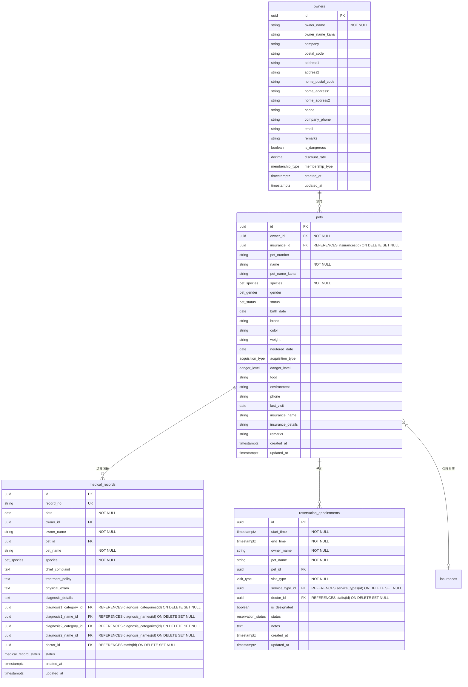
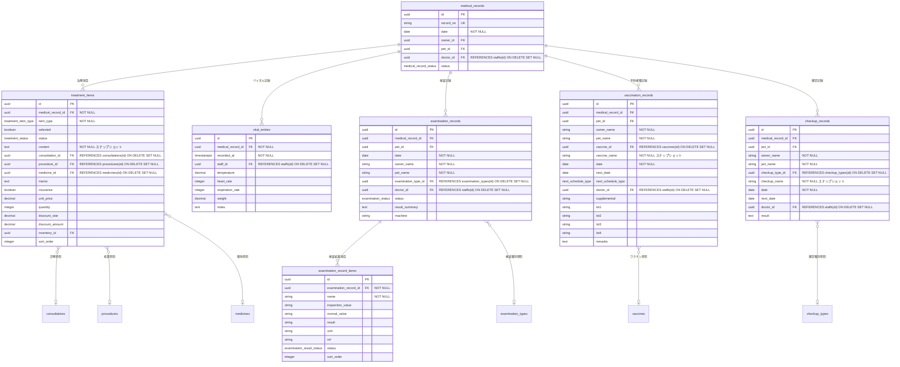
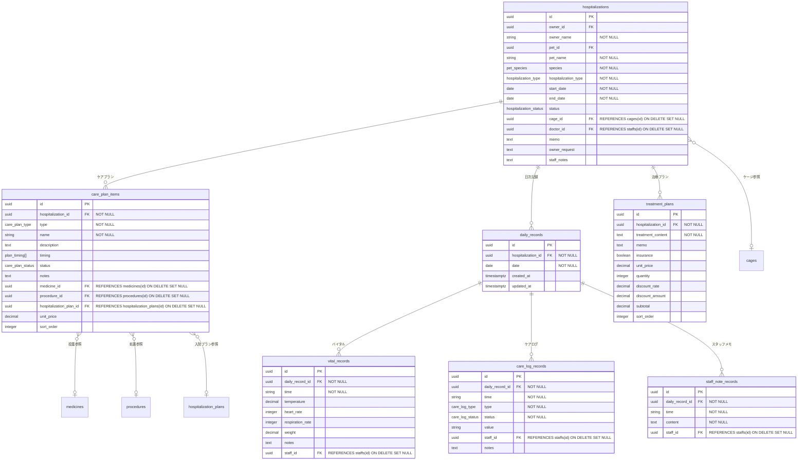
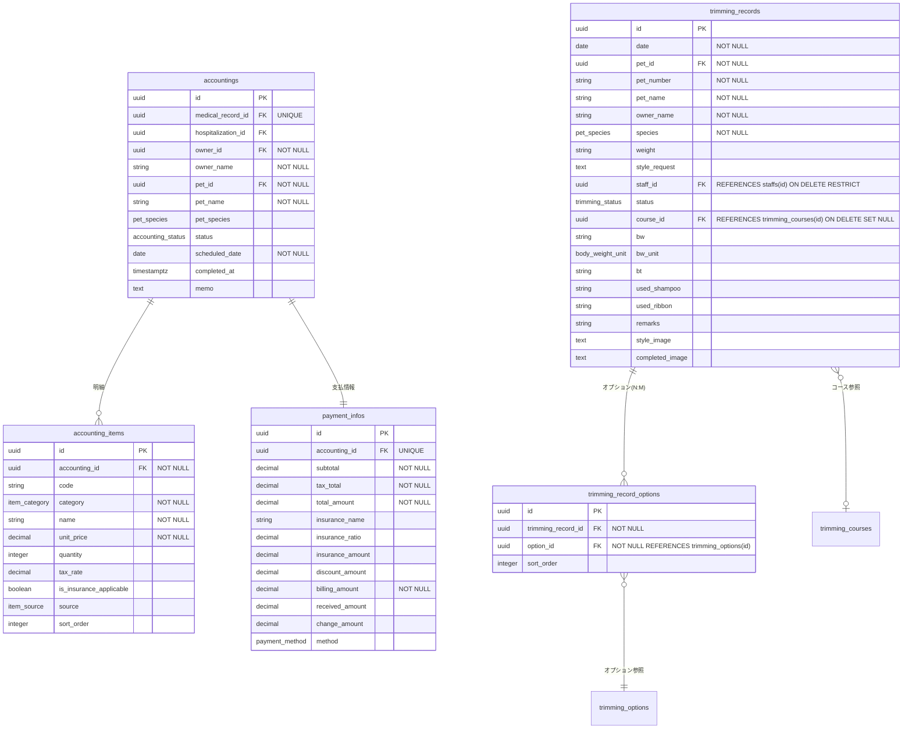
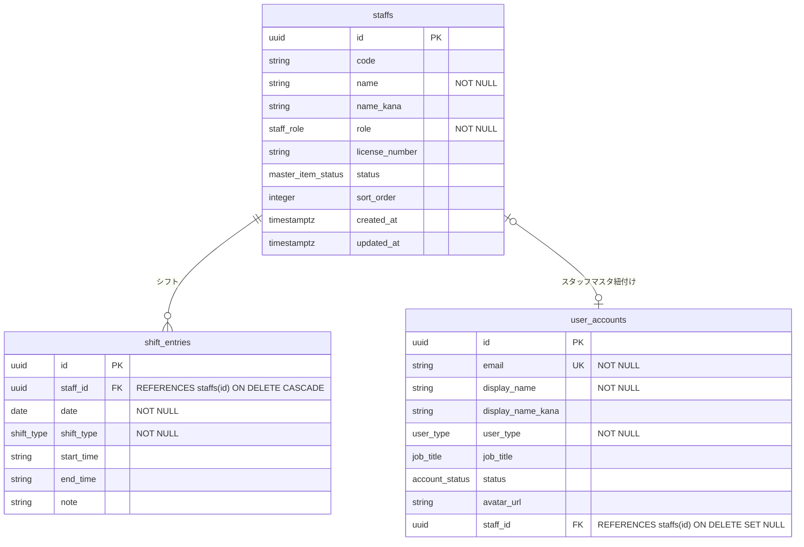
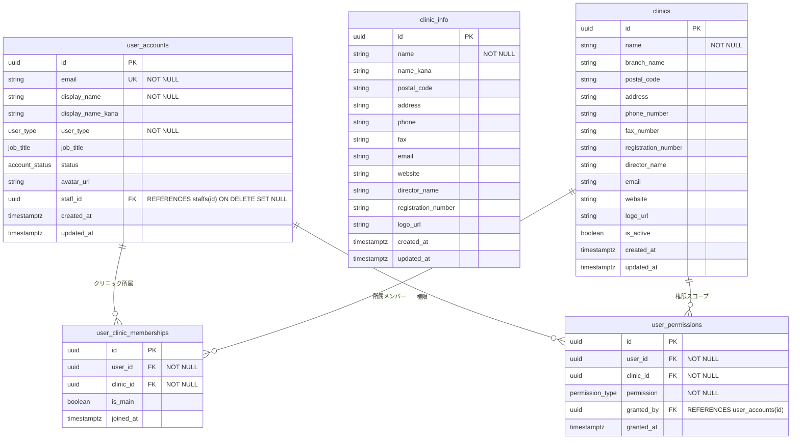

# 動物病院管理システム ER図 (Entity Relationship Diagram)

バージョン: 5.0（45テーブル 専用マスタテーブル版）
更新日: 2026-03-12
状態: Production Ready

本ドキュメントは、システムの全45テーブルとそのリレーションを定義します。
PostgreSQL 18 + Go/GORM（クリーンアーキテクチャ）で実装。

---

## 変更概要（v4.0 → v5.0）

| 変更内容 | 詳細 |
|---------|------|
| STIテーブル廃止 | `master_items`（15カテゴリ統合）を削除 |
| 検査マスタ廃止 | `master_item_inspections` を削除 |
| 専用マスタ追加 | 16の専用マスタテーブルに分離 |
| スタッフ正規化 | `staffs` テーブルを独立させ、全 `doctor TEXT` フィールドをFKに正規化 |
| 診断名正規化 | `diagnosis_names` テーブルで self-referencing `parent_id` を廃止し、明示的FK（`diagnosis_category_id`）を追加 |
| ケアプラン正規化 | `care_plan_items` のポリモーフィック参照（`master_id`）を解消し、3専用FKに分離 |
| テーブル総数 | 31 → 45 |

---

## テーブル一覧（45テーブル）

| # | テーブル名 | 区分 | 状態 |
|---|-----------|------|------|
| 1 | `inventory_items` | 独立 | 変更なし |
| 2 | `clinic_info` | マスタ | 変更なし |
| 3 | `clinics` | 認証 | 変更なし |
| 4 | `owners` | コア | 変更なし |
| 5 | `examination_types` | マスタ | 新規 |
| 6 | `examination_type_items` | マスタ | 新規 |
| 7 | `vaccines` | マスタ | 新規 |
| 8 | `medicines` | マスタ | 新規（inventory_id FK） |
| 9 | `staffs` | マスタ | 新規 |
| 10 | `insurances` | マスタ | 新規 |
| 11 | `cages` | マスタ | 新規 |
| 12 | `service_types` | マスタ | 新規 |
| 13 | `consultations` | マスタ | 新規 |
| 14 | `procedures` | マスタ | 新規 |
| 15 | `hospitalization_plans` | マスタ | 新規 |
| 16 | `trimming_courses` | マスタ | 新規 |
| 17 | `trimming_options` | マスタ | 新規 |
| 18 | `diagnosis_categories` | マスタ | 新規 |
| 19 | `diagnosis_names` | マスタ | 新規（diagnosis_category_id FK） |
| 20 | `checkup_types` | マスタ | 新規 |
| 21 | `user_accounts` | 認証 | staff_id FK変更 |
| 22 | `shift_entries` | シフト | staff_id FK変更 |
| 23 | `user_clinic_memberships` | 認証 | 変更なし |
| 24 | `user_permissions` | 認証 | 変更なし |
| 25 | `pets` | コア | insurance_id FK追加 |
| 26 | `medical_records` | カルテ | diagnosis FK変更、doctor_id FK追加 |
| 27 | `treatment_items` | カルテ | item_type追加、consultation/procedure/medicine_id FK追加 |
| 28 | `vital_entries` | カルテ | staff_id FK変更 |
| 29 | `examination_records` | カルテ | examination_type_id FK変更、doctor_id FK変更 |
| 30 | `examination_record_items` | カルテ | 変更なし |
| 31 | `vaccination_records` | カルテ | vaccine_id FK追加、doctor_id FK変更 |
| 32 | `checkup_records` | カルテ | checkup_type_id FK変更、doctor_id FK変更 |
| 33 | `hospitalizations` | 入院 | cage_id/doctor_id FK変更 |
| 34 | `care_plan_items` | 入院 | medicine/procedure/hospitalization_plan_id FK追加 |
| 35 | `treatment_plans` | 入院 | 変更なし |
| 36 | `daily_records` | 入院 | 変更なし |
| 37 | `vital_records` | 入院 | staff_id FK変更 |
| 38 | `care_log_records` | 入院 | staff_id FK変更 |
| 39 | `staff_note_records` | 入院 | staff_id FK変更 |
| 40 | `reservation_appointments` | 予約 | service_type_id/doctor_id FK変更 |
| 41 | `trimming_records` | トリミング | staff_id/course_id FK変更 |
| 42 | `trimming_record_options` | トリミング | option_id FK変更 |
| 43 | `accountings` | 会計 | 変更なし |
| 44 | `accounting_items` | 会計 | 変更なし |
| 45 | `payment_infos` | 会計 | 変更なし |

---

## システム全体 ER図（概要）

全リレーションを俯瞰するための概要図（フィールド詳細は省略）。


```mermaid
erDiagram
    %% ===== コア =====
    owners ||--o{ pets : "飼育"
    pets ||--o{ medical_records : "診療記録"
    pets ||--o{ hospitalizations : "入院記録"
    pets ||--o{ trimming_records : "トリミング記録"
    pets ||--o{ reservation_appointments : "予約"
    pets ||--o{ examination_records : "検査記録"
    pets ||--o{ vaccination_records : "予防接種記録"
    pets ||--o{ checkup_records : "健診記録"
    pets }o--o| insurances : "保険参照"

    %% ===== カルテ =====
    medical_records ||--o{ treatment_items : "治療項目"
    medical_records ||--o{ vital_entries : "バイタル"
    medical_records ||--o{ examination_records : "検査"
    medical_records ||--o{ vaccination_records : "予防接種"
    medical_records ||--o{ checkup_records : "健診"
    medical_records |o--o| accountings : "会計連携"
    medical_records }o--o| diagnosis_categories : "診断1カテゴリ"
    medical_records }o--o| diagnosis_names : "診断1名"
    examination_records ||--o{ examination_record_items : "検査結果項目"

    %% ===== 入院 =====
    hospitalizations ||--o{ care_plan_items : "ケアプラン"
    hospitalizations ||--o{ daily_records : "日次記録"
    hospitalizations ||--o{ treatment_plans : "治療プラン"
    hospitalizations |o--o| accountings : "入院会計連携"
    hospitalizations }o--o| cages : "ケージ参照"
    daily_records ||--o{ vital_records : "バイタル"
    daily_records ||--o{ care_log_records : "ケアログ"
    daily_records ||--o{ staff_note_records : "スタッフメモ"

    %% ===== 会計 =====
    accountings ||--o{ accounting_items : "明細"
    accountings ||--|| payment_infos : "支払情報"
    owners ||--o{ accountings : "会計"

    %% ===== トリミング =====
    trimming_records ||--o{ trimming_record_options : "オプション選択"
    trimming_records }o--o| trimming_courses : "コース参照"
    trimming_record_options }o--|| trimming_options : "オプション参照"

    %% ===== マスタ =====
    examination_types ||--o{ examination_type_items : "検査項目定義"
    examination_types ||--o{ examination_records : "検査種別参照"
    vaccines ||--o{ vaccination_records : "ワクチン参照"
    medicines |o--o| inventory_items : "在庫連携"
    medicines ||--o{ treatment_items : "薬剤参照"
    medicines ||--o{ care_plan_items : "投薬参照"
    consultations ||--o{ treatment_items : "診察参照"
    procedures ||--o{ treatment_items : "処置参照"
    procedures ||--o{ care_plan_items : "処置参照"
    hospitalization_plans ||--o{ care_plan_items : "入院プラン参照"
    diagnosis_categories ||--o{ diagnosis_names : "診断名"
    checkup_types ||--o{ checkup_records : "健診種別参照"
    cages ||--o{ hospitalizations : "ケージ参照"
    service_types ||--o{ reservation_appointments : "サービス種別"
    insurances |o--o{ pets : "保険参照"

    %% ===== スタッフ =====
    staffs ||--o{ shift_entries : "シフト"
    staffs |o--o{ medical_records : "担当医"
    staffs |o--o{ reservation_appointments : "担当医予約"
    staffs |o--o{ trimming_records : "トリマー"
    staffs |o--o{ examination_records : "検査担当医"
    staffs |o--o| user_accounts : "スタッフマスタ紐付け"

    %% ===== 認証 =====
    user_accounts ||--o{ user_clinic_memberships : "クリニック所属"
    clinics ||--o{ user_clinic_memberships : "所属メンバー"
    user_accounts ||--o{ user_permissions : "権限付与"
    clinics ||--o{ user_permissions : "権限スコープ"
```

---

## マスタサブシステム図

専用マスタテーブル16個の詳細ER図。


```mermaid
erDiagram
    examination_types {
        uuid id PK
        string code
        string name "NOT NULL"
        master_item_status status
        text description
        integer sort_order
        timestamptz created_at
        timestamptz updated_at
    }

    examination_type_items {
        uuid id PK
        uuid examination_type_id FK "NOT NULL"
        string name "NOT NULL"
        string normal_value
        string unit
        integer sort_order
    }

    vaccines {
        uuid id PK
        string code
        string name "NOT NULL"
        vaccine_species species "NOT NULL"
        string interval
        string target_age
        master_item_status status
        text description
        integer sort_order
        timestamptz created_at
        timestamptz updated_at
    }

    medicines {
        uuid id PK
        string code
        string name "NOT NULL"
        dosage_form dosage_form
        medicine_unit medicine_unit
        decimal price
        integer default_quantity
        uuid inventory_id FK
        master_item_status status
        text description
        integer sort_order
        timestamptz created_at
        timestamptz updated_at
    }

    staffs {
        uuid id PK
        string code
        string name "NOT NULL"
        string name_kana
        staff_role role "NOT NULL"
        string license_number
        master_item_status status
        integer sort_order
        timestamptz created_at
        timestamptz updated_at
    }

    insurances {
        uuid id PK
        string code
        string name "NOT NULL"
        coverage_rate coverage_rate
        string contact_phone
        master_item_status status
        text description
        integer sort_order
        timestamptz created_at
        timestamptz updated_at
    }

    cages {
        uuid id PK
        string code
        string name "NOT NULL"
        cage_type cage_type
        cage_size cage_size
        master_item_status status
        text description
        integer sort_order
        timestamptz created_at
        timestamptz updated_at
    }

    service_types {
        uuid id PK
        string code
        string name "NOT NULL"
        string color
        string duration
        master_item_status status
        text description
        integer sort_order
        timestamptz created_at
        timestamptz updated_at
    }

    consultations {
        uuid id PK
        string code
        string name "NOT NULL"
        decimal price
        string time_condition
        master_item_status status
        text description
        integer sort_order
        timestamptz created_at
        timestamptz updated_at
    }

    procedures {
        uuid id PK
        string code
        string name "NOT NULL"
        decimal price
        string anesthesia
        master_item_status status
        text description
        integer sort_order
        timestamptz created_at
        timestamptz updated_at
    }

    hospitalization_plans {
        uuid id PK
        string code
        string name "NOT NULL"
        decimal price
        billing_unit billing_unit
        body_size body_size
        master_item_status status
        text description
        integer sort_order
        timestamptz created_at
        timestamptz updated_at
    }

    trimming_courses {
        uuid id PK
        string code
        string name "NOT NULL"
        decimal price
        target_size target_size
        master_item_status status
        text description
        integer sort_order
        timestamptz created_at
        timestamptz updated_at
    }

    trimming_options {
        uuid id PK
        string code
        string name "NOT NULL"
        decimal price
        combinable combinable
        master_item_status status
        text description
        integer sort_order
        timestamptz created_at
        timestamptz updated_at
    }

    diagnosis_categories {
        uuid id PK
        string code
        string name "NOT NULL"
        master_item_status status
        integer sort_order
        timestamptz created_at
        timestamptz updated_at
    }

    diagnosis_names {
        uuid id PK
        uuid diagnosis_category_id FK "NOT NULL"
        string code
        string name "NOT NULL"
        master_item_status status
        integer sort_order
        timestamptz created_at
        timestamptz updated_at
    }

    checkup_types {
        uuid id PK
        string code
        string name "NOT NULL"
        master_item_status status
        text description
        integer sort_order
        timestamptz created_at
        timestamptz updated_at
    }

    inventory_items {
        uuid id PK
        string name "NOT NULL"
        inventory_category category "NOT NULL"
        integer quantity
        string unit "NOT NULL"
        integer min_stock_level
        string location
        date expiry_date
        string supplier
        date last_restocked
        inventory_status status
        timestamptz created_at
        timestamptz updated_at
    }

    examination_types ||--o{ examination_type_items : "検査項目定義"
    diagnosis_categories ||--o{ diagnosis_names : "診断名"
    medicines |o--o| inventory_items : "在庫連携"
```

---

## コアエンティティ詳細図


```mermaid
erDiagram
    owners {
        uuid id PK
        string owner_name "NOT NULL"
        string owner_name_kana
        string company
        string postal_code
        string address1
        string address2
        string home_postal_code
        string home_address1
        string home_address2
        string phone
        string company_phone
        string email
        string remarks
        boolean is_dangerous
        decimal discount_rate
        membership_type membership_type
        timestamptz created_at
        timestamptz updated_at
    }

    pets {
        uuid id PK
        uuid owner_id FK "NOT NULL"
        uuid insurance_id FK "REFERENCES insurances(id) ON DELETE SET NULL"
        string pet_number
        string name "NOT NULL"
        string pet_name_kana
        pet_species species "NOT NULL"
        pet_gender gender
        pet_status status
        date birth_date
        string breed
        string color
        string weight
        date neutered_date
        acquisition_type acquisition_type
        danger_level danger_level
        string food
        string environment
        string phone
        date last_visit
        string insurance_name
        string insurance_details
        string remarks
        timestamptz created_at
        timestamptz updated_at
    }

    medical_records {
        uuid id PK
        string record_no UK
        date date "NOT NULL"
        uuid owner_id FK
        string owner_name "NOT NULL"
        uuid pet_id FK
        string pet_name "NOT NULL"
        pet_species species "NOT NULL"
        text chief_complaint
        text treatment_policy
        text physical_exam
        text diagnosis_details
        uuid diagnosis1_category_id FK "REFERENCES diagnosis_categories(id) ON DELETE SET NULL"
        uuid diagnosis1_name_id FK "REFERENCES diagnosis_names(id) ON DELETE SET NULL"
        uuid diagnosis2_category_id FK "REFERENCES diagnosis_categories(id) ON DELETE SET NULL"
        uuid diagnosis2_name_id FK "REFERENCES diagnosis_names(id) ON DELETE SET NULL"
        uuid doctor_id FK "REFERENCES staffs(id) ON DELETE SET NULL"
        medical_record_status status
        timestamptz created_at
        timestamptz updated_at
    }

    reservation_appointments {
        uuid id PK
        timestamptz start_time "NOT NULL"
        timestamptz end_time "NOT NULL"
        string owner_name "NOT NULL"
        string pet_name "NOT NULL"
        uuid pet_id FK
        visit_type visit_type "NOT NULL"
        uuid service_type_id FK "REFERENCES service_types(id) ON DELETE SET NULL"
        uuid doctor_id FK "REFERENCES staffs(id) ON DELETE SET NULL"
        boolean is_designated
        reservation_status status
        text notes
        timestamptz created_at
        timestamptz updated_at
    }

    owners ||--o{ pets : "飼育"
    pets ||--o{ medical_records : "診療記録"
    pets ||--o{ reservation_appointments : "予約"
    pets }o--o| insurances : "保険参照"
```

---

## 電子カルテ サブシステム図


```mermaid
erDiagram
    medical_records {
        uuid id PK
        string record_no UK
        date date "NOT NULL"
        uuid owner_id FK
        uuid pet_id FK
        uuid doctor_id FK "REFERENCES staffs(id) ON DELETE SET NULL"
        medical_record_status status
    }

    treatment_items {
        uuid id PK
        uuid medical_record_id FK "NOT NULL"
        treatment_item_type item_type "NOT NULL"
        boolean selected
        treatment_status status
        text content "NOT NULL スナップショット"
        uuid consultation_id FK "REFERENCES consultations(id) ON DELETE SET NULL"
        uuid procedure_id FK "REFERENCES procedures(id) ON DELETE SET NULL"
        uuid medicine_id FK "REFERENCES medicines(id) ON DELETE SET NULL"
        text memo
        boolean insurance
        decimal unit_price
        integer quantity
        decimal discount_rate
        decimal discount_amount
        uuid inventory_id FK
        integer sort_order
    }

    vital_entries {
        uuid id PK
        uuid medical_record_id FK "NOT NULL"
        timestamptz recorded_at "NOT NULL"
        uuid staff_id FK "REFERENCES staffs(id) ON DELETE SET NULL"
        decimal temperature
        integer heart_rate
        integer respiration_rate
        decimal weight
        text notes
    }

    examination_records {
        uuid id PK
        uuid medical_record_id FK
        uuid pet_id FK
        date date "NOT NULL"
        string owner_name "NOT NULL"
        string pet_name "NOT NULL"
        uuid examination_type_id FK "REFERENCES examination_types(id) ON DELETE SET NULL"
        uuid doctor_id FK "REFERENCES staffs(id) ON DELETE SET NULL"
        examination_status status
        text result_summary
        string machine
    }

    examination_record_items {
        uuid id PK
        uuid examination_record_id FK "NOT NULL"
        string name "NOT NULL"
        string inspection_value
        string normal_value
        string result
        string unit
        string ref
        examination_result_status status
        integer sort_order
    }

    vaccination_records {
        uuid id PK
        uuid medical_record_id FK
        uuid pet_id FK
        string owner_name "NOT NULL"
        string pet_name "NOT NULL"
        uuid vaccine_id FK "REFERENCES vaccines(id) ON DELETE SET NULL"
        string vaccine_name "NOT NULL スナップショット"
        date date "NOT NULL"
        date next_date
        next_schedule_type next_schedule_type
        uuid doctor_id FK "REFERENCES staffs(id) ON DELETE SET NULL"
        string supplemental
        string lot1
        string lot2
        string lot3
        string lot4
        text remarks
    }

    checkup_records {
        uuid id PK
        uuid medical_record_id FK
        uuid pet_id FK
        string owner_name "NOT NULL"
        string pet_name "NOT NULL"
        uuid checkup_type_id FK "REFERENCES checkup_types(id) ON DELETE SET NULL"
        string checkup_name "NOT NULL スナップショット"
        date date "NOT NULL"
        date next_date
        uuid doctor_id FK "REFERENCES staffs(id) ON DELETE SET NULL"
        text result
    }

    medical_records ||--o{ treatment_items : "治療項目"
    medical_records ||--o{ vital_entries : "バイタル記録"
    medical_records ||--o{ examination_records : "検査記録"
    medical_records ||--o{ vaccination_records : "予防接種記録"
    medical_records ||--o{ checkup_records : "健診記録"
    examination_records ||--o{ examination_record_items : "検査結果項目"
    treatment_items }o--o| consultations : "診察参照"
    treatment_items }o--o| procedures : "処置参照"
    treatment_items }o--o| medicines : "薬剤参照"
    vaccination_records }o--o| vaccines : "ワクチン参照"
    checkup_records }o--o| checkup_types : "健診種別参照"
    examination_records }o--o| examination_types : "検査種別参照"
```

---

## 入院管理 サブシステム図


```mermaid
erDiagram
    hospitalizations {
        uuid id PK
        uuid owner_id FK
        string owner_name "NOT NULL"
        uuid pet_id FK
        string pet_name "NOT NULL"
        pet_species species "NOT NULL"
        hospitalization_type hospitalization_type "NOT NULL"
        date start_date "NOT NULL"
        date end_date "NOT NULL"
        hospitalization_status status
        uuid cage_id FK "REFERENCES cages(id) ON DELETE SET NULL"
        uuid doctor_id FK "REFERENCES staffs(id) ON DELETE SET NULL"
        text memo
        text owner_request
        text staff_notes
    }

    care_plan_items {
        uuid id PK
        uuid hospitalization_id FK "NOT NULL"
        care_plan_type type "NOT NULL"
        string name "NOT NULL"
        text description
        plan_timing[] timing
        care_plan_status status
        text notes
        uuid medicine_id FK "REFERENCES medicines(id) ON DELETE SET NULL"
        uuid procedure_id FK "REFERENCES procedures(id) ON DELETE SET NULL"
        uuid hospitalization_plan_id FK "REFERENCES hospitalization_plans(id) ON DELETE SET NULL"
        decimal unit_price
        integer sort_order
    }

    daily_records {
        uuid id PK
        uuid hospitalization_id FK "NOT NULL"
        date date "NOT NULL"
        timestamptz created_at
        timestamptz updated_at
    }

    vital_records {
        uuid id PK
        uuid daily_record_id FK "NOT NULL"
        string time "NOT NULL"
        decimal temperature
        integer heart_rate
        integer respiration_rate
        decimal weight
        text notes
        uuid staff_id FK "REFERENCES staffs(id) ON DELETE SET NULL"
    }

    care_log_records {
        uuid id PK
        uuid daily_record_id FK "NOT NULL"
        string time "NOT NULL"
        care_log_type type "NOT NULL"
        care_log_status status "NOT NULL"
        string value
        uuid staff_id FK "REFERENCES staffs(id) ON DELETE SET NULL"
        text notes
    }

    staff_note_records {
        uuid id PK
        uuid daily_record_id FK "NOT NULL"
        string time "NOT NULL"
        text content "NOT NULL"
        uuid staff_id FK "REFERENCES staffs(id) ON DELETE SET NULL"
    }

    treatment_plans {
        uuid id PK
        uuid hospitalization_id FK "NOT NULL"
        text treatment_content "NOT NULL"
        text memo
        boolean insurance
        decimal unit_price
        integer quantity
        decimal discount_rate
        decimal discount_amount
        decimal subtotal
        integer sort_order
    }

    hospitalizations ||--o{ care_plan_items : "ケアプラン"
    hospitalizations ||--o{ daily_records : "日次記録"
    hospitalizations ||--o{ treatment_plans : "治療プラン"
    hospitalizations }o--o| cages : "ケージ参照"
    daily_records ||--o{ vital_records : "バイタル"
    daily_records ||--o{ care_log_records : "ケアログ"
    daily_records ||--o{ staff_note_records : "スタッフメモ"
    care_plan_items }o--o| medicines : "投薬参照"
    care_plan_items }o--o| procedures : "処置参照"
    care_plan_items }o--o| hospitalization_plans : "入院プラン参照"
```

---

## 会計・トリミング サブシステム図


```mermaid
erDiagram
    accountings {
        uuid id PK
        uuid medical_record_id FK "UNIQUE"
        uuid hospitalization_id FK
        uuid owner_id FK "NOT NULL"
        string owner_name "NOT NULL"
        uuid pet_id FK "NOT NULL"
        string pet_name "NOT NULL"
        pet_species pet_species
        accounting_status status
        date scheduled_date "NOT NULL"
        timestamptz completed_at
        text memo
    }

    accounting_items {
        uuid id PK
        uuid accounting_id FK "NOT NULL"
        string code
        item_category category "NOT NULL"
        string name "NOT NULL"
        decimal unit_price "NOT NULL"
        integer quantity
        decimal tax_rate
        boolean is_insurance_applicable
        item_source source
        integer sort_order
    }

    payment_infos {
        uuid id PK
        uuid accounting_id FK "UNIQUE"
        decimal subtotal "NOT NULL"
        decimal tax_total "NOT NULL"
        decimal total_amount "NOT NULL"
        string insurance_name
        decimal insurance_ratio
        decimal insurance_amount
        decimal discount_amount
        decimal billing_amount "NOT NULL"
        decimal received_amount
        decimal change_amount
        payment_method method
    }

    trimming_records {
        uuid id PK
        date date "NOT NULL"
        uuid pet_id FK "NOT NULL"
        string pet_number "NOT NULL"
        string pet_name "NOT NULL"
        string owner_name "NOT NULL"
        pet_species species "NOT NULL"
        string weight
        text style_request
        uuid staff_id FK "REFERENCES staffs(id) ON DELETE RESTRICT"
        trimming_status status
        uuid course_id FK "REFERENCES trimming_courses(id) ON DELETE SET NULL"
        string bw
        body_weight_unit bw_unit
        string bt
        string used_shampoo
        string used_ribbon
        string remarks
        text style_image
        text completed_image
    }

    trimming_record_options {
        uuid id PK
        uuid trimming_record_id FK "NOT NULL"
        uuid option_id FK "NOT NULL REFERENCES trimming_options(id)"
        integer sort_order
    }

    accountings ||--o{ accounting_items : "明細"
    accountings ||--|| payment_infos : "支払情報"
    trimming_records ||--o{ trimming_record_options : "オプション(N:M)"
    trimming_records }o--o| trimming_courses : "コース参照"
    trimming_record_options }o--|| trimming_options : "オプション参照"
```

---

## スタッフ・シフト管理 図


```mermaid
erDiagram
    staffs {
        uuid id PK
        string code
        string name "NOT NULL"
        string name_kana
        staff_role role "NOT NULL"
        string license_number
        master_item_status status
        integer sort_order
        timestamptz created_at
        timestamptz updated_at
    }

    shift_entries {
        uuid id PK
        uuid staff_id FK "REFERENCES staffs(id) ON DELETE CASCADE"
        date date "NOT NULL"
        shift_type shift_type "NOT NULL"
        string start_time
        string end_time
        string note
    }

    user_accounts {
        uuid id PK
        string email UK "NOT NULL"
        string display_name "NOT NULL"
        string display_name_kana
        user_type user_type "NOT NULL"
        job_title job_title
        account_status status
        string avatar_url
        uuid staff_id FK "REFERENCES staffs(id) ON DELETE SET NULL"
    }

    staffs ||--o{ shift_entries : "シフト"
    staffs |o--o| user_accounts : "スタッフマスタ紐付け"
```

---

## 認証・認可 サブシステム図


```mermaid
erDiagram
    clinics {
        uuid id PK
        string name "NOT NULL"
        string branch_name
        string postal_code
        string address
        string phone_number
        string fax_number
        string registration_number
        string director_name
        string email
        string website
        string logo_url
        boolean is_active
        timestamptz created_at
        timestamptz updated_at
    }

    clinic_info {
        uuid id PK
        string name "NOT NULL"
        string name_kana
        string postal_code
        string address
        string phone
        string fax
        string email
        string website
        string director_name
        string registration_number
        string logo_url
        timestamptz created_at
        timestamptz updated_at
    }

    user_accounts {
        uuid id PK
        string email UK "NOT NULL"
        string display_name "NOT NULL"
        string display_name_kana
        user_type user_type "NOT NULL"
        job_title job_title
        account_status status
        string avatar_url
        uuid staff_id FK "REFERENCES staffs(id) ON DELETE SET NULL"
        timestamptz created_at
        timestamptz updated_at
    }

    user_clinic_memberships {
        uuid id PK
        uuid user_id FK "NOT NULL"
        uuid clinic_id FK "NOT NULL"
        boolean is_main
        timestamptz joined_at
    }

    user_permissions {
        uuid id PK
        uuid user_id FK "NOT NULL"
        uuid clinic_id FK "NOT NULL"
        permission_type permission "NOT NULL"
        uuid granted_by FK "REFERENCES user_accounts(id)"
        timestamptz granted_at
    }

    user_accounts ||--o{ user_clinic_memberships : "クリニック所属"
    clinics ||--o{ user_clinic_memberships : "所属メンバー"
    user_accounts ||--o{ user_permissions : "権限"
    clinics ||--o{ user_permissions : "権限スコープ"
```

---

## エンティティ一覧（詳細）

### コアエンティティ

| # | エンティティ | テーブル | 説明 |
|---|------------|---------|------|
| 1 | Owner | `owners` | 飼主（顧客）。住所2種類（会社/自宅）、割引率、会員種別 |
| 2 | Pet | `pets` | ペット（患者）。種別・性別・ステータス・保険FKへ変更 |
| 3 | MedicalRecord | `medical_records` | 電子カルテ。SOAPS形式対応。診断名最大2つ。doctor_id FK |
| 4 | Hospitalization | `hospitalizations` | 入院/ホテル記録。cage_id FK・doctor_id FK正規化 |
| 5 | Accounting | `accountings` | 会計レコード。カルテ/入院どちらからも生成可 |
| 6 | ReservationAppointment | `reservation_appointments` | 予約。service_type_id FK・doctor_id FKへ正規化 |
| 7 | TrimmingRecord | `trimming_records` | トリミング記録。staff_id FK・course_id FK正規化 |
| 8 | ExaminationRecord | `examination_records` | 検査記録（院内/院外）。examination_type_id FK |
| 9 | VaccinationRecord | `vaccination_records` | 予防接種記録。vaccine_id FK追加。LOT番号4つ対応 |
| 10 | InventoryItem | `inventory_items` | 在庫品目 |
| 11 | ClinicInfo | `clinic_info` | 病院情報（シングルトン） |

### マスタエンティティ（専用テーブル・新規16テーブル）

| # | エンティティ | テーブル | 説明 |
|---|------------|---------|------|
| 12 | ExaminationType | `examination_types` | 検査種別マスタ（院内/院外/血液等） |
| 13 | ExaminationTypeItem | `examination_type_items` | 検査項目定義（正常値範囲・単位付き） |
| 14 | Vaccine | `vaccines` | ワクチンマスタ（対象種・接種間隔） |
| 15 | Medicine | `medicines` | 薬剤マスタ（剤形・単位・在庫連携FK） |
| 16 | Staff | `staffs` | スタッフマスタ（業務情報のみ。認証はuser_accountsが担当） |
| 17 | Insurance | `insurances` | 保険マスタ（補償率・連絡先） |
| 18 | Cage | `cages` | ケージマスタ（タイプ・サイズ） |
| 19 | ServiceType | `service_types` | サービス種別マスタ（予約区分・色・所要時間） |
| 20 | Consultation | `consultations` | 診察マスタ（価格・時間条件） |
| 21 | Procedure | `procedures` | 処置マスタ（価格・麻酔情報） |
| 22 | HospitalizationPlan | `hospitalization_plans` | 入院プランマスタ（価格・課金単位・体格区分） |
| 23 | TrimmingCourse | `trimming_courses` | トリミングコースマスタ（価格・対象サイズ） |
| 24 | TrimmingOption | `trimming_options` | トリミングオプションマスタ（価格・併用可否） |
| 25 | DiagnosisCategory | `diagnosis_categories` | 診断カテゴリマスタ |
| 26 | DiagnosisName | `diagnosis_names` | 診断名マスタ（diagnosis_category_id FK） |
| 27 | CheckupType | `checkup_types` | 健診種別マスタ |

### 入院サブエンティティ

| # | エンティティ | テーブル | 親 | 説明 |
|---|------------|---------|-----|------|
| 28 | CarePlanItem | `care_plan_items` | hospitalizations | ケアプラン項目。medicine_id/procedure_id/hospitalization_plan_id FK |
| 29 | DailyRecord | `daily_records` | hospitalizations | 日次記録コンテナ（日付ごとにUNIQUE） |
| 30 | VitalRecord | `vital_records` | daily_records | 入院バイタルサイン（時刻付き、staff_id FK） |
| 31 | CareLogRecord | `care_log_records` | daily_records | ケアログ（食事/排泄/投薬等、staff_id FK） |
| 32 | StaffNoteRecord | `staff_note_records` | daily_records | スタッフメモ（staff_id FK） |
| 33 | TreatmentPlan | `treatment_plans` | hospitalizations | 入院治療プラン（入院費用計算に使用） |

### 電子カルテサブエンティティ

| # | エンティティ | テーブル | 親 | 説明 |
|---|------------|---------|-----|------|
| 34 | TreatmentItem | `treatment_items` | medical_records | 治療/処置項目。item_type追加、3専用FK正規化 |
| 35 | VitalEntry | `vital_entries` | medical_records | カルテ内バイタル（staff_id FK） |
| 36 | ExaminationRecordItem | `examination_record_items` | examination_records | 検査結果項目（正常値/異常値判定） |
| 37 | CheckupRecord | `checkup_records` | medical_records | 定期健診記録（checkup_type_id FK） |

### 会計サブエンティティ

| # | エンティティ | テーブル | 親 | 説明 |
|---|------------|---------|-----|------|
| 38 | AccountingItem | `accounting_items` | accountings | 会計明細行（3ソース: カルテ/手動/入院） |
| 39 | PaymentInfo | `payment_infos` | accountings | 支払情報（1:1）。保険負担内訳対応 |

### トリミングサブエンティティ

| # | エンティティ | テーブル | 親 | 説明 |
|---|------------|---------|-----|------|
| 40 | TrimmingRecordOption | `trimming_record_options` | trimming_records | トリミングオプション中間テーブル（N:M、option_id FK正規化） |

### シフト管理エンティティ

| # | エンティティ | テーブル | 説明 |
|---|------------|---------|------|
| 41 | ShiftEntry | `shift_entries` | シフトエントリ（staff_id FK正規化、UNIQUE: staff_id×date） |

### 認証・認可エンティティ

| # | エンティティ | テーブル | 説明 |
|---|------------|---------|------|
| 42 | Clinic | `clinics` | クリニック（マルチクリニック対応） |
| 43 | UserAccount | `user_accounts` | ユーザーアカウント（認証の主エンティティ、staff_id FK） |
| 44 | UserClinicMembership | `user_clinic_memberships` | ユーザー・クリニック所属（N:M中間テーブル） |
| 45 | UserPermission | `user_permissions` | ユーザー権限（クリニックスコープ、10権限種別） |

> テーブル総数: 45

---

## リレーション詳細

### コアリレーション

| 親テーブル | 子テーブル | カラム名 | 削除動作 | 説明 |
|-----------|-----------|---------|---------|------|
| `owners` | `pets` | `pets.owner_id` | CASCADE | 1人の飼主が複数のペットを飼育 |
| `insurances` | `pets` | `pets.insurance_id` | SET NULL | ペットへの保険マスタ参照 |
| `pets` | `medical_records` | `medical_records.pet_id` | SET NULL | 1匹のペットに複数の診療記録 |
| `pets` | `hospitalizations` | `hospitalizations.pet_id` | SET NULL | ペット削除後も入院記録を保持 |
| `pets` | `trimming_records` | `trimming_records.pet_id` | RESTRICT | トリミング履歴を保全 |
| `pets` | `reservation_appointments` | `reservation_appointments.pet_id` | SET NULL | 予約記録を保持 |
| `pets` | `examination_records` | `examination_records.pet_id` | SET NULL | 検査記録を保持 |
| `pets` | `vaccination_records` | `vaccination_records.pet_id` | SET NULL | 予防接種記録を保持 |
| `pets` | `checkup_records` | `checkup_records.pet_id` | SET NULL | 健診記録を保持 |

### カルテリレーション

| 親テーブル | 子テーブル | カラム名 | 削除動作 | 説明 |
|-----------|-----------|---------|---------|------|
| `medical_records` | `treatment_items` | `treatment_items.medical_record_id` | CASCADE | カルテ削除で治療項目も削除 |
| `medical_records` | `vital_entries` | `vital_entries.medical_record_id` | CASCADE | カルテ削除でバイタルも削除 |
| `medical_records` | `examination_records` | `examination_records.medical_record_id` | CASCADE | カルテ削除で検査記録も削除 |
| `medical_records` | `vaccination_records` | `vaccination_records.medical_record_id` | CASCADE | カルテ削除で予防接種記録も削除 |
| `medical_records` | `checkup_records` | `checkup_records.medical_record_id` | CASCADE | カルテ削除で健診記録も削除 |
| `medical_records` | `accountings` | `accountings.medical_record_id` | SET NULL | UNIQUE制約付き。カルテ→会計の連携 |
| `examination_records` | `examination_record_items` | `examination_record_items.examination_record_id` | CASCADE | 検査記録削除で結果項目も削除 |

### カルテ診断FK（diagnosis正規化）

| 親テーブル | 子テーブル | カラム名 | 削除動作 | 説明 |
|-----------|-----------|---------|---------|------|
| `diagnosis_categories` | `medical_records` | `medical_records.diagnosis1_category_id` | SET NULL | 第1診断カテゴリ |
| `diagnosis_names` | `medical_records` | `medical_records.diagnosis1_name_id` | SET NULL | 第1診断名 |
| `diagnosis_categories` | `medical_records` | `medical_records.diagnosis2_category_id` | SET NULL | 第2診断カテゴリ |
| `diagnosis_names` | `medical_records` | `medical_records.diagnosis2_name_id` | SET NULL | 第2診断名 |
| `diagnosis_categories` | `diagnosis_names` | `diagnosis_names.diagnosis_category_id` | CASCADE | 診断カテゴリ→診断名の親子関係 |

### カルテ担当医FK（doctor正規化）

| 親テーブル | 子テーブル | カラム名 | 削除動作 | 説明 |
|-----------|-----------|---------|---------|------|
| `staffs` | `medical_records` | `medical_records.doctor_id` | SET NULL | カルテ担当医 |
| `staffs` | `examination_records` | `examination_records.doctor_id` | SET NULL | 検査担当医 |
| `staffs` | `vaccination_records` | `vaccination_records.doctor_id` | SET NULL | 予防接種担当医 |
| `staffs` | `checkup_records` | `checkup_records.doctor_id` | SET NULL | 健診担当医 |
| `staffs` | `vital_entries` | `vital_entries.staff_id` | SET NULL | バイタル記録スタッフ |
| `staffs` | `hospitalizations` | `hospitalizations.doctor_id` | SET NULL | 入院担当医 |
| `staffs` | `vital_records` | `vital_records.staff_id` | SET NULL | 入院バイタル記録スタッフ |
| `staffs` | `care_log_records` | `care_log_records.staff_id` | SET NULL | ケアログ記録スタッフ |
| `staffs` | `staff_note_records` | `staff_note_records.staff_id` | SET NULL | スタッフメモ記録者 |
| `staffs` | `reservation_appointments` | `reservation_appointments.doctor_id` | SET NULL | 予約担当医 |
| `staffs` | `trimming_records` | `trimming_records.staff_id` | RESTRICT | トリマー（実績保全のためRESTRICT） |
| `staffs` | `shift_entries` | `shift_entries.staff_id` | CASCADE | シフトエントリのスタッフ参照 |

### 治療項目FK（treatment_items正規化）

| 親テーブル | 子テーブル | カラム名 | 削除動作 | 説明 |
|-----------|-----------|---------|---------|------|
| `consultations` | `treatment_items` | `treatment_items.consultation_id` | SET NULL | 診察マスタ参照 |
| `procedures` | `treatment_items` | `treatment_items.procedure_id` | SET NULL | 処置マスタ参照 |
| `medicines` | `treatment_items` | `treatment_items.medicine_id` | SET NULL | 薬剤マスタ参照 |
| `inventory_items` | `treatment_items` | `treatment_items.inventory_id` | SET NULL | 在庫消費連動 |

### ケアプランFK（care_plan_items正規化）

| 親テーブル | 子テーブル | カラム名 | 削除動作 | 説明 |
|-----------|-----------|---------|---------|------|
| `hospitalizations` | `care_plan_items` | `care_plan_items.hospitalization_id` | CASCADE | 入院削除でケアプランも削除 |
| `medicines` | `care_plan_items` | `care_plan_items.medicine_id` | SET NULL | 投薬計画の薬剤参照 |
| `procedures` | `care_plan_items` | `care_plan_items.procedure_id` | SET NULL | 処置計画の処置参照 |
| `hospitalization_plans` | `care_plan_items` | `care_plan_items.hospitalization_plan_id` | SET NULL | 入院プランマスタ参照 |

### 入院サブリレーション

| 親テーブル | 子テーブル | カラム名 | 削除動作 | 説明 |
|-----------|-----------|---------|---------|------|
| `cages` | `hospitalizations` | `hospitalizations.cage_id` | SET NULL | ケージマスタ参照 |
| `hospitalizations` | `daily_records` | `daily_records.hospitalization_id` | CASCADE | 入院削除で日次記録も削除 |
| `hospitalizations` | `treatment_plans` | `treatment_plans.hospitalization_id` | CASCADE | 入院削除で治療プランも削除 |
| `hospitalizations` | `accountings` | `accountings.hospitalization_id` | SET NULL | 入院→会計の連携 |
| `daily_records` | `vital_records` | `vital_records.daily_record_id` | CASCADE | 日次記録削除でバイタルも削除 |
| `daily_records` | `care_log_records` | `care_log_records.daily_record_id` | CASCADE | 日次記録削除でケアログも削除 |
| `daily_records` | `staff_note_records` | `staff_note_records.daily_record_id` | CASCADE | 日次記録削除でメモも削除 |

### マスタ参照リレーション

| 親テーブル | 子テーブル | カラム名 | 削除動作 | 説明 |
|-----------|-----------|---------|---------|------|
| `examination_types` | `examination_records` | `examination_records.examination_type_id` | SET NULL | 検査種別参照 |
| `examination_types` | `examination_type_items` | `examination_type_items.examination_type_id` | CASCADE | 検査項目定義 |
| `vaccines` | `vaccination_records` | `vaccination_records.vaccine_id` | SET NULL | ワクチン参照 |
| `medicines` | `inventory_items` | `medicines.inventory_id` | SET NULL | 薬剤→在庫連携 |
| `checkup_types` | `checkup_records` | `checkup_records.checkup_type_id` | SET NULL | 健診種別参照 |
| `service_types` | `reservation_appointments` | `reservation_appointments.service_type_id` | SET NULL | 予約サービス種別 |
| `trimming_courses` | `trimming_records` | `trimming_records.course_id` | SET NULL | トリミングコース参照 |
| `trimming_options` | `trimming_record_options` | `trimming_record_options.option_id` | RESTRICT | オプション参照（使用中は削除不可） |
| `trimming_records` | `trimming_record_options` | `trimming_record_options.trimming_record_id` | CASCADE | オプション中間テーブル |

### 認証・認可リレーション

| 親テーブル | 子テーブル | カラム名 | 削除動作 | 説明 |
|-----------|-----------|---------|---------|------|
| `staffs` | `user_accounts` | `user_accounts.staff_id` | SET NULL | スタッフマスタとアカウントの紐付け |
| `user_accounts` | `user_clinic_memberships` | `user_clinic_memberships.user_id` | CASCADE | ユーザー削除で所属も削除 |
| `clinics` | `user_clinic_memberships` | `user_clinic_memberships.clinic_id` | CASCADE | クリニック削除で所属も削除 |
| `user_accounts` | `user_permissions` | `user_permissions.user_id` | CASCADE | ユーザー削除で権限も削除 |
| `clinics` | `user_permissions` | `user_permissions.clinic_id` | CASCADE | クリニック削除で権限も削除 |

### UNIQUE制約一覧

| テーブル | UNIQUE制約 | 説明 |
|---------|-----------|------|
| `medical_records` | `record_no` | カルテ番号のグローバル一意性 |
| `accountings` | `medical_record_id` | カルテ1件につき会計1件 |
| `payment_infos` | `accounting_id` | 会計1件につき支払情報1件 |
| `daily_records` | `(hospitalization_id, date)` | 同一入院の同日重複を防止 |
| `shift_entries` | `(staff_id, date)` | 同一スタッフの同日重複を防止 |
| `trimming_record_options` | `(trimming_record_id, option_id)` | 同一オプションの重複選択を防止 |
| `user_clinic_memberships` | `(user_id, clinic_id)` | 同一ユーザーの同一クリニック重複を防止 |
| `user_accounts` | `email` | メールアドレスの一意性 |

---

## ENUM型一覧

### グローバルENUM型

| ENUM型 | 値 | 用途 |
|--------|-----|------|
| `pet_species` | dog, cat, bird, other | ペット種別 |
| `pet_status` | alive, deceased | ペット状態 |
| `medical_record_status` | draft, confirmed | カルテステータス |
| `hospitalization_type` | hospitalization, hotel | 入院区分 |
| `hospitalization_status` | admitted, discharged, reserved | 入院ステータス |
| `care_plan_type` | food, medicine, treatment, instruction, item | ケアプラン種別 |
| `care_plan_status` | active, completed, discontinued | ケアプランステータス |
| `care_log_type` | food, excretion, medicine, treatment, other | ケアログ種別 |
| `care_log_status` | completed, partial, skipped | ケアログステータス |
| `plan_timing` | morning, noon, night | 実施タイミング |
| `reservation_status` | confirmed, pending, cancelled, checked_in, in_consultation, accounting, completed | 予約ステータス（7種） |
| `visit_type` | first, revisit | 来院種別 |
| `trimming_status` | completed, reserved, in_progress | トリミングステータス |
| `examination_status` | requested, in_progress, completed | 検査ステータス |
| `master_item_status` | active, inactive | マスタ有効性（全専用マスタ共通） |
| `inventory_category` | medicine, consumable, food, other | 在庫カテゴリ |
| `inventory_status` | sufficient, low, out_of_stock | 在庫ステータス |
| `treatment_item_type` | consultation, procedure, medicine, other | 治療項目種別（新規） |

### Feature固有ENUM型

| ENUM型 | 値 | 用途 |
|--------|-----|------|
| `pet_gender` | male, female, unknown | ペット性別 |
| `acquisition_type` | purchase, transfer, rescue, other | ペット入手経路 |
| `danger_level` | low, medium, high | 危険度 |
| `membership_type` | non_member, member, deceased, other | 会員種別 |
| `accounting_status` | waiting, completed, cancelled, pending | 会計ステータス |
| `payment_method` | cash, credit_card, electronic_money | 支払方法 |
| `item_category` | examination, test, procedure, surgery, medicine, food, goods, other | 会計品目カテゴリ |
| `item_source` | medical_record, manual, hospitalization | 会計品目ソース |
| `treatment_status` | incomplete, completed | 治療ステータス |
| `next_schedule_type` | 3weeks, 4weeks, 1year, other | 次回接種間隔 |
| `examination_result_status` | normal, high, low | 検査結果状態 |
| `vaccine_species` | dog, cat, both | 予防接種対象種 |
| `dosage_form` | tablet, liquid, injection, topical, powder | 剤形 |
| `medicine_unit` | per_tablet, per_ml, per_dose, per_gram | 薬剤単位 |
| `staff_role` | veterinarian, nurse, trimmer, reception, manager | スタッフロール |
| `cage_type` | icu, dog, cat, general | ケージタイプ |
| `cage_size` | small, medium, large | ケージサイズ |
| `coverage_rate` | 50, 70, 80, 100 | 保険補償率 |
| `target_size` | small, medium, large, cat | トリミング対象サイズ |
| `combinable` | yes, no | トリミング併用可否 |
| `body_size` | small, medium, large | 入院体格区分 |
| `billing_unit` | per_day, per_night | 入院課金単位 |
| `body_weight_unit` | kg, g | 体重単位 |
| `shift_type` | full, morning, afternoon, off, paid_leave | シフト種別 |
| `anesthesia_type` | none, local, general | 麻酔種別（新規） |

### 認証・認可ENUM型

| ENUM型 | 値 | 用途 |
|--------|-----|------|
| `user_type` | system_admin, clinic_admin, staff | ユーザー種別（3層モデル） |
| `job_title` | veterinarian, nurse, trimmer, reception, general_staff | 職種 |
| `permission_type` | account_admin, medical, medical_read, trimming, billing, reception, hospitalization, master_admin, shift_admin, inventory | 権限種別（10種） |
| `account_status` | active, inactive, locked | アカウントステータス |

### 廃止ENUM型

| ENUM型 | 廃止理由 |
|--------|---------|
| `master_category` | `master_items`（STI）廃止に伴い削除。各マスタテーブルに専用フィールドで代替 |

---

## インデックス設計

| テーブル | インデックス対象カラム | 用途 |
|---------|---------------------|------|
| `pets` | `owner_id`, `species`, `name`, `insurance_id` | 飼主別ペット取得、種別検索、保険絞り込み |
| `medical_records` | `pet_id`, `owner_id`, `date DESC`, `status`, `doctor_id` | ペット別カルテ、日付降順一覧、担当医絞り込み |
| `hospitalizations` | `pet_id`, `status`, `start_date DESC`, `cage_id`, `doctor_id` | 入院中絞り込み、ケージ・担当医検索 |
| `reservation_appointments` | `start_time`, `status`, `pet_id`, `service_type_id`, `doctor_id` | カレンダー表示、担当医・種別絞り込み |
| `trimming_records` | `pet_id`, `date DESC`, `status`, `staff_id`, `course_id` | トリミング履歴、スタッフ・コース絞り込み |
| `accountings` | `owner_id`, `pet_id`, `status`, `scheduled_date DESC` | 会計一覧 |
| `treatment_items` | `medical_record_id`, `item_type`, `medicine_id` | カルテ治療項目、薬剤参照 |
| `vital_entries` | `medical_record_id`, `staff_id` | バイタルグラフ、スタッフ別 |
| `examination_records` | `medical_record_id`, `pet_id`, `examination_type_id`, `doctor_id` | 検査履歴、種別・担当医絞り込み |
| `vaccination_records` | `medical_record_id`, `pet_id`, `vaccine_id`, `doctor_id` | 予防接種履歴、ワクチン別 |
| `checkup_records` | `medical_record_id`, `pet_id`, `checkup_type_id`, `doctor_id` | 健診履歴、種別別 |
| `care_plan_items` | `hospitalization_id`, `medicine_id`, `procedure_id` | ケアプラン参照 |
| `vital_records` | `daily_record_id`, `staff_id` | 入院バイタル |
| `care_log_records` | `daily_record_id`, `staff_id`, `type` | ケアログ種別絞り込み |
| `staff_note_records` | `daily_record_id`, `staff_id` | メモ検索 |
| `shift_entries` | `staff_id`, `date` | シフトカレンダー表示 |
| `staffs` | `role`, `status` | スタッフロール絞り込み |
| `examination_types` | `status` | 有効検査種別一覧 |
| `examination_type_items` | `examination_type_id` | 検査項目一覧 |
| `vaccines` | `species`, `status` | ワクチン種別絞り込み |
| `medicines` | `status`, `inventory_id` | 薬剤一覧、在庫連携確認 |
| `diagnosis_names` | `diagnosis_category_id`, `status` | カテゴリ別診断名一覧 |
| `inventory_items` | `category`, `status` | 在庫カテゴリ絞り込み |
| `user_accounts` | `email`, `user_type`, `status`, `staff_id` | 認証・権限確認、スタッフ紐付け |
| `user_clinic_memberships` | `clinic_id`, `user_id` | クリニック所属確認 |
| `user_permissions` | `clinic_id`, `user_id`, `permission` | 権限確認 |

---

## データフロー概要

```
  ┌──────────────────────────────────────────────────────────┐
  │                   専用マスタテーブル群                    │
  │                                                          │
  │  examination_types  vaccines  medicines  staffs          │
  │  consultations  procedures  hospitalization_plans        │
  │  trimming_courses  trimming_options  cages               │
  │  service_types  insurances  checkup_types                │
  │  diagnosis_categories  diagnosis_names                   │
  └─────────────┬──────────────┬──────────────┬─────────────┘
                │ FK参照       │ FK参照       │ FK参照
                ▼              ▼              ▼
  ┌─────────────────┐  ┌──────────────┐  ┌──────────────┐
  │ treatment_items │  │care_plan_items│  │inventory_items│
  │ (カルテ治療)    │  │(入院ケア)    │  │(在庫管理)    │
  └────────┬────────┘  └──────┬───────┘  └──────────────┘
           │                  │                ▲
           │                  │         consumeStock
           ▼                  ▼
  ┌──────────────────┐  ┌──────────────────┐
  │  medical_records │  │  hospitalizations │
  │  (電子カルテ)    │  │  (入院管理)      │
  └────────┬─────────┘  └──────┬───────────┘
           │  1:0..1           │ 1:N
           ▼                   ▼
  ┌──────────────────┐  ┌──────────────────┐
  │    accountings   │  │   daily_records  │
  │    (会計)        │  │  (日次記録)      │
  └────────┬─────────┘  └──────────────────┘
           │
           ▼
  ┌──────────────────┐
  │   payment_infos  │
  │   (支払情報)     │
  └──────────────────┘

  owners 1:N ──▶ pets 1:N ──▶ medical_records
                          ├──▶ hospitalizations
                          ├──▶ trimming_records
                          ├──▶ reservation_appointments
                          ├──▶ examination_records
                          ├──▶ vaccination_records
                          └──▶ checkup_records

  staffs ──▶ medical_records.doctor_id
         ──▶ examination_records.doctor_id
         ──▶ vaccination_records.doctor_id
         ──▶ checkup_records.doctor_id
         ──▶ hospitalizations.doctor_id
         ──▶ reservation_appointments.doctor_id
         ──▶ trimming_records.staff_id
         ──▶ vital_entries.staff_id
         ──▶ vital_records.staff_id
         ──▶ care_log_records.staff_id
         ──▶ staff_note_records.staff_id
         ──▶ shift_entries.staff_id
```

---

## 設計変更の判断理由

### STI（Single Table Inheritance）廃止の理由

v4.0 では `master_items` テーブルに15カテゴリを `category` カラムで区別するSTIパターンを採用していた。廃止の理由は以下の通り。

| 問題点 | 詳細 |
|--------|------|
| カラムの肥大化 | カテゴリ固有フィールドが全てNULLABLE。50以上のカラムのうち、各カテゴリが使用するのは一部のみ |
| FK型安全性の欠如 | `cage_id UUID REFERENCES master_items(id)` では、誤ってvaccineのIDを設定してもDBレベルで防げない |
| クエリの複雑性 | 常に `WHERE category = 'xxx'` が必要。インデックスも複合インデックス必須 |
| 型システムとの乖離 | 各カテゴリは実質的に別エンティティであり、同一テーブルに収める設計上のメリットがない |

専用マスタテーブルへの分離により、各テーブルは自身のドメインに必要なカラムのみを持つ。FKも型安全になる（`cage_id REFERENCES cages(id)` はケージ以外を参照できない）。

### self-referencing parent_id 廃止の理由

v4.0 では `master_items.parent_id = master_items.id` で診断カテゴリ→診断名の親子関係を表現していた。廃止の理由は以下の通り。

| 問題点 | 詳細 |
|--------|------|
| 意図の不明確さ | `parent_id` がある場合とない場合でレコードの意味が変わる。カテゴリなのか診断名なのかをコードで判断する必要がある |
| カテゴリ混在リスク | 誤ったカテゴリのIDを `parent_id` に設定してもDBレベルで防げない |
| JOINの複雑性 | 自己JOINが必要になり、ORMでの扱いが煩雑 |

`diagnosis_categories` と `diagnosis_names` を分離し、`diagnosis_names.diagnosis_category_id REFERENCES diagnosis_categories(id)` とすることで、意図が明確になり型安全性も向上する。

### care_plan_itemsのポリモーフィック参照解消

v4.0 では `care_plan_items.master_id UUID REFERENCES master_items(id)` で投薬/処置/入院プランの参照を単一FKで管理していた。

専用マスタテーブルへの分離に伴い、`medicine_id`, `procedure_id`, `hospitalization_plan_id` の3専用FKに分離した。各カラムはNULLABLEで、`care_plan_type` に応じて使用するFKが決まる。これにより、どのマスタを参照しているかがカラム名から明確になる。

### doctor TEXTフィールドの全面FK化

v4.0 では `medical_records.doctor TEXT`, `examination_records.doctor TEXT` 等、スタッフ名を文字列で直接保存していた。問題点は以下の通り。

| 問題点 | 詳細 |
|--------|------|
| 名前変更非対応 | スタッフ名が変わった場合、過去の記録が自動更新されない |
| 集計不可 | 担当医別の統計を取る際、名前の表記ゆれで集計が壊れる |
| 参照整合性なし | 存在しないスタッフ名でも保存できてしまう |

`staffs` テーブルを独立させ、全doctor/staff TEXTフィールドを `staff_id UUID REFERENCES staffs(id)` に変更した。削除動作は `SET NULL` とし、スタッフ削除後も記録を保持する（trimming_records のみ実績保全のため `RESTRICT`）。

### トレードオフ

| 変更 | メリット | デメリット |
|------|---------|-----------|
| STI廃止 | 型安全性向上、クエリ簡素化 | テーブル数増加（+16）、マイグレーション複雑 |
| 専用FK | 参照整合性強化 | 旧TEXT値の移行コスト |
| ポリモーフィック解消 | 意図明確化 | NULLABLEカラム増加 |

> テーブル総数: 45
