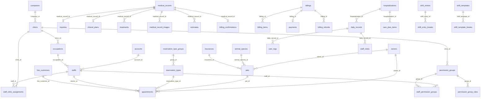

# ノア動物病院 電子カルテシステム ER図 (Entity Relationship Diagram)

バージョン: v31.3（SQL マイグレーション 100% 同期）
更新日: 2026-04-13
状態: Production Ready

---

## 変更概要（v31.2 → v31.3）

| 変更内容 | 詳細 |
|---------|------|
| テーブル総数修正 | 重複を削除し 67 テーブルに修正 |
| SQL同期 | 各テーブルの順序および定義を `001_init.sql` と完全に一致させた |

---

## 変更概要（v31.1 → v31.2）

| 変更内容 | 詳細 |
|---------|------|
| テーブル総数 66 → 68 | `shift_templates`, `shift_template_breaks`, `shift_entry_breaks` を追加 |
| `audit_logs` カラム長修正 | `actor_type varchar(30)` に修正 |
| `permission_groups` カラム長修正 | `name varchar(100)` に修正 |

---

## 変更概要（v31.0 → v31.1）

| 変更内容 | 詳細 |
|---------|------|
| テーブル総数修正 | `shift_entry_breaks` 等を含めた正確なカウントに修正 |
| SQL同期 | 各テーブルの制約（UNIQUE, CHECK）やインデックス情報を 001_init.sql と 100% 同期 |

---

## テーブル一覧（67テーブル）

> テーブル順序は `001_init.sql` の CREATE TABLE 順に準拠。

| # | テーブル名 | 区分 | 説明 |
|---|-----------|------|------|
| 1 | `companies` | 法人情報 | 法人（ノア動物病院）情報 |
| 2 | `clinics` | 医院情報 | 各医院情報 |
| 3 | `animal_species` | マスタ | ペット種類マスタ |
| 4 | `occupations` | マスタ | 職種マスタ |
| 5 | `accounts` | 認証 | ログインアカウント |
| 6 | `staffs` | マスタ | スタッフ情報 |
| 7 | `owners` | コア | 飼主情報 |
| 8 | `inventory_items` | 在庫 | 在庫アイテム |
| 9 | `exam_types` | マスタ | 検査種別マスタ |
| 10 | `exam_type_fields` | マスタ | 検査項目定義 |
| 11 | `vaccines` | マスタ | ワクチンマスタ |
| 12 | `medicines` | マスタ | 薬剤マスタ |
| 13 | `insurances` | マスタ | 保険マスタ |
| 14 | `cages` | マスタ | ケージマスタ |
| 15 | `reservation_type_groups` | 予約マスタ | 予約区分グループ |
| 16 | `reservation_types` | 予約マスタ | 予約区分マスタ |
| 17 | `consultations` | マスタ | 診察項目マスタ |
| 18 | `procedures` | マスタ | 処置項目マスタ |
| 19 | `hospitalization_plans` | マスタ | 入院プランマスタ |
| 20 | `trimming_courses` | マスタ | トリミングコース |
| 21 | `trimming_options` | マスタ | トリミングオプション |
| 22 | `diagnosis_types` | マスタ | 診断カテゴリ |
| 23 | `diagnosis_names` | マスタ | 診断病名 |
| 24 | `checkup_types` | マスタ | 健診種別 |
| 25 | `chief_complaint_types` | マスタ | 主訴区分マスタ |
| 26 | `inquiry_templates` | マスタ | 問診定型文マスタ |
| 27 | `pets` | コア | ペット情報 |
| 28 | `staff_clinic_assignments` | 認証 | スタッフ-クリニック所属 |
| 29 | `permission_groups` | 権限 | 権限グループ |
| 30 | `permission_group_rules` | 権限 | 権限ルール |
| 31 | `staff_permission_groups` | 権限 | スタッフ-権限グループ |
| 32 | `appointments` | 予約 | 予約情報 |
| 33 | `hospitalizations` | 入院 | 入院・ホテル管理 |
| 34 | `trimming_records` | トリミング | トリミング記録 |
| 35 | `medical_records` | 診療 | カルテ |
| 36 | `vaccinations` | 診療 | ワクチン接種記録 |
| 37 | `checkups` | 診療 | 健診記録 |
| 38 | `exams` | 診療 | 検査記録 |
| 39 | `inquiries` | 診療 | 問診情報 |
| 40 | `clinical_plans` | 診療 | 診察プラン |
| 41 | `treatments` | 診療 | 治療明細 |
| 42 | `treatment_plans` | 診療 | 治療プラン |
| 43 | `medical_record_images` | 診療 | 診療画像 |
| 44 | `billing_confirmations` | 診療 | 会計医師確認 |
| 45 | `estimates` | 診療 | 見積書 |
| 46 | `exam_results` | 診療 | 検査結果詳細 |
| 47 | `daily_records` | 入院 | 入院日次記録 |
| 48 | `vital_records` | 診療・入院 | バイタル記録 |
| 49 | `care_plan_items` | 入院 | ケアプラン項目 |
| 50 | `estimate_items` | 診療 | 見積明細 |
| 51 | `care_logs` | 入院 | ケアログ |
| 52 | `staff_notes` | 入院 | スタッフノート |
| 53 | `trimming_record_options` | トリミング | トリミングオプション |
| 54 | `billings` | 会計 | 会計情報 |
| 55 | `billing_items` | 会計 | 会計明細 |
| 56 | `payments` | 会計 | 支払い情報 |
| 57 | `billing_refunds` | 会計 | 返金レコード |
| 58 | `shift_entries` | シフト | スタッフシフト |
| 59 | `clinic_holidays` | シフト | 医院個別休診日 |
| 60 | `merchandise_items` | マスタ | 物販マスタ |
| 61 | `audit_logs` | 監査 | 操作監査ログ |
| 62 | `line_reservation_settings` | LINE予約 | LINE予約設定 |
| 63 | `line_customers` | LINE予約 | LINE予約顧客 |
| 64 | `staff_reservation_exclusions` | 予約マスタ | スタッフ除外設定 |
| 65 | `shift_entry_breaks` | シフト | シフト休憩時間 |
| 66 | `shift_templates` | マスタ | シフトテンプレート |
| 67 | `shift_template_breaks` | マスタ | テンプレート休憩時間 |

## システム全体 ER図

```mermaid
erDiagram
    %% ===== 法人・認証 =====
    companies ||--o{ clinics : "company_id"
    accounts ||--o{ staffs : "account_id"
    clinics ||--o{ staff_clinic_assignments : "clinic_id"
    staffs ||--o{ staff_clinic_assignments : "staff_id"

    %% ===== コア =====
    owners ||--o{ pets : "owner_id"
    animal_species ||--o{ pets : "animal_species_id"
    insurances ||--o{ pets : "insurance_id"

    %% ===== マスタ =====
    clinics ||--o{ occupations : "clinic_id"
    occupations ||--o{ staffs : "occupation_id"
    clinics ||--o{ permission_groups : "clinic_id"
    permission_groups ||--o{ permission_group_rules : "group_id"
    staffs ||--o{ staff_permission_groups : "staff_id"
    permission_groups ||--o{ staff_permission_groups : "group_id"

    %% ===== 予約 =====
    owners ||--o{ appointments : "owner_id"
    pets ||--o{ appointments : "pet_id"
    reservation_types ||--o{ appointments : "reservation_type_id"
    reservation_type_groups ||--o{ reservation_types : "group_id"
    staffs ||--o{ appointments : "doctor_id"
    line_customers ||--o{ appointments : "line_customer_id"

    %% ===== 診療 =====
    medical_records ||--o| inquiries : "medical_record_id"
    medical_records ||--o| clinical_plans : "medical_record_id"
    medical_records ||--o{ treatments : "medical_record_id"
    medical_records ||--o{ medical_record_images : "medical_record_id"
    medical_records ||--o{ estimates : "medical_record_id"
    medical_records ||--o| billing_confirmations : "medical_record_id"

    %% ===== 会計 =====
    billings ||--o{ billing_items : "billing_id"
    billings ||--o| payments : "billing_id"
    billings ||--o{ billing_refunds : "billing_id"

    %% ===== 入院 =====
    hospitalizations ||--o{ daily_records : "hospitalization_id"
    daily_records ||--o{ care_logs : "daily_record_id"
    daily_records ||--o{ staff_notes : "daily_record_id"
    hospitalizations ||--o{ care_plan_items : "hospitalization_id"

    %% ===== シフト =====
    shift_entries ||--o{ shift_entry_breaks : "shift_entry_id"
    shift_templates ||--o{ shift_template_breaks : "shift_template_id"
```

---

## ENUM型定義

| ENUM名 | 値 |
| ------- | ---- |
| `account_status` | active, inactive, locked |
| `appetite_level` | normal, increased, decreased, none |
| `confirmation_status` | pending, confirmed, returned |
| `billing_status` | waiting, completed, cancelled, pending |
| `acquisition_type` | purchased, transferred, rescued, other |
| `anesthesia_type` | none, local, sedation, general |
| `billing_unit` | per_day, per_night |
| `body_size` | small, medium, large |
| `body_weight_unit` | Kg, g |
| `cage_size` | small, medium, large |
| `cage_type` | icu, dog, cat, general |
| `care_log_status` | completed, partial, skipped |
| `care_log_type` | food, excretion, medicine, treatment, other |
| `care_plan_status` | active, completed, discontinued |
| `care_plan_type` | food, medicine, treatment, instruction, item |
| `danger_level` | low, medium, high |
| `dosage_form` | tablet, liquid, injection, topical, powder |
| `estimate_status` | draft, sent, approved, rejected |
| `exam_result_status` | normal, high, low |
| `exam_status` | pending, in_progress, result_entered, completed, confirmed |
| `hospitalization_status` | admitted, discharged, reserved |
| `hospitalization_type` | hospitalization, hotel |
| `inventory_category` | medicine, consumable, food, other |
| `inventory_status` | sufficient, low, out_of_stock |
| `item_category` | examination, test, procedure, surgery, medicine, food, goods, other |
| `item_source` | medical_record, manual, hospitalization |
| `medical_image_type` | xray, echo, photo, endoscope, ct, mri, microscope, other |
| `medical_record_status` | draft, finalized |
| `medicine_unit` | per_tablet, per_ml, per_dose, per_gram |
| `membership_type` | non_member, member, deceased, transferred |
| `next_schedule_type` | 3weeks, 4weeks, 1year, other |
| `payment_method` | cash, credit_card, electronic_money |
| `pet_gender` | male, female, unknown |
| `pet_status` | alive, deceased |
| `plan_timing` | morning, noon, night |
| `reservation_source` | manual, line |
| `reservation_status` | confirmed, pending, cancelled, checked_in, in_consultation, accounting, completed |
| `shift_type` | full, morning, afternoon, off, paid_leave |
| `staff_type` | doctor, nurse, resource |
| `target_size` | small, medium, large, cat |
| `tax_type` | included, excluded, exempt |
| `treatment_item_type` | consultation, procedure, medicine, other |
| `treatment_status` | pending, completed, not_applicable |
| `trimming_status` | completed, reserved, in_progress |
| `vaccine_species` | dog, cat, both |
| `visit_type` | first, revisit |
| `water_intake_level` | normal, increased, decreased, none |

## テーブル詳細

### 法人・医院

---

#### `companies`

用途: ノア動物病院の法人情報。clinics テーブルの親。

| カラム名 | 型 | NULL | デフォルト | 説明 |
|---------|-----|------|-----------|------|
| id | bigint | NO | - | PK (BIGSERIAL) |
| name | text | NO | | 法人名 |
| postal_code | text | NO | '' | 郵便番号 |
| address | text | NO | '' | 住所 |
| phone_number | text | NO | '' | 電話番号 |
| fax_number | text | NO | '' | FAX番号 |
| registration_number | text | NO | '' | 登録番号 |
| invoice_registration_number | text | NO | '' | インボイス登録番号 |
| director_name | text | NO | '' | 院長名 |
| email | text | NO | '' | メールアドレス |
| website | text | NO | '' | ウェブサイトURL |
| logo_url | text | NO | '' | ロゴ画像URL |
| created_at | timestamptz | NO | now() | 作成日時 |
| updated_at | timestamptz | NO | now() | 更新日時 |

---

#### `clinics`

用途: 各医院（八王子・城東・敷島等）の情報。

| カラム名 | 型 | NULL | デフォルト | 説明 |
|---------|-----|------|-----------|------|
| id | bigint | NO | - | PK (BIGSERIAL) |
| company_id | bigint | NO | | companies.id FK |
| name | text | NO | | 医院名 |
| postal_code | text | NO | '' | 郵便番号 |
| address | text | NO | '' | 住所 |
| phone_number | text | NO | '' | 電話番号 |
| fax_number | text | NO | '' | FAX番号 |
| registration_number | text | NO | '' | 登録番号 |
| director_name | text | NO | '' | 院長名 |
| email | text | NO | '' | メールアドレス |
| website | text | NO | '' | ウェブサイトURL |
| logo_url | text | NO | '' | ロゴ画像URL |
| is_active | boolean | NO | true | 有効フラグ |
| standard_tax_rate | numeric | NO | 0.10 | 標準税率 |
| reduced_tax_rate | numeric | NO | 0.08 | 軽減税率 |
| created_at | timestamptz | NO | now() | 作成日時 |
| updated_at | timestamptz | NO | now() | 更新日時 |

---

### 認証

---

#### `accounts`

用途: 認証用アカウント。

| カラム名 | 型 | NULL | デフォルト | 説明 |
|---------|-----|------|-----------|------|
| id | bigint | NO | - | PK (BIGSERIAL) |
| email | text | NO | | メールアドレス（UNIQUE） |
| password_hash | text | NO | | パスワードハッシュ |
| is_active | boolean | NO | true | 有効フラグ |
| is_system_admin | boolean | NO | false | システム管理者フラグ |
| created_at | timestamptz | NO | now() | 作成日時 |
| updated_at | timestamptz | NO | now() | 更新日時 |
| deleted_at | timestamptz | YES | NULL | 論理削除日時 |

---

#### `staff_clinic_assignments`

用途: スタッフと医院の紐付け。

| カラム名 | 型 | NULL | デフォルト | 説明 |
|---------|-----|------|-----------|------|
| id | bigint | NO | - | PK (BIGSERIAL) |
| staff_id | bigint | NO | | staffs.id FK |
| clinic_id | bigint | NO | | clinics.id FK |
| is_main | boolean | NO | false | メイン医院フラグ |
| created_at | timestamptz | NO | now() | 作成日時 |
| updated_at | timestamptz | NO | now() | 更新日時 |

### コア

---

#### `owners`

用途: ペットの飼い主情報。

| カラム名 | 型 | NULL | デフォルト | 説明 |
|---------|-----|------|-----------|------|
| id | bigint | NO | - | PK (BIGSERIAL) |
| clinic_id | bigint | NO | - | FK → clinics(id) RESTRICT |
| name | text | NO | | 飼い主名 |
| phone | text | NO | '' | 電話番号 |
| email | text | NO | '' | メールアドレス |
| created_at | timestamptz | NO | now() | 作成日時 |
| updated_at | timestamptz | NO | now() | 更新日時 |
| deleted_at | timestamptz | YES | NULL | 論理削除日時 |

---

#### `pets`

用途: ペット情報。

| カラム名 | 型 | NULL | デフォルト | 説明 |
|---------|-----|------|-----------|------|
| id | bigint | NO | - | PK (BIGSERIAL) |
| clinic_id | bigint | NO | - | FK → clinics(id) RESTRICT |
| owner_id | bigint | NO | | owners.id FK |
| name | text | NO | | ペット名 |
| status | pet_status | NO | 'alive' | 生存状態 |
| created_at | timestamptz | NO | now() | 作成日時 |
| updated_at | timestamptz | NO | now() | 更新日時 |
| deleted_at | timestamptz | YES | NULL | 論理削除日時 |

---

### マスタ

---

#### `animal_species`

用途: ペット種類マスタ。

| カラム名 | 型 | NULL | デフォルト | 説明 |
|---------|-----|------|-----------|------|
| id | bigint | NO | - | PK (BIGSERIAL) |
| name | text | NO | | 種類名 |
| created_at | timestamptz | NO | now() | 作成日時 |
| updated_at | timestamptz | NO | now() | 更新日時 |

---

#### `occupations`

用途: 職種マスタ。

| カラム名 | 型 | NULL | デフォルト | 説明 |
|---------|-----|------|-----------|------|
| id | bigint | NO | - | PK (BIGSERIAL) |
| clinic_id | bigint | NO | - | clinics.id FK |
| name | text | NO | '' | 職種名 |
| created_at | timestamptz | NO | now() | 作成日時 |
| updated_at | timestamptz | NO | now() | 更新日時 |

---

#### `staffs`

用途: スタッフマスタ。

| カラム名 | 型 | NULL | デフォルト | 説明 |
|---------|-----|------|-----------|------|
| id | bigint | NO | - | PK (BIGSERIAL) |
| account_id | bigint | YES | NULL | accounts.id FK |
| name | text | NO | | スタッフ名 |
| occupation_id | bigint | YES | NULL | occupations.id FK |
| created_at | timestamptz | NO | now() | 作成日時 |
| updated_at | timestamptz | NO | now() | 更新日時 |
| deleted_at | timestamptz | YES | NULL | 論理削除日時 |

---

> ※ 全てのテーブル（67件）の詳細なカラム定義、インデックス、制約については、バックエンドのマイグレーションファイル `backend/migrations/001_init.sql` を正として参照してください。
