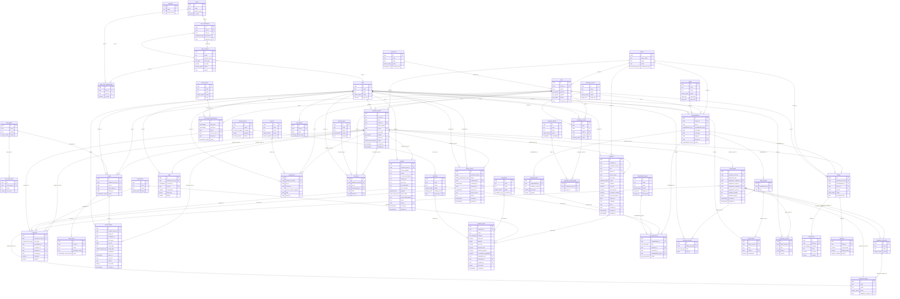

# ノア動物病院 電子カルテシステム ER図 (Entity Relationship Diagram)

バージョン: v9.0（診察/治療タブ専用テーブル追加・51テーブル）
更新日: 2026-03-12
状態: Production Ready

本ドキュメントは、Animal Ekarteの全51テーブルとそのリレーションを定義します。
PostgreSQL 18 + Go/GORM（クリーンアーキテクチャ）で実装。

---

## 変更概要（v8.0 → v9.0）

| 変更内容 | 詳細 |
|---------|------|
| `clinical_plans` テーブル追加 | 診察/治療タブ専用。`medical_records` から診察・診断フィールドを移動。1:1 |
| `medical_records` スリム化 | `physical_exam`, `treatment_policy`, `diagnosis_details`, `diagnosis1/2` FK を `clinical_plans` に移動 |
| テーブル総数 | 50 → 51 |

## 変更概要（v5.0 → v6.0）

| 変更内容 | 詳細 |
|---------|------|
| 法人テーブル追加 | `company`（ノア動物病院法人情報、シングルトン） |
| 医院テーブル追加 | `clinics`（八王子医院・城東医院・敷島医院等） |
| clinic_id追加予定 | `003_add_clinic_id.sql` にて以下テーブルに追加予定: owners, staffs, inventory_items, cages, service_types, consultations, procedures, hospitalization_plans, trimming_courses, trimming_options, exam_types, vaccines, medicines, insurances, diagnosis_categories, checkup_types |
| clinic_id保持済 | `user_clinic_memberships`, `user_permissions` のみ現時点で保持 |

## 変更概要（v7.0 → v8.0）

| 変更内容 | 詳細 |
|---------|------|
| 命名規則統一 | `_records`/`_entries`/`_items` サフィックスを排除し、短縮形に統一 |
| `examination_records` → `exams` | 検査記録 |
| `examination_record_items` → `exam_items` | 検査結果項目 |
| `examination_types` → `exam_types` | 検査種別マスタ |
| `examination_type_items` → `exam_type_items` | 検査項目定義マスタ |
| `treatment_items` → `treatments` | 治療項目 |
| `vital_entries` → `vitals` | バイタル（外来） |
| `vaccination_records` → `vaccinations` | 予防接種記録 |
| `checkup_records` → `checkups` | 健診記録 |
| `accountings` → `billings` | 会計 |
| `accounting_items` → `billing_items` | 会計明細 |
| `payment_infos` → `payments` | 支払情報 |
| `medical_inquiries` → `inquiries` | 問診（不要なプレフィックス削除） |
| `medical_images` → `record_images` | 診療画像 |
| `billing_confirmations` → `billing_reviews` | 会計医師確認 |
| テーブル総数 | 50テーブル（変更なし） |

---

## 設計方針

### 法人・医院の区別

| テーブル | 役割 | レコード数 |
|---------|------|-----------|
| `company` | 法人情報（ノア動物病院）。FK参照なし。設定画面で参照のみ | 1件固定 |
| `clinics` | 各医院（八王子医院等）。ユーザー・権限管理で参照 | 複数（増加あり） |

### clinic_id 戦略

現在は `user_clinic_memberships` と `user_permissions` のみ `clinic_id` を保持。
`003_add_clinic_id.sql` にてマスタ系テーブルへの `clinic_id` 追加を予定。
追加後はマスタ情報（staffs, cages, medicines等）を医院ごとに独立管理できる。

### カルテタブ ↔ テーブル対応表

| タブ | テーブル | 状態 |
|------|---------|------|
| 問診 | `inquiries` | v7.0追加 |
| 診察/治療 | `clinical_plans` | v9.0追加 |
| 治療 | `treatments` | 既存 |
| 予防接種 | `vaccinations` | 既存 |
| 定期健診 | `checkups` | 既存 |
| 検査 | `exams` + `exam_items` | 既存 |
| 画像 | `record_images` | v7.0追加 |
| 見積書 | `estimates` + `estimate_items` | v7.0追加 |
| 会計（医師確認） | `billing_reviews` | v7.0追加 |
| 会計情報 | `billings` + `billing_items` + `payments` | 既存 |
| 生体情報 | `vitals` | 既存 |
| ペット情報 | `pets`（参照） | 既存 |

---

## テーブル一覧（51テーブル）

| # | テーブル名 | 区分 | 説明 |
|---|-----------|------|------|
| 1 | `company` | 法人情報 | 法人（ノア動物病院）情報シングルトン |
| 2 | `clinics` | 医院情報 | 各医院（八王子・城東・敷島） |
| 3 | `user_accounts` | 認証 | ログインアカウント |
| 4 | `user_clinic_memberships` | 認証 | ユーザーの医院所属 |
| 5 | `user_permissions` | 認証 | ユーザーの権限 |
| 6 | `owners` | コア | 飼い主 |
| 7 | `pets` | コア | ペット |
| 8 | `staffs` | マスタ | スタッフ（獣医師・看護師等） |
| 9 | `inventory_items` | 在庫 | 在庫アイテム |
| 10 | `exam_types` | マスタ | 検査種別 |
| 11 | `exam_type_items` | マスタ | 検査種別の検査項目定義 |
| 12 | `vaccines` | マスタ | ワクチン |
| 13 | `medicines` | マスタ | 薬剤 |
| 14 | `insurances` | マスタ | 保険 |
| 15 | `cages` | マスタ | ケージ |
| 16 | `service_types` | マスタ | サービス種別 |
| 17 | `consultations` | マスタ | 診察項目 |
| 18 | `procedures` | マスタ | 処置項目 |
| 19 | `hospitalization_plans` | マスタ | 入院プラン |
| 20 | `trimming_courses` | マスタ | トリミングコース |
| 21 | `trimming_options` | マスタ | トリミングオプション |
| 22 | `diagnosis_categories` | マスタ | 診断カテゴリ |
| 23 | `diagnosis_names` | マスタ | 診断名 |
| 24 | `checkup_types` | マスタ | 健診種別 |
| 25 | `medical_records` | 診療 | カルテ（診療記録） |
| 26 | `clinical_plans` | 診療 | 診察所見・診断・治療方針（診察/治療タブ） |
| 27 | `inquiries` | 診療 | 問診情報（カルテ問診タブ） |
| 28 | `treatments` | 診療 | 処置・診察・薬剤明細 |
| 29 | `vitals` | 診療 | バイタル記録（外来） |
| 30 | `exams` | 診療 | 検査記録 |
| 31 | `exam_items` | 診療 | 検査記録の検査結果項目 |
| 32 | `vaccinations` | 診療 | ワクチン接種記録 |
| 33 | `checkups` | 診療 | 健診記録 |
| 34 | `record_images` | 診療 | 診療画像（レントゲン・エコー等） |
| 35 | `estimates` | 診療 | 見積書 |
| 36 | `estimate_items` | 診療 | 見積書明細 |
| 37 | `billing_reviews` | 診療 | 会計医師確認 |
| 38 | `reservation_appointments` | 予約 | 予約 |
| 39 | `hospitalizations` | 入院 | 入院・ホテル |
| 40 | `daily_records` | 入院 | 入院日次記録 |
| 41 | `care_plan_items` | 入院 | ケアプラン項目 |
| 42 | `care_log_records` | 入院 | ケアログ |
| 43 | `vital_records` | 入院 | バイタル記録（入院） |
| 44 | `staff_note_records` | 入院 | スタッフノート |
| 45 | `treatment_plans` | 入院 | 入院治療プラン |
| 46 | `trimming_records` | トリミング | トリミング記録 |
| 47 | `trimming_record_options` | トリミング | トリミング記録のオプション選択 |
| 48 | `billings` | 会計 | 会計 |
| 49 | `billing_items` | 会計 | 会計明細 |
| 50 | `payments` | 会計 | 支払い情報 |
| 51 | `shift_entries` | シフト | スタッフシフト |

---

## システム全体 ER図

```mermaid
erDiagram
    %% ===== 法人・医院 =====
    company {
        uuid id PK
        text name
        text branch_name
    }

    clinics {
        uuid id PK
        text name
        text branch_name
        boolean is_active
    }

    %% ===== 認証 =====
    user_accounts {
        uuid id PK
        text email
        text display_name
        user_type user_type
        job_title job_title
        account_status status
        uuid staff_id FK
    }

    user_clinic_memberships {
        uuid id PK
        uuid user_id FK
        uuid clinic_id FK
        boolean is_main
    }

    user_permissions {
        uuid id PK
        uuid user_id FK
        uuid clinic_id FK
        permission_type permission
        uuid granted_by FK
    }

    %% ===== コア =====
    owners {
        uuid id PK
        text owner_name
        text phone
        text email
        membership_type membership_type
    }

    pets {
        uuid id PK
        uuid owner_id FK
        text name
        pet_species species
        pet_gender gender
        pet_status status
        uuid insurance_id FK
    }

    %% ===== マスタ =====
    staffs {
        uuid id PK
        text code
        text name
        master_status status
        staff_role staff_role
    }

    inventory_items {
        uuid id PK
        text name
        inventory_category category
        integer quantity
        inventory_status status
    }

    exam_types {
        uuid id PK
        text code
        text name
        master_status status
    }

    exam_type_items {
        uuid id PK
        uuid exam_type_id FK
        text name
        integer sort_order
    }

    vaccines {
        uuid id PK
        text code
        text name
        master_status status
        vaccine_species species
    }

    medicines {
        uuid id PK
        text code
        text name
        master_status status
        dosage_form dosage_form
        uuid inventory_id FK
    }

    insurances {
        uuid id PK
        text code
        text name
        master_status status
        coverage_rate coverage_rate
    }

    cages {
        uuid id PK
        text code
        text name
        master_status status
        cage_type cage_type
        cage_size cage_size
    }

    service_types {
        uuid id PK
        text code
        text name
        master_status status
        text color
    }

    consultations {
        uuid id PK
        text code
        text name
        master_status status
    }

    procedures {
        uuid id PK
        text code
        text name
        master_status status
        anesthesia_type anesthesia
    }

    hospitalization_plans {
        uuid id PK
        text code
        text name
        master_status status
        body_size body_size
        billing_unit billing_unit
    }

    trimming_courses {
        uuid id PK
        text code
        text name
        master_status status
        target_size target_size
    }

    trimming_options {
        uuid id PK
        text code
        text name
        master_status status
        combinable combinable
    }

    diagnosis_categories {
        uuid id PK
        text code
        text name
        master_status status
    }

    diagnosis_names {
        uuid id PK
        text code
        text name
        master_status status
        uuid diagnosis_category_id FK
    }

    checkup_types {
        uuid id PK
        text code
        text name
        master_status status
        text interval
    }

    %% ===== 診療 =====
    medical_records {
        uuid id PK
        text record_no
        date date
        uuid owner_id FK
        text owner_name
        uuid pet_id FK
        text pet_name
        pet_species species
        uuid doctor_id FK
        medical_record_status status
        timestamptz created_at
        timestamptz updated_at
    }

    clinical_plans {
        uuid id PK
        uuid medical_record_id FK
        text physical_exam
        uuid diagnosis1_category_id FK
        uuid diagnosis1_name_id FK
        uuid diagnosis2_category_id FK
        uuid diagnosis2_name_id FK
        text diagnosis_details
        text treatment_policy
        timestamptz created_at
        timestamptz updated_at
    }

    treatments {
        uuid id PK
        uuid medical_record_id FK
        treatment_item_type item_type
        uuid consultation_id FK
        uuid procedure_id FK
        uuid medicine_id FK
        uuid inventory_id FK
        numeric unit_price
        integer quantity
    }

    vitals {
        uuid id PK
        uuid medical_record_id FK
        timestamptz recorded_at
        uuid staff_id FK
        numeric temperature
        integer heart_rate
        numeric weight
    }

    exams {
        uuid id PK
        uuid medical_record_id FK
        uuid pet_id FK
        uuid exam_type_id FK
        uuid doctor_id FK
        examination_status status
    }

    exam_items {
        uuid id PK
        uuid exam_id FK
        text name
        text inspection_value
        examination_result_status status
    }

    vaccinations {
        uuid id PK
        uuid medical_record_id FK
        uuid pet_id FK
        uuid vaccine_id FK
        text vaccine_name_snapshot
        date date
        uuid doctor_id FK
    }

    checkups {
        uuid id PK
        uuid medical_record_id FK
        uuid pet_id FK
        uuid checkup_type_id FK
        date date
        uuid doctor_id FK
    }

    inquiries {
        uuid id PK
        uuid medical_record_id FK
        text chief_complaint
        text history
        text current_medications
        text allergy_info
        text last_meal
        text last_defecation
        text last_urination
        appetite_level appetite
        water_intake_level water_intake
        text owner_observations
        text notes
        uuid staff_id FK
        timestamptz created_at
        timestamptz updated_at
    }

    record_images {
        uuid id PK
        uuid medical_record_id FK
        text image_url
        text thumbnail_url
        text file_name
        bigint file_size
        text mime_type
        medical_image_type image_type
        text description
        timestamptz taken_at
        uuid exam_id FK
        uuid staff_id FK
        integer sort_order
        timestamptz created_at
    }

    estimates {
        uuid id PK
        text estimate_no
        uuid medical_record_id FK
        text title
        uuid owner_id FK
        text owner_name
        text pet_name
        estimate_status status
        numeric subtotal
        numeric tax_total
        numeric total_amount
        numeric insurance_amount
        numeric discount_amount
        date valid_until
        text comment
        text notes
        uuid created_by FK
        timestamptz created_at
        timestamptz updated_at
    }

    estimate_items {
        uuid id PK
        uuid estimate_id FK
        text name
        item_category category
        numeric unit_price
        integer quantity
        numeric tax_rate
        numeric discount_rate
        numeric discount_amount
        boolean is_insurance_applicable
        uuid consultation_id FK
        uuid procedure_id FK
        uuid medicine_id FK
        integer sort_order
        timestamptz created_at
    }

    billing_reviews {
        uuid id PK
        uuid medical_record_id FK
        billing_confirmation_status status
        uuid confirmed_by FK
        timestamptz confirmed_at
        uuid returned_by FK
        timestamptz returned_at
        text return_reason
        text memo
        timestamptz created_at
        timestamptz updated_at
    }

    %% ===== 予約 =====
    reservation_appointments {
        uuid id PK
        timestamptz start_time
        timestamptz end_time
        uuid pet_id FK
        uuid service_type_id FK
        uuid doctor_id FK
        reservation_status status
    }

    %% ===== 入院 =====
    hospitalizations {
        uuid id PK
        uuid owner_id FK
        uuid pet_id FK
        hospitalization_type hospitalization_type
        date start_date
        date end_date
        uuid cage_id FK
        uuid doctor_id FK
        hospitalization_status status
    }

    daily_records {
        uuid id PK
        uuid hospitalization_id FK
        date date
    }

    care_plan_items {
        uuid id PK
        uuid hospitalization_id FK
        care_plan_type type
        uuid medicine_id FK
        uuid procedure_id FK
        uuid hospitalization_plan_id FK
        care_plan_status status
    }

    care_log_records {
        uuid id PK
        uuid daily_record_id FK
        care_log_type type
        uuid staff_id FK
    }

    vital_records {
        uuid id PK
        uuid daily_record_id FK
        text time
        uuid staff_id FK
        numeric temperature
    }

    staff_note_records {
        uuid id PK
        uuid daily_record_id FK
        text time
        uuid staff_id FK
        text content
    }

    treatment_plans {
        uuid id PK
        uuid hospitalization_id FK
        text treatment_content
        numeric unit_price
        integer quantity
    }

    %% ===== トリミング =====
    trimming_records {
        uuid id PK
        date date
        uuid pet_id FK
        uuid staff_id FK
        uuid course_id FK
        trimming_status status
    }

    trimming_record_options {
        uuid id PK
        uuid trimming_record_id FK
        uuid option_id FK
    }

    %% ===== 会計 =====
    billings {
        uuid id PK
        uuid medical_record_id FK
        uuid hospitalization_id FK
        uuid owner_id FK
        uuid pet_id FK
        billing_status status
        date scheduled_date
    }

    billing_items {
        uuid id PK
        uuid billing_id FK
        item_category category
        text name
        numeric unit_price
        integer quantity
    }

    payments {
        uuid id PK
        uuid billing_id FK
        numeric total_amount
        numeric billing_amount
        payment_method method
    }

    %% ===== シフト =====
    shift_entries {
        uuid id PK
        uuid staff_id FK
        date date
        shift_type shift_type
    }

    %% ===== リレーション =====

    %% 認証
    user_accounts ||--o{ user_clinic_memberships : "user_id"
    user_accounts ||--o{ user_permissions : "user_id"
    user_accounts }o--|| staffs : "staff_id"
    user_permissions }o--|| user_accounts : "granted_by"
    clinics ||--o{ user_clinic_memberships : "clinic_id"
    clinics ||--o{ user_permissions : "clinic_id"

    %% コア
    owners ||--o{ pets : "owner_id"
    insurances ||--o{ pets : "insurance_id"

    %% マスタ
    exam_types ||--o{ exam_type_items : "exam_type_id"
    diagnosis_categories ||--o{ diagnosis_names : "diagnosis_category_id"
    inventory_items ||--o{ medicines : "inventory_id"

    %% 診療
    owners ||--o{ medical_records : "owner_id"
    pets ||--o{ medical_records : "pet_id"
    staffs ||--o{ medical_records : "doctor_id"
    medical_records ||--o| clinical_plans : "medical_record_id"
    clinical_plans }o--|| diagnosis_categories : "diagnosis1_category_id"
    clinical_plans }o--|| diagnosis_categories : "diagnosis2_category_id"
    clinical_plans }o--|| diagnosis_names : "diagnosis1_name_id"
    clinical_plans }o--|| diagnosis_names : "diagnosis2_name_id"

    medical_records ||--o{ treatments : "medical_record_id"
    consultations ||--o{ treatments : "consultation_id"
    procedures ||--o{ treatments : "procedure_id"
    medicines ||--o{ treatments : "medicine_id"
    inventory_items ||--o{ treatments : "inventory_id"

    medical_records ||--o{ vitals : "medical_record_id"
    staffs ||--o{ vitals : "staff_id"

    medical_records ||--o{ exams : "medical_record_id"
    pets ||--o{ exams : "pet_id"
    exam_types ||--o{ exams : "exam_type_id"
    staffs ||--o{ exams : "doctor_id"
    exams ||--o{ exam_items : "exam_id"

    medical_records ||--o{ vaccinations : "medical_record_id"
    pets ||--o{ vaccinations : "pet_id"
    vaccines ||--o{ vaccinations : "vaccine_id"
    staffs ||--o{ vaccinations : "doctor_id"

    medical_records ||--o{ checkups : "medical_record_id"
    pets ||--o{ checkups : "pet_id"
    checkup_types ||--o{ checkups : "checkup_type_id"
    staffs ||--o{ checkups : "doctor_id"

    medical_records ||--o| inquiries : "medical_record_id"
    staffs ||--o{ inquiries : "staff_id"
    medical_records ||--o{ record_images : "medical_record_id"
    exams ||--o{ record_images : "exam_id"
    staffs ||--o{ record_images : "staff_id"
    medical_records ||--o{ estimates : "medical_record_id"
    owners ||--o{ estimates : "owner_id"
    staffs ||--o{ estimates : "created_by"
    estimates ||--o{ estimate_items : "estimate_id"
    consultations ||--o{ estimate_items : "consultation_id"
    procedures ||--o{ estimate_items : "procedure_id"
    medicines ||--o{ estimate_items : "medicine_id"
    medical_records ||--o| billing_reviews : "medical_record_id"
    staffs ||--o{ billing_reviews : "confirmed_by"
    staffs ||--o{ billing_reviews : "returned_by"

    %% 予約
    pets ||--o{ reservation_appointments : "pet_id"
    service_types ||--o{ reservation_appointments : "service_type_id"
    staffs ||--o{ reservation_appointments : "doctor_id"

    %% 入院
    owners ||--o{ hospitalizations : "owner_id"
    pets ||--o{ hospitalizations : "pet_id"
    cages ||--o{ hospitalizations : "cage_id"
    staffs ||--o{ hospitalizations : "doctor_id"

    hospitalizations ||--o{ daily_records : "hospitalization_id"
    hospitalizations ||--o{ care_plan_items : "hospitalization_id"
    hospitalizations ||--o{ treatment_plans : "hospitalization_id"

    daily_records ||--o{ care_log_records : "daily_record_id"
    daily_records ||--o{ vital_records : "daily_record_id"
    daily_records ||--o{ staff_note_records : "daily_record_id"

    staffs ||--o{ care_log_records : "staff_id"
    staffs ||--o{ vital_records : "staff_id"
    staffs ||--o{ staff_note_records : "staff_id"

    medicines ||--o{ care_plan_items : "medicine_id"
    procedures ||--o{ care_plan_items : "procedure_id"
    hospitalization_plans ||--o{ care_plan_items : "hospitalization_plan_id"

    %% トリミング
    pets ||--o{ trimming_records : "pet_id"
    staffs ||--o{ trimming_records : "staff_id"
    trimming_courses ||--o{ trimming_records : "course_id"
    trimming_records ||--o{ trimming_record_options : "trimming_record_id"
    trimming_options ||--o{ trimming_record_options : "option_id"

    %% 会計
    medical_records ||--o| billings : "medical_record_id"
    hospitalizations ||--o{ billings : "hospitalization_id"
    owners ||--o{ billings : "owner_id"
    pets ||--o{ billings : "pet_id"
    billings ||--o{ billing_items : "billing_id"
    billings ||--|| payments : "billing_id"

    %% シフト
    staffs ||--o{ shift_entries : "staff_id"
```

---

## ENUM型定義

| ENUM名 | 値 |
|-------|----|
| `account_status` | active, inactive, locked |
| `appetite_level` | normal, increased, decreased, none |
| `billing_confirmation_status` | pending, confirmed, returned |
| `billing_status` | waiting, completed, cancelled, pending |
| `acquisition_type` | 購入, 譲渡, 保護, その他 |
| `anesthesia_type` | none, local, general |
| `billing_unit` | per_day, per_night |
| `body_size` | small, medium, large |
| `body_weight_unit` | Kg, g |
| `cage_size` | small, medium, large |
| `cage_type` | icu, dog, cat, general |
| `care_log_status` | completed, partial, skipped |
| `care_log_type` | food, excretion, medicine, treatment, other |
| `care_plan_status` | active, completed, discontinued |
| `care_plan_type` | food, medicine, treatment, instruction, item |
| `combinable` | yes, no |
| `coverage_rate` | 50, 70, 80, 100 |
| `danger_level` | 低, 中, 高 |
| `dosage_form` | tablet, liquid, injection, topical, powder |
| `estimate_status` | draft, sent, approved, rejected |
| `examination_result_status` | normal, high, low |
| `examination_status` | 依頼中, 検査中, 完了 |
| `hospitalization_status` | 入院中, 退院済, 予約 |
| `hospitalization_type` | 入院, ホテル |
| `inventory_category` | medicine, consumable, food, other |
| `inventory_status` | sufficient, low, out_of_stock |
| `item_category` | examination, test, procedure, surgery, medicine, food, goods, other |
| `item_source` | medical_record, manual, hospitalization |
| `job_title` | veterinarian, nurse, trimmer, reception, general_staff |
| `master_status` | active, inactive |
| `medical_image_type` | xray, echo, photo, endoscope, ct, mri, microscope, other |
| `medical_record_status` | 作成中, 確定済 |
| `medicine_unit` | per_tablet, per_ml, per_dose, per_gram |
| `membership_type` | 非会員, 会員, 退亡者, 他診/準 |
| `next_schedule_type` | 3weeks, 4weeks, 1year, other |
| `payment_method` | cash, credit_card, electronic_money |
| `permission_type` | account_admin, medical, medical_read, trimming, billing, reception, hospitalization, master_admin, shift_admin, inventory |
| `pet_gender` | 雄, 雌, 不明 |
| `pet_species` | 犬, 猫, 鳥, その他 |
| `pet_status` | 生存, 死亡 |
| `plan_timing` | morning, noon, night |
| `reservation_status` | confirmed, pending, cancelled, checked_in, in_consultation, accounting, completed |
| `shift_type` | full, morning, afternoon, off, paid_leave |
| `staff_role` | veterinarian, nurse, trimmer, reception, manager |
| `target_size` | small, medium, large, cat |
| `treatment_item_type` | consultation, procedure, medicine, other |
| `treatment_status` | 未完了, 完了, - |
| `trimming_status` | 完了, 予約, 進行中 |
| `user_type` | system_admin, clinic_admin, staff |
| `vaccine_species` | dog, cat, both |
| `visit_type` | first, revisit |
| `water_intake_level` | normal, increased, decreased, none |

---

## テーブル詳細

### 法人・医院

---

#### `company`

用途: ノア動物病院の法人情報。システム全体で1件のみ存在するシングルトン。FK参照なし。

| カラム名 | 型 | NULL | デフォルト | 説明 |
|---------|-----|------|-----------|------|
| id | uuid | NO | uuid_generate_v4() | PK |
| name | text | NO | | 法人名 |
| branch_name | text | YES | '' | 支店名 |
| postal_code | text | YES | '' | 郵便番号 |
| address | text | YES | '' | 住所 |
| phone_number | text | YES | '' | 電話番号 |
| fax_number | text | YES | '' | FAX番号 |
| registration_number | text | YES | '' | 登録番号 |
| director_name | text | YES | '' | 院長名 |
| email | text | YES | '' | メールアドレス |
| website | text | YES | '' | ウェブサイトURL |
| logo_url | text | YES | '' | ロゴ画像URL |
| created_at | timestamptz | YES | now() | 作成日時 |
| updated_at | timestamptz | YES | now() | 更新日時 |

---

#### `clinics`

用途: 各医院（八王子医院・城東医院・敷島医院等）の情報。ユーザーの所属・権限管理で参照される。

| カラム名 | 型 | NULL | デフォルト | 説明 |
|---------|-----|------|-----------|------|
| id | uuid | NO | uuid_generate_v4() | PK |
| name | text | NO | | 医院名 |
| branch_name | text | YES | '' | 支店名 |
| postal_code | text | YES | '' | 郵便番号 |
| address | text | YES | '' | 住所 |
| phone_number | text | YES | '' | 電話番号 |
| fax_number | text | YES | '' | FAX番号 |
| registration_number | text | YES | '' | 登録番号 |
| director_name | text | YES | '' | 院長名 |
| email | text | YES | '' | メールアドレス |
| website | text | YES | '' | ウェブサイトURL |
| logo_url | text | YES | '' | ロゴ画像URL |
| is_active | boolean | YES | true | 有効フラグ |
| created_at | timestamptz | YES | now() | 作成日時 |
| updated_at | timestamptz | YES | now() | 更新日時 |

---

### 認証

---

#### `user_accounts`

用途: システムへのログインアカウント。staffsと1対1で紐づく（任意）。

| カラム名 | 型 | NULL | デフォルト | 説明 |
|---------|-----|------|-----------|------|
| id | uuid | NO | uuid_generate_v4() | PK |
| email | text | NO | | メールアドレス（UNIQUE） |
| display_name | text | NO | | 表示名 |
| display_name_kana | text | YES | '' | 表示名カナ |
| user_type | user_type | NO | 'staff' | ユーザー種別 |
| job_title | job_title | YES | | 職種 |
| status | account_status | YES | 'active' | アカウント状態 |
| avatar_url | text | YES | '' | アバター画像URL |
| staff_id | uuid | YES | | staffs.id FK |
| created_at | timestamptz | YES | now() | 作成日時 |
| updated_at | timestamptz | YES | now() | 更新日時 |

**FK:** `staff_id` → `staffs.id` (SET NULL)

---

#### `user_clinic_memberships`

用途: ユーザーの医院所属。1ユーザーが複数医院に所属可能。is_main=trueは各ユーザーにつき1件のみ。

| カラム名 | 型 | NULL | デフォルト | 説明 |
|---------|-----|------|-----------|------|
| id | uuid | NO | uuid_generate_v4() | PK |
| user_id | uuid | NO | | user_accounts.id FK |
| clinic_id | uuid | NO | | clinics.id FK |
| is_main | boolean | YES | false | 主所属医院フラグ |
| joined_at | timestamptz | YES | now() | 所属開始日時 |

**FK:**
- `user_id` → `user_accounts.id` (CASCADE)
- `clinic_id` → `clinics.id` (CASCADE)

**インデックス:**
- `(user_id, clinic_id)` UNIQUE
- `(user_id) WHERE is_main = true` UNIQUE（部分インデックス）

---

#### `user_permissions`

用途: ユーザーの医院別権限。医院ごとに複数の権限を付与可能。

| カラム名 | 型 | NULL | デフォルト | 説明 |
|---------|-----|------|-----------|------|
| id | uuid | NO | uuid_generate_v4() | PK |
| user_id | uuid | NO | | user_accounts.id FK |
| clinic_id | uuid | NO | | clinics.id FK |
| permission | permission_type | NO | | 権限種別 |
| granted_by | uuid | YES | | 付与者 user_accounts.id FK |
| granted_at | timestamptz | YES | now() | 付与日時 |

**FK:**
- `user_id` → `user_accounts.id` (CASCADE)
- `clinic_id` → `clinics.id` (CASCADE)
- `granted_by` → `user_accounts.id` (SET NULL)

---

### コア

---

#### `owners`

用途: ペットの飼い主情報。

| カラム名 | 型 | NULL | デフォルト | 説明 |
|---------|-----|------|-----------|------|
| id | uuid | NO | uuid_generate_v4() | PK |
| owner_name | text | NO | | 飼い主名 |
| owner_name_kana | text | YES | '' | 飼い主名カナ |
| company | text | YES | '' | 会社名 |
| postal_code | text | YES | '' | 郵便番号（会社） |
| address1 | text | YES | '' | 住所1（会社） |
| address2 | text | YES | '' | 住所2（会社） |
| home_postal_code | text | YES | '' | 郵便番号（自宅） |
| home_address1 | text | YES | '' | 住所1（自宅） |
| home_address2 | text | YES | '' | 住所2（自宅） |
| phone | text | YES | '' | 電話番号 |
| company_phone | text | YES | '' | 会社電話番号 |
| email | text | YES | '' | メールアドレス |
| remarks | text | YES | '' | 備考 |
| is_dangerous | boolean | YES | false | 危険フラグ |
| discount_rate | numeric | YES | 0 | 割引率 |
| membership_type | membership_type | YES | '非会員' | 会員種別 |
| created_at | timestamptz | YES | now() | 作成日時 |
| updated_at | timestamptz | YES | now() | 更新日時 |

---

#### `pets`

用途: ペット情報。飼い主（owners）に属する。

| カラム名 | 型 | NULL | デフォルト | 説明 |
|---------|-----|------|-----------|------|
| id | uuid | NO | uuid_generate_v4() | PK |
| owner_id | uuid | NO | | owners.id FK |
| pet_number | text | YES | '' | ペット番号 |
| name | text | NO | | ペット名 |
| pet_name_kana | text | YES | '' | ペット名カナ |
| species | pet_species | NO | | 動物種別 |
| gender | pet_gender | YES | '不明' | 性別 |
| status | pet_status | YES | '生存' | 生存状態 |
| birth_date | date | YES | | 誕生日 |
| breed | text | YES | '' | 品種 |
| color | text | YES | '' | 毛色 |
| weight | text | YES | '' | 体重 |
| neutered_date | date | YES | | 去勢・避妊手術日 |
| acquisition_type | acquisition_type | YES | | 取得区分 |
| danger_level | danger_level | YES | '低' | 危険度 |
| food | text | YES | '' | 食事内容 |
| environment | text | YES | '' | 飼育環境 |
| phone | text | YES | '' | ペット専用電話 |
| last_visit | date | YES | | 最終来院日 |
| insurance_id | uuid | YES | | insurances.id FK |
| insurance_name | text | YES | '' | 保険名スナップショット |
| insurance_details | text | YES | '' | 保険詳細 |
| remarks | text | YES | '' | 備考 |
| created_at | timestamptz | YES | now() | 作成日時 |
| updated_at | timestamptz | YES | now() | 更新日時 |

**FK:**
- `owner_id` → `owners.id` (CASCADE)
- `insurance_id` → `insurances.id` (SET NULL)

---

### マスタ

---

#### `staffs`

用途: スタッフ（獣医師・看護師・トリマー等）のマスタ。認証情報は持たず user_accounts と別管理。

| カラム名 | 型 | NULL | デフォルト | 説明 |
|---------|-----|------|-----------|------|
| id | uuid | NO | uuid_generate_v4() | PK |
| code | text | YES | '' | スタッフコード |
| name | text | NO | | スタッフ名 |
| status | master_status | YES | 'active' | 状態 |
| staff_role | staff_role | NO | | 役割 |
| license_number | text | YES | '' | 免許番号 |
| sort_order | integer | YES | 0 | 並び順 |
| created_at | timestamptz | YES | now() | 作成日時 |
| updated_at | timestamptz | YES | now() | 更新日時 |

---

#### `inventory_items`

用途: 在庫アイテム。薬剤マスタ（medicines）から参照される。

| カラム名 | 型 | NULL | デフォルト | 説明 |
|---------|-----|------|-----------|------|
| id | uuid | NO | uuid_generate_v4() | PK |
| name | text | NO | | 品目名 |
| category | inventory_category | NO | | カテゴリ |
| quantity | integer | YES | 0 | 在庫数量 |
| unit | text | NO | '' | 単位 |
| min_stock_level | integer | YES | 0 | 最低在庫数 |
| location | text | YES | '' | 保管場所 |
| expiry_date | date | YES | | 有効期限 |
| supplier | text | YES | '' | 仕入先 |
| last_restocked | date | YES | | 最終補充日 |
| status | inventory_status | YES | 'sufficient' | 在庫状態 |
| created_at | timestamptz | YES | now() | 作成日時 |
| updated_at | timestamptz | YES | now() | 更新日時 |

---

#### `exam_types`

用途: 検査種別マスタ（血液検査・尿検査等）。

| カラム名 | 型 | NULL | デフォルト | 説明 |
|---------|-----|------|-----------|------|
| id | uuid | NO | uuid_generate_v4() | PK |
| code | text | YES | '' | コード |
| name | text | NO | | 検査種別名 |
| price | numeric | YES | | 価格 |
| status | master_status | YES | 'active' | 状態 |
| description | text | YES | '' | 説明 |
| sort_order | integer | YES | 0 | 並び順 |
| created_at | timestamptz | YES | now() | 作成日時 |
| updated_at | timestamptz | YES | now() | 更新日時 |

---

#### `exam_type_items`

用途: 検査種別に属する検査項目定義（検査結果のテンプレート）。

| カラム名 | 型 | NULL | デフォルト | 説明 |
|---------|-----|------|-----------|------|
| id | uuid | NO | uuid_generate_v4() | PK |
| exam_type_id | uuid | NO | | exam_types.id FK |
| name | text | NO | | 検査項目名 |
| inspection_value | text | YES | '' | 検査値（テンプレート） |
| normal_value | text | YES | '' | 正常値 |
| sort_order | integer | YES | 0 | 並び順 |
| created_at | timestamptz | YES | now() | 作成日時 |

**FK:** `exam_type_id` → `exam_types.id` (CASCADE)

---

#### `vaccines`

用途: ワクチンマスタ。動物種別・接種間隔を管理。

| カラム名 | 型 | NULL | デフォルト | 説明 |
|---------|-----|------|-----------|------|
| id | uuid | NO | uuid_generate_v4() | PK |
| code | text | YES | '' | コード |
| name | text | NO | | ワクチン名 |
| price | numeric | YES | | 価格 |
| status | master_status | YES | 'active' | 状態 |
| description | text | YES | '' | 説明 |
| species | vaccine_species | YES | | 対象動物種 |
| interval | text | YES | '' | 接種間隔 |
| sort_order | integer | YES | 0 | 並び順 |
| created_at | timestamptz | YES | now() | 作成日時 |
| updated_at | timestamptz | YES | now() | 更新日時 |

---

#### `medicines`

用途: 薬剤マスタ。在庫アイテム（inventory_items）と紐づく。

| カラム名 | 型 | NULL | デフォルト | 説明 |
|---------|-----|------|-----------|------|
| id | uuid | NO | uuid_generate_v4() | PK |
| code | text | YES | '' | コード |
| name | text | NO | | 薬剤名 |
| price | numeric | YES | | 価格 |
| status | master_status | YES | 'active' | 状態 |
| description | text | YES | '' | 説明 |
| dosage_form | dosage_form | YES | | 剤形 |
| medicine_unit | medicine_unit | YES | | 単位 |
| inventory_id | uuid | YES | | inventory_items.id FK |
| default_quantity | integer | YES | 1 | デフォルト数量 |
| sort_order | integer | YES | 0 | 並び順 |
| created_at | timestamptz | YES | now() | 作成日時 |
| updated_at | timestamptz | YES | now() | 更新日時 |

**FK:** `inventory_id` → `inventory_items.id` (SET NULL)

---

#### `insurances`

用途: 保険マスタ。保険種別・補償率を管理。

| カラム名 | 型 | NULL | デフォルト | 説明 |
|---------|-----|------|-----------|------|
| id | uuid | NO | uuid_generate_v4() | PK |
| code | text | YES | '' | コード |
| name | text | NO | | 保険名 |
| status | master_status | YES | 'active' | 状態 |
| description | text | YES | '' | 説明 |
| coverage_rate | coverage_rate | YES | | 補償率 |
| contact_phone | text | YES | '' | 問い合わせ電話番号 |
| sort_order | integer | YES | 0 | 並び順 |
| created_at | timestamptz | YES | now() | 作成日時 |
| updated_at | timestamptz | YES | now() | 更新日時 |

---

#### `cages`

用途: ケージマスタ。入院・ホテルで使用するケージの種別・サイズを管理。

| カラム名 | 型 | NULL | デフォルト | 説明 |
|---------|-----|------|-----------|------|
| id | uuid | NO | uuid_generate_v4() | PK |
| code | text | YES | '' | コード |
| name | text | NO | | ケージ名 |
| price | numeric | YES | | 価格 |
| status | master_status | YES | 'active' | 状態 |
| description | text | YES | '' | 説明 |
| cage_type | cage_type | NO | | ケージ種別 |
| cage_size | cage_size | NO | | ケージサイズ |
| sort_order | integer | YES | 0 | 並び順 |
| created_at | timestamptz | YES | now() | 作成日時 |
| updated_at | timestamptz | YES | now() | 更新日時 |

---

#### `service_types`

用途: サービス種別マスタ（予約に使用）。表示色を保持。

| カラム名 | 型 | NULL | デフォルト | 説明 |
|---------|-----|------|-----------|------|
| id | uuid | NO | uuid_generate_v4() | PK |
| code | text | YES | '' | コード |
| name | text | NO | | サービス種別名 |
| status | master_status | YES | 'active' | 状態 |
| description | text | YES | '' | 説明 |
| color | text | YES | '#3B82F6' | 表示色（HEX） |
| sort_order | integer | YES | 0 | 並び順 |
| created_at | timestamptz | YES | now() | 作成日時 |
| updated_at | timestamptz | YES | now() | 更新日時 |

---

#### `consultations`

用途: 診察項目マスタ（初診・再診・往診等）。

| カラム名 | 型 | NULL | デフォルト | 説明 |
|---------|-----|------|-----------|------|
| id | uuid | NO | uuid_generate_v4() | PK |
| code | text | YES | '' | コード |
| name | text | NO | | 診察項目名 |
| price | numeric | YES | | 価格 |
| status | master_status | YES | 'active' | 状態 |
| description | text | YES | '' | 説明 |
| time_condition | text | YES | '' | 時間条件 |
| duration | text | YES | '' | 所要時間 |
| sort_order | integer | YES | 0 | 並び順 |
| created_at | timestamptz | YES | now() | 作成日時 |
| updated_at | timestamptz | YES | now() | 更新日時 |

---

#### `procedures`

用途: 処置項目マスタ（手術・注射・処置等）。麻酔種別を保持。

| カラム名 | 型 | NULL | デフォルト | 説明 |
|---------|-----|------|-----------|------|
| id | uuid | NO | uuid_generate_v4() | PK |
| code | text | YES | '' | コード |
| name | text | NO | | 処置項目名 |
| price | numeric | YES | | 価格 |
| status | master_status | YES | 'active' | 状態 |
| description | text | YES | '' | 説明 |
| duration | text | YES | '' | 所要時間 |
| anesthesia | anesthesia_type | YES | 'none' | 麻酔種別 |
| sort_order | integer | YES | 0 | 並び順 |
| created_at | timestamptz | YES | now() | 作成日時 |
| updated_at | timestamptz | YES | now() | 更新日時 |

---

#### `hospitalization_plans`

用途: 入院プランマスタ。体格・課金単位（1泊/1日）を管理。

| カラム名 | 型 | NULL | デフォルト | 説明 |
|---------|-----|------|-----------|------|
| id | uuid | NO | uuid_generate_v4() | PK |
| code | text | YES | '' | コード |
| name | text | NO | | プラン名 |
| price | numeric | YES | | 価格 |
| status | master_status | YES | 'active' | 状態 |
| description | text | YES | '' | 説明 |
| body_size | body_size | YES | | 体格区分 |
| billing_unit | billing_unit | YES | 'per_day' | 課金単位 |
| sort_order | integer | YES | 0 | 並び順 |
| created_at | timestamptz | YES | now() | 作成日時 |
| updated_at | timestamptz | YES | now() | 更新日時 |

---

#### `trimming_courses`

用途: トリミングコースマスタ。対象サイズ・所要時間を管理。

| カラム名 | 型 | NULL | デフォルト | 説明 |
|---------|-----|------|-----------|------|
| id | uuid | NO | uuid_generate_v4() | PK |
| code | text | YES | '' | コード |
| name | text | NO | | コース名 |
| price | numeric | YES | | 価格 |
| status | master_status | YES | 'active' | 状態 |
| description | text | YES | '' | 説明 |
| target_size | target_size | YES | | 対象サイズ |
| duration | text | YES | '' | 所要時間 |
| sort_order | integer | YES | 0 | 並び順 |
| created_at | timestamptz | YES | now() | 作成日時 |
| updated_at | timestamptz | YES | now() | 更新日時 |

---

#### `trimming_options`

用途: トリミングオプションマスタ（シャンプー・カット等の追加オプション）。

| カラム名 | 型 | NULL | デフォルト | 説明 |
|---------|-----|------|-----------|------|
| id | uuid | NO | uuid_generate_v4() | PK |
| code | text | YES | '' | コード |
| name | text | NO | | オプション名 |
| price | numeric | YES | | 価格 |
| status | master_status | YES | 'active' | 状態 |
| description | text | YES | '' | 説明 |
| duration | text | YES | '' | 追加所要時間 |
| combinable | combinable | YES | 'yes' | 組み合わせ可否 |
| sort_order | integer | YES | 0 | 並び順 |
| created_at | timestamptz | YES | now() | 作成日時 |
| updated_at | timestamptz | YES | now() | 更新日時 |

---

#### `diagnosis_categories`

用途: 診断カテゴリマスタ（消化器・循環器等）。

| カラム名 | 型 | NULL | デフォルト | 説明 |
|---------|-----|------|-----------|------|
| id | uuid | NO | uuid_generate_v4() | PK |
| code | text | YES | '' | コード |
| name | text | NO | | カテゴリ名 |
| status | master_status | YES | 'active' | 状態 |
| description | text | YES | '' | 説明 |
| sort_order | integer | YES | 0 | 並び順 |
| created_at | timestamptz | YES | now() | 作成日時 |
| updated_at | timestamptz | YES | now() | 更新日時 |

---

#### `diagnosis_names`

用途: 診断名マスタ。診断カテゴリに属する具体的な診断名。self-referencing廃止・明示的FK採用。

| カラム名 | 型 | NULL | デフォルト | 説明 |
|---------|-----|------|-----------|------|
| id | uuid | NO | uuid_generate_v4() | PK |
| code | text | YES | '' | コード |
| name | text | NO | | 診断名 |
| status | master_status | YES | 'active' | 状態 |
| description | text | YES | '' | 説明 |
| diagnosis_category_id | uuid | NO | | diagnosis_categories.id FK |
| sort_order | integer | YES | 0 | 並び順 |
| created_at | timestamptz | YES | now() | 作成日時 |
| updated_at | timestamptz | YES | now() | 更新日時 |

**FK:** `diagnosis_category_id` → `diagnosis_categories.id` (CASCADE)

---

#### `checkup_types`

用途: 健診種別マスタ（定期健診・シニア健診等）。間隔・対象年齢を管理。

| カラム名 | 型 | NULL | デフォルト | 説明 |
|---------|-----|------|-----------|------|
| id | uuid | NO | uuid_generate_v4() | PK |
| code | text | YES | '' | コード |
| name | text | NO | | 健診種別名 |
| price | numeric | YES | | 価格 |
| status | master_status | YES | 'active' | 状態 |
| description | text | YES | '' | 説明 |
| interval | text | YES | '' | 推奨間隔 |
| target_age | text | YES | '' | 対象年齢 |
| sort_order | integer | YES | 0 | 並び順 |
| created_at | timestamptz | YES | now() | 作成日時 |
| updated_at | timestamptz | YES | now() | 更新日時 |

---

### 診療

---

#### `medical_records`

用途: カルテ（診療記録）。1回の来院に対し1件作成。record_noはUNIQUE。

> ⚠️ v7.0: `chief_complaint` は `inquiries.chief_complaint` に移動。
> ⚠️ v9.0: `physical_exam`, `treatment_policy`, `diagnosis_details`, `diagnosis1/2` FK は `clinical_plans` に移動。

| カラム名 | 型 | NULL | デフォルト | 説明 |
|---------|-----|------|-----------|------|
| id | uuid | NO | uuid_generate_v4() | PK |
| record_no | text | NO | | カルテ番号（UNIQUE） |
| date | date | NO | | 診療日 |
| owner_id | uuid | YES | | FK → owners(id) SET NULL |
| owner_name | text | NO | '' | 飼い主名スナップショット |
| pet_id | uuid | YES | | FK → pets(id) SET NULL |
| pet_name | text | NO | '' | ペット名スナップショット |
| species | pet_species | NO | | 動物種別スナップショット |
| doctor_id | uuid | YES | | FK → staffs(id) SET NULL（担当医師） |
| status | medical_record_status | YES | '作成中' | カルテ状態 |
| created_at | timestamptz | YES | now() | 作成日時 |
| updated_at | timestamptz | YES | now() | 更新日時 |

**FK:**
- `owner_id` → `owners.id` (SET NULL)
- `pet_id` → `pets.id` (SET NULL)
- `doctor_id` → `staffs.id` (SET NULL)

---

#### `clinical_plans`

**用途**: 診察/治療タブ。医師による身体検査所見・診断・治療方針を記録。1カルテに1件（1:1）。

| カラム名 | 型 | NULL | デフォルト | 説明 |
|---------|-----|------|-----------|------|
| id | uuid | NO | uuid_generate_v4() | PK |
| medical_record_id | uuid | NO | | FK → medical_records(id) CASCADE（UNIQUE） |
| physical_exam | text | YES | '' | 身体検査所見（O: Objective） |
| diagnosis1_category_id | uuid | YES | | FK → diagnosis_categories(id) SET NULL（第1診断カテゴリ） |
| diagnosis1_name_id | uuid | YES | | FK → diagnosis_names(id) SET NULL（第1診断名） |
| diagnosis2_category_id | uuid | YES | | FK → diagnosis_categories(id) SET NULL（第2診断カテゴリ） |
| diagnosis2_name_id | uuid | YES | | FK → diagnosis_names(id) SET NULL（第2診断名） |
| diagnosis_details | text | YES | '' | 診断詳細（A: Assessment） |
| treatment_policy | text | YES | '' | 治療方針（P: Plan） |
| created_at | timestamptz | YES | now() | 作成日時 |
| updated_at | timestamptz | YES | now() | 更新日時 |

**FK:**
- `medical_record_id` → `medical_records.id` (CASCADE) UNIQUE
- `diagnosis1_category_id` → `diagnosis_categories.id` (SET NULL)
- `diagnosis1_name_id` → `diagnosis_names.id` (SET NULL)
- `diagnosis2_category_id` → `diagnosis_categories.id` (SET NULL)
- `diagnosis2_name_id` → `diagnosis_names.id` (SET NULL)

**インデックス:** `medical_record_id` UNIQUE（1:1保証）

---

#### `inquiries`

**用途**: カルテ問診タブ。飼主からの問診情報を記録。1カルテに1件（1:1）。

| カラム | 型 | NULL | デフォルト | 説明 |
|--------|-----|------|-----------|------|
| id | uuid | NO | uuid_generate_v4() | PK |
| medical_record_id | uuid | NO | - | FK → medical_records(id) CASCADE, UNIQUE |
| chief_complaint | text | YES | '' | 主訴 |
| history | text | YES | '' | 既往歴・現病歴 |
| current_medications | text | YES | '' | 現在の投薬状況 |
| allergy_info | text | YES | '' | アレルギー情報 |
| last_meal | text | YES | '' | 最終食事 |
| last_defecation | text | YES | '' | 最終排便 |
| last_urination | text | YES | '' | 最終排尿 |
| appetite | appetite_level | YES | - | 食欲レベル |
| water_intake | water_intake_level | YES | - | 飲水量レベル |
| owner_observations | text | YES | '' | 飼主の気になる点 |
| notes | text | YES | '' | その他メモ |
| staff_id | uuid | YES | - | FK → staffs(id) SET NULL（問診担当） |
| created_at | timestamptz | YES | now() | |
| updated_at | timestamptz | YES | now() | |

**FK**: medical_record_id → medical_records(id) CASCADE, staff_id → staffs(id) SET NULL

**インデックス**: medical_record_id UNIQUE（1:1保証）

---

#### `treatments`

用途: カルテに紐づく処置・診察・薬剤の明細。item_typeで種別を区別し、対応するFKが設定される。

| カラム名 | 型 | NULL | デフォルト | 説明 |
|---------|-----|------|-----------|------|
| id | uuid | NO | uuid_generate_v4() | PK |
| medical_record_id | uuid | NO | | medical_records.id FK |
| item_type | treatment_item_type | NO | 'other' | 明細種別 |
| consultation_id | uuid | YES | | consultations.id FK |
| procedure_id | uuid | YES | | procedures.id FK |
| medicine_id | uuid | YES | | medicines.id FK |
| selected | boolean | YES | false | 選択フラグ |
| status | treatment_status | YES | '未完了' | 処置状態 |
| content | text | NO | '' | 内容 |
| memo | text | YES | '' | メモ |
| insurance | boolean | YES | false | 保険適用フラグ |
| unit_price | numeric | YES | 0 | 単価 |
| quantity | integer | YES | 1 | 数量 |
| discount_rate | numeric | YES | 0 | 割引率 |
| discount_amount | numeric | YES | 0 | 割引額 |
| inventory_id | uuid | YES | | inventory_items.id FK |
| sort_order | integer | YES | 0 | 並び順 |
| created_at | timestamptz | YES | now() | 作成日時 |
| updated_at | timestamptz | YES | now() | 更新日時 |

**FK:**
- `medical_record_id` → `medical_records.id` (CASCADE)
- `consultation_id` → `consultations.id` (SET NULL)
- `procedure_id` → `procedures.id` (SET NULL)
- `medicine_id` → `medicines.id` (SET NULL)
- `inventory_id` → `inventory_items.id` (SET NULL)

**CHECK制約:** `chk_treatment_item_ref` — item_typeとFK列の整合性

---

#### `vitals`

用途: 外来診療時のバイタル記録（体温・心拍数・体重等）。カルテに紐づく。

| カラム名 | 型 | NULL | デフォルト | 説明 |
|---------|-----|------|-----------|------|
| id | uuid | NO | uuid_generate_v4() | PK |
| medical_record_id | uuid | NO | | medical_records.id FK |
| recorded_at | timestamptz | NO | now() | 測定日時 |
| staff_id | uuid | YES | | staffs.id FK |
| temperature | numeric | YES | | 体温（℃） |
| heart_rate | integer | YES | | 心拍数（bpm） |
| respiration_rate | integer | YES | | 呼吸数（回/分） |
| weight | numeric | YES | | 体重（kg） |
| notes | text | YES | '' | 備考 |
| created_at | timestamptz | YES | now() | 作成日時 |

**FK:**
- `medical_record_id` → `medical_records.id` (CASCADE)
- `staff_id` → `staffs.id` (SET NULL)

---

#### `exams`

用途: 検査記録。カルテ・ペットに紐づき、検査種別マスタを参照する。

| カラム名 | 型 | NULL | デフォルト | 説明 |
|---------|-----|------|-----------|------|
| id | uuid | NO | uuid_generate_v4() | PK |
| medical_record_id | uuid | YES | | medical_records.id FK |
| pet_id | uuid | YES | | pets.id FK |
| date | date | NO | | 検査日 |
| owner_name | text | NO | '' | 飼い主名スナップショット |
| pet_name | text | NO | '' | ペット名スナップショット |
| exam_type_id | uuid | NO | | exam_types.id FK |
| doctor_id | uuid | YES | | staffs.id FK |
| status | examination_status | YES | '依頼中' | 検査状態 |
| result_summary | text | YES | '' | 検査結果サマリ |
| machine | text | YES | '' | 使用機器 |
| created_at | timestamptz | YES | now() | 作成日時 |
| updated_at | timestamptz | YES | now() | 更新日時 |

**FK:**
- `medical_record_id` → `medical_records.id` (CASCADE)
- `pet_id` → `pets.id` (CASCADE)
- `exam_type_id` → `exam_types.id` (RESTRICT)
- `doctor_id` → `staffs.id` (SET NULL)

---

#### `exam_items`

用途: 検査記録の各検査項目結果。

| カラム名 | 型 | NULL | デフォルト | 説明 |
|---------|-----|------|-----------|------|
| id | uuid | NO | uuid_generate_v4() | PK |
| exam_id | uuid | NO | | exams.id FK |
| name | text | NO | '' | 検査項目名 |
| inspection_value | text | YES | '' | 検査値 |
| normal_value | text | YES | '' | 正常値 |
| result | text | YES | '' | 結果コメント |
| unit | text | YES | '' | 単位 |
| ref | text | YES | '' | 参考値 |
| status | examination_result_status | YES | 'normal' | 結果状態 |
| sort_order | integer | YES | 0 | 並び順 |
| created_at | timestamptz | YES | now() | 作成日時 |

**FK:** `exam_id` → `exams.id` (CASCADE)

---

#### `vaccinations`

用途: ワクチン接種記録。vaccine_name_snapshotにて接種時のワクチン名を保持。

| カラム名 | 型 | NULL | デフォルト | 説明 |
|---------|-----|------|-----------|------|
| id | uuid | NO | uuid_generate_v4() | PK |
| medical_record_id | uuid | YES | | medical_records.id FK |
| pet_id | uuid | YES | | pets.id FK |
| owner_name | text | NO | '' | 飼い主名スナップショット |
| pet_name | text | NO | '' | ペット名スナップショット |
| vaccine_id | uuid | NO | | vaccines.id FK |
| vaccine_name_snapshot | text | NO | '' | ワクチン名スナップショット |
| date | date | NO | | 接種日 |
| next_date | date | YES | | 次回接種予定日 |
| next_schedule_type | next_schedule_type | YES | | 次回スケジュール種別 |
| doctor_id | uuid | YES | | staffs.id FK |
| supplemental | text | YES | '' | 補足情報 |
| lot1 | text | YES | '' | ロット番号1 |
| lot2 | text | YES | '' | ロット番号2 |
| lot3 | text | YES | '' | ロット番号3 |
| lot4 | text | YES | '' | ロット番号4 |
| remarks | text | YES | '' | 備考 |
| created_at | timestamptz | YES | now() | 作成日時 |
| updated_at | timestamptz | YES | now() | 更新日時 |

**FK:**
- `medical_record_id` → `medical_records.id` (CASCADE)
- `pet_id` → `pets.id` (CASCADE)
- `vaccine_id` → `vaccines.id` (RESTRICT)
- `doctor_id` → `staffs.id` (SET NULL)

---

#### `checkups`

用途: 健診記録。健診種別マスタを参照し、次回健診日を管理。

| カラム名 | 型 | NULL | デフォルト | 説明 |
|---------|-----|------|-----------|------|
| id | uuid | NO | uuid_generate_v4() | PK |
| medical_record_id | uuid | YES | | medical_records.id FK |
| pet_id | uuid | YES | | pets.id FK |
| owner_name | text | NO | '' | 飼い主名スナップショット |
| pet_name | text | NO | '' | ペット名スナップショット |
| checkup_type_id | uuid | NO | | checkup_types.id FK |
| date | date | NO | | 健診日 |
| next_date | date | YES | | 次回健診予定日 |
| doctor_id | uuid | YES | | staffs.id FK |
| result | text | YES | '' | 健診結果 |
| created_at | timestamptz | YES | now() | 作成日時 |
| updated_at | timestamptz | YES | now() | 更新日時 |

**FK:**
- `medical_record_id` → `medical_records.id` (CASCADE)
- `pet_id` → `pets.id` (CASCADE)
- `checkup_type_id` → `checkup_types.id` (RESTRICT)
- `doctor_id` → `staffs.id` (SET NULL)

---

#### `record_images`

**用途**: カルテ画像タブ。レントゲン・エコー・写真等の診療画像を管理。1カルテに複数件。

| カラム | 型 | NULL | デフォルト | 説明 |
|--------|-----|------|-----------|------|
| id | uuid | NO | uuid_generate_v4() | PK |
| medical_record_id | uuid | NO | - | FK → medical_records(id) CASCADE |
| image_url | text | NO | '' | 画像URL（オブジェクトストレージ） |
| thumbnail_url | text | YES | '' | サムネイルURL |
| file_name | text | NO | '' | 元ファイル名 |
| file_size | bigint | YES | 0 | ファイルサイズ（bytes） |
| mime_type | text | YES | '' | MIMEタイプ |
| image_type | medical_image_type | NO | 'other' | 画像種別 |
| description | text | YES | '' | 説明・所見メモ |
| taken_at | timestamptz | YES | - | 撮影日時 |
| exam_id | uuid | YES | - | FK → exams(id) SET NULL |
| staff_id | uuid | YES | - | FK → staffs(id) SET NULL（撮影者） |
| sort_order | integer | YES | 0 | 表示順 |
| created_at | timestamptz | YES | now() | |

**FK**: medical_record_id → medical_records(id) CASCADE, exam_id → exams(id) SET NULL, staff_id → staffs(id) SET NULL

**インデックス**: (medical_record_id), (image_type), (taken_at DESC), (exam_id) WHERE NOT NULL

---

#### `estimates`

**用途**: カルテ見積書タブ。診察前後の費用見積書。1カルテに複数件作成可。

| カラム | 型 | NULL | デフォルト | 説明 |
|--------|-----|------|-----------|------|
| id | uuid | NO | uuid_generate_v4() | PK |
| estimate_no | text | NO | - | 見積書番号（UNIQUE） |
| medical_record_id | uuid | NO | - | FK → medical_records(id) CASCADE |
| title | text | YES | '' | 件名 |
| owner_id | uuid | YES | - | FK → owners(id) SET NULL |
| owner_name | text | NO | '' | 飼主名スナップショット |
| pet_name | text | NO | '' | ペット名スナップショット |
| status | estimate_status | YES | 'draft' | draft/sent/approved/rejected |
| subtotal | numeric | NO | 0 | 小計 |
| tax_total | numeric | NO | 0 | 税合計 |
| total_amount | numeric | NO | 0 | 合計金額 |
| insurance_amount | numeric | YES | 0 | 保険適用額 |
| discount_amount | numeric | YES | 0 | 値引き額 |
| valid_until | date | YES | - | 有効期限 |
| comment | text | YES | '' | コメント |
| notes | text | YES | '' | 備考 |
| created_by | uuid | YES | - | FK → staffs(id) SET NULL（作成者） |
| created_at | timestamptz | YES | now() | |
| updated_at | timestamptz | YES | now() | |

**FK**: medical_record_id → medical_records(id) CASCADE, owner_id → owners(id) SET NULL, created_by → staffs(id) SET NULL

**インデックス**: (estimate_no) UNIQUE, (medical_record_id), (status), (owner_id)

---

#### `estimate_items`

**用途**: 見積書の明細行。診察・処置・薬剤等を行単位で管理。

| カラム | 型 | NULL | デフォルト | 説明 |
|--------|-----|------|-----------|------|
| id | uuid | NO | uuid_generate_v4() | PK |
| estimate_id | uuid | NO | - | FK → estimates(id) CASCADE |
| name | text | NO | '' | 項目名 |
| category | item_category | NO | - | 区分 |
| unit_price | numeric | NO | 0 | 単価 |
| quantity | integer | NO | 1 | 数量 |
| tax_rate | numeric | YES | 0.10 | 税率 |
| discount_rate | numeric | YES | 0 | 割引率 |
| discount_amount | numeric | YES | 0 | 値引額 |
| is_insurance_applicable | boolean | YES | false | 保険適用可否 |
| consultation_id | uuid | YES | - | FK → consultations(id) SET NULL |
| procedure_id | uuid | YES | - | FK → procedures(id) SET NULL |
| medicine_id | uuid | YES | - | FK → medicines(id) SET NULL |
| sort_order | integer | YES | 0 | 表示順 |
| created_at | timestamptz | YES | now() | |

**FK**: estimate_id → estimates(id) CASCADE, consultation_id → consultations(id) SET NULL, procedure_id → procedures(id) SET NULL, medicine_id → medicines(id) SET NULL

**インデックス**: (estimate_id)

---

#### `billing_reviews`

**用途**: カルテ会計（医師確認）タブ。医師が会計内容を確認・承認するレコード。1カルテに1件（1:1）。

| カラム | 型 | NULL | デフォルト | 説明 |
|--------|-----|------|-----------|------|
| id | uuid | NO | uuid_generate_v4() | PK |
| medical_record_id | uuid | NO | - | FK → medical_records(id) CASCADE, UNIQUE |
| status | billing_confirmation_status | YES | 'pending' | pending/confirmed/returned |
| confirmed_by | uuid | YES | - | FK → staffs(id) SET NULL（確認医師） |
| confirmed_at | timestamptz | YES | - | 確認日時 |
| returned_by | uuid | YES | - | FK → staffs(id) SET NULL（差戻し者） |
| returned_at | timestamptz | YES | - | 差戻し日時 |
| return_reason | text | YES | '' | 差戻し理由 |
| memo | text | YES | '' | メモ |
| created_at | timestamptz | YES | now() | |
| updated_at | timestamptz | YES | now() | |

**FK**: medical_record_id → medical_records(id) CASCADE, confirmed_by → staffs(id) SET NULL, returned_by → staffs(id) SET NULL

**インデックス**: (medical_record_id) UNIQUE, (status)

---

### 予約

---

#### `reservation_appointments`

用途: 予約情報。ペット・サービス種別・担当医に紐づく。

| カラム名 | 型 | NULL | デフォルト | 説明 |
|---------|-----|------|-----------|------|
| id | uuid | NO | uuid_generate_v4() | PK |
| start_time | timestamptz | NO | | 開始日時 |
| end_time | timestamptz | NO | | 終了日時 |
| owner_name | text | NO | '' | 飼い主名スナップショット |
| pet_name | text | NO | '' | ペット名スナップショット |
| pet_id | uuid | YES | | pets.id FK |
| visit_type | visit_type | NO | 'revisit' | 来院種別 |
| service_type_id | uuid | YES | | service_types.id FK |
| doctor_id | uuid | NO | | staffs.id FK |
| is_designated | boolean | YES | false | 担当医指名フラグ |
| status | reservation_status | YES | 'pending' | 予約状態 |
| notes | text | YES | '' | 備考 |
| created_at | timestamptz | YES | now() | 作成日時 |
| updated_at | timestamptz | YES | now() | 更新日時 |

**FK:**
- `pet_id` → `pets.id` (SET NULL)
- `service_type_id` → `service_types.id` (SET NULL)
- `doctor_id` → `staffs.id` (RESTRICT)

---

### 入院

---

#### `hospitalizations`

用途: 入院・ホテル管理。ペット・ケージ・担当医に紐づく。

| カラム名 | 型 | NULL | デフォルト | 説明 |
|---------|-----|------|-----------|------|
| id | uuid | NO | uuid_generate_v4() | PK |
| owner_id | uuid | YES | | owners.id FK |
| owner_name | text | NO | '' | 飼い主名スナップショット |
| pet_id | uuid | YES | | pets.id FK |
| pet_name | text | NO | '' | ペット名スナップショット |
| species | pet_species | NO | | 動物種別スナップショット |
| hospitalization_type | hospitalization_type | NO | | 入院種別 |
| start_date | date | NO | | 入院開始日 |
| end_date | date | NO | | 入院終了日 |
| status | hospitalization_status | YES | '予約' | 入院状態 |
| cage_id | uuid | YES | | cages.id FK |
| doctor_id | uuid | YES | | staffs.id FK |
| memo | text | YES | '' | メモ |
| owner_request | text | YES | '' | 飼い主要望 |
| staff_notes | text | YES | '' | スタッフメモ |
| created_at | timestamptz | YES | now() | 作成日時 |
| updated_at | timestamptz | YES | now() | 更新日時 |

**FK:**
- `owner_id` → `owners.id` (SET NULL)
- `pet_id` → `pets.id` (SET NULL)
- `cage_id` → `cages.id` (SET NULL)
- `doctor_id` → `staffs.id` (SET NULL)

---

#### `daily_records`

用途: 入院の日次記録ヘッダ。1入院・1日につき1件（UNIQUE制約）。

| カラム名 | 型 | NULL | デフォルト | 説明 |
|---------|-----|------|-----------|------|
| id | uuid | NO | uuid_generate_v4() | PK |
| hospitalization_id | uuid | NO | | hospitalizations.id FK |
| date | date | NO | | 日付 |
| created_at | timestamptz | YES | now() | 作成日時 |
| updated_at | timestamptz | YES | now() | 更新日時 |

**FK:** `hospitalization_id` → `hospitalizations.id` (CASCADE)

**インデックス:** `(hospitalization_id, date)` UNIQUE

---

#### `care_plan_items`

用途: 入院のケアプラン項目。食事・投薬・処置・指示・物品を管理。ポリモーフィック参照廃止・3専用FK採用。

| カラム名 | 型 | NULL | デフォルト | 説明 |
|---------|-----|------|-----------|------|
| id | uuid | NO | uuid_generate_v4() | PK |
| hospitalization_id | uuid | NO | | hospitalizations.id FK |
| type | care_plan_type | NO | | ケアプラン種別 |
| name | text | NO | '' | 項目名 |
| description | text | YES | '' | 説明 |
| timing | plan_timing[] | YES | '{}' | 実施タイミング（配列） |
| status | care_plan_status | YES | 'active' | 状態 |
| notes | text | YES | '' | 備考 |
| medicine_id | uuid | YES | | medicines.id FK |
| procedure_id | uuid | YES | | procedures.id FK |
| hospitalization_plan_id | uuid | YES | | hospitalization_plans.id FK |
| unit_price | numeric | YES | 0 | 単価 |
| category | text | YES | '' | カテゴリ |
| sort_order | integer | YES | 0 | 並び順 |
| created_at | timestamptz | YES | now() | 作成日時 |
| updated_at | timestamptz | YES | now() | 更新日時 |

**FK:**
- `hospitalization_id` → `hospitalizations.id` (CASCADE)
- `medicine_id` → `medicines.id` (SET NULL)
- `procedure_id` → `procedures.id` (SET NULL)
- `hospitalization_plan_id` → `hospitalization_plans.id` (SET NULL)

**CHECK制約:** `chk_care_plan_item_ref` — typeとFK列の整合性

---

#### `care_log_records`

用途: 日次記録に紐づくケアログ（実際の処置・食事・排泄等の記録）。

| カラム名 | 型 | NULL | デフォルト | 説明 |
|---------|-----|------|-----------|------|
| id | uuid | NO | uuid_generate_v4() | PK |
| daily_record_id | uuid | NO | | daily_records.id FK |
| time | text | NO | '' | 実施時刻 |
| type | care_log_type | NO | | ケアログ種別 |
| status | care_log_status | NO | 'completed' | 実施状態 |
| value | text | YES | '' | 値（量・回数等） |
| staff_id | uuid | YES | | staffs.id FK |
| notes | text | YES | '' | 備考 |
| created_at | timestamptz | YES | now() | 作成日時 |

**FK:**
- `daily_record_id` → `daily_records.id` (CASCADE)
- `staff_id` → `staffs.id` (SET NULL)

---

#### `vital_records`

用途: 入院中のバイタル記録（日次記録に紐づく）。

| カラム名 | 型 | NULL | デフォルト | 説明 |
|---------|-----|------|-----------|------|
| id | uuid | NO | uuid_generate_v4() | PK |
| daily_record_id | uuid | NO | | daily_records.id FK |
| time | text | NO | '' | 測定時刻 |
| temperature | numeric | YES | | 体温（℃） |
| heart_rate | integer | YES | | 心拍数（bpm） |
| respiration_rate | integer | YES | | 呼吸数（回/分） |
| weight | numeric | YES | | 体重（kg） |
| notes | text | YES | '' | 備考 |
| staff_id | uuid | YES | | staffs.id FK |
| created_at | timestamptz | YES | now() | 作成日時 |

**FK:**
- `daily_record_id` → `daily_records.id` (CASCADE)
- `staff_id` → `staffs.id` (SET NULL)

---

#### `staff_note_records`

用途: 入院中のスタッフノート（日次記録に紐づく自由記述）。

| カラム名 | 型 | NULL | デフォルト | 説明 |
|---------|-----|------|-----------|------|
| id | uuid | NO | uuid_generate_v4() | PK |
| daily_record_id | uuid | NO | | daily_records.id FK |
| time | text | NO | '' | 記録時刻 |
| content | text | NO | '' | 内容 |
| staff_id | uuid | YES | | staffs.id FK |
| created_at | timestamptz | YES | now() | 作成日時 |

**FK:**
- `daily_record_id` → `daily_records.id` (CASCADE)
- `staff_id` → `staffs.id` (SET NULL)

---

#### `treatment_plans`

用途: 入院の治療プラン・費用明細。

| カラム名 | 型 | NULL | デフォルト | 説明 |
|---------|-----|------|-----------|------|
| id | uuid | NO | uuid_generate_v4() | PK |
| hospitalization_id | uuid | NO | | hospitalizations.id FK |
| treatment_content | text | NO | '' | 治療内容 |
| memo | text | YES | '' | メモ |
| insurance | boolean | YES | false | 保険適用フラグ |
| unit_price | numeric | YES | 0 | 単価 |
| quantity | integer | YES | 1 | 数量 |
| discount_rate | numeric | YES | 0 | 割引率 |
| discount_amount | numeric | YES | 0 | 割引額 |
| subtotal | numeric | YES | 0 | 小計 |
| sort_order | integer | YES | 0 | 並び順 |
| created_at | timestamptz | YES | now() | 作成日時 |
| updated_at | timestamptz | YES | now() | 更新日時 |

**FK:** `hospitalization_id` → `hospitalizations.id` (CASCADE)

---

### トリミング

---

#### `trimming_records`

用途: トリミング実施記録。ペット・担当スタッフ・コースに紐づく。

| カラム名 | 型 | NULL | デフォルト | 説明 |
|---------|-----|------|-----------|------|
| id | uuid | NO | uuid_generate_v4() | PK |
| date | date | NO | | トリミング日 |
| pet_id | uuid | NO | | pets.id FK |
| pet_number | text | NO | '' | ペット番号スナップショット |
| pet_name | text | NO | '' | ペット名スナップショット |
| owner_name | text | NO | '' | 飼い主名スナップショット |
| species | pet_species | NO | | 動物種別 |
| weight | text | YES | '' | 体重 |
| style_request | text | YES | '' | スタイルリクエスト |
| staff_id | uuid | NO | | staffs.id FK |
| status | trimming_status | YES | '予約' | 状態 |
| course_id | uuid | YES | | trimming_courses.id FK |
| bw | text | YES | '' | 体重測定値 |
| bw_unit | body_weight_unit | YES | 'Kg' | 体重単位 |
| bt | text | YES | '' | 体温 |
| used_shampoo | text | YES | '' | 使用シャンプー |
| used_ribbon | text | YES | '' | 使用リボン |
| remarks | text | YES | '' | 備考 |
| style_image | text | YES | '' | スタイル見本画像URL |
| completed_image | text | YES | '' | 完成画像URL |
| created_at | timestamptz | YES | now() | 作成日時 |
| updated_at | timestamptz | YES | now() | 更新日時 |

**FK:**
- `pet_id` → `pets.id` (CASCADE)
- `staff_id` → `staffs.id` (RESTRICT)
- `course_id` → `trimming_courses.id` (SET NULL)

---

#### `trimming_record_options`

用途: トリミング記録に紐づく選択オプション（多対多中間テーブル）。

| カラム名 | 型 | NULL | デフォルト | 説明 |
|---------|-----|------|-----------|------|
| id | uuid | NO | uuid_generate_v4() | PK |
| trimming_record_id | uuid | NO | | trimming_records.id FK |
| option_id | uuid | NO | | trimming_options.id FK |
| sort_order | integer | YES | 0 | 並び順 |

**FK:**
- `trimming_record_id` → `trimming_records.id` (CASCADE)
- `option_id` → `trimming_options.id` (CASCADE)

**インデックス:** `(trimming_record_id, option_id)` UNIQUE

---

### 会計

---

#### `billings`

用途: 会計情報。カルテまたは入院に1件対応（medical_record_idはUNIQUE）。

| カラム名 | 型 | NULL | デフォルト | 説明 |
|---------|-----|------|-----------|------|
| id | uuid | NO | uuid_generate_v4() | PK |
| medical_record_id | uuid | YES | | medical_records.id FK（UNIQUE） |
| hospitalization_id | uuid | YES | | hospitalizations.id FK |
| owner_id | uuid | NO | | owners.id FK |
| owner_name | text | NO | '' | 飼い主名スナップショット |
| pet_id | uuid | NO | | pets.id FK |
| pet_name | text | NO | '' | ペット名スナップショット |
| pet_species | pet_species | YES | | 動物種別スナップショット |
| status | billing_status | YES | 'waiting' | 会計状態 |
| scheduled_date | date | NO | | 会計予定日 |
| completed_at | timestamptz | YES | | 会計完了日時 |
| memo | text | YES | '' | メモ |
| created_at | timestamptz | YES | now() | 作成日時 |
| updated_at | timestamptz | YES | now() | 更新日時 |

**FK:**
- `medical_record_id` → `medical_records.id` (SET NULL)
- `hospitalization_id` → `hospitalizations.id` (SET NULL)
- `owner_id` → `owners.id` (CASCADE)
- `pet_id` → `pets.id` (CASCADE)

---

#### `billing_items`

用途: 会計明細。会計に紐づく各請求項目。

| カラム名 | 型 | NULL | デフォルト | 説明 |
|---------|-----|------|-----------|------|
| id | uuid | NO | uuid_generate_v4() | PK |
| billing_id | uuid | NO | | billings.id FK |
| code | text | YES | '' | コード |
| category | item_category | NO | | 明細カテゴリ |
| name | text | NO | '' | 項目名 |
| unit_price | numeric | NO | 0 | 単価 |
| quantity | integer | NO | 1 | 数量 |
| tax_rate | numeric | YES | 0.10 | 税率 |
| is_insurance_applicable | boolean | YES | false | 保険適用フラグ |
| source | item_source | YES | 'manual' | 明細元 |
| sort_order | integer | YES | 0 | 並び順 |
| created_at | timestamptz | YES | now() | 作成日時 |

**FK:** `billing_id` → `billings.id` (CASCADE)

---

#### `payments`

用途: 支払い情報。会計に1対1で紐づく（billing_idはUNIQUE）。

| カラム名 | 型 | NULL | デフォルト | 説明 |
|---------|-----|------|-----------|------|
| id | uuid | NO | uuid_generate_v4() | PK |
| billing_id | uuid | NO | | billings.id FK（UNIQUE） |
| subtotal | numeric | NO | 0 | 小計 |
| tax_total | numeric | NO | 0 | 消費税合計 |
| total_amount | numeric | NO | 0 | 合計金額 |
| insurance_name | text | YES | '' | 保険名 |
| insurance_ratio | numeric | YES | 0 | 保険割合 |
| insurance_amount | numeric | YES | 0 | 保険補填額 |
| discount_amount | numeric | YES | 0 | 割引額 |
| billing_amount | numeric | NO | 0 | 請求額 |
| received_amount | numeric | YES | 0 | 受取金額 |
| change_amount | numeric | YES | 0 | お釣り |
| method | payment_method | YES | 'cash' | 支払い方法 |
| created_at | timestamptz | YES | now() | 作成日時 |
| updated_at | timestamptz | YES | now() | 更新日時 |

**FK:** `billing_id` → `billings.id` (CASCADE)

---

### シフト

---

#### `shift_entries`

用途: スタッフのシフト情報。1スタッフ・1日につき1件（UNIQUE制約）。

| カラム名 | 型 | NULL | デフォルト | 説明 |
|---------|-----|------|-----------|------|
| id | uuid | NO | uuid_generate_v4() | PK |
| staff_id | uuid | NO | | staffs.id FK |
| date | date | NO | | 日付 |
| shift_type | shift_type | NO | | シフト種別 |
| start_time | text | YES | '' | 開始時刻 |
| end_time | text | YES | '' | 終了時刻 |
| note | text | YES | '' | 備考 |
| created_at | timestamptz | YES | now() | 作成日時 |
| updated_at | timestamptz | YES | now() | 更新日時 |

**FK:** `staff_id` → `staffs.id` (CASCADE)

**インデックス:** `(staff_id, date)` UNIQUE

---

## FK関係一覧

### billings

| FK元カラム | 参照先 | 削除時 |
|-----------|-------|--------|
| medical_record_id | medical_records.id | SET NULL |
| hospitalization_id | hospitalizations.id | SET NULL |
| owner_id | owners.id | CASCADE |
| pet_id | pets.id | CASCADE |

### billing_reviews

| FK元カラム | 参照先 | 削除時 |
|-----------|-------|--------|
| medical_record_id | medical_records.id | CASCADE |
| confirmed_by | staffs.id | SET NULL |
| returned_by | staffs.id | SET NULL |

### estimate_items

| FK元カラム | 参照先 | 削除時 |
|-----------|-------|--------|
| estimate_id | estimates.id | CASCADE |
| consultation_id | consultations.id | SET NULL |
| procedure_id | procedures.id | SET NULL |
| medicine_id | medicines.id | SET NULL |

### estimates

| FK元カラム | 参照先 | 削除時 |
|-----------|-------|--------|
| medical_record_id | medical_records.id | CASCADE |
| owner_id | owners.id | SET NULL |
| created_by | staffs.id | SET NULL |

### record_images

| FK元カラム | 参照先 | 削除時 |
|-----------|-------|--------|
| medical_record_id | medical_records.id | CASCADE |
| exam_id | exams.id | SET NULL |
| staff_id | staffs.id | SET NULL |

### inquiries

| FK元カラム | 参照先 | 削除時 |
|-----------|-------|--------|
| medical_record_id | medical_records.id | CASCADE |
| staff_id | staffs.id | SET NULL |

### billing_items

| FK元カラム | 参照先 | 削除時 |
|-----------|-------|--------|
| billing_id | billings.id | CASCADE |

### care_log_records

| FK元カラム | 参照先 | 削除時 |
|-----------|-------|--------|
| daily_record_id | daily_records.id | CASCADE |
| staff_id | staffs.id | SET NULL |

### care_plan_items

| FK元カラム | 参照先 | 削除時 |
|-----------|-------|--------|
| hospitalization_id | hospitalizations.id | CASCADE |
| hospitalization_plan_id | hospitalization_plans.id | SET NULL |
| medicine_id | medicines.id | SET NULL |
| procedure_id | procedures.id | SET NULL |

### checkups

| FK元カラム | 参照先 | 削除時 |
|-----------|-------|--------|
| checkup_type_id | checkup_types.id | RESTRICT |
| doctor_id | staffs.id | SET NULL |
| medical_record_id | medical_records.id | CASCADE |
| pet_id | pets.id | CASCADE |

### daily_records

| FK元カラム | 参照先 | 削除時 |
|-----------|-------|--------|
| hospitalization_id | hospitalizations.id | CASCADE |

### diagnosis_names

| FK元カラム | 参照先 | 削除時 |
|-----------|-------|--------|
| diagnosis_category_id | diagnosis_categories.id | CASCADE |

### exam_items

| FK元カラム | 参照先 | 削除時 |
|-----------|-------|--------|
| exam_id | exams.id | CASCADE |

### exams

| FK元カラム | 参照先 | 削除時 |
|-----------|-------|--------|
| doctor_id | staffs.id | SET NULL |
| exam_type_id | exam_types.id | RESTRICT |
| medical_record_id | medical_records.id | CASCADE |
| pet_id | pets.id | CASCADE |

### exam_type_items

| FK元カラム | 参照先 | 削除時 |
|-----------|-------|--------|
| exam_type_id | exam_types.id | CASCADE |

### hospitalizations

| FK元カラム | 参照先 | 削除時 |
|-----------|-------|--------|
| cage_id | cages.id | SET NULL |
| doctor_id | staffs.id | SET NULL |
| owner_id | owners.id | SET NULL |
| pet_id | pets.id | SET NULL |

### medical_records

| FK元カラム | 参照先 | 削除時 |
|-----------|-------|--------|
| doctor_id | staffs.id | SET NULL |
| owner_id | owners.id | SET NULL |
| pet_id | pets.id | SET NULL |

### clinical_plans

| FK元カラム | 参照先 | 削除時 |
|-----------|-------|--------|
| medical_record_id | medical_records.id | CASCADE |
| diagnosis1_category_id | diagnosis_categories.id | SET NULL |
| diagnosis1_name_id | diagnosis_names.id | SET NULL |
| diagnosis2_category_id | diagnosis_categories.id | SET NULL |
| diagnosis2_name_id | diagnosis_names.id | SET NULL |

### medicines

| FK元カラム | 参照先 | 削除時 |
|-----------|-------|--------|
| inventory_id | inventory_items.id | SET NULL |

### payments

| FK元カラム | 参照先 | 削除時 |
|-----------|-------|--------|
| billing_id | billings.id | CASCADE |

### pets

| FK元カラム | 参照先 | 削除時 |
|-----------|-------|--------|
| insurance_id | insurances.id | SET NULL |
| owner_id | owners.id | CASCADE |

### reservation_appointments

| FK元カラム | 参照先 | 削除時 |
|-----------|-------|--------|
| doctor_id | staffs.id | RESTRICT |
| pet_id | pets.id | SET NULL |
| service_type_id | service_types.id | SET NULL |

### shift_entries

| FK元カラム | 参照先 | 削除時 |
|-----------|-------|--------|
| staff_id | staffs.id | CASCADE |

### staff_note_records

| FK元カラム | 参照先 | 削除時 |
|-----------|-------|--------|
| daily_record_id | daily_records.id | CASCADE |
| staff_id | staffs.id | SET NULL |

### treatments

| FK元カラム | 参照先 | 削除時 |
|-----------|-------|--------|
| consultation_id | consultations.id | SET NULL |
| inventory_id | inventory_items.id | SET NULL |
| medical_record_id | medical_records.id | CASCADE |
| medicine_id | medicines.id | SET NULL |
| procedure_id | procedures.id | SET NULL |

### treatment_plans

| FK元カラム | 参照先 | 削除時 |
|-----------|-------|--------|
| hospitalization_id | hospitalizations.id | CASCADE |

### trimming_record_options

| FK元カラム | 参照先 | 削除時 |
|-----------|-------|--------|
| option_id | trimming_options.id | CASCADE |
| trimming_record_id | trimming_records.id | CASCADE |

### trimming_records

| FK元カラム | 参照先 | 削除時 |
|-----------|-------|--------|
| course_id | trimming_courses.id | SET NULL |
| pet_id | pets.id | CASCADE |
| staff_id | staffs.id | RESTRICT |

### user_accounts

| FK元カラム | 参照先 | 削除時 |
|-----------|-------|--------|
| staff_id | staffs.id | SET NULL |

### user_clinic_memberships

| FK元カラム | 参照先 | 削除時 |
|-----------|-------|--------|
| clinic_id | clinics.id | CASCADE |
| user_id | user_accounts.id | CASCADE |

### user_permissions

| FK元カラム | 参照先 | 削除時 |
|-----------|-------|--------|
| clinic_id | clinics.id | CASCADE |
| granted_by | user_accounts.id | SET NULL |
| user_id | user_accounts.id | CASCADE |

### vaccinations

| FK元カラム | 参照先 | 削除時 |
|-----------|-------|--------|
| doctor_id | staffs.id | SET NULL |
| medical_record_id | medical_records.id | CASCADE |
| pet_id | pets.id | CASCADE |
| vaccine_id | vaccines.id | RESTRICT |

### vitals

| FK元カラム | 参照先 | 削除時 |
|-----------|-------|--------|
| medical_record_id | medical_records.id | CASCADE |
| staff_id | staffs.id | SET NULL |

### vital_records

| FK元カラム | 参照先 | 削除時 |
|-----------|-------|--------|
| daily_record_id | daily_records.id | CASCADE |
| staff_id | staffs.id | SET NULL |

---

## インデックス一覧

### UNIQUE制約・インデックス

| テーブル | カラム | 備考 |
|---------|-------|------|
| medical_records | record_no | カルテ番号の一意性 |
| clinical_plans | medical_record_id | 1カルテ1診察記録（1:1保証） |
| inquiries | medical_record_id | 1カルテ1問診（1:1保証） |
| billing_reviews | medical_record_id | 1カルテ1医師確認（1:1保証） |
| estimates | estimate_no | 見積書番号の一意性 |
| billings | medical_record_id | 1カルテ1会計（1対1） |
| payments | billing_id | 1会計1支払情報（1対1） |
| user_accounts | email | メールアドレスの一意性 |
| daily_records | (hospitalization_id, date) | 1入院1日1件 |
| shift_entries | (staff_id, date) | 1スタッフ1日1シフト |
| user_clinic_memberships | (user_id, clinic_id) | 重複所属防止 |
| user_clinic_memberships | (user_id) WHERE is_main = true | 主所属医院は1件のみ（部分インデックス） |
| trimming_record_options | (trimming_record_id, option_id) | 重複オプション防止 |

### マスタテーブル code 部分UNIQUEインデックス

以下のテーブルは `code` カラムに `WHERE code != ''` の部分UNIQUEインデックスを持つ。

- staffs
- exam_types
- vaccines
- medicines
- insurances
- cages
- service_types
- consultations
- procedures
- hospitalization_plans
- trimming_courses
- trimming_options
- diagnosis_categories
- diagnosis_names
- checkup_types

> `ON CONFLICT DO NOTHING`（ターゲット未指定）を使用すること。部分インデックスは `ON CONFLICT (code)` 構文と不一致となるため。

### v7.0 追加テーブルのインデックス

| テーブル | カラム | 備考 |
|---------|-------|------|
| inquiries | (medical_record_id) UNIQUE | 1:1保証 |
| record_images | (medical_record_id) | カルテ別画像検索 |
| record_images | (image_type) | 種別フィルタ |
| record_images | (taken_at DESC) | 撮影日時ソート |
| record_images | (exam_id) WHERE NOT NULL | 検査別画像検索 |
| estimates | (estimate_no) UNIQUE | 見積書番号の一意性 |
| estimates | (medical_record_id) | カルテ別見積書検索 |
| estimates | (status) | ステータスフィルタ |
| estimates | (owner_id) | 飼主別見積書検索 |
| estimate_items | (estimate_id) | 見積書明細検索 |
| billing_reviews | (medical_record_id) UNIQUE | 1:1保証 |
| billing_reviews | (status) | ステータスフィルタ |

---

## 未対応事項・今後の予定

### clinic_id 追加（003_add_clinic_id.sql 予定）

以下テーブルへの `clinic_id` 追加が予定されている。追加後は医院ごとにマスタを独立管理できる。

| テーブル | 追加後の用途 |
|---------|------------|
| owners | 医院別の飼い主管理 |
| staffs | 医院別のスタッフ管理 |
| inventory_items | 医院別の在庫管理 |
| cages | 医院別のケージ管理 |
| service_types | 医院別のサービス種別 |
| consultations | 医院別の診察項目 |
| procedures | 医院別の処置項目 |
| hospitalization_plans | 医院別の入院プラン |
| trimming_courses | 医院別のトリミングコース |
| trimming_options | 医院別のトリミングオプション |
| exam_types | 医院別の検査種別 |
| vaccines | 医院別のワクチン |
| medicines | 医院別の薬剤 |
| insurances | 医院別の保険 |
| diagnosis_categories | 医院別の診断カテゴリ |
| checkup_types | 医院別の健診種別 |

**現時点で clinic_id を保持するテーブル:** `user_clinic_memberships`, `user_permissions` のみ。

### chief_complaint 移行（004_migrate_chief_complaint.sql 予定）

`medical_records.chief_complaint` を `inquiries.chief_complaint` に移行するマイグレーション。

| 作業 | 内容 |
|------|------|
| 004_migrate_chief_complaint.sql | `inquiries` レコードを既存 `medical_records` 分だけ生成し、`chief_complaint` の値をコピー後、`medical_records.chief_complaint` カラムを削除 |

> v7.0 時点では `medical_records.chief_complaint` は削除済み。新規カルテ作成時は `inquiries` に書き込むこと。
