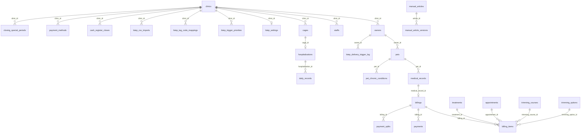

# データベース設計書 (Entity Relationship Diagram)

> **Animal Ekarte**: 高精度・高整合な動物病院データモデル
> **バージョン**: v31.21 | **最新更新**: 2026-06-22 | **状態**: Production Ready (103 Tables Verified)

---

## 1. データモデルの全体像 (全 103 テーブル)

本システムは、臨床・経営・外部連携を支える 103 のテーブルが高度に正規化され、臨床的整合性を維持するリレーショナルモデルを採用しています。

### 1.1 主要ドメイン別構成

| 区分 | 管理対象（物理テーブル名抜粋） |
|:---|:---|
| **システム基盤 (13)** | `accounts`, `clinics`, `clinic_settings`, `clinic_holidays`, `closing_special_periods`, `staffs`, `permission_groups`, `permission_group_rules`, `audit_logs`, `companies`, `password_reset_tokens`, `token_blacklist`, `occupations` |
| **入院・稼働 (11)** | `hospitalizations`, `daily_records`, `care_plan_items`, `care_logs`, `cages`, `hospitalization_plans`, `staff_notes`, `staff_clinic_assignments`, `staff_permission_groups`, `staff_reservation_exclusions`, `staff_reservation_capabilities` |
| **臨床・診察 (21)** | `owners`, `pets`, `pet_chronic_conditions`, `animal_species`, `chief_complaint_types`, `medical_records`, `medical_record_addenda`, `medical_record_images`, `clinical_plans`, `treatment_plans`, `treatments`, `prescriptions`, `procedures`, `vital_records`, `inquiries`, `consultations`, `diagnosis_names`, `diagnosis_types`, `inquiry_templates`, `medicines`, `vaccines` |
| **検査・予防 (8)** | `exams`, `exam_results`, `exam_types`, `exam_type_fields`, `vaccinations`, `checkups`, `checkup_types`, `shared_files` |
| **予約・シフト (12)** | `appointments`, `reservation_types`, `reservation_type_groups`, `reservation_type_occupations`, `reservation_type_available_slots`, `reservation_type_unavailable_times`, `appointment_trimming_details`, `appointment_trimming_options`, `shift_entries`, `shift_entry_breaks`, `shift_templates`, `shift_template_breaks` |
| **会計・経営 (15)** | `billings`, `billing_items`, `payments`, `payment_splits`, `billing_refunds`, `billing_confirmations`, `cash_register_closes`, `payment_methods`, `merchandise_items`, `estimate_items`, `estimates`, `insurances`, `campaigns`, `campaign_target_categories`, `campaign_target_items` |
| **トリミング (3)** | `trimming_course_types`, `trimming_courses`, `trimming_options` |
| **在庫 (1)** | `inventory_items` |
| **LINE/CRM (19)** | `line_customers`, `line_link_tokens`, `line_send_logs`, `line_reservation_settings`, `lstep_settings`, `lstep_trigger_priorities`, `lstep_delivery_trigger_log`, `lstep_csv_imports`, `lstep_tag_cache`, `lstep_tag_code_mappings`, `lstep_auto_managed_prefixes`, `lstep_condition_tag_mappings`, `lstep_send_purpose_tag_prefixes`, `lstep_friend_attribute_snapshots`, `lstep_sync_error_counters`, `clinic_integrations`, `manual_articles`, `manual_article_versions`, `lstep_migration_progress` |

---

## 2. エンティティ・リレーション図 (Mermaid)

```mermaid
erDiagram
    clinics ||--o{ owners : "clinic_id"
    clinics ||--o{ staffs : "clinic_id"
    owners ||--o{ pets : "owner_id"
    pets ||--o{ medical_records : "pet_id"
    pets ||--o{ pet_chronic_conditions : "pet_id"
    medical_records ||--o| billings : "medical_record_id"
    billings ||--o{ billing_items : "billing_id"
    treatments ||--o{ billing_items : "treatment_id"
    appointments ||--o{ billing_items : "appointment_id"
    trimming_courses ||--o{ billing_items : "trimming_course_id"
    trimming_options ||--o{ billing_items : "trimming_option_id"
    billings ||--o{ payments : "billing_id"
    billings ||--o{ payment_splits : "billing_id"

    %% 入院
    clinics ||--o{ cages : "clinic_id"
    hospitalizations ||--o{ daily_records : "hospitalization_id"
    cages ||--o| hospitalizations : "cage_id"

    %% Lステップ連携 (拡張)
    clinics ||--o| lstep_settings : "clinic_id"
    clinics ||--o{ lstep_trigger_priorities : "clinic_id"
    owners ||--o{ lstep_delivery_trigger_log : "owner_id"
    clinics ||--o{ lstep_tag_code_mappings : "clinic_id"
    clinics ||--o{ lstep_csv_imports : "clinic_id"

    %% 会計・集計 (拡張)
    clinics ||--o{ cash_register_closes : "clinic_id"
    clinics ||--o{ payment_methods : "clinic_id"
    clinics ||--o{ closing_special_periods : "clinic_id"

    %% 取扱説明書（マニュアル）
    manual_articles ||--o{ manual_article_versions : "article_id"
```

---

## 3. 設計原則と安全性

### 3.1 物理設計の標準
- **主キー**: 全テーブルで `bigint` (auto_increment) または `uuid` を採用。
- **日時管理**: アプリケーション、DB セッション、インフラ設定は `Asia/Tokyo` を標準とする。日時カラムは主に `timestamptz` を使い、API 入出力は JST オフセット付き ISO 8601 を基本とする。
- **整合性制約**: アプリケーション層だけでなく、DB レベルで `FOREIGN KEY` 制約によりデータの孤立を防止。

### 3.2 高度なマルチテナント隔離
- **`clinic_id` の強制**: ビジネスロジックが関わる全テーブルに `clinic_id` カラムを配置。
- **物理隔離インデックス**: `idx_xxx_clinic_id` を全テーブルに作成し、他拠点へのアクセスを DB レベルで遮断。

### 3.3 臨床データの信頼性
- **計量データ**: 体重 (`numeric(6,2)`) や薬剤量、金額には、丸め誤差の発生しない固定小数点方式を採用。
- **監査証跡**: `audit_logs` により、誰が・いつ・どの値を・どのように変更したかを全件記録。

---

## 4. スキーマ整合・不要候補判定ログ

`backend/migrations/001_init.sql` の `CREATE TABLE` 定義と本 ERD の主要ドメイン別構成を静的照合し、2026-06-12 時点で以下の通り整理しました。実 DB のデータ量・実行時 SQL・アクセスログは確認対象外です。

| 項目 | 結果 | 判定 |
|:---|:---|:---|
| `001_init.sql` の `CREATE TABLE` 数 | 103 | ERD の全体数と一致 |
| ERD ドメイン表の物理テーブル数 | 103 | migrations と一致 |
| ERD へ追加した不足テーブル | 6: `token_blacklist`, `reservation_type_available_slots`, `trimming_course_types`, `campaigns`, `campaign_target_categories`, `campaign_target_items` | migration に存在し、用途コメントまたはドメイン上の継続理由があるため追加 |
| migrations にあり ERD にないテーブル | 0 | 整合済み |
| ERD にあり migrations にないテーブル | 0 | 整合済み |
| 不要確定テーブル | 0 | 静的照合では削除対象なし |
| 不要確定カラム | 0 | ERD は列一覧を保持しないため、migration DDL 内の `unused` / `deprecated` / `DROP COLUMN` / `廃止` 等の明示的な削除候補コメントを確認。統合済み・seed 更新不要コメントのみで、削除確定カラムなし。 |

### 4.2 実 DB 検証結果（2026-06-22）

静的照合を補完する実 DB 検証として、現行ローカル環境で以下を実行しました。

- 実行コマンド:
  - `make schema-check` (内部で `docker compose --env-file .env.local exec backend go test ./internal/model/ -run TestSchemaDrift -v` を実行)
- 結果:
  - `TestSchemaDrift` PASS (0.18s)
- 互換注記:
  - `docker compose` 実行時、`.env.local` にて `DB_USER` / `DB_PASSWORD` / `DB_NAME` などの環境変数を読み込んでおり、検証は正常に成功しました。

### 4.3 最近のスキーマ更新履歴 (2026-06-22)

最新のモデルファイルおよびマイグレーションの適用に伴い、以下の更新を行いました。

- **緊急レジ締め区分の追加 (Issue #150 / 005_add_emg_period.sql)**
  - `cash_register_closes.period` カラムを `varchar(2)` から `varchar(3)` に拡張し、従来の `'am'`, `'pm'` に加えて `'emg'` (緊急) 区分を許容する `CHECK` 制約へと緩和。
- **レガシーEMR準拠の飼主・ペット情報追加 (Issue #158 / 006_add_owner_report_fields.sql)**
  - `pets.blood_type` (text, NULL可, ペット血液型) および `pets.microchip_number` (text, NULL可, マイクロチップ番号) を追加。
  - `owners.dm_preference` (boolean, NULL可, DM送付希望) を追加。既存レコードを汚染しないよう nullable 設計。
- **支払方法の銀行振込追加 (Issue #127 / 007_add_bank_transfer_payment_method.sql)**
  - `payment_method` ENUM型に `'bank_transfer'` (銀行振込) を追加。新クリニック作成時にマスタへ自動投入される「銀行振込」の値を `payment_splits.method` で保持できるように不整合を解消。

### 4.1 継続理由を明示する対象

| 対象 | 分類 | 継続理由 |
|:---|:---|:---|
| `lstep_migration_progress` | LINE/CRM | 既存飼い主データ一括同期の進捗管理テーブルとして `001_init.sql` にコメント定義あり。アプリ通常モデルと異なる運用テーブルのため、削除ではなく要確認継続。 |
| `token_blacklist` | システム基盤 | refresh token JTI の失効管理テーブルとして `001_init.sql` にコメント定義あり。認証安全性に関わるため削除対象外。 |
| `reservation_type_available_slots` | 予約・シフト | 予約区分ごとの受付可能枠を保持する設定テーブル。予約制御の設定情報であり削除対象外。 |
| `trimming_course_types` | トリミング | トリミングコースの分類マスタ。`trimming_courses` の種別管理に必要なため削除対象外。 |
| `campaigns` / `campaign_target_categories` / `campaign_target_items` | 会計・経営 | #81 キャンペーン割引マスタと対象指定テーブル。親子構造で割引適用対象を表現するため削除対象外。 |

## 5. 未確定事項（分類に関する注記）

> [!NOTE]
> `insurances`（保険マスタ）テーブルは、動物病院における会計精算（保険窓口精算・自己負担額計算）に深く関連するため、本設計書では暫定的に「会計・経営」ドメインに分類しています。ただし、診療時の適用確認やカルテ側の参照も発生するため、将来的な見直しで「臨床・診察」あるいは独立ドメインへ再編される可能性があります。
