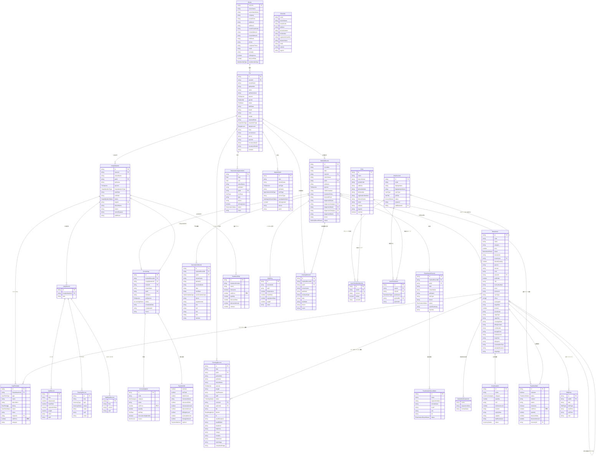

# 動物病院管理システム ER図 (Entity Relationship Diagram)

本ドキュメントは、システム内の全エンティティとその関連を定義します。
現在はフロントエンドのみ（Mock Data）で動作していますが、将来のバックエンド実装（自前環境）を想定した論理ERDです。

---

## Mermaid ER図


```mermaid
erDiagram
    %% ===== Core Entities =====

    Owner {
        string ownerId PK
        string ownerName
        string ownerNameKana
        string company
        string postalCode
        string address1
        string address2
        string homePostalCode
        string homeAddress1
        string homeAddress2
        string birthDate
        string phone
        string companyPhone
        string email
        string remarks
        boolean isDangerous
        number discountRate
        MembershipType membershipType
    }

    Pet {
        string id PK
        string ownerId FK
        string ownerName
        string petNumber
        string name
        string petNameKana
        PetSpecies species
        PetGender gender
        PetStatus status
        string birthDate
        string breed
        string color
        string weight
        string neuteredDate
        AcquisitionType acquisitionType
        DangerLevel dangerLevel
        string food
        string environment
        string phone
        string lastVisit
        string insuranceName
        string insuranceDetails
        string remarks
    }

    MedicalRecord {
        string id PK
        string recordNo
        string date
        string ownerId FK
        string ownerName
        string petId FK
        string petName
        PetSpecies species
        string chiefComplaint
        string treatmentPolicy
        string physicalExam
        string diagnosisDetails
        string diagnosis1Category FK
        string diagnosis1Name FK
        string diagnosis2Category FK
        string diagnosis2Name FK
        string doctor
        MedicalRecordStatus status
    }

    Hospitalization {
        string id PK
        string ownerId FK
        string ownerName
        string petId FK
        string petName
        PetSpecies species
        HospitalizationType hospitalizationType
        string startDate
        string endDate
        HospitalizationStatus status
        string cageId FK
        string doctorName
        string memo
        string ownerRequest
        string staffNotes
    }

    CarePlanItem {
        string id PK
        string hospitalizationId FK
        CarePlanType type
        string name
        string description
        PlanTiming[] timing
        CarePlanStatus status
        string notes
        string masterId FK
        number unitPrice "税込"
        string category
    }

    DailyRecord {
        string id PK
        string hospitalizationId FK
        string date
    }

    VitalRecord {
        string id PK
        string time
        number temperature
        number heartRate
        number respirationRate
        number weight
        string notes
        string staff
    }

    CareLogRecord {
        string id PK
        string time
        CareLogType type
        CareLogStatus status
        string value
        string staff
        string notes
    }

    StaffNoteRecord {
        string id PK
        string time
        string content
        string staff
    }

    Accounting {
        string id PK
        string medicalRecordId FK
        string hospitalizationId FK
        string ownerId FK
        string ownerName
        string petId FK
        string petName
        PetSpecies petSpecies
        AccountingStatus status
        string scheduledDate
        string completedAt
        string memo
    }

    AccountingItem {
        string id PK
        string code
        ItemCategory category
        string name
        number unitPrice "税込"
        number quantity
        TaxRate taxRate
        boolean isInsuranceApplicable
        ItemSource source
    }

    PaymentInfo {
        number subtotal
        number taxTotal
        number totalAmount
        string insuranceName
        number insuranceRatio
        number insuranceAmount
        number discountAmount
        number billingAmount
        number receivedAmount
        number changeAmount
        PaymentMethod method
    }

    ReservationAppointment {
        string id PK
        Date start
        Date end
        string ownerName
        string petName
        string petId FK
        VisitType visitType
        string type
        string doctor
        boolean isDesignated
        ReservationStatus status
        string notes
    }

    TrimmingRecord {
        string id PK
        string date
        string petId FK
        string petNumber
        string petName
        string ownerName
        PetSpecies species
        string weight
        string styleRequest
        string staff
        TrimmingStatus status
        string courseId FK
        string[] optionIds FK
        string bw
        BodyWeightUnit bwUnit
        string bt
        string usedShampoo
        string usedRibbon
        string treatment
        string medicine
        string charge
        string remarks
        string finalCheck
        string styleImage
        string completedImage
    }

    ExaminationRecord {
        string id PK
        string medicalRecordId FK
        string petId FK
        string date
        string ownerName
        string petName
        string testType
        string doctor
        ExaminationStatus status
        string resultSummary
        string machine
    }

    ExaminationRecordItem {
        string id PK
        string name
        string inspectionValue
        string normalValue
        string result
        string unit
        string ref
        ExaminationResultStatus status
    }

    VaccinationRecord {
        string id PK
        string medicalRecordId FK
        string petId FK
        string ownerName
        string petName
        string vaccineName
        string date
        string nextDate
        NextScheduleType nextScheduleType
        string doctor
        string supplemental
        string lot1
        string lot2
        string lot3
        string lot4
        string remarks
    }

    MasterItem {
        string id PK
        string code
        string name
        string category
        number price
        MasterItemStatus status
        string description
        string inventoryId FK
        number defaultQuantity
        string species
        string interval
        string color
        string parentId FK
        number sortOrder
        string role
        string licenseNumber
        string email
        string password
        string userType
        string[] clinics
        string lastLoginAt
        string targetSize
        number duration
        string anesthesia
        string cageType
        string cageSize
        string coverageRate
        string billingContact
        string combinable
        string dosageForm
        string medicineUnit
        string bodySize
        string billingUnit
        string consultationTime
        string standardDuration
        string targetAge
    }

    MasterItemInspection {
        string name
        string inspectionValue
        string normalValue
    }

    InventoryItem {
        string id PK
        string name
        InventoryCategory category
        number quantity
        string unit
        number minStockLevel
        string location
        string expiryDate
        string supplier
        string lastRestocked
        InventoryStatus status
    }

    ClinicInfo {
        string name
        string branchName
        string postalCode
        string address
        string phoneNumber
        string faxNumber
        string registrationNumber
        string directorName
        string email
        string website
        string logoUrl
    }

    Appointment {
        string id PK
        string time
        string ownerName
        PetSpecies petType
        string petName
        AppointmentVisitType visitType
        string serviceType
        NextAppointmentStatus nextAppointment
        boolean isDesignated
        string doctor
        string petId FK
    }

    TreatmentPlan {
        string id PK
        string treatmentContent
        string memo
        boolean insurance
        number unitPrice "税込"
        number quantity
        number discountRate
        number discountAmount
        number subtotal
    }

    TreatmentItem {
        string id PK
        boolean selected
        TreatmentStatus status
        string content
        string memo
        boolean insurance
        number unitPrice "税込"
        number quantity
        number discountRate
        number discountAmount
        string inventoryId FK
    }

    VitalEntry {
        string id PK
        string recordedAt
        string staff
        number temperature
        number heartRate
        number respirationRate
        number weight
        string notes
    }

    %% ===== Shift Management =====

    ShiftEntry {
        string id PK
        string staffId FK
        string date
        ShiftType shiftType
        string startTime
        string endTime
        string note
    }

    %% ===== Checkup =====

    CheckupRecord {
        string id PK
        string medicalRecordId FK
        string petId FK
        string ownerName
        string petName
        string checkupType
        string date
        string nextDate
        string doctor
        string result
    }

    %% ===== Authentication & Authorization =====

    Clinic {
        string id PK
        string name
        string branchName
        string postalCode
        string address
        string phoneNumber
        string faxNumber
        string registrationNumber
        string directorName
        string email
        string website
        string logoUrl
        boolean isActive
    }

    UserAccount {
        string id PK
        string email
        string displayName
        string displayNameKana
        UserType userType
        JobTitle jobTitle
        AccountStatus status
        string avatarUrl
        string staffMasterId FK
    }

    UserClinicMembership {
        string id PK
        string userId FK
        string clinicId FK
        boolean isMain
        string joinedAt
    }

    UserPermission {
        string id PK
        string userId FK
        string clinicId FK
        PermissionType permission
        string grantedBy FK
        string grantedAt
    }

    %% ===== Relationships =====

    Owner ||--o{ Pet : "飼育"
    Pet ||--o{ MedicalRecord : "診療記録"
    Pet ||--o{ Hospitalization : "入院記録"
    Pet ||--o{ TrimmingRecord : "トリミング記録"
    Pet ||--o{ ReservationAppointment : "予約"
    Pet ||--o{ Appointment : "来院"
    Pet ||--o{ CheckupRecord : "定期健診"

    MedicalRecord ||--o{ ExaminationRecord : "検査"
    MedicalRecord ||--o{ VaccinationRecord : "予防接種"
    MedicalRecord ||--o{ TreatmentItem : "治療プラン/実施"
    MedicalRecord ||--o{ VitalEntry : "バイタル記録"
    MedicalRecord |o--o| Accounting : "会計紐付け"
    MedicalRecord ||--o{ CheckupRecord : "定期健診記録"

    Hospitalization ||--o{ CarePlanItem : "ケアプラン"
    Hospitalization ||--o{ DailyRecord : "日次記録"
    Hospitalization ||--o{ TreatmentPlan : "治療プラン"
    Hospitalization |o--o| Accounting : "入院会計紐付け"

    DailyRecord ||--o{ VitalRecord : "バイタ"
    DailyRecord ||--o{ CareLogRecord : "ケアログ"
    DailyRecord ||--o{ StaffNoteRecord : "スタッフメモ"

    Accounting ||--o{ AccountingItem : "明細"
    Accounting |o--|| PaymentInfo : "支払情報"

    ExaminationRecord ||--o{ ExaminationRecordItem : "検査項目"

    MasterItem ||--o{ MasterItemInspection : "検査項目定義"
    MasterItem |o--o| InventoryItem : "在庫連携"
    MasterItem |o--o| MasterItem : "親子階層(9カテゴリ)"
    MasterItem |o--o{ CarePlanItem : "ケアプラン連携"
    MasterItem |o--o{ TreatmentItem : "治療連携"
    MasterItem |o--o{ TrimmingRecord : "コース/オプション連携"

    MedicalRecord }o--o{ MasterItem : "診断名参照"

    MasterItem ||--o{ ShiftEntry : "スタッフシフト"

    %% ===== Auth Relationships =====
    UserAccount ||--o{ UserClinicMembership : "クリニック所属"
    Clinic ||--o{ UserClinicMembership : "所属メンバー"
    UserAccount ||--o{ UserPermission : "権限付与"
    Clinic ||--o{ UserPermission : "権限スコープ"
    UserAccount |o--o| MasterItem : "スタッフマスタ紐付け"
```

---

## エンティティ一覧

### コアエンティティ

| # | エンティティ | 定義場所 | 説明 |
|---|-------------|---------|------|
| 1 | `Owner` | `features/owners/types` | 飼主（顧客） |
| 2 | `Pet` | `types/index.ts` + `features/owners/types` | ペット（患者）。一覧用の軽量IF(`Pet`)と編集用の完全IF(`PetFormData`/`PetInfo`)に分離 |
| 3 | `MedicalRecord` | `types/index.ts` | 電子カルテ |
| 4 | `Hospitalization` | `types/index.ts` | 入院/ホテル記録 |
| 5 | `Accounting` | `features/accounting/types` | 会計レコード |
| 6 | `ReservationAppointment` | `types/index.ts` | 予約 |
| 7 | `TrimmingRecord` | `types/index.ts` + `features/trimming/types` | トリミング記録。一覧用(`TrimmingRecord`)とフォーム用(`TrimmingFormData`)に分離 |
| 8 | `ExaminationRecord` | `types/index.ts` | 検査記録 |
| 9 | `VaccinationRecord` | `types/index.ts` + `features/medical-records/types` | 予防接種記録。フォーム用の追加フィードは`VaccinationFormData`に分離 |
| 10 | `MasterItem` | `types/index.ts` | マスタデータ。`code`列は`staff`（社員番号）・`cage`（ケージ番号）のみ業務コードとして使用、他カテゴリではnameと同値。`parentId`で同一カテゴリ内の親子階層を構成、`sortOrder`でD&D並び替え順を永続化 |
| 11 | `InventoryItem` | `types/index.ts` | 在庫品目 |
| 12 | `ClinicInfo` | `features/clinic/types` | 病院情報（シングルトン） |

### 入院サブエンティティ

| # | エンティティ | 親 | 説明 |
|---|-------------|-----|------|
| 13 | `CarePlanItem` | `Hospitalization` | ケアプラン項目 |
| 14 | `DailyRecord` | `Hospitalization` | 日次記録コンテナ |
| 15 | `VitalRecord` | `DailyRecord` | バイタルサイン |
| 16 | `CareLogRecord` | `DailyRecord` | ケアログ（食事/排泄/投薬等） |
| 17 | `StaffNoteRecord` | `DailyRecord` | スタッフメモ |
| 18 | `TreatmentPlan` | `Hospitalization` | 入院治療プラン |

### 電子カルテサブエンティティ

| # | エンティティ | 親 | 説明 |
|---|-------------|-----|------|
| 19 | `TreatmentItem` | `MedicalRecord` | 治療/処置項目 |
| 20 | `VitalEntry` | `MedicalRecord` | カルテ内バイタル |
| 21 | `ExaminationRecordItem` | `ExaminationRecord` | 検査結果項目 |
| 22 | `CheckupRecord` | `MedicalRecord` | 定期健診記録 |

### 会計サブエンティティ

| # | エンティティ | 親 | 説明 |
|---|-------------|-----|------|
| 23 | `AccountingItem` | `Accounting` | 会計明細行 |
| 24 | `PaymentInfo` | `Accounting` | 支払情報（1:1） |

### マスタサブエンティティ

| # | エンティティ | 親 | 説明 |
|---|-------------|-----|------|
| 25 | `MasterItemInspection` | `MasterItem` | 検査マスタの検査項目定義 |

### シフト管理エンティティ

| # | エンティティ | 説明 |
|---|-------------|------|
| 26 | `ShiftEntry` | シフトエントリ（スタッフ×日付ごとの勤務情報） |
| 27 | `ShiftStaffInfo` | シフト用スタッフ情報（マスタから派生、ビューモデル） |
| 28 | `DayShiftSummary` | 月表示用の日別サマリー（ビューモデル） |
| 29 | `ShiftColorConfig` | シフトタイプ別カラー定義（bg/text/border、Notion風パレット） |

### ダッシュボードエンティティ（ビューモデル）

| # | エンティティ | 説明 |
|---|-------------|------|
| 30 | `Appointment` | カンバンカード（ダッシュボード用ビューモデル） |
| 31 | `ColumnData` | カンバンカラム（ビューモデル、Mermaid図からは省略） |

### 認証・認可エンティティ

| # | エンティティ | 定義場所（実装後） | 説明 |
|---|-------------|---------|------|
| 32 | `Clinic` | `features/auth/types` | クリニック（マルチクリニック対応）。既存 `ClinicInfo` を拡張・複数院対応化 |
| 33 | `UserAccount` | `features/auth/types` | ユーザーアカウント（認証の主エンティティ） |
| 34 | `UserClinicMembership` | `features/auth/types` | ユーザー・クリニック所属（N:M中間テーブル） |
| 35 | `UserPermission` | `features/auth/types` | ユーザー権限（クリニックスコープ） |

> **エンティティ総数: 35**（コア12 + 入院サブ6 + カルテサブ4 + 会計サブ2 + マスタサブ1 + シフト4 + ダッシュボード2 + 認証4）

---

## リレーション詳細

### 1. Owner ↔ Pet（1:N）

```
Owner.ownerId = Pet.ownerId
```
- 1人の飼主が複数のペットを飼育
- Pet側にownerName等の非正規化フィールドあり（表示用）

### 2. Pet ↔ MedicalRecord（1:N）

```
Pet.id = MedicalRecord.petId
```
- 1匹のペットに対して複数の診療記録
- MedicalRecord側にpetName, ownerName等の非正規化フィールドあり

### 3. Pet ↔ Hospitalization（1:N）

```
Pet.id = Hospitalization.petId
```
- 1匹のペットに対して複数の入院記録

### 4. MedicalRecord ↔ Accounting（1:0..1）

```
Accounting.medicalRecordId = MedicalRecord.id
```
- 診療記録に対して最大1件の会計レコード
- 会計レコードはカルテなしでも作成可能（物販等）

### 4b. Hospitalization ↔ Accounting（N:0..1）

```
Accounting.hospitalizationId = Hospitalization.id
```
- 入院→退院→会計連携時に設定
- `ItemSource` の `'hospitalization'` ソースと対応し、入院治療プランの明細を会計に引き渡す

### 5. MedicalRecord ↔ ExaminationRecord（1:N）

```
ExaminationRecord.medicalRecordId = MedicalRecord.id
```
- 1つのカルテに複数の検査を紐付け

### 6. MedicalRecord ↔ VaccinationRecord（1:N）

```
VaccinationRecord.medicalRecordId = MedicalRecord.id
```
- 1つのカルテに複数の予防接種記録

### 7. Hospitalization ↔ CarePlanItem（1:N）

```
CarePlanItem.hospitalizationId = Hospitalization.id
```
- 入院レコードに対して複数のケアプランアイテム

### 8. Hospitalization ↔ DailyRecord（1:N）

```
DailyRecord.hospitalizationId = Hospitalization.id
```
- 入院レコードに対して日付ごとの記録

### 9. DailyRecord ↔ VitalRecord / CareLogRecord / StaffNoteRecord（1:N each）

```
DailyRecord.vitals[]      → VitalRecord
DailyRecord.careLogs[]    → CareLogRecord
DailyRecord.staffNotes[]  → StaffNoteRecord
```
- 各日次記録に複数のバイタル/ログ/メモを納（ネスト構造）

### 10. Accounting ↔ AccountingItem（1:N）

```
AccountingItem は Accounting.items[] として保持
```

### 11. Accounting ↔ PaymentInfo（1:0..1）

```
PaymentInfo は Accounting.payment として保持
```
- 支払い完了後にセットさ���る

### 12. MasterItem ↔ InventoryItem（N:0..1）

```
MasterItem.inventoryId = InventoryItem.id
```
- 薬剤マスタ等が在庫品目と紐付く

### 13. MasterItem ↔ MasterItem（自己参照: 親子）

```
MasterItem.parentId = MasterItem.id
```
- 同一カテゴリ内の親子階層（N段対応）。`showParentItem: true`の9カテゴリ（診察・検査・処置・予防接種・トリミングコース・オプション・入院・薬剤・定期健診）で使用
- 親項目は金額を持たず（`price: 0`）、子項目（リーフ）のみ金額入力可
- `sortOrder`で同一階層内の表示順を管理（HTML5 D&Dによる並び替え対応）
- カスケード削除: 親削除時に子孫もすべて削除
- 循環参照防止: 編集フォームの親候補から自身と子孫を除外

### 14. MasterItem ↔ CarePlanItem（マスタ参照）

```
CarePlanItem.masterId = MasterItem.id
```
- ケアプランがマスタ項目を参照（単価・名称の自動入力）

### 15. Hospitalization ↔ MasterItem(cage)

```
Hospitalization.cageId = MasterItem.id (category=cage)
```
- ケージマスタから入院先ケージを参照

### 16. TrimmingRecord ↔ MasterItem(trimming_course)（N:0..1）

```
TrimmingRecord.courseId = MasterItem.id (category=trimming_course)
```
- トリミングコースマスタからコースを参照（料金・名称の自動入力）

### 17. TrimmingRecord ↔ MasterItem(trimming_option)（N:M）

```
TrimmingRecord.optionIds[] = MasterItem.id (category=trimming_option)
```
- トリミングオプションマスタから複数オプションを参照
- バックエンド実装時は中間テーブル（`TrimmingRecordOption`）が必要

### 18. MedicalRecord ↔ MasterItem(diagnosis)（診断名参照）

```
MedicalRecord.diagnosis1Category = MasterItem.id (category=diagnosis_category)
MedicalRecord.diagnosis1Name     = MasterItem.id (category=diagnosis_name)
MedicalRecord.diagnosis2Category = MasterItem.id (category=diagnosis_category)
MedicalRecord.diagnosis2Name     = MasterItem.id (category=diagnosis_name)
```
- カルテに最大2つの診断（カテゴリ+診断名）を紐付け
- 各診断はdiagnosis_categoryマスタとdiagnosis_nameマスタへのFK

### 19. UserAccount ↔ UserClinicMembership ↔ Clinic（N:M）

```
UserClinicMembership.userId   = UserAccount.id
UserClinicMembership.clinicId = Clinic.id
```
- 1ユーザーが複数のクリニックに所属可能
- 各所属に `isMain` フラグ（1ユーザーにつき1つのみ `true`、部分一意インデックスで保証）
- `system_admin` は所属に関係なく全クリニックにアクセス可能

### 20. UserAccount ↔ UserPermission ↔ Clinic（N:M × Permission）

```
UserPermission.userId    = UserAccount.id
UserPermission.clinicId  = Clinic.id
UserPermission.permission = permission_type
```
- 権限はクリニックスコープ（同一ユーザーがA院では `medical`、B院では `trimming` のみ等）
- `clinic_admin` は所属クリニック内の全権限を暗黙的に保持
- `staff` は明示的に付与された権限のみ

### 21. UserAccount ↔ MasterItem(staff)（1:0..1）

```
UserAccount.staffMasterId = MasterItem.id (category=staff)
```
- 既存のスタッフマスタとの紐付け（シフト管理・カル担当医表示等で使用）
- 認証実装後、段階的に `UserAccount` ベースに移行

### 22. Clinic ↔ ClinicInfo（移行関係）

```
Clinic は ClinicInfo を拡張・複数院対応化したもの
```
- 既存の `ClinicInfo`（シングルトン）を `Clinic`（複数レコード対応、UUID PK、`isActive` フラグ）に移行
- フロントエンドの `currentClinicId` コンテキストで選択中クリニックを管理

---

## 列挙型（Enum）一覧

### グローバル列挙型（`/types/index.ts`）

| 列挙型 | 値 | 用途 |
|--------|-----|------|
| `PetSpecies` | 犬, 猫, 鳥, その他 | ペット種別 |
| `PetStatus` | 生存, 死亡 | ペット状態 |
| `MedicalRecordStatus` | 作成中, 確定済 | カルテステータス |
| `HospitalizationType` | 入院, ホテル | 入院区分 |
| `HospitalizationStatus` | 入院中, 退院済, 予約 | 入院ステータス |
| `CarePlanType` | food, medicine, treatment, instruction, item | ケアプラン種別 |
| `CarePlanStatus` | active, completed, discontinued | ケアプランステータス |
| `CareLogType` | food, excretion, medicine, treatment, other | ケアログ種別 |
| `CareLogStatus` | completed, partial, skipped | ケアログステータス |
| `PlanTiming` | morning, noon, night | 実施タイミング |
| `ReservationStatus` | confirmed, pending, cancelled, checked_in, in_consultation, accounting, completed | 予約ステータス |
| ~~`ReservationType`~~ | ~~診療, ��期健診, 検査, 手術, トリミング, 予防接種, 入院, ホテル~~ | **廃止**: 予約種別はマスタデータ（`MasterItem` category=`serviceType`）で動的管理。`ReservationAppointment.type` は `string` 型 |
| `VisitType` | first, revisit | 来院種別 |
| `VisitReason` | injury, vomiting, diarrhea, skin, eye, ear, dental, checkup, vaccination, other | 来院理由 |
| `TrimmingStatus` | 完了, 予約, 進行中 | トリミングステータス |
| `ExaminationStatus` | 依頼中, 検査中, 完了 | 検査ステータス |
| `MasterItemStatus` | active, inactive | マスタ有効性 |
| `MasterCategory` | examination, vaccine, medicine, staff, insurance, cage, serviceType, consultation, procedure, hospitalization, trimming_course, trimming_option, diagnosis_category, diagnosis_name, checkup | マスタカテゴリ（15種） |
| `InventoryCategory` | medicine, consumable, food, other | 在庫カテゴリ |
| `InventoryStatus` | sufficient, low, out_of_stock | 在庫ステータス |
| `SortOrder` | desc, asc | ソート順 |
| `CalendarView` | month, week | カレンダー表示 |
| `TextAlign` | left, center, right | テーブル列配置 |

### Feature固有列挙型

| 列挙型 | Feature | 値 | 用途 |
|--------|---------|-----|------|
| `AccountingStatus` | accounting | waiting, completed, cancelled, pending | 会計ステータス |
| `PaymentMethod` | accounting | cash, credit_card, electronic_money | 支払方法 |
| `ItemCategory` | accounting | examination, test, procedure, surgery, medicine, food, goods, other | 会計品目カテゴリ |
| `TaxRate` | accounting | 0.1, 0.08 | 税率 |
| `ItemSource` | accounting | medical_record, manual, hospitalization | 品目ソース |
| `InsuranceRatio` | accounting | 0.5, 0.7, 0.9, 1.0 | 保険負担割合（会計側） |
| `DocumentType` | accounting | receipt, statement | 書類種別 |
| `MembershipType` | owners | 非会員, 会員, 退亡者, 他診/準 | 会員種別 |
| `PetGender` | owners | 雄, 雌, 不明 | ペット性別 |
| `AcquisitionType` | owners | 購入, 譲渡, 保護, その他 | 入手経路 |
| `DangerLevel` | owners | 低, 中, 高 | 危険度 |
| `InsuranceCompany` | owners | アニコム, アイペット, ... | 保険会社 |
| `PetInsuranceRatio` | owners | 50%, 70%, 90%, 100%, その他 | ペット保険負担割合（飼主側） |
| `TreatmentStatus` | medical-records | 未完了, 完了, - | 治療ステータス |
| `NextScheduleType` | medical-records | 3weeks, 4weeks, 1year, other | 次回接種間隔 |
| `ExaminationResultStatus` | medical-records | normal, high, low | 検査結果状態 |
| `VaccineSpecies` | master | dog, cat, both | 予防接種対象種 |
| `DosageForm` | master | tablet, liquid, injection, topical, powder | 剤形 |
| `MedicineUnit` | master | per_tablet, per_ml, per_dose, per_gram | 薬剤単位 |
| ~~`StaffRole`~~ | ~~master~~ | ~~veterinarian, nurse, trimmer, reception, manager~~ | **廃止予定**: 認証実装時に `JobTitle` に移行。`manager` は `UserType.clinic_admin` に対応 |
| `CageType` | master | icu, dog, cat, general | ケージタイプ |
| `CageSize` | master | small, medium, large | ケージサイズ |
| `CoverageRate` | master | 50, 70, 80, 100 | 保険補償率 |
| `TargetSize` | master | small, medium, large, cat | トリミング対象サイズ |
| `Combinable` | master | yes, no | トリミング併用可否 |
| `BodySize` | master | small, medium, large | 入院体格区分 |
| `BillingUnit` | master | per_day, per_night | 入院課金単位 |
| `ConsultationTime` | master | anytime, first_visit, revisit, after_hours, emergency | 診察適用区分 |
| `Anesthesia` | master | none, local, sedation, general | 処置麻酔区分 |
| `CheckupTargetAge` | master | all, puppy, adult, senior | 健診対象年齢 |
| `BodyWeightUnit` | trimming | Kg, g | 体重単位 |
| `HospitalizationFilterStatus` | hospitalization | all, active, discharged, reserved | 一覧フィルタ |
| `HospitalizationViewMode` | hospitalization | list, board | 表モード |
| `SelectionMode` | pets | single, multiple, multiple-same-owner | ペット選択モード |
| `ShiftType` | shifts | full, morning, afternoon, off, paid_leave | シフト種別 |
| `ShiftView` | shifts | week, month | シフトカレンダー表示 |

### 認証・認可列挙型（認証実装時に追加）

| 列挙型 | Feature | 値 | 用途 |
|--------|---------|-----|------|
| `UserType` | auth | system_admin, clinic_admin, staff | ユーザー種別（3層モデル最上位） |
| `JobTitle` | auth | veterinarian, nurse, trimmer, reception, general_staff | 職種（`StaffRole` の後継、`manager` → `general_staff` 置換） |
| `PermissionType` | auth | account_admin, medical, medical_read, trimming, billing, reception, hospitalization, master_admin, shift_admin, inventory | 権限種別（10種） |
| `AccountStatus` | auth | active, inactive, locked | アカウントステータス |

### 印刷ドキュメント型列挙

| 列挙型 | Feature | 値 | 用途 |
|--------|---------|-----|------|
| `MrDocumentType` | medical-records | prescription, certificate | カルテ印刷（処方箋/診断書） |
| `HospDocumentType` | hospitalization | summary | 入院印刷（入院サマリー） |
| `DocumentType` | accounting | receipt, statement | 会計印刷（領収書/診療明細書） |

> 各feature の `types/index.ts` で `XXX_DOCUMENT_TYPE_VALUES` / `XXX_DOCUMENT_TYPE_LABELS` の値列挙パターンで定義。`usePrint<T>` ジェネリックフック + `PrintPreviewDialog` 共通コンポーネントで統一的に使用。

---

## データフロー概要

```
                           ┌────────────┐
                           │  MasterItem │
                           │  (15カテゴリ)│
                           └──────┬─────┘
                                  │ 参照
          ┌───────────────────────┼───────────────────────┐
          │                       │                       │
          ▼                       ▼                       ▼
    ┌───────────┐          ┌───────────┐          ┌───────────┐
    │TreatmentItem│         │CarePlanItem│         │InventoryItem│
    │(カルテ治療) │         │(入院ケア)  │         │(在庫管理)  │
    └──────┬────┘          └──────┬────┘          └───────────┘
           │                      │                    ▲
           │                      │                    │ consumeStock
           ▼                      ▼                    │
    ┌──────────────┐       ┌──────────────┐     ┌─────────────┐
    │ MedicalRecord │       │Hospitalization│     │  カルテ保存時  │
    │  (電子カルテ) │       │ (入院管理)    │     │  在庫消費連動  │
    └───────┬──────┘       └──────┬───────┘     └─────────────┘
            │                     │
            │  1:0..1             │ 1:N
            ▼                     ▼
    ┌──────────────┐       ┌──────────────┐
    │  Accounting   │       │  DailyRecord  │
    │   (会計)      │       │ (日次記録)    │
    └──────────────┘       └──────────────┘

    MasterItem(trimming_course/option) ←── TrimmingRecord（コース・オプション連携）
    MasterItem(diagnosis_category/name) ←── MedicalRecord（診断名参照）

    ┌──────────────┐       ┌──────────────┐
    │    Owner      │ 1:N  │     Pet       │
    │  (飼主)       │──────│   (ペット)    │
    └──────────────┘       └──────┬───────┘
                                  │ 1:N
                    ┌─────────────┼─────────────┐
                    │             │             │
                    ▼             ▼             ▼
             MedicalRecord  Hospitalization  TrimmingRecord
             ExaminationRecord  VaccinationRecord  ReservationAppointment
```

---

## 備考

1. **非正規化フィールド**: `ownerName`, `petName`, `species` 等が複数エンティティに冗長に保持されている。これはMock Data環境での表示利便性のため。バックエンド実装時はJOINに置き換えるか、意図的にデノーマライズを維持するか設計判断が必要。

2. **ClinicInfo**: シングルトンエンティティ（1レコードのみ）。`features/clinic/api/store.ts` でインメモリ管理。

3. **Appointment vs ReservationAppointment**: `Appointment` はダッシュボードのカンバンカード用のビューモデル。`ReservationAppointment` は予約管理画面の正式な予約データ。将来は同一エンティティに統合する可能性あり。

4. **TreatmentPlan vs TreatmentItem**: `TreatmentPlan` は入院管理の治療プラン。`TreatmentItem` はカルテの治療/処置項目。将来は共通化の余地あり。

5. **インメモリストア**: `master`, `clinic`, `hospitalization` は `api/store.ts` でミュータブルなインメモリストアを保持（CRUD操作のシミュレーション）。その他のfeatureは `api/mockData.ts` の静的データを参照。

6. **Pet のインターフェース分離**: 現在 `Pet`（`types/index.ts`）は一覧/検索用の軽量インターフェース。`PetFormData`/`PetInfo`（`features/owners/types`）がペット編集時の完全フィールドセットを持つ。ERD上は統合した完全なエンティティとして記載。バックエンド実装時は単一テーブルとして実装し、APIレスポンスのプロジェクション（SELECT列の選択）で軽量版を提供する想定。

7. **TrimmingRecord のインターフェース分離**: `TrimmingRecord`（`types/index.ts`）は一覧表示用。`TrimmingFormData`（`features/trimming/types`）がフォーム入力用の完全フィールドセットを持つ。ERD上は統合して記載。

8. **VaccinationRecord の拡張フィールド**: `VaccinationRecord`（`types/index.ts`）は一覧表示用の基本フィールドのみ。`VaccinationFormData`（`features/medical-records/types/vaccination.ts`）にLOT番号や補助説明等の入力フィールドが追加定義されている。ERD上は統合して記載。

9. **MedicalRecord の診断フィールド**: `MedicalRecord`（`types/index.ts`）は一覧表示用の基本フィールドのみ。`DiagnosisFormData`（`features/medical-records/types/diagnosis.ts`）に診断詳細・診断カテゴリ・診断名のフォームフィールドが追加定義されている。ERD上は統合して記載。`treatmentPolicy`（治療方針）と`physicalExam`（身体所見）も同様にカルテォーム内で入力されるMarkdownフィールド。

10. **Owner の自宅郵便番号**: コード上では `OwnerData.homePostalCode` として統一済み。ERDの `homePostalCode` と一致。

11. **TrimmingRecord ↔ MasterItem(option) の中間テーブル**: `optionIds: string[]` は現在配列として保持されているが、バックエンド実装時はN:M関係のため中間テーブル（`trimming_record_options`）が必要。

12. **MasterItem の親子関係**: 
    - 多階層カテゴリの親子関係（showParentItem: true の9カテゴリで使用）
    - 親＝カテゴリ、子＝項目として機能し、最下層のみ金額入力可
    - D&Dで項目の所属カテゴリを変更可能
    - 診断名マスタ → 診断カテゴリマスタの親子関係にも使用

13. **ExaminationRecordItem のインターフェース分離**: `ExaminationRecordItem`（`types/index.ts`）は `MasterItemInspection` を継承し検査項目定義ベースの軽量インターフェース（`name`, `inspectionValue`, `normalValue`, `result`）。`ExaminationResultItem`（`features/medical-records/types/examination.ts`）に結果表示用の追加フィールド（`unit`, `ref`, `status`）が定義されている。ERD上は統合して記載。

14. **ClinicInfo → Clinic 移行**: 認証実装（AUTH.md Phase 2）で `ClinicInfo`（シングルトン、PK なし）を `Clinic`（UUID PK、複数レコード対応、`isActive` フラグ）に移行する。移行後も `ClinicInfo` エンティティは互換のため残存し、`features/clinic/` が `Clinic` エンティティの CRUD を担当する形に段階的に切り替える。

15. **StaffRole → JobTitle 移行**: 認証実装で `StaffRole` enum（`veterinarian`, `nurse`, `trimmer`, `reception`, `manager`）を `JobTitle` enum（`veterinarian`, `nurse`, `trimmer`, `reception`, `general_staff`）に置換する。`manager` は `UserType.clinic_admin` に対応するため `JobTitle` からは除外し、`general_staff`（一般職員）に置き換える。移行期間中は両方の enum が共存する。

16. **マルチクリニック対応（`clinic_id` 追加）**: 認証実装で全データテーブル（27テーブル）に `clinic_id UUID NOT NULL REFERENCES clinics(id)` カラムを追加し、クリニックスコープの RLS ポリシーを適用する。グローバルマスタ（法人全体で共有）が必要な場合は `clinic_id = NULL` をグローバルマスタとして扱う設計も検討。詳細は AUTH.md §6.3 を参照。

17. **LocalStorage によるデータ永続化**: 現在のプロトタイプ（v2026-03d）では、「会計機能 (`accounting`)」および「入院機能 (`hospitalization`)」のデータについて、一時的なオンメモリではなく、ブラウザの LocalStorage を用いた永続化ストア（Store）を採用しています。これによりリロード後もデータが保持されます。

18. **権限コントロールの適用**: 特定の操作（例: カルテの確定操作など）には `medical` ロール・権限を要求する仕様を適用開始しています。