# データベース設計書 (Entity Relationship Diagram)

> **目的**: 全128テーブルのデータベース設計(ER図)を定義し、テーブル数等の統計値の正本とする。
> **読者**: 全開発者。
> **タイミング**: スキーマ変更・DB設計判断時。

<!-- ERD:TABLE_COUNT=128 -->

> **Animal Ekarte**: 高精度・高整合な動物病院データモデル
> **バージョン**: v31.39 | **最新更新**: 2026-08-19 | **状態**: Production Ready (128 Tables Verified)

---

## 1. データモデルの全体像 (全 128 テーブル)

本システムは、臨床・経営・外部連携を支える 128 のテーブルが高度に正規化され、臨床的整合性を維持するリレーショナルモデルを採用しています。

### 1.1 主要ドメイン別構成

| 区分 | 管理対象（物理テーブル名抜粋） |
|:---|:---|
| **システム基盤 (13)** | `accounts`, `clinics`, `clinic_settings`, `clinic_holidays`, `closing_special_periods`, `staffs`, `permission_groups`, `permission_group_rules`, `audit_logs`, `companies`, `password_reset_tokens`, `token_blacklist`, `occupations` |
| **入院・稼働 (11)** | `hospitalizations`, `daily_records`, `care_plan_items`, `care_logs`, `cages`, `hospitalization_plans`, `staff_notes`, `staff_clinic_assignments`, `staff_permission_groups`, `staff_reservation_exclusions`, `staff_reservation_capabilities` |
| **臨床・診察 (24)** | `owners`, `pets`, `pet_owners`, `pet_chronic_conditions`, `animal_species`, `chief_complaint_types`, `medical_records`, `medical_record_addenda`, `medical_record_images`, `medical_record_image_upload_quota`, `clinical_plans`, `treatment_plans`, `treatments`, `prescriptions`, `procedures`, `vital_records`, `inquiries`, `consultations`, `diagnosis_names`, `diagnosis_types`, `inquiry_templates`, `medicines`, `medicine_dose_params`, `vaccines` |
| **検査・予防 (25)** | `exams`, `exam_results`, `exam_types`, `exam_type_fields`, `exam_reference_ranges`, `examination_revisions`, `examination_revision_items`, `vaccinations`, `checkups`, `checkup_types`, `checkup_type_fields`, `checkup_field_results`, `checkup_package_import_receipts`, `shared_files`, `lab_import_jobs`, `lab_import_events`, `lab_import_exam_retractions`, `lab_import_exam_retraction_items`, `lab_import_usage_receipts`, `lab_import_revert_receipts`, `lab_devices`, `lab_device_item_masters`, `lab_import_job_items`, `lab_device_waits`, `lab_device_station_settings` |
| **予約・シフト (12)** | `appointments`, `reservation_types`, `reservation_type_groups`, `reservation_type_occupations`, `reservation_type_available_slots`, `reservation_type_unavailable_times`, `appointment_trimming_details`, `appointment_trimming_options`, `shift_entries`, `shift_entry_breaks`, `shift_templates`, `shift_template_breaks` |
| **会計・経営 (16)** | `billings`, `billing_items`, `payments`, `payment_splits`, `billing_refunds`, `billing_confirmations`, `cash_register_closes`, `cash_register_close_adjustments`, `payment_methods`, `merchandise_items`, `estimate_items`, `estimates`, `insurances`, `campaigns`, `campaign_target_categories`, `campaign_target_items` |
| **トリミング (3)** | `trimming_course_types`, `trimming_courses`, `trimming_options` |
| **在庫 (1)** | `inventory_items` |
| **LINE/CRM (19)** | `line_customers`, `line_link_tokens`, `line_send_logs`, `line_reservation_settings`, `lstep_settings`, `lstep_trigger_priorities`, `lstep_delivery_trigger_log`, `lstep_csv_imports`, `lstep_tag_cache`, `lstep_tag_code_mappings`, `lstep_auto_managed_prefixes`, `lstep_condition_tag_mappings`, `lstep_send_purpose_tag_prefixes`, `lstep_friend_attribute_snapshots`, `lstep_sync_error_counters`, `clinic_integrations`, `manual_articles`, `manual_article_versions`, `lstep_migration_progress` |
| **横断・identity links (4)** | `owner_identity_groups`, `owner_identity_group_members`, `pet_identity_groups`, `pet_identity_group_members`（`001_init.sql` セクション10・旧 `004_add_identity_links.sql` 原文・医院横断の owner/pet 明示リンク） |

---

## 2. エンティティ・リレーション図 (Mermaid)

```mermaid
erDiagram
    clinics ||--o{ owners : "clinic_id"
    clinics ||--o{ staffs : "clinic_id"
    owners ||--o{ pets : "owner_id"
    pets ||--o{ medical_records : "pet_id"
    pets ||--o{ pet_chronic_conditions : "pet_id"
    clinics ||--o{ pet_owners : "clinic_id"
    pets ||--o{ pet_owners : "(clinic_id, pet_id)"
    owners ||--o{ pet_owners : "(clinic_id, owner_id)"
    medical_records ||--o| billings : "medical_record_id"
    billings ||--o{ billing_items : "billing_id"
    treatments ||--o{ billing_items : "treatment_id"
    appointments ||--o{ billing_items : "appointment_id"
    trimming_courses ||--o{ billing_items : "trimming_course_id"
    trimming_options ||--o{ billing_items : "trimming_option_id"
    merchandise_items ||--o{ billing_items : "merchandise_item_id"
    vaccinations ||--o{ billing_items : "vaccination_id"
    billings ||--o{ payments : "billing_id"
    billings ||--o{ payment_splits : "billing_id"

    %% 入院
    clinics ||--o{ cages : "clinic_id"
    hospitalizations ||--o{ daily_records : "hospitalization_id"
    cages ||--o| hospitalizations : "cage_id"

    %% Lステップ連携 (拡張)
    clinics ||--o| lstep_settings : "clinic_id"
    clinics ||--o{ lstep_trigger_priorities : "clinic_id"
    owners ||--o{ lstep_delivery_trigger_log : "owner_id"
    clinics ||--o{ lstep_tag_code_mappings : "clinic_id"
    clinics ||--o{ lstep_csv_imports : "clinic_id"

    %% 会計・集計 (拡張)
    clinics ||--o{ cash_register_closes : "clinic_id"
    clinics ||--o{ cash_register_close_adjustments : "clinic_id"
    cash_register_closes ||--o{ cash_register_close_adjustments : "(close_id, clinic_id)"
    billings ||--o{ cash_register_close_adjustments : "(billing_id, clinic_id)"
    staffs ||--o{ cash_register_close_adjustments : "(actor_id, clinic_id)"
    clinics ||--o{ payment_methods : "clinic_id"
    clinics ||--o{ closing_special_periods : "clinic_id"

    %% 取扱説明書（マニュアル）
    manual_articles ||--o{ manual_article_versions : "article_id"
    
    %% 健診パッケージ
    checkups ||--o{ checkup_field_results : "checkup_id"
    checkup_types ||--o{ checkup_type_fields : "checkup_type_id"
    checkup_type_fields ||--o{ checkup_field_results : "checkup_type_field_id"
    exam_type_fields ||--o{ exam_reference_ranges : "exam_type_field_id"
    animal_species ||--o{ exam_reference_ranges : "animal_species_id"
    exams ||--o{ examination_revisions : "(clinic_id, examination_id)"
    examination_revisions ||--o{ examination_revision_items : "(clinic_id, examination_id, version)"
    clinics ||--o{ checkup_package_import_receipts : "clinic_id"
    staffs ||--o{ checkup_package_import_receipts : "actor_id"
    lab_import_jobs ||--o{ lab_import_exam_retractions : "(clinic_id, job_id)"
    exams ||--o{ lab_import_exam_retractions : "(clinic_id, exam_id, job_id)"
    lab_import_exam_retractions ||--o{ lab_import_exam_retraction_items : "(clinic_id, retraction_id, job_id, exam_id)"
    lab_import_jobs ||--o{ lab_import_usage_receipts : "(clinic_id, job_id)"
    exams ||--o{ lab_import_usage_receipts : "(clinic_id, exam_id, job_id)"
    lab_import_jobs ||--o{ lab_import_revert_receipts : "(clinic_id, job_id)"
    clinics ||--o{ lab_devices : "clinic_id"
    exam_types ||--o{ lab_devices : "(exam_type_id, clinic_id)"
    clinics ||--o{ lab_device_item_masters : "clinic_id"
    exam_type_fields ||--o{ lab_device_item_masters : "(exam_type_field_id, clinic_id)"
    lab_import_jobs ||--o{ lab_import_job_items : "(job_id, clinic_id)"
    exam_type_fields ||--o{ lab_import_job_items : "(exam_type_field_id, clinic_id)"
    clinics ||--o{ lab_device_waits : "clinic_id"
    pets ||--o{ lab_device_waits : "(pet_id, clinic_id)"
    pets ||--o{ lab_import_jobs : "(pet_id, clinic_id)"
    clinics ||--o{ lab_device_station_settings : "clinic_id"
```

---

## 3. 設計原則と安全性

### 3.1 物理設計 of 健診パッケージ複合FK保護
- **主キー**: 全テーブルで `bigint` (auto_increment) または `uuid` を採用。
- **日時管理**: アプリケーション、DB セッション、インフラ設定は `Asia/Tokyo` を標準とする。日時カラムは主に `timestamptz` を使い、API 入出力は JST オフセット付き ISO 8601 を基本とする。
- **整合性制約**: アプリケーション層だけでなく、DB レベルで `FOREIGN KEY` 制約によりデータの孤立を防止。特に健診パッケージの結果レコード `checkup_field_results` では、越境防止のため `(checkup_type_field_id, clinic_id)` 複合FKにより親定義とクリニックIDの不一致を物理的に排除しています。同様に `checkup_type_fields.checkup_type_id` も、`checkup_types` の `UNIQUE (id, clinic_id)` を参照する `(checkup_type_id, clinic_id)` 複合FK（`fk_checkup_type_fields_type_clinic`・#211 A6）へ置換済みです（2026-07-17 に `001_init.sql` へ統合。既存 DB への反映は USER の `DB_RESET=true` 再適用時、詳細は §4.3）。同型の防御として、`pet_owners`（ペットと飼い主の多対多・旧003・2026-07-27統合）は `(clinic_id, pet_id)` → `pets (clinic_id, id)` と `(clinic_id, owner_id)` → `owners (clinic_id, id)` の複合FK対を持ち、両親テーブルに追加した `UNIQUE (clinic_id, id)`（旧002・`uq_pets_clinic_id_id` / `uq_owners_clinic_id_id`）を参照先とすることで、他院のペットと飼い主を跨いだ紐付けを物理的に排除しています。同様に、`billing_items` の接種 provenance（旧008・2026-07-27統合）では `(vaccination_id, clinic_id)` → `vaccinations (id, clinic_id)` と `(billing_id, clinic_id)` → `billings (id, clinic_id)` の複合FK対と lifetime 部分 unique index（`uq_billing_items_vaccination_lifetime`）により、他院接種の混入と同一接種の二重計上を物理的に排除しています。2026-07-29 統合（§9）では、会計・飼主・ペット境界の clinic 軸をさらに harden している: `payments.clinic_id` と `fk_payments_*` 複合 FK、`fk_pets_clinic_owner`、`uq_medical_records_id_clinic` および medical_records/vaccinations/billings の clinic 軸複合 FK、`app_private.enforce_payment_method_system_key_match`（method ⇔ `payment_methods.system_key`）、部分 unique index `uk_owners_clinic_phone`（非空 phone）、`chk_inventory_items_quantity_non_negative`、`pets.version`（楽観ロック）、`idx_exam_results_exam_type_field_id`。

### 3.2 高度なマルチテナント隔離
- **`clinic_id` の強制**: ビジネスロジックが関わる全テーブルに `clinic_id` カラムを配置。
- **物理隔離インデックス**: `idx_xxx_clinic_id` を全テーブルに作成し、他拠点へのアクセスを DB レベルで遮断。

### 3.3 臨床データの信頼性
- **計量データ**: 体重 (`numeric(6,2)`) や薬剤量、金額には、丸め誤差の発生しない固定小数点方式を採用。
- **監査証跡**: `audit_logs` により、誰が・いつ・どの値を・どのように変更したかを全件記録。

---

## 4. スキーマ整合・不要候補判定ログ

現行マイグレーション（直下 DDL 在庫は `ls backend/migrations/*.sql` を正とする。2026-08-04 統合第6回で旧 append-only `002`–`008` を `001_init.sql` セクション11へ統合済み。物理テーブル総数は直下 `*.sql` の行頭 `CREATE TABLE` 合算 = **123**（001 単体 = 123。内訳: セクション10統合後の 115 + close adjustments 1 + examination_revisions 2 + checkup_package_import_receipts 1 + lab import compensation 4）。`seeds/` は対象外）の定義と本 ERD の主要ドメイン別構成を静的照合し、2026-08-04 時点の現行構成を以下の通り整理しました。実 DB のデータ量・実行時 SQL・アクセスログは確認対象外です。

> [!NOTE]
> **2026-07-04 追記**: 増分マイグレーション `005`〜`012` は同日中に `001_init.sql`（DDL）/ `003_seed_demo.sql`（歯科検診暫定 seed DML）へ再統合された（当時の独立ファイル名は削除）。ファイル構成が変わっただけで物理テーブル定義そのものは変化していないため、以下の判定結果・テーブル総数は本追記時点でも有効です。
>
> **2026-07-06 追記**: 2026-07-04 の再統合後、受付ヘッダー テレメトリ（change-ui.md Phase 2）用に増分マイグレーション `005_add_appointment_checked_in_at.sql`（`appointments.checked_in_at` カラム追加）が新設されていましたが、同日中にこれも `001_init.sql` の `appointments` テーブル定義へ再統合し、独立ファイルとしては存在しません（§4.3 参照）。新規テーブル追加ではなく既存テーブルへの単一カラム追加のため、テーブル総数(108)への影響はありません。
>
> **2026-07-10 追記**: seed データの実体が SQL から CSV へ移行しました。旧 `002_seed_master.sql` / `003_seed_demo.sql` / `004_seed_staging.sql`（`SELECT 1;` の no-op スタブ）は削除済みで、現在は `backend/migrations/seeds/{002_master,003_demo,004_staging}/*.csv` + `manifest.json` というディレクトリ構成のみが存在します（`backend/migrations/CLAUDE.md` 参照）。テーブル追加を伴わないため、テーブル総数(108)は不変です（§4.3 のファイル一覧を参照）。
>
> **2026-07-15 追記**: インデックス追加のみの DDL 増分（旧 `002_add_checkup_vaccination_indexes.sql` / `003_add_pets_batch_living_count_index.sql` / `004_add_billings_hospitalization_id_unique_index.sql`）を `001_init.sql` へ統合した。テーブル総数(108)は不変。
>
> **2026-07-17 追記**: 上記再統合により applied `001` が §7 相当 DDL をスキップするリスクへの対策として冪等 incremental `003`–`011` を一時追加したが、同日中に方針転換し、`002_checkup_field_clinic_composite_fk.sql`（#211 A6 複合FK）を含む全 incremental `002`–`011` を `001_init.sql` へ完全統合して削除した。当時の既存 DB への適用経路は `DB_RESET=true` 再構築のみ。テーブル総数(108)は不変。
>
> **2026-07-22 追記**: 統合済み001を変更せず、`002_lstep_snapshot_import_clinic_fk.sql`を追記専用incrementalとして追加した。LSTEP属性snapshotとCSV importのclinic整合性を複合FKで保証するDDLで、新規テーブルはないため当時の総数(108)は不変だった。同ファイルは2026-07-27に001末尾の旧002アーカイブブロックへ統合済み。
>
> **2026-07-24 追記**: `003_medical_records_appointment_id_index.sql`と`004_payment_splits_billing_id_index.sql`を追記専用incrementalとして追加した。いずれも非一意indexで、新規テーブルはないため当時の総数(108)は不変だった。両ファイルは2026-07-27に001末尾の旧003/004アーカイブブロックへ統合済み。
>
> **2026-07-27 追記**: 当時のincremental 002〜009を原文・元commit・SHA-256付きで`001_init.sql`末尾へ統合し、独立ファイルを削除した。旧005が`exam_reference_ranges`を追加するため当時のテーブル総数は109。既適用001はchecksumが変わるため、local/STGとも明示承認した`DB_RESET=true`相当の再構築が必要で、現行STG workflowに自動reset経路はない。
>
> **2026-07-27 夕 追記（統合第3回）**: 上記統合の後に追加された incremental `002_pets_owners_clinic_composite_unique.sql`（`pets`/`owners` へ `UNIQUE (clinic_id, id)`）・`003_add_pet_owners.sql`（`pet_owners` 新設 + 複合FK対 + RLS）・`004_add_exam_result_qualitative_bounds.sql`（`exam_results.qualitative_min/max`・#249 U3 の定性判定境界snapshot）を、同じく原文・元commit・SHA-256付きで`001_init.sql`末尾へ統合し独立ファイルを削除した。**旧003が`pet_owners`を追加するため現行テーブル総数は110**（本文書の統計値を109→110へ更新済み）。この統合はファイル配置の変更であってschemaを変えないが、001のchecksumが再度変わるため既存DBの適用経路は引き続き`DB_RESET=true`再構築のみ。あわせて、この3ファイルが追加された時点で本ERDが追随できておらず`pet_owners`・複合FK・定性境界列が未記載だった drift を本更新で解消した。
>
> **2026-07-29 追記（統合第4回）**: その後に追加された incremental `002_add_pets_version.sql` / `003_add_exam_results_exam_type_field_id_index.sql` / `004_add_inventory_quantity_check.sql` / `005_payment_clinic_id_and_clinic_axis_composite_fks.sql` / `006_payment_method_system_key_match.sql` / `007_owners_clinic_phone_unique.sql` を、セクション8と同様式（原文・元commit・SHA-256）で `001_init.sql` 末尾セクション9へ統合し独立ファイルを削除した。新規テーブルはなく総数110は不変。001 の checksum が変わるため既存 DB の適用経路は引き続き `DB_RESET=true` 再構築のみ。seed `003_demo/owners.csv` には非空 phone の clinic 内重複が無いことを静的検証済みで、`uk_owners_clinic_phone` は 001 へ統合する（適用済み DB 上の 23505 は seed 外の既存行由来であり、リセット後は seed 経路では再現しない）。
>
> **2026-07-31 追記**: append-only incremental として `002_lstep_delivery_trigger_log_daily_unique.sql`（index のみ）・`003_closing_special_periods_exclude_overlap.sql`（EXCLUDE 制約のみ）・`004_add_identity_links.sql`（#239 Phase 1・医院横断 owner/pet identity link 4 テーブル）が追加された。当時の物理テーブル総数は 001 の 110 + 004 の 4 = **114**。ゲート 3a の正本は全 `backend/migrations/*.sql` の行頭 `CREATE TABLE` 合算。
>
> **2026-07-31 夕 追記**: `005_line_webhook_bot_user_id.sql`（カラムのみ・新規テーブルなし）および `006_medical_record_image_upload_quota.sql`（`medical_record_image_upload_quota` 1 テーブル。SEC-CS-F08-R1 画像 upload quota lease）が追加された。当時は append-only 独立ファイルとして管理し、物理テーブル総数は 110 + 4 + 1 = **115**。
>
> **2026-07-31 統合第5回**: 上記 incremental `002`–`006` を原文・元commit・SHA-256付きで `001_init.sql` 末尾セクション10へ統合し独立ファイルを削除した。物理テーブル総数は 2026-07 時点 **115** 後、`003_cash_register_close_append_only` で **116**。001 の checksum が変わるため既存 DB の適用経路は引き続き `DB_RESET=true` 再構築のみ。
>
> **2026-08-04 統合第6回（TASK-378）**: その後の append-only incremental `002_estimate_successor_and_numbering` / `003_cash_register_close_append_only` / `004_examination_revisions` / `005_accounting_completion_idempotency` / `006_checkup_package_import` / `007_lab_import_job_status_reverted` / `008_lab_import_revert_compensation` を原文・元commit・SHA-256付きで `001_init.sql` 末尾セクション11へ統合し独立ファイルを削除した。新規テーブル 8（close adjustments 1 + examination revisions 2 + checkup package receipts 1 + lab import compensation 4）により物理テーブル総数は **123**。001 の checksum が変わるため既存 DB の適用経路は引き続き `DB_RESET=true` 再構築のみ（`docs/ops/deploy/LOCAL_DB_RESET.md`）。
>
> **2026-08-14 セクション12 hardening**: 統合済み旧003本文とその元SHA証跡は変更せず、`cash_register_close_adjustments` に対する close / billing / actor の clinic 複合FKと明示RLSを `001_init.sql` 末尾へ追加した。新規テーブルはなく総数123は不変。001 checksum が変わるため適用経路は同じく USER 手動の `DB_RESET=true` 再構築のみ。
>
> **2026-08-19 BRT-96**: 追記専用 incremental `004_lab_device_item_masters.sql` が `lab_device_item_masters` を追加。Postgres `lab_import_source_type` enum は触らない。当時の物理テーブル総数は **124**。
>
> **2026-08-19 BRT-97**: `005_lab_import_source_type_device.sql` は enum ADD VALUE のみ（使用しない）。`006_lab_device_receive.sql` が `lab_import_job_items` / `lab_device_waits` / `lab_device_station_settings` を追加し、`lab_import_jobs` に受信列を足す。物理テーブル総数は **127**。
>
> **2026-08-19 統合第7回**: 未適用 incremental `003_add_estimates_pet_id` / `004_lab_device_item_masters` / `005_lab_import_source_type_device` / `006_lab_device_receive` を `001_init.sql` セクション13へ畳み込み、独立ファイルを削除した。enum 3値は `CREATE TYPE` へ取り込み。物理テーブル総数は **127** のまま。001 checksum が変わるため適用経路は USER 手動の `make reset`（`docs/ops/deploy/LOCAL_DB_RESET.md`）。`002_ensure_pet_owners.sql` は部分適用安全ネットとして残す。
>
> **2026-08-19**: incremental `004_lab_devices.sql` が `lab_devices` を追加（機器名と検査種別の医院マスタ。`source_type` は電文プロトコル）。物理テーブル総数は **128**。適用は USER 手動の `make migrate`。
>
> **2026-08-19**: incremental `005_fix_lab_device_station_slots.sql` は保存済み station 既定 slots の PU-4010 を 2400 / parity even へ直すデータ修正のみ（DDL なし。電文正本: 尿は 2400 8E1）。物理テーブル総数は **128** のまま。適用は USER 手動の `make migrate`。

| 項目 | 結果 | 判定 |
|:---|:---|:---|
| `001_init.sql` の `CREATE TABLE` 数 | 123（セクション11統合後。直下 DDL は 001 のみ） | 2026-07-04統合済みの5テーブルに加え、2026-07-27統合の旧005由来 `exam_reference_ranges` と旧003由来 `pet_owners`、2026-07-31統合の identity links 4 と upload quota 1、2026-08-04統合の close adjustments / examination revisions / checkup package receipts / lab import compensation を含む |
| 旧増分マイグレーションが追加していたテーブル | 6: `lab_import_jobs` / `lab_import_events` (旧`005`)、`medicine_dose_params` (旧`009`)、`checkup_type_fields` / `checkup_field_results` (旧`010`)、`exam_reference_ranges`（2026-07-27統合の旧`005`） | 現在は全て `001_init.sql` に直接定義（旧ファイルは削除済み） |
| 全マイグレーション（`backend/migrations/*.sql` 行頭 `CREATE TABLE` 合算）の物理テーブル総数 | 128 | 在庫は `001_init.sql`（127。城東4表をセクション13へ統合）+ incremental `004_lab_devices`。`002` の `pet_owners` は 001 と重複。ERD の全体数と一致 |
| ERD ドメイン表の物理テーブル数 | 128 | migrations と一致 |
| ERD へ追加した不足テーブル | 11: 従来6（`token_blacklist`, `reservation_type_available_slots`, `trimming_course_types`, `campaigns`, `campaign_target_categories`, `campaign_target_items`）+ identity 4 + `medical_record_image_upload_quota` | migration に存在し、用途コメントまたはドメイン上の継続理由があるため追加 |
| migrations にあり ERD にないテーブル | 0 | 整合済み |
| ERD にあり migrations にないテーブル | 0 | 整合済み |
| 不要確定テーブル | 0 | 静的照合では削除対象なし |
| 不要確定カラム | 0 | ERD は列一覧を保持しないため、migration DDL 内の `unused` / `deprecated` / `DROP COLUMN` / `廃止` 等の明示的な削除候補コメントを確認。統合済み・seed 更新不要コメントのみで、削除確定カラムなし。 |

### 4.2 実 DB 検証結果（2026-06-22）

静的照合を補完する実 DB 検証として、現行ローカル環境で以下を実行しました。

- 実行コマンド:
  - `make schema-check` (内部で `docker compose --env-file .env.local exec backend go test ./internal/model/ -run TestSchemaDrift -v` を実行)
- 結果:
  - `TestSchemaDrift` PASS (0.18s)
- 互換注記:
  - `docker compose` 実行時、`.env.local` にて `DB_USER` / `DB_PASSWORD` / `DB_NAME` などの環境変数を読み込んでおり、検証は正常に成功しました。

### 4.3 スキーマ更新履歴（001 統合スキーマ + 統合アーカイブ）

2026-06-26 に、かつて独立した増分ファイル (旧 005-012) として管理されていたスキーマ・シード変更を `001_init.sql` および `003_seed_demo.sql` へ統合しました。
その後、新たな機能追加に伴い増分マイグレーション 005〜012 が再び追加されていましたが、2026-07-04 にこれらを再度 `001_init.sql`（DDL）および `003_seed_demo.sql`（歯科検診パッケージの暫定 seed DML のみ）へ統合し、独立ファイルとしての 005〜012 は削除しました。さらに 2026-07-15 に、インデックス追加のみの DDL 増分（旧 `002_add_checkup_vaccination_indexes.sql` / `003_add_pets_batch_living_count_index.sql` / `004_add_billings_hospitalization_id_unique_index.sql`）を `001_init.sql` へ統合しました。

> **2026-07-17 追記（Codex PR #186 / applied-001 skip 対策 → 同日中に完全統合へ方針転換）**: applied 済みの薄い `001` が §7 相当 DDL をスキップするリスクへの対策として、旧 005–012 および `appointments.checked_in_at` 相当の additive DDL を冪等な incremental（`003`–`011`）として一時再出荷した。しかし同日中に「DDL は `001_init.sql` 単一ファイル」へ方針転換し、`002_checkup_field_clinic_composite_fk.sql`（#211 A6・`checkup_types`↔`checkup_type_fields` 複合FK。この内容のみ 001 に未収録だったため 001 末尾へ折り込み）を含む incremental `002`–`011` を全て削除した。この時点以降、既存 DB への no-reset アップグレード経路は存在せず、適用は `DB_RESET=true` 再構築のみ（USER 手動）。

> **2026-07-22 追記**: 上記の統合済み`001_init.sql`は変更せず、以後の新規DDLをappend-only incrementalとして再開した。最初の追加は`002_lstep_snapshot_import_clinic_fk.sql`で、当時の001が適用済みのDBにはno-resetで適用する設計だった。`baselineIfNeeded`は001だけをbaselineし、002以降を実行対象として残した。同ファイルの現行所在は2026-07-27統合後の001末尾旧002ブロック。
>
> **2026-07-23 追記**: 2本目のappend-only incrementalとして`003_medical_records_appointment_id_index.sql`を追加した。以後の新規DDL番号は004以降を使用する方針だった。同ファイルの現行所在は001末尾旧003ブロック。
>
> **2026-07-24 追記**: 3本目のappend-only incrementalとして`004_payment_splits_billing_id_index.sql`を追加した。payment graph検証とbilling単位の参照を全医院横断scanにしないための非一意indexで、新規テーブルはなく当時の総数(108)は不変だった。同ファイルの現行所在は001末尾旧004ブロック。
>
> **2026-07-27 追記**: 旧incremental 002〜009を`001_init.sql`末尾セクション8へ原文のまま番号順に統合し、独立ファイルを削除した。当時の直下DDLは001のみ。旧005の`exam_reference_ranges`追加により総数は109となった。

現行マイグレーションは以下の構成です（`backend/migrations/`、2026-07-31 統合第5回時点。在庫の正は `ls backend/migrations/*.sql`）。

- `001_init.sql`（fresh用統合スキーマ・**123**テーブル。§7に旧005–013相当、§8に2026-07-27統合の旧002–009原文と同日夕統合の旧002–004原文、§9に2026-07-29統合の旧002–007原文、§10に2026-07-31統合の旧002–006原文、§11に2026-08-04統合の旧002–008原文を番号順追記）
- `seeds/002_master/`、`seeds/003_demo/`、`seeds/004_staging/`（各 `*.csv` + `manifest.json` のシードバンドル。SQL ファイルではない）

物理テーブル総数 = **123**（ゲート 3a と `TestERDTableCount_MatchesSchema` は `001_init.sql` の distinct `CREATE TABLE` を正とする。直下 DDL 在庫は `ls backend/migrations/*.sql` で確認し、現行は 001 のみ）。

2026-07-31統合分の論理的な記録（旧ファイル名は履歴識別子、現行所在は全て`001_init.sql`末尾セクション10）:

- 旧 `002_lstep_delivery_trigger_log_daily_unique.sql`: LSA-15・`lstep_delivery_trigger_log` の clinic/owner/type/JST-day 部分 unique index。
- 旧 `003_closing_special_periods_exclude_overlap.sql`: POC-05・`closing_special_periods` の clinic+daterange EXCLUDE 制約（`btree_gist`）。
- 旧 `004_add_identity_links.sql`: #239 Phase 1・医院横断 owner/pet identity link 4 テーブル + 明示 RLS。
- 旧 `005_line_webhook_bot_user_id.sql`: SEC-CS-F05-R1・`line_reservation_settings.line_bot_user_id` + グローバル部分 unique。
- 旧 `006_medical_record_image_upload_quota.sql`: SEC-CS-F08-R1・`medical_record_image_upload_quota` 1 テーブル（明示 RLS/FK なしを原文維持）。

2026-07-29統合分の論理的な記録（旧ファイル名は履歴識別子、現行所在は全て`001_init.sql`末尾セクション9）:

- 旧 `002_add_pets_version.sql`: `pets.version`（INTEGER NOT NULL DEFAULT 1・楽観ロック CAS）。
- 旧 `003_add_exam_results_exam_type_field_id_index.sql`: `idx_exam_results_exam_type_field_id`（`exam_results(exam_type_field_id)`）。
- 旧 `004_add_inventory_quantity_check.sql`: `chk_inventory_items_quantity_non_negative`（`quantity >= 0`）。
- 旧 `005_payment_clinic_id_and_clinic_axis_composite_fks.sql`: `payments.clinic_id` + `fk_payments_clinic_id` / `fk_payments_billing_clinic` / `fk_payments_payment_method_clinic` / `idx_payments_clinic_id`、`fk_pets_clinic_owner`、`uq_medical_records_id_clinic` と medical_records/vaccinations/billings の clinic 軸複合 FK。
- 旧 `006_payment_method_system_key_match.sql`: `app_private.enforce_payment_method_system_key_match` と `trg_payment_splits_method_system_key_match` / `trg_payments_method_system_key_match`。
- 旧 `007_owners_clinic_phone_unique.sql`: 部分 unique index `uk_owners_clinic_phone` on `(clinic_id, phone)` where `deleted_at IS NULL AND phone <> ''`。

2026-07-27統合分の論理的な記録（旧ファイル名は履歴識別子、現行所在は全て`001_init.sql`末尾セクション8）:

- 旧 `002_lstep_snapshot_import_clinic_fk.sql`: LSTEP属性snapshotとCSV importのclinic複合FK。
- 旧 `003_medical_records_appointment_id_index.sql`: 予約紐付きカルテ参照用の非一意部分index。
- 旧 `004_payment_splits_billing_id_index.sql`: payment splitのbilling単位参照用の非一意index。
- 旧 `005_exam_reference_ranges_and_clinic_fk.sql`: `exam_type_fields`のclinic複合FKと`exam_reference_ranges`（新規テーブル1件）。
- 旧 `006_payment_splits_payment_method_clinic_fk.sql`: payment method参照のclinic複合FK。
- 旧 `007_add_pets_danger_reason.sql`: `pets.danger_reason`。
- 旧 `008_add_billing_item_vaccination_provenance.sql`: vaccination provenanceとclinic複合FK・index。
- 旧 `009_add_billing_items_other_reason.sql`: other理由・作成者参照・index。

以下は 2026-06-26 の統合時点で `001_init.sql` / `003_seed_demo.sql` へ畳み込まれた変更の論理的な記録です（参照用、当時の独立ファイルは存在しません）。

- **緊急レジ締め区分の追加 (Issue #150 → 001_init.sql に統合)**
  - `cash_register_closes.period` を `varchar(3)` / `CHECK (period IN ('am', 'pm', 'emg'))` で定義済み。
- **レガシーEMR準拠の飼主・ペット情報追加 (Issue #158 → 001_init.sql に統合)**
  - `pets.blood_type` (text, NULL可)、`pets.microchip_number` (text, NULL可)、`owners.dm_preference` (boolean, NULL可) を定義済み。
- **支払方法の銀行振込追加 (Issue #127 → 001_init.sql に統合)**
  - `payment_method` ENUM に `'bank_transfer'` を含めて定義済み。
- **帳票レイアウト設定追加 (Issue #179 → 001_init.sql に統合)**
  - `clinics` テーブルに `accounting_document_show_logo`、`accounting_document_show_registration_warning`、`accounting_document_show_item_category`、`accounting_document_footer_note` を定義済み。
- **支払方法安定識別子追加 (Issue #197 → 001_init.sql に統合)**
  - `payment_methods.system_key` (varchar(50))、部分 UNIQUE INDEX `idx_payment_methods_clinic_system_key`、`create_default_payment_methods` 関数の system_key 対応を定義済み。
- **帳票セクション設定追加 (Issue #190 → 001_init.sql に統合)**
  - `clinics` テーブルに `accounting_document_show_clinic_header`、`accounting_document_show_owner_pet_info`、`accounting_document_show_items_table`、`accounting_document_show_payment_summary`、`accounting_document_section_order` を定義済み。
- **健康診断マスタ投入 (Issue #160 → 003_seed_demo.sql に統合)**
  - `exam_types` (id 12000-12003) および `exam_type_fields` (id 45-58) を clinic 1 向けに 003_seed_demo.sql 末尾へシード定義済み。
- **手術処置フラグ追加 (Issue #159 → 001_init.sql に統合)**
  - `procedures.is_surgery` (BOOLEAN NOT NULL DEFAULT false) と部分インデックス `idx_procedures_clinic_is_surgery` を定義済み。

以下は 2026-07-04 の再統合時点で `001_init.sql` / `003_seed_demo.sql` へ畳み込まれた変更の論理的な記録です（参照用、当時の独立ファイル 005〜012 は存在しません）。

- **Dr.Wan / 外部検査連携インポート基盤の追加 (旧 005 → 001_init.sql に統合)**
  - `lab_import_job_status` / `lab_import_source_type` ENUM、`lab_import_jobs` / `lab_import_events` テーブルを定義済み（Phase 0 scaffold）。統合前と同じく、両テーブルには明示的な RLS ポリシー適用（`apply_rls_policy`）が無い。
- **検査取り込みバッチ用インデックス追加 (旧 006/007 → 001_init.sql に統合)**
  - `idx_exam_results_exam_id`、`idx_exams_clinic_exam_type_date` を定義済み。
- **exams.job_id FK 追加 (旧 008 → 001_init.sql に統合)**
  - `exams.job_id` (uuid NULL, `ON DELETE SET NULL`) と `idx_exams_clinic_job` を定義済み。
- **薬量自動計算基盤の追加 (Issue #201 / 旧 009 → 001_init.sql に統合)**
  - `medicine_calculation_type` / `medicine_dose_basis` / `medicine_rounding_mode` / `medicine_dose_species` ENUM、`medicines` への計算パラメータカラム、`medicine_dose_params` テーブル、`treatments` への計算根拠スナップショットカラムを定義済み。
- **検査・健診パッケージ化 歯科検診垂直スライス (Issue #211 / 旧 010 → 001_init.sql / 003_seed_demo.sql に統合)**
  - `checkup_field_type` ENUM、`checkup_type_fields` / `checkup_field_results` テーブルを `001_init.sql` に、歯科検診の暫定 seed（DO ブロック）を `003_seed_demo.sql`（J-12b セクション）に定義済み。
- **AM 開始時刻の追加 (Issue #215 / 旧 011 → 001_init.sql に統合)**
  - `clinic_settings.closing_am_start` (time, デフォルト 09:00) を定義済み。
- **臨床結果テーブルの複合 FK 追加 (BE-refactor R3-7/D13 / 旧 012 → 001_init.sql に統合)**
  - `checkup_type_fields` に `UNIQUE(id, clinic_id)`、`checkup_field_results` の `checkup_type_field_id` を `(checkup_type_field_id, clinic_id)` 複合 FK（`ON DELETE SET NULL` 列指定）へ置換済み。
- **健診パッケージ親子テーブルの複合 FK (Issue #211 A6 / 旧 `002_checkup_field_clinic_composite_fk.sql` → 2026-07-17 に 001_init.sql へ統合)**
  - `checkup_types` に `UNIQUE (id, clinic_id)`（`uq_checkup_types_id_clinic`）を追加し、`checkup_type_fields.checkup_type_id` の単一列 FK を `(checkup_type_id, clinic_id) REFERENCES checkup_types (id, clinic_id) ON DELETE CASCADE`（`fk_checkup_type_fields_type_clinic`）の複合 FK へ置換する内容を `001_init.sql` 末尾（013 セクション）に定義済み。fresh DB では 001 適用で有効。既存 DB（STG/PROD）への反映は USER の `DB_RESET=true` 再適用時。

以下は 2026-07-06 の再統合時点で `001_init.sql` へ畳み込まれた変更の論理的な記録です（参照用、当時の独立ファイル 005 は存在しません）。

- **受付ヘッダー テレメトリ用 checked_in_at 追加 (change-ui.md Phase 2 / 旧 005_add_appointment_checked_in_at.sql → 001_init.sql に統合)**
  - `appointments.checked_in_at` (timestamptz, NULL可) を定義済み。`updated_at` は autoUpdateTime のため予約編集全般でリセットされ待ち時間算出に流用できず、checked_in ステータス遷移時刻専用カラムとして新設したもの。

### 4.1 継続理由を明示する対象

| 対象 | 分類 | 継続理由 |
|:---|:---|:---|
| `lstep_migration_progress` | LINE/CRM | 既存飼い主データ一括同期の進捗管理テーブルとして `001_init.sql` にコメント定義あり。アプリ通常モデルと異なる運用テーブルのため、削除ではなく要確認継続。 |
| `token_blacklist` | システム基盤 | refresh token JTI の失効管理テーブルとして `001_init.sql` にコメント定義あり。認証安全性に関わるため削除対象外。 |
| `reservation_type_available_slots` | 予約・シフト | 予約区分ごとの受付可能枠を保持する設定テーブル。予約制御の設定情報であり削除対象外。 |
| `trimming_course_types` | トリミング | トリミングコースの分類マスタ。`trimming_courses` の種別管理に必要なため削除対象外。 |
| `campaigns` / `campaign_target_categories` / `campaign_target_items` | 会計・経営 | #81 キャンペーン割引マスタと対象指定テーブル。親子構造で割引適用対象を表現するため削除対象外。 |

## 5. 未確定事項（分類に関する注記）

> [!NOTE]
> `insurances`（保険マスタ）テーブルは、動物病院における会計精算（保険窓口精算・自己負担額計算）に深く関連するため、本設計書では暫定的に「会計・経営」ドメインに分類しています。ただし、診療時の適用確認やカルテ側の参照も発生するため、将来的な見直しで「臨床・診察」あるいは独立ドメインへ再編される可能性があります。
