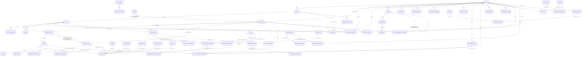

# データベース設計書 (Entity Relationship Diagram)

> **目的**: 全138テーブルの inventory と主要リレーションを記録し、テーブル数等の統計値の正本とする。DDL は列・制約の正本。
> **読者**: 全開発者。
> **タイミング**: スキーマ変更・DB設計判断時。

> **詳細**: [全カラム・全外部キーの詳細ERD](erd-detail/index.md) はマイグレーションから静的に生成する。型・NULL可否・複合FKの列順・削除動作・部分uniqueの述語をテーブル別に記録し、`python3 -B scripts/tools/generate-erd-detail.py --check` で更新漏れを確認できる。

<!-- ERD:TABLE_COUNT=138 -->

> **Animal Ekarte**: 高精度・高整合な動物病院データモデル
> **最終照合**: 2026-10-19 consolidated baseline | **対象**: `backend/migrations/001_init.sql`（138テーブル。001〜038 を1ファイルへ統合済み。以下の旧ファイル名は履歴識別子で、現行ファイルは 001 のみ）。DDL の正本は 001、旧増分の原文は `consolidated from` マーカーと git 履歴を参照する。稼働DBの適用状態・実データ・STG/本番受入は未確認。
>
> **確認範囲**: repo内DDL・関連コードとの静的照合。稼働DBのmigration適用状態・実データ・STG/本番受入は未確認。DDLの存在をDB適用済みとは扱わない。後続変更は [migration方針](../../backend/migrations/README.md) に従い、適用済みSQLを編集・再統合しない。

---

## EMR-446 保険設定の保存subset（2026-10-19）

今回の本人指示により、統一 `backend/migrations/001_init.sql` を編集する。上記およびmigration規約の通常の増分方針に対する今回範囲の例外であり、既存・共有DBへの適用・reset・再構築は実行していない。

[品目別保険設定FR/AC](../spec/domains/accounting/lifecycle.md#requirement-fr-accounting-item-insurance-setting)に対応し、`consultations`・`procedures`・`vaccines`・`checkup_types`へ `is_non_insurance BOOLEAN NULL` を追加した。NULLは未保存・旧欠落、trueは対象外、falseは品目側の対象設定。患者の資格や補償保証ではない。DB既定値・一括補完は置かず、新規登録の対象外初期値は対応APIが明示保存する。旧writerの未指定を明示値へ変換しない。

テーブル数138、PK/FK/unique/index/clinic/RLS・主要関係は不変。既存の薬剤・検査設定と会計snapshotも不変。現行Go model/request/responseは追加4列を未接続で、API/UIの往復保存・権限/監査/競合/結果照会は別担当の縦割り受入が必要。列追加だけで利用開始可能とはしない。4表は現行002_masterの12表に含まれず、同bundleのCSV列構成は変わらない。承認済みの隔離PostgreSQL 18.6で001の直接適用と合成データのNULL/true/false・型・医院FK境界を検証し、一時環境を破棄済み。`cmd/migrate`経由のseed適用、旧dump/隔離handoffへの適合、実ユーザーRLS・API/UI往復とSTG/本番受入は未検証。

001のchecksumは変更される。直前の統合baselineを持つDBも既存checksum guardで停止するため、checksumを書き換える修復や自動適用をしない。EMR443との対象revision・保持/復元・seed・適用窓の調整後、承認済みoperatorの検証が必要。

---

## 1. データモデルの全体像 (全 138 テーブル)

本システムは、臨床・経営・外部連携を支える 138 のテーブルが高度に正規化され、臨床的整合性を維持するリレーショナルモデルを採用しています。

### 1.1 主要ドメイン別構成

| 区分 | 管理対象（物理テーブル名・全件） |
|:---|:---|
| **システム基盤 (17)** | `accounts`, `clinics`, `clinic_settings`, `clinic_holidays`, `closing_special_periods`, `staffs`, `permission_groups`, `permission_group_rules`, `audit_logs`, `companies`, `password_reset_tokens`, `token_blacklist`, `occupations`, `support_bug_reports`, `support_chat_messages`, `support_manual_embeddings`, `support_llm_budgets` |
| **入院・稼働 (11)** | `hospitalizations`, `daily_records`, `care_plan_items`, `care_logs`, `cages`, `hospitalization_plans`, `staff_notes`, `staff_clinic_assignments`, `staff_permission_groups`, `staff_reservation_exclusions`, `staff_reservation_capabilities` |
| **臨床・診察 (24)** | `owners`, `pets`, `pet_owners`, `pet_chronic_conditions`, `animal_species`, `chief_complaint_types`, `medical_records`, `medical_record_addenda`, `medical_record_images`, `medical_record_image_upload_quota`, `medical_record_image_deletions`, `clinical_plans`, `treatment_plans`, `treatments`, `procedures`, `vital_records`, `inquiries`, `consultations`, `diagnosis_names`, `diagnosis_types`, `inquiry_templates`, `medicines`, `medicine_dose_params`, `vaccines` |
| **検査・予防 (29)** | `exams`, `exam_results`, `exam_types`, `exam_type_fields`, `exam_reference_ranges`, `examination_revisions`, `examination_revision_items`, `vaccinations`, `checkups`, `checkup_types`, `checkup_type_fields`, `checkup_field_results`, `checkup_package_import_receipts`, `shared_files`, `lab_import_jobs`, `lab_import_events`, `lab_import_exam_retractions`, `lab_import_exam_retraction_items`, `lab_import_usage_receipts`, `lab_import_revert_receipts`, `lab_devices`, `lab_device_item_masters`, `lab_import_job_items`, `lab_device_waits`, `lab_device_station_settings`, `lab_device_mapping_drafts`, `lab_device_mapping_draft_items`, `lab_device_mapping_specs`, `lab_device_mapping_generation` |
| **予約・シフト (12)** | `appointments`, `reservation_types`, `reservation_type_groups`, `reservation_type_occupations`, `reservation_type_available_slots`, `reservation_type_unavailable_times`, `appointment_trimming_details`, `appointment_trimming_options`, `shift_entries`, `shift_entry_breaks`, `shift_templates`, `shift_template_breaks` |
| **会計・経営 (16)** | `billings`, `billing_items`, `payments`, `payment_splits`, `billing_refunds`, `billing_confirmations`, `cash_register_closes`, `cash_register_close_adjustments`, `payment_methods`, `merchandise_items`, `estimate_items`, `estimates`, `insurances`, `campaigns`, `campaign_target_categories`, `campaign_target_items` |
| **トリミング (4)** | `trimming_course_types`, `trimming_courses`, `trimming_options`, `trimming_image_deletions` |
| **在庫 (1)** | `inventory_items` |
| **LINE/CRM (20)** | `line_customers`, `line_link_tokens`, `line_send_logs`, `line_reservation_settings`, `lstep_settings`, `lstep_trigger_priorities`, `lstep_delivery_trigger_log`, `lstep_csv_imports`, `lstep_tag_cache`, `lstep_next_visit_sync_retries`, `lstep_tag_code_mappings`, `lstep_auto_managed_prefixes`, `lstep_condition_tag_mappings`, `lstep_send_purpose_tag_prefixes`, `lstep_friend_attribute_snapshots`, `lstep_sync_error_counters`, `clinic_integrations`, `manual_articles`, `manual_article_versions`, `lstep_migration_progress` |
| **横断・identity links (4)** | `owner_identity_groups`, `owner_identity_group_members`, `pet_identity_groups`, `pet_identity_group_members`（`001_init.sql` セクション10・旧 `004_add_identity_links.sql` 原文・医院横断の owner/pet 明示リンク） |

> 追記（2026-10-07 監査）: 「臨床・診察」ラベルを (25) → (24) へ訂正（`prescriptions` は `014_drop_prescriptions.sql` / EMR-236 で除去済みだがラベルが減算されていなかった）。当時の 10 区分の合計は 134 で `ERD:TABLE_COUNT` ゲート pin（`backend/internal/lintscan/erd_table_count_drift_test.go`）と一致した。2026-10-10 の `032` 追加後は、トリミング区分を (4) とし合計 135 へ更新した。2026-10-19 の統合時点では 138（support 系 2 テーブルを含む）。

---

`038_support_manual_search.sql` の2表は共有技術状態であり、臨床データではない。`support_manual_embeddings` は本文・質問・スタッフ詳細を保持しない派生キャッシュ、`support_llm_budgets` は `(scope, model)` ごとの次回許可時刻を保持するquota状態で、両表に `clinic_id` 列は置かない。

## 2. 主要リレーション（抜粋・Mermaid）

全テーブルは §1 の inventory に含むが、下図は主要関係だけを示す。全 FK / association を網羅する図ではない。

図の親側 `||` は参照先が設定されている場合の関係を示す。nullable FK の未設定は省略し、列の NULL 可否は DDL を正とする。`billings ||--|| payments` は支払いが存在する場合の1対1を表し、全会計に支払い行の存在を強制する制約ではない。予約とカルテは削除済み行を含めると1対多で、active カルテだけが予約ごとに最大1件となる。治療・接種・検査から会計明細への `o|` は、それぞれの参照IDに対する部分一意indexによる最大1件（明細の論理削除後も含む）を表す。治療の制約は `004` 適用後の定義であり、稼働DBへの適用証明ではない。

`staffs.clinic_id` は主所属、`staff_clinic_assignments` は医院への所属を表す。（追記（2026-10-07 監査）: 同一人物 = 1 `accounts` 行、旧DB移行データの医院別複数 staffs 行（migration 017 適用前の `(doctor_id, clinic_id)` 複合FK 名残・同FKは 017 で単一カラム FK へ置換済み）、`staffs.account_id` に DB 一意制約がない点を含むアカウント・スタッフ・医院所属の不変条件の正本は [auth.md §1.3](auth.md) に集約した。FK 構造として `staffs.account_id` → `accounts(id)` で、同一人物の医院別行は同一 `account_id` を共有し、各行は所属医院すべてへの assignment を持つ）カルテの `entered_by` と予約の `created_by` は記録者として `staffs(id)` を参照し、親レコードの医院と主所属の一致をDBでは強制しない。担当医の `doctor_id` とは異なる関係で、記録時の医院権限はアプリ側の検証対象（§4.4）。

```mermaid
erDiagram
    clinics ||--o{ owners : "clinic_id"
    clinics ||--o{ staffs : "clinic_id (主所属)"
    accounts ||--o{ staffs : "account_id (同一人物の医院別行で共有)"
    clinics ||--o{ staff_clinic_assignments : "clinic_id"
    staffs ||--o{ staff_clinic_assignments : "staff_id"
    staffs ||--o{ medical_records : "entered_by (記録者)"
    staffs ||--o{ appointments : "created_by (記録者)"
    owners ||--o{ pets : "owner_id"
    pets ||--o{ medical_records : "pet_id"
    pets ||--o{ pet_chronic_conditions : "pet_id"
    clinics ||--o{ pet_owners : "clinic_id"
    pets ||--o{ pet_owners : "(clinic_id, pet_id)"
    owners ||--o{ pet_owners : "(clinic_id, owner_id)"
    medical_records ||--o| billings : "medical_record_id"
    pets ||--o{ estimates : "(clinic_id, pet_id)"
    appointments ||--o{ medical_records : "(appointment_id, clinic_id)"
    medical_records ||--o{ appointments : "(source_medical_record_id, clinic_id) (次回予定の元のカルテ)"
    appointments ||--o| appointment_trimming_details : "(appointment_id, clinic_id)"
    appointments ||--o{ appointment_trimming_options : "(appointment_id, clinic_id)"
    billings ||--o{ billing_items : "billing_id"
    treatments ||--o| billing_items : "treatment_id"
    appointments ||--o{ billing_items : "(appointment_id, clinic_id)"
    trimming_courses ||--o{ billing_items : "trimming_course_id"
    trimming_options ||--o{ billing_items : "trimming_option_id"
    merchandise_items ||--o{ billing_items : "merchandise_item_id"
    vaccinations ||--o| billing_items : "vaccination_id"
    exams ||--o| billing_items : "(exam_id, clinic_id)"
    billings ||--|| payments : "billing_id"
    billings ||--o{ payment_splits : "billing_id"

    %% 入院
    clinics ||--o{ cages : "clinic_id"
    hospitalizations ||--o{ daily_records : "hospitalization_id"
    cages ||--o{ hospitalizations : "cage_id"
    cages ||--o{ cages : "(merged_into_cage_id, clinic_id) (連結中の代表ケージ)"

    %% Lステップ連携 (拡張)
    clinics ||--o| lstep_settings : "clinic_id"
    clinics ||--o{ lstep_trigger_priorities : "clinic_id"
    owners ||--o{ lstep_delivery_trigger_log : "owner_id"
    clinics ||--o{ lstep_tag_code_mappings : "clinic_id"
    clinics ||--o{ lstep_csv_imports : "clinic_id"

    %% 会計・集計 (拡張)
    clinics ||--o{ cash_register_closes : "clinic_id"
    clinics ||--o{ cash_register_close_adjustments : "clinic_id"
    cash_register_closes ||--o{ cash_register_close_adjustments : "(close_id, clinic_id)"
    billings ||--o{ cash_register_close_adjustments : "(billing_id, clinic_id)"
    staffs ||--o{ cash_register_close_adjustments : "actor_id"
    clinics ||--o{ payment_methods : "clinic_id"
    clinics ||--o{ closing_special_periods : "clinic_id"

    %% 取扱説明書（マニュアル）
    manual_articles ||--o{ manual_article_versions : "article_id"
    
    %% 健診パッケージ
    checkups ||--o{ checkup_field_results : "checkup_id"
    checkup_types ||--o{ checkup_type_fields : "checkup_type_id"
    checkup_type_fields ||--o{ checkup_field_results : "checkup_type_field_id"
    exam_type_fields ||--o{ exam_reference_ranges : "exam_type_field_id"
    animal_species ||--o{ exam_reference_ranges : "animal_species_id"
    exams ||--o{ examination_revisions : "(clinic_id, examination_id)"
    examination_revisions ||--o{ examination_revision_items : "(clinic_id, examination_id, version)"
    clinics ||--o{ checkup_package_import_receipts : "clinic_id"
    staffs ||--o{ checkup_package_import_receipts : "actor_id"
    lab_import_jobs ||--o{ lab_import_exam_retractions : "(clinic_id, job_id)"
    exams ||--o{ lab_import_exam_retractions : "(clinic_id, exam_id, job_id)"
    lab_import_exam_retractions ||--o{ lab_import_exam_retraction_items : "(clinic_id, retraction_id, job_id, exam_id)"
    lab_import_jobs ||--o{ lab_import_usage_receipts : "(clinic_id, job_id)"
    exams ||--o{ lab_import_usage_receipts : "(clinic_id, exam_id, job_id)"
    lab_import_jobs ||--o{ lab_import_revert_receipts : "(clinic_id, job_id)"
    clinics ||--o{ lab_devices : "clinic_id"
    exam_types ||--o{ lab_devices : "(exam_type_id, clinic_id)"
    clinics ||--o{ lab_device_item_masters : "clinic_id"
    exam_type_fields ||--o{ lab_device_item_masters : "(exam_type_field_id, clinic_id)"
    lab_import_jobs ||--o{ lab_import_job_items : "(job_id, clinic_id)"
    exam_type_fields ||--o{ lab_import_job_items : "(exam_type_field_id, clinic_id)"
    clinics ||--o{ lab_device_waits : "clinic_id"
    pets ||--o{ lab_device_waits : "(pet_id, clinic_id)"
    staffs ||--o{ lab_device_waits : "staff_id"
    pets ||--o{ lab_import_jobs : "(pet_id, clinic_id)"
    clinics ||--o| lab_device_station_settings : "clinic_id"
```

---

## 3. 設計原則と安全性

### 3.1 物理設計 of 健診パッケージ複合FK保護
- **主キー**: 多くの entity table は `bigint`（`BIGSERIAL` / sequence採番）または `uuid` ID を使う。例外として `token_blacklist.jti` は text PK で、join table には composite PK がある。正確な型と複合 key は DDL を正とする。
- **日時管理**: アプリケーション、DB セッション、インフラ設定は `Asia/Tokyo` を標準とする。日時カラムは主に `timestamptz` を使い、API 入出力は JST オフセット付き ISO 8601 を基本とする。
- **整合性制約**: アプリケーション層だけでなく、DB レベルで `FOREIGN KEY` 制約によりデータの孤立を防止。特に健診パッケージの結果レコード `checkup_field_results` では、越境防止のため `(checkup_type_field_id, clinic_id)` 複合FKにより親定義とクリニックIDの不一致を物理的に排除しています。同様に `checkup_type_fields.checkup_type_id` も、`checkup_types` の `UNIQUE (id, clinic_id)` を参照する `(checkup_type_id, clinic_id)` 複合FK（`fk_checkup_type_fields_type_clinic`・#211 A6）へ置換済みです（2026-07-17 に `001_init.sql` へ統合。統合前DBとのchecksum不一致を含む適用経路は [migration方針](../../backend/migrations/README.md) を参照。過去の統合履歴は §4.3、現行増分は §4.4）。同型の防御として、`pet_owners`（ペットと飼い主の多対多・旧003・2026-07-27統合）は `(clinic_id, pet_id)` → `pets (clinic_id, id)` と `(clinic_id, owner_id)` → `owners (clinic_id, id)` の複合FK対を持ち、両親テーブルに追加した `UNIQUE (clinic_id, id)`（旧002・`uq_pets_clinic_id_id` / `uq_owners_clinic_id_id`）を参照先とすることで、他院のペットと飼い主を跨いだ紐付けを物理的に排除しています。`billing_items` には接種・検査・治療の3系統の provenance 制御が存在：接種 provenance（旧008・2026-07-27統合）では `(vaccination_id, clinic_id)` → `vaccinations (id, clinic_id)` と `(billing_id, clinic_id)` → `billings (id, clinic_id)` の複合FK対と lifetime 部分 unique index（`uq_billing_items_vaccination_lifetime`）により、他院接種の混入と同一接種の二重計上を物理的に排除。検査 provenance（2026-08-20 統合・セクション14）では `billing_items.exam_id`（ライフタイム一意・1 exam = 1 会計行）を `exams (id, clinic_id)` へ `fk_billing_items_exam_clinic` 複合 FK（ON DELETE RESTRICT・医院間紐付け防止）と `uq_billing_items_exam_lifetime` で保証し、`exam_types.price` の空値をブロッキング警告（会計確認カルテのみ請求・該当医記の同日複数カルテから検査抽出）とします。治療 provenance は `treatment_id` の単列FKと `004` の lifetime unique（`uq_billing_items_treatment_lifetime`）で最大1明細を保証する。最終DDLの排他 CHECK は `chk_billing_items_provenance_exclusive`（`num_nonnulls(vaccination_id, exam_id) <= 1`）であり、`treatment_id` はこのCHECKの対象外（詳細は §4.4）。2026-07-29 統合（§9）では、会計・飼主・ペット境界の clinic 軸をさらに harden している: `payments.clinic_id` と `fk_payments_*` 複合 FK、`fk_pets_clinic_owner`、`uq_medical_records_id_clinic` および medical_records/vaccinations/billings の clinic 軸複合 FK、`app_private.enforce_payment_method_system_key_match`（method ⇔ `payment_methods.system_key`）、部分 unique index `uk_owners_clinic_phone`（非空 phone）、`chk_inventory_items_quantity_non_negative`、`pets.version`（楽観ロック）、`idx_exam_results_exam_type_field_id`。2026-09-01〜02 の制約強化はテーブルを増やさない: `estimates.pet_id` は `fk_estimates_pet_clinic`（`(clinic_id, pet_id)` → `pets (clinic_id, id)`、`ON DELETE SET NULL (pet_id)`）。`lab_device_waits` の staff 参照は001時点の `fk_lab_device_waits_staff_clinic` から017で `fk_lab_device_waits_staff`（`staff_id → staffs(id)`、`ON DELETE RESTRICT`）へ置換済み。`lab_devices` に `tenant_clinic_id_isolation` RLS。予約グラフは `uq_appointments_id_clinic` を参照するカルテ・会計・トリミング複合 FK、nullable 予約/入院 FK の `ON DELETE SET NULL (col)`、`excl_appointments_doctor_timerange`、`treatments` / `appointment_trimming_options` の trigger-copied `clinic_id`、`payments` の最終 RLS `has_clinic_access(clinic_id)`（当時の定義は §4.3）。記録者の `medical_records.entered_by` / `appointments.created_by` は後続 `002` / `003` で単列FKへ置換済みであり、001だけを最終制約とみなさない（§4.4）。

### 3.2 マルチテナント隔離
- clinic-owned table は適用可能な範囲で `clinic_id` を持つ。一方、global master、identity/session、親経由で scope する child など例外もあるため、「全 business table が直接 `clinic_id` を持つ」とは扱わない。
- isolation は query predicate、ownership check、request-time authority、composite FK、選択的 RLS、runtime test の多層防御で成立する。`idx_*_clinic_id` は query performance を支援する index であり、単独では cross-tenant access を物理的に禁止しない。

### 3.3 臨床データの信頼性
- **計量データ**: `vital_records.weight` は精度・小数桁を指定しない `numeric`。数量は例えば `billing_items.quantity` が `numeric(10,1)`、金額は `billings.subtotal` / `tax_total` / `total_amount` や `billing_items.unit_price` が `bigint`。一律に `numeric(6,2)` や固定小数桁の金額型とは扱わず、型・桁数・CHECKは列ごとのDDLを正とする。`billings.subtotal` / `tax_total` / `total_amount` は Jouto 返品・赤伝のため負値を許す（AE-MIG-NEG-1。旧 `chk_billings_amounts` は 2026-08-25 統合第9回で除去）。
- **監査証跡**: designated security / clinical / financial path は `audit_logs` へ記録し、integrity 必須 path は business write と同じ transaction で fail closed にする。すべての変更を自動記録するわけではなく、coverage は path-dependent（[data-flow.md](data-flow.md)）。

---

## 4. スキーマ整合・不要候補判定ログ

照合対象は `ls backend/migrations/*.sql` で確認する直下 DDL である。各ファイルの役割とテーブル定義の所在は §4.4、過去の統合でテーブル数がどう変わったかは §4.3 の履歴を見る。在庫の件数をこの段落では固定しない。直下 DDL inventory と DDL 本文を正とし、実 DB のデータ量・実行時 SQL・アクセスログはこの静的照合の対象外とする。active seed bundle は `backend/migrations/seeds/002_master` のみ。

> [!NOTE]
> **Historical schema chronology (2026-07-04〜2026-09-02; not current inventory):** 旧 incremental は複数回 `001_init.sql` へ統合された。table count は 108 → 109 → 110 → 115 → 123 → 124 → 127 → 128 と変化した。2026-08-20 までに lab-device 5 table を含む 128 table へ到達し、exam provenance、2026-08-25 の negative-amount change、2026-09-01〜02 の tenant FK / RLS / 予約グラフ複合 FK は table を増やしていない。旧番号、当時の apply/reset 条件、commit provenance は `001_init.sql` の archive comment と git history を参照する。旧 `seeds/003_demo` / `seeds/004_staging` は CSV 移行後に存在したが commit `09d2c9e2b` で退役した。HEAD の active seed は `seeds/002_master` だけである。

| 項目 | 結果 | 判定 |
|:---|:---|:---|
| `001_init.sql` の `CREATE TABLE` 数 | 138（2026-10-19 統合 baseline。001〜038 を1ファイルへ統合済み。現行の直下 DDL の顔ぶれは `ls backend/migrations/*.sql` で導出する） | 統合前の履歴は §4.3 / §4.4。テーブル数は ERD ドメイン表と一致する。 |
| 旧増分マイグレーションが追加していたテーブル | 6: `lab_import_jobs` / `lab_import_events` (旧`005`)、`medicine_dose_params` (旧`009`)、`checkup_type_fields` / `checkup_field_results` (旧`010`)、`exam_reference_ranges`（2026-07-27統合の旧`005`） | 現在は全て `001_init.sql` に直接定義（旧ファイルは削除済み） |
| 全マイグレーション（`backend/migrations/*.sql` 行頭 `CREATE TABLE` 合算から `DROP TABLE` 対象を除いた現行値）の物理テーブル総数 | 138 | 2026-10-19 の統合後は `001_init.sql` が唯一の直下 DDL。統合前の履歴は §4.3 / §4.4 を参照する。 |
| 現行増分 `002`〜`038`（`008`・`026`・`027` 欠番） | 新規テーブル11（`support_bug_reports`・`support_chat_messages`・`medical_record_image_deletions`・対応下書き 4・`trimming_image_deletions`・`lstep_next_visit_sync_retries`・`support_manual_embeddings`・`support_llm_budgets`）。`014` は `prescriptions` DROP（純減1）、`015` は検索 index のみ、`016`/`018`/`022` はカラム追加、`017` は担当医・actor・staff参照の複合FK置換、`019` は権限行削除、`020` は checksum reconcile、`023` は `lab_import_jobs.species` 追加と対応下書き 4 テーブル。`024` は drafts 複合キーの列順張り直し、`025` は `cages.merged_into_cage_id`（旧025〜027の承認済み統合版）、`028`〜`030` は EMR-308 tentative 予約基盤（enum値・列2件・部分unique index）と `medical_records.next_visit_recommended_date` の DROP（新規テーブル0）。`031` は予約の元カルテ参照を医院複合FKへ置換、`032` はトリミング画像削除予約台帳を新設、`033` は次回来院タグ同期の再試行記録を新設、`034` は同表への `cleanup_line_user_id` 列追加のみ、`035` は `trimming_image_deletions` への `storage_deleted_at` / `last_attempt_at` 列と pending 部分index 追加のみ（いずれも新規テーブル0）。`036` は入院の `next_visit` 列追加のみ、`037` は `item_category` への `house_call` 値の追加のみ（新規テーブル0）、`038` は共有マニュアルembeddingキャッシュとquota状態の2表を新設 | 記録者FK2件の置換、治療明細のlifetime unique、子レコード楽観ロック `version`、accounts RLS ops bypass、billings 複合index、seed checksum reconcile 2件、`care_plan_items.other_reason`、pets 由来列2件（§4.4。2026-09-29 訂正: 「002 / 003 / 004・新規テーブル0」→ `002`〜`013`・新規テーブル2。2026-10-05 訂正: 当時の `023` backfill DML は運用判断で削除。2026-10-06: 現行 `023_lab_device_mapping_drafts.sql` を追加。2026-10-10: `024`〜`030` を追加・`026`/`027` 欠番・新規テーブル0。2026-10-10: `031` の複合FK置換と `032` の新規テーブル1を追加） |
| ERD ドメイン表の物理テーブル数 | 138 | migrations と一致（2026-09-29 訂正: 128 → 130。§1.1 に `support_bug_reports` / `support_chat_messages` を含む。EMR-236 で `prescriptions` 除去し 129。2026-10-05 訂正: §1.1 に `medical_record_image_deletions` を含み 130。2026-10-06 訂正: §1.1 に対応下書き 4 テーブルを含み 134。2026-10-10: §1.1 に `trimming_image_deletions` を含み 135） |
| ERD へ追加した不足テーブル | 12: 従来6（`token_blacklist`, `reservation_type_available_slots`, `trimming_course_types`, `campaigns`, `campaign_target_categories`, `campaign_target_items`）+ identity 4 + `medical_record_image_upload_quota` + `medical_record_image_deletions` | migration に存在し、用途コメントまたはドメイン上の継続理由があるため追加 |
| migrations にあり ERD にないテーブル | 0 | 整合済み |
| ERD にあり migrations にないテーブル | 0 | 整合済み |
| 不要確定テーブル | 0 | 静的照合では削除対象なし |
| 追加の削除確定カラム候補 | 0 | ERD は列一覧を保持しない。`030` による `medical_records.next_visit_recommended_date` の DROP は現行スキーマへ反映済み（§4.4）。適用後スキーマからさらに削除すると確定したカラムは、この静的照合ではない。 |

### 4.1 継続理由を明示する対象

| 対象 | 分類 | 継続理由 |
|:---|:---|:---|
| `lstep_migration_progress` | LINE/CRM | 既存飼い主データ一括同期の進捗管理テーブルとして `001_init.sql` にコメント定義あり。アプリ通常モデルと異なる運用テーブルのため、削除ではなく要確認継続。 |
| `token_blacklist` | システム基盤 | refresh token JTI の失効管理テーブルとして `001_init.sql` にコメント定義あり。認証安全性に関わるため削除対象外。 |
| `reservation_type_available_slots` | 予約・シフト | 予約区分ごとの受付可能枠を保持する設定テーブル。予約制御の設定情報であり削除対象外。 |
| `trimming_course_types` | トリミング | トリミングコースの分類マスタ。`trimming_courses` の種別管理に必要なため削除対象外。 |
| `campaigns` / `campaign_target_categories` / `campaign_target_items` | 会計・経営 | #81 キャンペーン割引マスタと対象指定テーブル。親子構造で割引適用対象を表現するため削除対象外。 |

### 4.2 Historical local DB validation（2026-06-22）

以下は 2026-06-22 時点の historical result であり、今回照合の現行schemaのruntime validation evidence ではない。current evidence は CI/schema gate を実行して得る。

- 実行コマンド:
  - `make schema-check` (内部で `docker compose --env-file .env.local exec backend go test ./internal/model/ -run TestSchemaDrift -v` を実行)
- 結果:
  - `TestSchemaDrift` PASS (0.18s)
- 互換注記:
  - 当時の local Docker environment で成功した記録。current runtime state を示さない。

### 4.3 Historical schema update log（001 integrated schema + archive）

> この節の旧 migration / seed 名は historical identifier であり、HEAD の active file inventory ではない。

2026-06-26 に、かつて独立した増分ファイル (旧 005-012) として管理されていたスキーマ・シード変更を `001_init.sql` および `003_seed_demo.sql` へ統合しました。
その後、新たな機能追加に伴い増分マイグレーション 005〜012 が再び追加されていましたが、2026-07-04 にこれらを再度 `001_init.sql`（DDL）および `003_seed_demo.sql`（歯科検診パッケージの暫定 seed DML のみ）へ統合し、独立ファイルとしての 005〜012 は削除しました。さらに 2026-07-15 に、インデックス追加のみの DDL 増分（旧 `002_add_checkup_vaccination_indexes.sql` / `003_add_pets_batch_living_count_index.sql` / `004_add_billings_hospitalization_id_unique_index.sql`）を `001_init.sql` へ統合しました。

> **2026-07-17 追記（Codex PR #186 / applied-001 skip 対策 → 同日中に完全統合へ方針転換）**: applied 済みの薄い `001` が §7 相当 DDL をスキップするリスクへの対策として、旧 005–012 および `appointments.checked_in_at` 相当の additive DDL を冪等な incremental（`003`–`011`）として一時再出荷した。しかし同日中に「DDL は `001_init.sql` 単一ファイル」へ方針転換し、`002_checkup_field_clinic_composite_fk.sql`（#211 A6・`checkup_types`↔`checkup_type_fields` 複合FK。この内容のみ 001 に未収録だったため 001 末尾へ折り込み）を含む incremental `002`–`011` を全て削除した。この統合により、統合前001のchecksumを持つDBにはno-resetアップグレード経路がなくなった（再構築はUSER手動）。これは当時の001統合に関する記録であり、現行001適用済みDBへの後続002〜004まで再構築必須とする意味ではない。現行方針は [migration README](../../backend/migrations/README.md) を参照。

> **2026-07-22 追記**: 上記の統合済み`001_init.sql`は変更せず、以後の新規DDLをappend-only incrementalとして再開した。最初の追加は`002_lstep_snapshot_import_clinic_fk.sql`で、当時の001が適用済みのDBにはno-resetで適用する設計だった。`baselineIfNeeded`は001だけをbaselineし、002以降を実行対象として残した。同ファイルの現行所在は2026-07-27統合後の001末尾旧002ブロック。
>
> **2026-07-23 追記**: 2本目のappend-only incrementalとして`003_medical_records_appointment_id_index.sql`を追加した。以後の新規DDL番号は004以降を使用する方針だった。同ファイルの現行所在は001末尾旧003ブロック。
>
> **2026-07-24 追記**: 3本目のappend-only incrementalとして`004_payment_splits_billing_id_index.sql`を追加した。payment graph検証とbilling単位の参照を全医院横断scanにしないための非一意indexで、新規テーブルはなく当時の総数(108)は不変だった。同ファイルの現行所在は001末尾旧004ブロック。
>
> **2026-07-27 追記**: 旧incremental 002〜009を`001_init.sql`末尾セクション8へ原文のまま番号順に統合し、独立ファイルを削除した。当時の直下DDLは001のみ。旧005の`exam_reference_ranges`追加により総数は109となった。

2026-10-19 consolidated inventory:

- [`001_init.sql`](../../backend/migrations/001_init.sql)（fresh 用の唯一の DDL。138 テーブル。001〜038 の原文を `consolidated from` マーカー付きで統合）
- seed: `backend/migrations/seeds/002_master/`（12 tables、manifest.json が正本）
- 旧 incremental の内容は 001 内の `consolidated from <filename>` マーカーと git 履歴を参照する。

### 4.4 Historical incremental migrations（001〜038、2026-10-19 統合済み）

下表は統合前の履歴。現在の図・制約説明の基準は `001_init.sql`（001〜038 を統合済み、138テーブル）。下表の内容は 001 内の `consolidated from` マーカーと git 履歴で確認できる。稼働DBへの適用状態は未確認。

| migration | 各migrationの変更（後続で置換あり） | 関係・境界 |
|:---|:---|:---|
| `002` | `fk_medical_records_entered_by_clinic` と旧単列FKをDROPし、`fk_medical_records_entered_by`（`entered_by → staffs(id)`、`ON DELETE RESTRICT`）を追加 | 兼務先でも記録できる記録者FK。002適用時点では担当医の `(doctor_id, clinic_id)` 複合FKを維持し、017で `doctor_id → staffs(id)` の単列FKへ置換 |
| `003` | `fk_appointments_created_by_clinic` と旧単列FKをDROPし、`fk_appointments_created_by`（`created_by → staffs(id)`、`ON DELETE RESTRICT`）を追加 | 予約登録者は担当医とは別。医院の記録権限と過去記録の帰属を区別 |
| `004` | `uq_billing_items_treatment_lifetime`：`billing_items(treatment_id) WHERE treatment_id IS NOT NULL` のUNIQUE INDEX | `deleted_at` 条件がないため、論理削除済み明細を含め同一治療参照は最大1件 |
| `005` | `treatments` / `vital_records` / `prescriptions` / `vaccinations` に `version INTEGER NOT NULL DEFAULT 1` を追加 | UAT-R2-EXCLUSIVE-LOCK。子レコードの楽観ロック CAS（`WHERE version = expectedVersion` + 成功時 `version+1`）。`medical_records.version` / `clinical_plans.version`（001）と同型。既存行は DEFAULT 1 でバックフィル |
| `006` | `tenant_accounts_isolation` RLS を `app_private.bypass_rls() OR EXISTS (SELECT 1 FROM staffs s WHERE s.account_id = accounts.id AND app_private.has_clinic_access(s.clinic_id))` へ再定義 | 旧 policy は既存 `staffs.account_id` 逆参照を要求し、非 owner role の account INSERT が構造的に不可能だった。ops bypass セッション（`app.bypass_rls`）が accounts を INSERT/SELECT 可能にするため、他の tenant policy と同じ bypass contract へ整合 |
| `007` | `idx_billings_clinic_owner_scheduled`：`billings (clinic_id, owner_id, scheduled_date DESC, created_at DESC) WHERE deleted_at IS NULL` 部分index | EMR-201。`GET /api/v1/accountings?owner_id=` のレイテンシ改善。既存 `idx_billings_owner_id` は clinic スコープ・soft-delete・ソート列を含まない単一列 index のため clinic 先頭複合を追加 |
| `009` | `schema_migrations` の seed bundle `002_master` 記録を現行内容へ reconcile（ガード付き UPDATE） | EMR-213。EMR-71 の `permission_group_rules.csv` 直編集で適用済み DB の checksum ガードが fail-closed になり STG が起動不能になった事故の修復（一回限りの修復例外。正規経路は DB_RESET のみ）。初版 `008` は STG 適用済みのため番号のみ繰上げ（008 欠番の経緯） |
| `010` | `lab-import:create` の既定付与を適用済み行へ反映（執行 `t,f,t,f`→`t,t,t,f`・一般 `t,f,f,f`→`t,t,f,f`）+ seed bundle checksum reconcile | EMR-176。009 と同型の修復例外（CSV 直編集に伴う checksum ドリフトを先に解消し bundle チェックを通過させる） |
| `011` | `care_plan_items.other_reason`（`text` NOT NULL DEFAULT `''`）を追加し、`chk_care_plan_item_ref` を再定義 | EMR-179。手入力「その他」行（`category='other'` かつ `btrim(other_reason) <> ''`）は `type=item` で `hospitalization_plan_id` NULL を許容。billing_items の手入力契約と同型。`other_reason` の500文字上限はアプリ層検証で CHECK には含めない |
| `011` | `support_bug_reports` テーブル新設 | サポートウィジェットのバグ報告。スクショは FileUploader の key のみ保持し配信は署名URL経由。`clinic_id`/`reporter_staff_id` は RESTRICT FK、合成クリニック teardown の削除順に登録済み |
| `012` | `pets.name_origin`（`text` NULL）と `pets.meeting_story`（`text` NULL）を追加 | EMR-174。名前の由来・出逢いのストーリー。NULL=未記録。空・空白のみは API 境界で NULL 正規化。検索対象外のため索引なし |
| `013` | `support_chat_messages` テーブル新設 | サポートウィジェットのヘルプチャット履歴（`clinic_id` × `staff_id` の個人スコープ、論理削除）。`clinic_id`/`staff_id` は RESTRICT FK、合成クリニック teardown の削除順に登録済み。任意テキストのため個人情報を含み得る |
| `014` | `prescriptions` テーブル DROP | EMR-236。処方リソースの廃止。薬剤明細は `treatments` が担う |
| `015` | 検索対象列に fold 式（カナ+空白の正規化）GIN trigram index を追加 | 検索述語の index 化。式リテラルは `internal/textsearch` の定数と一致必須 |
| `016` | `support_bug_reports` に `plane_issue_id` / `plane_issue_url` / `plane_sync_error`（いずれも `text` NULL）を追加 | バグ報告の Plane ワークアイテム自動起票結果の記録。起票成功時は issue UUID と表示URL、失敗時は同期エラーを保持し管理画面からの手動再送（`POST /support/bug-reports/:id/plane-ticket`）を可能にする。`plane_issue_id IS NULL` 条件付き UPDATE が二重起票のクレーム制御 |
| `017` | 参照先 `staffs.clinic_id`（主所属）と行の `clinic_id` の一致を誤って要求していた複合FKを単列 `staffs(id)` FKへ置換。`appointments.doctor_id` / `hospitalizations.doctor_id` / `medical_records.doctor_id` は `ON DELETE SET NULL`、`cash_register_close_adjustments.actor_id` / `medical_record_image_upload_quota.staff_id` / `lab_device_waits.staff_id` は `ON DELETE RESTRICT` | EMR-114。assignment 経由で兼務先の医院に所属する staff を参照できなかった 23503（「参照先が存在しません」）を解消。医院権限はアプリ層の検証が担う（002/003 と同型の判断） |
| `018` | `pet_neutered_status` ENUM（`'unknown'` / `'not_done'` / `'done'`）を新設し、`pets.neutered_status`（NOT NULL DEFAULT `'unknown'`）を追加。`neutered_date` 非NULL行は `'done'` へ backfill | 避妊・去勢の施術状況を `neutered_date`（日付のみ保持）から独立した状態で保持し、「施術済み・日付不明」と「未施術」を区別。オス去勢・メス避妊を共通 `done` で表現し、ラベル差は表示層が担う |
| `019` | `permission_group_rules` から `resource='checkup-package-import'` 行を物理 DELETE | EMR-249。削除済み checkup package import API の default-deny 残存行を除去。`uk_permission_group_rules` は `deleted_at` を含まない一意制約のため、論理削除では行が一意キーを占有し続けることから物理削除とする |
| `020` | `schema_migrations` の `seeds/002_master` 記録 checksum を、既知旧値の行のみ現行値へ reconcile（ガード付き UPDATE） | EMR-249 後続。CSV 直編集による checksum ドリフトで migrate が fail-closed・コンテナ起動不能となった STG 事故の修復（009 と同型の一回限り例外）。fresh DB では no-op。019 の行削除とセットで実データとの乖離なし |
| `021` | `medical_record_image_deletions` 新設（`UNIQUE (clinic_id, image_id)`、RLS `tenant_clinic_id_isolation` 適用、129 → 130）。`medical_record_images` へのFK・`medical_records` からのCASCADEは置かない | 診療画像は行を物理削除するため、この台帳が署名停止と storage 削除再試行の正本。発行済み署名URLは storage 削除失敗時に最大15分残存し、台帳はそれを取り消さない |
| `022` | `staff_clinic_assignments.capabilities_configured_at`（timestamptz NULL）を追加 | 予約受付可能区分の「明示設定（全部位対応不可の空選択を含む）」と「未設定（junction行ゼロ=既定全部位可）」を区別する書込み経路 marker。backfill は NULL 行のみを対象 |
| `023` | `lab_device_mapping_drafts` / `lab_device_mapping_draft_items` / `lab_device_mapping_specs` / `lab_device_mapping_generation` を新設（全て clinic 直接 RLS、130 → 134）+ `lab_import_jobs.species`（`''`/`canine`/`feline`）を追加 | EMR-297。1検査結果=1下書きを人が確定し、以後の取り込みは確定マップのみ使用。specs は `UNIQUE (clinic_id, source_type, species, device_item_code)`、source_type/species/value_shape は CHECK。drafts の `UNIQUE (id, clinic_id)` は 024 で `(clinic_id, id)` へ列順変更 |
| `024` | `uq_lab_device_mapping_drafts_id_clinic` を `UNIQUE (id, clinic_id)` → `UNIQUE (clinic_id, id)` へ張り直し、子2 FK を `(clinic_id, draft_id)` / `(clinic_id, confirmed_draft_id)` の列順で再定義 | drafts グラフの複合キーを他の複合FKと同型の clinic-first 順へ正規化。`ON DELETE RESTRICT` と参照先テーブルは不変 |
| `025` | `cages.merged_into_cage_id`（bigint NULL）追加 + `(merged_into_cage_id, clinic_id) → cages (id, clinic_id) ON DELETE RESTRICT` + 部分index `idx_cages_merged_into_cage_id`（`merged_into_cage_id IS NOT NULL AND deleted_at IS NULL`） | EMR-306 ケージ一時連結 Phase 1。連結中の構成ケージが代表ケージを指す自己参照FK（NULL=独立ケージ・代表自身）。代表行の物理削除は構成員参照中は拒否（連結解除は明示操作のみ）。STG未適用の旧 `025`〜`027` を承認により統合した版で、`026`/`027` は欠番 |
| `028` | `reservation_status` に `'tentative'` 追加 + `appointments.intended_date`（date NULL）+ `appointments.source_medical_record_id`（`→ medical_records(id) ON DELETE SET NULL`） | EMR-308 part1。tentative 予約（次回予定: 日付のみ確定・時間/スロット/担当医未定・枠消費なし・スタッフのみ可視）の基盤。enum 値は追加と同一トランザクションで参照不可のため、値参照DDLは 029 へ分離（007/008 前例） |
| `029` | `uq_appointments_one_active_tentative`：`appointments (clinic_id, pet_id) WHERE status='tentative' AND deleted_at IS NULL` の UNIQUE INDEX | EMR-308 part2。（医院, ペット）あたり active tentative は最大1件。非 tentative 行・削除済み行・`pet_id` NULL は競合しない |
| `030` | `medical_records.next_visit_recommended_date` を tentative 予約へ backfill 後に DROP + 未移行分は WARNING で報告 | EMR-308 cleanup。次回来院意図の正本をカルテ列から `reservation_route='record_intent'`・`source='manual'` の tentative 予約へ移行（最新の未削除カルテの予定日がJST当日以降で、生存ペット・未削除の飼い主が対象。未削除の予約区分を `general` 優先、次に `is_active DESC, id ASC` で選び、inactive区分も対象となる。未削除の予約区分が0件の医院はスキップして警告）。ファイル内コメントの `(026)` / `by 025` 参照はリナンバー前名残で、現行ファイルは 029 / 028 |
| `031` | `appointments_source_medical_record_id_fkey` を `fk_appointments_source_medical_record_clinic`：`(source_medical_record_id, clinic_id) → medical_records (id, clinic_id)` へ置換。`ON DELETE SET NULL (source_medical_record_id)` | 次回予定の元カルテの医院越境をDBでも拒否。NULL参照は許容し、親カルテ削除時は参照列だけをNULLにする。既存の医院越境参照があれば例外でmigrationを中断し、provenanceを自動消去しない。テーブル数不変 |
| `032` | `trimming_image_deletions` 新設（`PRIMARY KEY (clinic_id, object_key)`、`clinic_id → clinics(id) ON DELETE RESTRICT`、`tenant_clinic_id_isolation` RLS、134 → 135） | トリミング画像のストレージ削除前に削除予約を永続化し、削除後・削除失敗後の同一キー再添付を防ぐ台帳。最初の予約の医院・object key・`actor_staff_id`・`created_at` を保持。soft delete はなく、カルテ画像やその削除台帳への依存も置かない。臨床操作の監査は `audit_logs` が担う |
| `033` | `lstep_next_visit_sync_retries` 新設（`PRIMARY KEY (clinic_id, owner_id)`、`revision BIGSERIAL`、医院・飼主の複合FKは `ON DELETE RESTRICT`、`tenant_clinic_id_isolation` RLS、135 → 136） | 次回来院タグ同期の再試行を永続化する技術的な作業記録。再試行時は現在の予約・同意・LINE紐付けを読み直す |
| `034` | `lstep_next_visit_sync_retries` に `cleanup_line_user_id VARCHAR(64)` を追加（nullable、非NULL時は `^[A-Za-z0-9_-]{1,64}$` CHECK） | 飼主削除時に確定した LINE 宛先の不変 snapshot。削除済み飼主の remove-only な `next_visit_*` 除去意図を表し、通常の再試行 enqueue はこの列を上書きしない。テーブル数不変 |
| `035` | `trimming_image_deletions` に `storage_deleted_at` / `last_attempt_at`（いずれも timestamptz NULL）を追加し、pending 部分index `idx_trimming_image_deletions_pending`（`storage_deleted_at IS NULL` 条件）を新設 | 画像 key のストレージ削除 retry 台帳拡張。最初の予約時刻（`created_at`）・最終試行時刻（`last_attempt_at`）・storage 削除完了時刻（`storage_deleted_at`）の3点を保持し、完了後も tombstone 行は参照拒否の正本として残る。テーブル数不変 |
| `036` | `hospitalizations.next_visit DATE`（nullable）を追加 | 入院の次回予定日。カレンダー情報のみで予約意図・LSTEP連携を追加しない。テーブル数不変 |
| `037` | `item_category` enum に `house_call` を追加（`ADD VALUE IF NOT EXISTS`。テーブル数は不変） | 往診カテゴリを会計・日次帳票へ反映（EMR-269） |
| `038` | `support_manual_embeddings` / `support_llm_budgets` 新設（136 → 138）。前者は1536次元・1次元配列・task種別・分割版をCHECKし、後者は `(scope, model)` 複合PK | 共有マニュアルの再生成可能なembeddingキャッシュとモデル別quota状態。`clinic_id` 列・臨床データFKは持たず、本文・質問を保存しない。ベクトルの有限値・normはGo境界で検証 |

- **記録者の権限**: 単列FKへの変更は医院境界の撤廃ではない。[カルテ記録者ガード](../../backend/internal/medicalrecord/medical_record_entered_by_actor.go) と [予約登録者ガード](../../backend/internal/reservation/reservation_created_by.go) が、作成transaction内で有効なスタッフと医院所属、または確認済みのシステム管理者権限を検証する。FKは記録者の実在・物理削除制限を保持し、現在の操作権限はアプリが別に検証する。
- **治療明細の一意性**: 001の `idx_billing_items_treatment_id` はactive行検索用の非一意index。二重参照を防ぐのは004のlifetime uniqueであり、単なる検索indexや画面上のロックではない。既存の `treatment_id → treatments(id) ON DELETE SET NULL` は変更していない。
- **provenance排他の範囲**: `chk_billing_items_provenance_exclusive` は `vaccination_id` と `exam_id` の同時設定だけを禁止する。`treatment_id` を含む3列全体の排他CHECKがあるとは扱わない。
- **migration 番号**: 2026-10-19 の統合後、直下 DDL の顔ぶれは `ls backend/migrations/*.sql` で導出する。次の新規 migration は `002` から採番する。`011` の重複と `037`/`038` のリネームは統合前の履歴であり、現行ファイルには存在しない。`008`・`026`・`027` の欠番も履歴。
- **適用・検証**: 本書更新ではDB操作をしていない。migrationを追加する更新を取り込んだ開発者は対象DBの適用状態を確認し、必要な `make migrate` をユーザー操作で実行する。既存データの制約違反を自動削除で解消したり、適用済みSQLを書き換えたりしない。STG/本番は [運用TODOの適用確認](../work/plane/plane-md-migration-20260923-receipt.md) と環境別承認に従う。

## 5. 未確定事項（分類に関する注記）

> [!NOTE]
> `insurances`（保険マスタ）テーブルは、動物病院における会計精算（保険窓口精算・自己負担額計算）に深く関連するため、本設計書では暫定的に「会計・経営」ドメインに分類しています。ただし、診療時の適用確認やカルテ側の参照も発生するため、将来的な見直しで「臨床・診察」あるいは独立ドメインへ再編される可能性があります。
