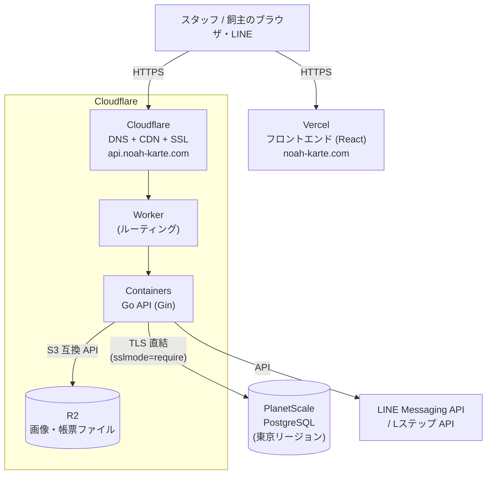

# 納品ドキュメント — システム構成・管理者設定・運用手順

> **対象 Issue**: #258 ／ **納品日**: 2026-07-18 ／ **状態**: ドラフト
> **読者**: 先方の管理者（院長・システム担当者）
> **目的**: 納品後に先方側で日常の運用・管理（スタッフ追加・権限変更・マスタ更新・障害時の一次対応）が自走できる状態にする。

---

## 1. システム構成概要

### 1.1 構成図（納品構成 = Cloudflare 経路。PO 決定 2026-07-15）

- **フロントエンド**: Vercel（React 19）。`staging`/`production` ブランチへの push で GitHub Actions 経由の自動デプロイ。
- **バックエンド API**: Cloudflare Workers + Containers（Go）。GitHub Actions（`backend-deploy.yml`）で自動デプロイ。
- **データベース**: PlanetScale PostgreSQL。DB の実体は Cloudflare 外（PlanetScale がホスト）。
- **ファイルストレージ**: Cloudflare R2（ペット写真・検査結果 PDF 等。参照は有効期限付き署名 URL 経由）。
- **外部連携**: LINE Messaging API / Lステップ API（予約・リマインド配信・タグ管理）。
- 詳細: [docs/architecture/overview.md](../architecture/overview.md)（アプリ構造）／[インフラ構成](../ops/infra/architecture.md)（現行インフラ SSOT）

> **復旧上の注意**: AWS ECS/RDS は 2026-07-20 に廃止済みで、切り戻し先やホットスタンバイはありません。
> 障害初動は [STG 運用 Runbook](../ops/infra/staging/runbook.md) に従い、Cloudflare 側の修正・再デプロイ、
> またはスナップショットと現行 IaC からの再建で復旧します。

### 1.2 利用サービスと契約の一覧

| サービス | 用途 | プラン | 契約・アカウント保有 |
|---|---|---|---|
| Cloudflare | DNS / CDN / API 実行基盤（Workers + Containers）/ R2 | Workers Paid | （確定待ち: 契約名義・移管有無） |
| PlanetScale | データベース（PostgreSQL） | （確定待ち: 本番プラン） | （確定待ち: 契約名義・移管有無） |
| Vercel | フロントエンドホスティング + ドメインレジストラ（noah-karte.com） | （確定待ち: プラン） | （確定待ち: 契約名義・移管有無） |
| GitHub | ソースコード・CI/CD（GitHub Actions） | — | （確定待ち: リポジトリ運用体制） |
| LINE 公式アカウント | 飼主向け予約・通知 | — | 各医院で契約済み |
| Lステップ | 配信・タグ管理 | — | 各医院で契約済み |

> シークレット（API キー・DB 接続情報等）は GitHub Encrypted Secrets および `wrangler secret` で管理し、本ドキュメントには記載しません。

### 1.3 環境一覧

（[docs/ops/deploy/README.md](../ops/deploy/README.md) §1 より）

| 環境 | フロントエンド URL | API ベース URL | 用途 |
|---|---|---|---|
| **本番 (Production、未構築)** | https://noah-karte.com（予定） | https://api.noah-karte.com/api（予定） | #253 に従って構築予定 |
| **ステージング (Staging)** | https://stg.noah-karte.com | https://api.stg.noah-karte.com/api | 更新の事前検証・デモ環境 |

---

## 2. 管理者向け初期設定手順

以下の順に設定します（後の項目が前の項目のマスタに依存するため、**順序どおり**に実施してください）。各手順の詳細はリンク先の画面仕様書と、システム内マニュアル（ログイン後サイドバー「取扱説明書」）を参照。

### Step 1: クリニック（医院）設定

- 画面: サイドバー「マスタ設定」→ 医院マスタ（`/settings/clinic`）— [仕様書](../spec/screens/19-clinic-settings.md)
- 設定内容: 院名・住所・電話/FAX・院長名・インボイス登録番号・消費税率（通常/軽減）・明細兼領収書のレイアウト。
- ここで登録した医院が全データの分離境界（本院・分院の別）およびスタッフの所属先の選択肢になります。
- インボイス登録番号・所在地は領収書・明細書にそのまま印字されるため、正確に入力してください。

### Step 2: 締め時間設定

- 画面: サイドバー「マスタ設定」→「締め時間設定」— [システム内マニュアル該当記事あり]
- 設定内容: 1 日の境界時刻（既定 23:59）・午前終了時刻・午後開始時刻・特別期間（年末年始等）。
- レジ締めの AM/PM/全日/EMG 区分の境界を決める設定です。変更は将来の締めにのみ影響します（過去の締めは不変）。

### Step 3: 職種マスタ・権限グループ

- 画面: サイドバー「マスタ設定」→「職種マスタ」「権限グループ」
- 手順: 職種（院長/獣医師/看護師/受付/トリマー等）を登録 → 権限グループを作成し、リソース（カルテ・会計・レジ締め・マスタ等）× 操作（閲覧/作成/編集/削除）のマトリクスを設定。
- 推奨: **最小権限から始めて必要に応じて追加**。会計の取消・締め後の修正・マスタ編集は管理者系グループに限定する（#255 の役割別テンプレート方針）。
- 役職別の設定例はシステム内マニュアル「権限グループ」に記載。

### Step 4: スタッフアカウント発行

- 画面: サイドバー「マスタ設定」→「スタッフマスタ」— システム内マニュアル「スタッフアカウント・権限の管理」
- 手順: 氏名・メールアドレス（= ログイン ID）・職種・権限グループ・所属医院（複数可）を入力し、初期パスワード発行を ON にして登録。
- **初期パスワードは登録直後に 1 回だけ画面表示されます**。以後システムから取得できないため、その場で本人に伝達してください。本人は初回ログイン時に変更します。
- 退職時は削除ではなく「無効化」を使用（過去カルテ・会計の担当者参照を維持するため）。
- アカウント発行・権限変更はすべて監査ログ（§4.3）に記録されます。

### Step 5: マスタ管理（診療・会計の基礎データ）

- 画面: サイドバー「マスタ設定」配下 — [マスタ設定 仕様書](../spec/screens/20-master-settings.md)
- 主なマスタ: 診療項目（単価）・薬剤・診断病名・問診テンプレート・主訴・動物種類・予約区分・支払方法・保険・ケージ・入院プラン・トリミングコース・物販。
- 単価・税区分は会計計算に直結します。運用開始前に料金表と突合してください。
- 在庫連動が必要な項目（薬剤・物販）は、マスタ編集画面の「在庫アイテム」フィールドで在庫と紐付けます。

### Step 6: LINE 予約・Lステップ連携（該当医院のみ）

- 画面: サイドバー「LINE予約管理」「Lステップ連携」— [LINE予約設定 仕様書](../spec/screens/28-line-reservation.md)
- 設定内容: 受付枠・受付条件・予約ページ表示内容・Lステップ API 接続（接続テストボタンあり）。
- （確定待ち: 本番用 LINE チャネル・Lステップ API キーの投入は各医院の契約情報受領後）

---

## 3. 運用手順

### 3.1 バックアップ方針

| 項目 | 内容 |
|---|---|
| DB 自動バックアップ | PlanetScale の自動バックアップ機能（STG 構成では 12 時間毎・PITR なし）。（確定待ち: 本番プランのバックアップ頻度・保持期間・復旧テスト結果と所要時間 — #253 で実施） |
| 大規模変更前の手動スナップショット | データ移行等の前に pg_dump で取得（Go-live 当日の手順は [GOLIVE_RUNBOOK.md](GOLIVE_RUNBOOK.md) §2） |
| ファイル（R2） | 画像・帳票の実体は R2 に保存。（確定待ち: R2 側のバックアップ/バージョニング方針） |
| 復旧手順 | バックアップからのリストア手順と実測所要時間は #253 の復旧テスト完了後に本節へ追記（確定待ち） |

> 日常運用で先方側にバックアップ操作は発生しません。バックアップは自動で取得され、復旧が必要な事態は §3.2 の連絡フローで開発側が対応します。

### 3.2 障害時の連絡フロー

1. **現場での一次切り分け**（スタッフ）: システム内マニュアル「エラー・トラブル対応」「システム障害時の対応（BCP）」に従い、再読み込み・別ブラウザ・ネットワーク確認を実施。
2. **管理者への報告**（各医院の管理者）: 複数端末・複数スタッフで再現する場合は障害と判断。
3. **開発側窓口へ連絡**: （確定待ち: 窓口の連絡手段・宛先・受付時間 — [GOLIVE_RUNBOOK.md](GOLIVE_RUNBOOK.md) §5 のサポート体制と共通）。報告時は「発生時刻・操作していた画面・エラーメッセージ・影響範囲（何人が困っているか）」を添える。
4. **開発側の対応**: 監視通知（5xx 率アラート）とヘルスチェックで裏取りし、復旧作業・経過報告を行う。

### 3.3 ログの見方

| ログ | 場所 | 用途 | 保持 |
|---|---|---|---|
| 操作履歴（監査ログ） | システム内: 管理者画面の操作履歴（`audit_logs`） | 「誰が・いつ・何を」の追跡。カルテ確定・会計取消・権限変更・ログイン等を自動記録。操作前後のスナップショット付き | 永続（DB 内） |
| API アクセスログ | Cloudflare ダッシュボード → Workers Logs | 障害調査（エラー・レイテンシ） | 7 日 |
| デプロイ履歴 | GitHub Actions 実行履歴 | いつ・どのバージョンが反映されたか | GitHub 準拠 |

- 先方管理者が日常的に使うのは**操作履歴（監査ログ）**のみです。期間・操作種別・操作者で絞り込めます（システム内マニュアル「監査ログ・操作履歴の確認」参照）。
- Workers Logs / GitHub は開発側の運用ツールであり、先方の操作は不要です。

### 3.4 日常運用チェック（推奨）

| 頻度 | 項目 | 実施者 |
|---|---|---|
| 毎営業日 | レジ締めの完了（差額があれば当日中に原因確認） | 各医院の締め担当 |
| 週次 | 未納者一覧（売掛）の確認・督促 | 経理担当 |
| 月次 | 月次集計レポートの確認・CSV 保管 | 経理担当・院長 |
| 随時 | スタッフの入退職に伴うアカウント発行・無効化（§2 Step 4） | 管理者 |

---

## 4. 監視・通知（開発側運用・参考）

- ヘルスチェック: `https://api.noah-karte.com/health`（HTTP 200 / `{"status":"ok"}` が正常）。
- 5xx 率の自動通知: Cloudflare 通知ポリシー（`infra/cloudflare/notifications.tf`）。（確定待ち: 送信先メールアドレスの供給・検証と apply — #253）
- コスト監視: Cloudflare にはアカウント全体の支出アラート機構が存在しないため、使用量 API の定期確認で代替（../ops/infra/_archive/migration-cloudflare.md P6-4 の記録参照）。
- 障害監視・通知体制の完成条件は #253 の受け入れ条件（プロセス死活・5xx 急増・DB 接続断の通知）を正本とする。

---

## 5. ドキュメント索引（納品一式）

| ドキュメント | 内容 | 読者 |
|---|---|---|
| [OPERATION_MANUAL.md](OPERATION_MANUAL.md) | 現場スタッフ向け操作マニュアル（ナビゲーション） | 現場スタッフ |
| システム内マニュアル（`/manual`） | 全画面・全業務フローの詳細手順（検索可能） | 現場スタッフ・管理者 |
| [GOLIVE_RUNBOOK.md](GOLIVE_RUNBOOK.md) | 本番切替準備・障害時判断 | 開発側・先方管理者 |
| 本書（DELIVERY_PACKAGE.md） | システム構成・管理者設定・運用手順 | 先方管理者 |
| [docs/spec/screens/](../spec/screens/README.md) | 画面別 詳細仕様書 | 管理者・開発側 |
| [docs/ops/deploy/README.md](../ops/deploy/README.md) | デプロイ・運用ハブ（環境一覧・障害時判断） | 開発側 |
| [docs/ops/testing/SECTION_14_MANUAL_TEST_GUIDE.md](../ops/testing/SECTION_14_MANUAL_TEST_GUIDE.md) | ブラウザ手動検証シナリオ | 開発側・QA |
| [../ops/infra/_archive/migration-cloudflare.md](../ops/infra/_archive/migration-cloudflare.md) | Cloudflare 移行の凍結実施記録（現行手順として実行しない） | 開発側 |
