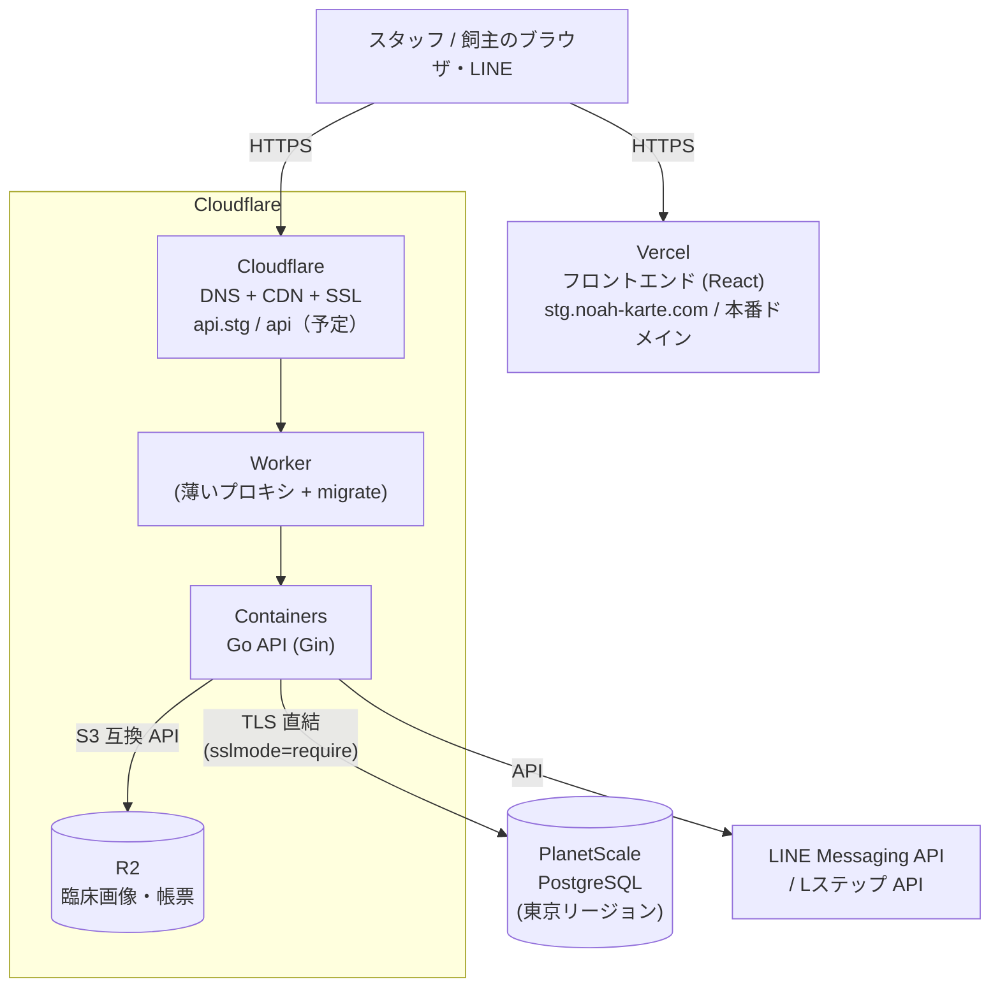

# 納品ドキュメント — システム構成・管理者設定・運用手順

> **対象 Issue**: #258 ／ **リポジトリ由来 slice 同期日**: 2026-07-31
> **読者**: 先方の管理者（院長・システム担当者）
> **目的**: 納品後に先方側で日常の運用・管理（スタッフ追加・権限変更・マスタ更新・障害時の一次対応）が自走できる状態にする。
> **前提**: **Production（本番）は未構築**。現行で稼働しているのは Staging のみ。最終承認・本番値の確定は #253 および末尾の **USER 入力待ち（U1–U12）** 表に依存する（#258 は本 slice だけでは close しない）。**U13（操作説明会の日程・形式・参加者・実施 receipt）は #256 / [OPERATION_MANUAL.md](OPERATION_MANUAL.md) 所有であり、#258 close 条件に含めない**（DEC-62）。

### 文書構成（#258 受け入れの 3 領域）

| 領域 | 本書の節 | 状態 |
|---|---|---|
| システム構成概要（利用サービス・契約一覧含む） | §1 | repo 由来 SSOT 同期済み。契約名義・本番プランは **USER（U1–U6, U12）** |
| 管理者向け初期設定手順 | §2 | path / 権限 / 順序は実装と突合済み。本番 LINE/L ステップ秘密は **USER（U5–U6）** |
| 運用手順（バックアップ・障害連絡・ログ） | §3 | STG 実績ベース。本番実測・窓口・通知先は **USER（U7–U11）** |

現場スタッフ向け操作ナビは [OPERATION_MANUAL.md](OPERATION_MANUAL.md)（#256）。本番切替当日のオーケストレーションは [GOLIVE_RUNBOOK.md](GOLIVE_RUNBOOK.md)（#257・LANE-2 所有）。

---

## 1. システム構成概要

現行インフラの正本は [docs/ops/infra/architecture.md](../ops/infra/architecture.md)。デプロイ・環境 URL の正本は [docs/ops/deploy/README.md](../ops/deploy/README.md)。アプリ構造は [docs/architecture/overview.md](../architecture/overview.md)。

### 1.1 構成図（納品構成 = Cloudflare 経路。PO 決定 2026-07-15）

（ASCII 版の全体像は [architecture.md](../ops/infra/architecture.md) 「全体像」節と同一。）

| 層 | 実装 | 根拠 |
|---|---|---|
| フロントエンド | Vercel（React 19 SPA） | [architecture.md](../ops/infra/architecture.md) / [deploy/README.md](../ops/deploy/README.md) |
| バックエンド API | Cloudflare Workers + Containers（Go/Gin）。Worker は薄いプロキシ + `/_internal/migrate` | 同上 |
| データベース | PlanetScale PostgreSQL（東京）。Containers は Hyperdrive 不可のため **直結**（`sslmode=require`） | [architecture.md](../ops/infra/architecture.md) 既知の制約 |
| ファイル | Cloudflare R2（臨床画像等。参照は有効期限付き署名 URL） | 同上 |
| 外部連携 | LINE Messaging API / Lステップ API（予約・リマインド・タグ） | [28-line-reservation.md](../spec/screens/28-line-reservation.md) 等 |
| IaC | Terraform: [`infra/cloudflare/`](../../infra/cloudflare/README.md)／Workers: `backend/wrangler*.jsonc` | [infra/README](../ops/infra/README.md) |

- **STG デプロイ**: `staging` ブランチ push → GitHub Actions `backend-deploy.yml`（deploy → `/health` → migrate → smoke）。手動は `gh workflow run backend-deploy.yml --ref staging`（[staging/runbook.md](../ops/infra/staging/runbook.md)）。
- **Production デプロイ**: **未整備**（#253・[production/setup.md](../ops/infra/production/setup.md)）。証跡は **USER 入力待ち（U12）**。
- **シークレット**: GitHub Encrypted Secrets および `wrangler secret` / `worker-secret-sync.yml` で管理。**本ドキュメントには秘密値を記載しない**。

> **復旧上の注意**: AWS ECS/RDS は 2026-07-20 に廃止済みで、切り戻し先やホットスタンバイはない。障害初動は [STG 運用 Runbook](../ops/infra/staging/runbook.md) に従い、Cloudflare 側の修正・再デプロイ、またはスナップショットと現行 IaC からの再建で復旧する。本番稼働後の手順は [production/runbook.md](../ops/infra/production/runbook.md)（プレースホルダ）へ整備予定。

### 1.2 利用サービスと契約の一覧

| サービス | 用途 | プラン | 契約・アカウント保有 |
|---|---|---|---|
| Cloudflare | DNS / CDN / API 実行基盤（Workers + Containers）/ R2 | Workers Paid（STG で使用中） | **USER 入力待ち（U1）**（契約名義・移管有無） |
| PlanetScale | データベース（PostgreSQL） | STG 稼働中。本番プランは **USER 入力待ち（U2）** | **USER 入力待ち（U2）**（本番プラン・契約名義・移管有無） |
| Vercel | フロントエンドホスティング + ドメイン（noah-karte.com） | **USER 入力待ち（U3）** | **USER 入力待ち（U3）**（契約名義・移管有無） |
| GitHub | ソースコード・CI/CD（GitHub Actions） | — | **USER 入力待ち（U4）**（リポジトリ運用体制） |
| LINE 公式アカウント | 飼主向け予約・通知 | — | 各医院で契約（本番チャネル投入は **USER 入力待ち（U5）**） |
| Lステップ | 配信・タグ管理 | — | 各医院で契約（本番 API キー投入は **USER 入力待ち（U6）**） |

### 1.3 環境一覧

（[docs/ops/deploy/README.md](../ops/deploy/README.md) §1 および [architecture.md](../ops/infra/architecture.md) 「環境」表より）

| 環境 | 状態 | フロントエンド URL | API ベース URL | 用途 |
|---|---|---|---|---|
| **Staging** | **稼働中**（2026-07-17 切替完了） | https://stg.noah-karte.com | https://api.stg.noah-karte.com/api | 更新の事前検証・デモ |
| **Production** | **未構築**（#253 / **U12**） | https://noah-karte.com（予定） | https://api.noah-karte.com/api（予定） | 本番。構築手順は [production/setup.md](../ops/infra/production/setup.md) |

| | STG | PROD（予定・未構築） |
|---|---|---|
| Worker | `animalekarte-stg-api` | `animalekarte-prod-api` |
| DB | PlanetScale `animalekarte-stg`（フルデモ投入済み） | 未作成 |
| R2 | `animalekarte-stg-images` | `animalekarte-prod-images` |
| デプロイ | staging push → 自動 | 未整備 |

本番 URL の疎通証跡・構築完了記録は **USER 入力待ち（U12）**。本書に偽の本番稼働証跡を書かない。

### 1.4 権限・データ境界（Permission boundaries）

先方が設定・運用するうえで破ってはならない境界。詳細は [ADR-002 マルチテナント](../architecture/adr/002-multitenancy-clinic-id-isolation.md) および [権限グループ仕様](../spec/screens/settings/master-permission-group.md)。

| 境界 | 内容 | 設定画面 / 根拠 |
|---|---|---|
| **医院（`clinic_id`）分離** | 診療・会計・予約等の業務データは医院単位で物理分離。医院マスタで定義した拠点がスタッフ所属とデータの源泉になる | [`/settings/clinic`](../spec/screens/19-clinic-settings.md) |
| **スタッフ所属医院** | スタッフは複数医院に所属可。操作可能な医院は所属割当で決まる | [`/settings/staff`](../spec/screens/settings/master-staff.md) |
| **権限グループ（RBAC）** | リソース × 操作（view / create / edit / delete）のマトリクス。API は毎リクエスト評価、画面は `/v1/me` ポーリングで同期 | [`/settings/permission-groups`](../spec/screens/settings/master-permission-group.md) |
| **最小権限** | 会計取消・締め後修正・マスタ編集・権限変更は管理者系グループに限定する | 同上・#255 役割方針 |
| **新規医院の既定グループ** | 医院開設時に「執行」「一般」がデフォルトルール付きで自動作成される | [master-permission-group.md](../spec/screens/settings/master-permission-group.md) |
| **監査** | 業務上重要な変更は DB の `audit_logs` に操作者・時刻付きで記録（全テーブル自動監査ではない。経路ごとに明示実装） | [specification.md §2.1](../spec/specification.md) |
| **ログイン保護** | 同一 IP あたり 5 回 / 1 分のレート制限。**アカウントロックはない**（Q&A No.25 / #256） | [OPERATION_MANUAL.md §1](OPERATION_MANUAL.md)／[21-login.md](../spec/screens/21-login.md) |

ルート定義の正本は `frontend/src/config/paths.ts`（本節および §2 で引用する path と一致）。

---

## 2. 管理者向け初期設定手順

以下の順に設定する（後の項目が前の項目のマスタに依存するため、**順序どおり**に実施）。各手順の詳細はリンク先の画面仕様書と、システム内マニュアル（ログイン後サイドバー「取扱説明書」→ [`/manual`](../spec/screens/35-internal-manual.md)）を参照。

### Step 1: クリニック（医院）設定

- 画面 path: **`/settings/clinic`** — [医院マスタ仕様](../spec/screens/19-clinic-settings.md)
- 権限: `hospital-settings`（`ResourceHospitalSettings`）
- 設定内容: 院名・住所・電話/FAX・院長名・拠点ごとの登録番号・消費税率（通常/軽減）・明細兼領収書レイアウト。法人単位のインボイス登録番号は画面上部の法人情報セクション（`companies` シングルトン）。
- ここで登録した医院が全データの分離境界およびスタッフ所属先の選択肢になる。
- インボイス登録番号・所在地は領収書・明細書に印字されるため正確に入力する。

### Step 2: 締め時間設定

- 画面 path: **`/settings/closing-time`** — [締め時間設定仕様](../spec/screens/settings/closing-time-settings.md)
- 権限: `closing-settings`（`ResourceClosingSettings`）
- 設定内容:
  - **AM/PM 境界**（既定 14:00）
  - **終了時刻**（平日 / 日曜。これを過ぎた会計は当日 EMG＝緊急レンジ）
  - 定例休診日（曜日）・特別期間・個別休診日
  - AM 開始時刻は **固定 09:00（編集不可）**
- レジ締めの AM / PM / EMG 区分の境界を決める。**売上集計専用**であり、LINE 予約の休診設定とは連動しない（LINE 側は別画面で設定）。
- 変更は将来の集計に影響する。過去の締めレコードは境界変更でも再計算されない（[29-closing-aggregation.md](../spec/screens/29-closing-aggregation.md)）。

### Step 3: 職種マスタ・権限グループ

- 職種: path **`/settings/occupations`** — [職種マスタ仕様](../spec/screens/settings/master-occupation.md)（権限: `master-staff`）
- 権限グループ: path **`/settings/permission-groups`** — [権限グループ仕様](../spec/screens/settings/master-permission-group.md)（権限: `master-permission`）
- 手順: 職種（院長 / 獣医師 / 看護師 / 受付 / トリマー等）を登録 → 権限グループを作成し、リソース（カルテ・会計・レジ締め・マスタ等）× 操作（閲覧 / 作成 / 編集 / 削除）を設定。
- 推奨: **最小権限から始めて必要に応じて追加**。会計取消・締め後修正・マスタ編集・権限変更は管理者系に限定する。
- 主要リソース例: `medical-records`, `accounting`, `cash-register-close`, `master-staff`, `hospital-settings` 等（一覧は権限グループ画面のマトリクスが正本）。

### Step 4: スタッフアカウント登録

- 画面 path: **`/settings/staff`** — [スタッフ管理仕様](../spec/screens/settings/master-staff.md)
- 権限: `master-staff`（`ResourceMasterStaff`）
- 手順:
  1. 氏名・職種・有効/無効を入力。
  2. **ログイン用メールアドレス**（= ログイン ID。**新規作成時のみ入力可**・以後は表示のみ）。
  3. **パスワードは管理者が入力する**（新規: 8 文字以上必須。既存: 変更する場合のみ入力。プレースホルダ「変更する場合のみ入力」）。システムが初期パスワードを自動生成して一度だけ表示する方式ではない。
  4. 権限グループ・所属医院（複数可）・LINE 予約公開設定（表示名・対応可能予約区分等）を割り当て。所属医院・対応可能区分は新規作成後にも設定可能。
- 退職・休職時は原則 **無効化（有効/無効ステータス）** を使う（過去カルテ・会計の担当者参照を維持するため）。削除 API は存在するが、参照整合が必要な場合は無効化を優先する。
- 権限グループ変更は API 側は即時反映。画面メニュー等は `/v1/me` のポーリングで同期される。
- **ロック解除操作は存在しない**（ログイン保護は IP レート制限のみ。Q&A No.25 / [OPERATION_MANUAL.md §1](OPERATION_MANUAL.md)）。ログインできないスタッフには「1〜2 分待機 → パスワード再設定 → 有効/無効確認」を案内する。

### Step 5: マスタ管理（診療・会計の基礎データ）

- 入口: サイドバー「マスタ設定」→ [`/settings`](../spec/screens/20-master-settings.md)
- 主なマスタ（path は `paths.ts` / 各仕様書）: 診療項目・薬剤・診断・問診テンプレート・主訴・動物種類・予約区分・支払方法・保険・ケージ・入院プラン・トリミング・物販 等。
- 単価・税区分は会計計算に直結する。運用開始前に料金表と突合する。
- 在庫連動が必要な項目（薬剤・物販）は、マスタ編集画面の在庫アイテム紐付けを使う。

### Step 6: LINE 予約・Lステップ連携（該当医院のみ）

- LINE 予約設定: サイドバー「LINE予約管理」— [28-line-reservation.md](../spec/screens/28-line-reservation.md)
- Lステップ連携: [31-lstep-integration.md](../spec/screens/31-lstep-integration.md)（設定 path 例: `/settings/integrations/lstep`）
- 設定内容: 受付枠・受付条件・予約ページ表示・Lステップ API 接続（接続テストあり）。
- 本番用チャネル・API キー投入は各医院の契約情報受領後（**USER 入力待ち（U5 / U6）**。秘密値は本書に書かない。secret 管理へ投入する）。

---

## 3. 運用手順

本番固有の数値・窓口・バックアップ実測は **Production 未構築**のため未確定。STG の運用正本は [staging/runbook.md](../ops/infra/staging/runbook.md) および [deploy/README.md](../ops/deploy/README.md)。本番構築後は [production/runbook.md](../ops/infra/production/runbook.md) を整備する。

### 3.1 バックアップ方針

| 項目 | 内容 | 根拠 / 状態 |
|---|---|---|
| DB 自動バックアップ | PlanetScale の自動バックアップ。STG 選定時の受容条件は **12 時間毎・PITR なし** | STG 現行。本番プランの頻度・保持・復旧テスト結果は **USER 入力待ち（U2 / U9）**（#253） |
| 大規模変更前の手動スナップショット | データ移行等の前に取得。Go-live 当日の位置づけは [GOLIVE_RUNBOOK.md](GOLIVE_RUNBOOK.md) | 実施タイミングは運用判断 |
| ファイル（R2） | 画像・帳票の実体は R2 | R2 側バックアップ/バージョニング方針は **USER 入力待ち（U10）** |
| 復旧手順 | バックアップからのリストア手順と実測所要時間 | #253 の復旧テスト完了後に本節へ追記（**USER 入力待ち（U9）**） |

> 日常運用で先方側にバックアップ操作は発生しない。復旧が必要な事態は §3.2 の連絡フローで開発側が対応する。

### 3.2 障害時の連絡フロー

1. **現場での一次切り分け**（スタッフ）: システム内マニュアル「エラー・トラブル対応」「システム障害時の対応（BCP）」に従い、再読み込み・別ブラウザ・ネットワーク確認を実施。
2. **管理者への報告**（各医院の管理者）: 複数端末・複数スタッフで再現する場合は障害と判断。
3. **開発側窓口へ連絡**: 窓口の連絡手段・宛先・受付時間は **USER 入力待ち（U7）**（[GOLIVE_RUNBOOK.md](GOLIVE_RUNBOOK.md) §5 のサポート体制と共通）。報告時は「発生時刻・操作していた画面・エラーメッセージ・影響範囲（何人が困っているか）」を添える。
4. **開発側の対応**（STG 実績ベース）:
   - `/health` 確認（workers.dev 直行と実 URL の両方 — [staging/runbook.md](../ops/infra/staging/runbook.md)）
   - デプロイ直後はローリング更新の旧イメージ残留を疑い、必要なら 15 分静置後に再確認
   - 全断 + DB 接続エラーは接続スロット枯渇を疑う（`DB_MAX_OPEN_CONNS` 等 — [architecture.md](../ops/infra/architecture.md)）
   - 監視通知（5xx 率アラート）の本番送信先は **USER 入力待ち（U8）**（`infra/cloudflare/notifications.tf` の `notification_email`）

### 3.3 ログの見方

| ログ | 場所 | 用途 | 保持 |
|---|---|---|---|
| 業務操作監査（`audit_logs`） | DB 内。カルテ確定・会計取消・権限変更等を経路ごとに記録 | 「誰が・いつ・何を」の追跡。臨床・会計の真正性 | 永続（DB 内）。保存期間ポリシーの最終合意は **USER 入力待ち（U11）** |
| 画面上の履歴断片 | カルテの追記/確定者表示、会計の取消理由表示など | 現場での個別レコード確認 | レコードに紐づく |
| API / インフラログ | Cloudflare ダッシュボード → Workers Logs / Containers | 障害調査（エラー・レイテンシ）。**業務監査の正本ではない** | プラットフォーム準拠（開発側運用） |
| デプロイ履歴 | GitHub Actions 実行履歴 | いつ・どのバージョンが反映されたか | GitHub 準拠 |

- 業務監査の正本は DB の `audit_logs`（[deploy/README.md §3.2](../ops/deploy/README.md)、[specification.md §2.1](../spec/specification.md)）。
- システム内マニュアル「監査ログ・操作履歴の確認」は管理者向けの読み方ガイド。Workers Logs / GitHub は開発側の運用ツールであり、先方の日常操作は不要。

### 3.4 日常運用チェック（推奨）

| 頻度 | 項目 | 実施者 |
|---|---|---|
| 毎営業日 | レジ締めの完了（差額があれば当日中に原因確認）— [`/accounting/close`](../spec/screens/29-closing-aggregation.md) | 各医院の締め担当 |
| 週次 | 未納者一覧（売掛）の確認・督促 | 経理担当 |
| 月次 | 月次集計レポートの確認・CSV 保管 | 経理担当・院長 |
| 随時 | スタッフの入退職に伴うアカウント登録・無効化・権限見直し（§2 Step 4） | 管理者（`/settings/staff`・`/settings/permission-groups`） |

---

## USER 入力待ち（委任外・repo では確定不能）

本表は repo 由来の SSOT だけでは埋められない項目を集約する。**値・秘密・契約内容・本番証跡は発明しない。** **U1–U12** の供給後に #258 最終承認・本ドキュメント追記を行う。U13（操作説明会）は #256 / OPERATION_MANUAL の残差であり、**#258 close 条件ではない**。

| ID | 項目 | 供給者（想定） | 必要入力 | 反映先 | 状態 |
|---|---|---|---|---|---|
| U1 | Cloudflare 契約名義・移管有無 | 先方 / 開発契約担当 | 契約名義、請求先、移管要否 | §1.2 | 空欄 |
| U2 | PlanetScale 本番プラン・契約名義 | 先方 / 開発契約担当 | プラン名、バックアップ頻度・保持、契約名義 | §1.2 / §3.1 | 空欄 |
| U3 | Vercel プラン・契約名義 | 先方 / 開発契約担当 | プラン、ドメインレジストラ権限 | §1.2 | 空欄 |
| U4 | GitHub リポジトリ運用体制 | 先方 / 開発 | 組織・権限・Collaborator 方針 | §1.2 | 空欄 |
| U5 | 本番 LINE チャネル情報 | 各医院 | チャネル ID 等（**秘密は secret 管理へ。本書に書かない**） | §2 Step 6 | 空欄 |
| U6 | 本番 Lステップ API キー | 各医院 | API キー（**secret 管理へ。本書に書かない**） | §2 Step 6 | 空欄 |
| U7 | 障害・サポート窓口 | 先方 × 開発 | 連絡手段・宛先・受付時間・一次対応者 | §3.2 / GOLIVE_RUNBOOK §5 | 空欄 |
| U8 | 監視通知メール | 開発 / 先方 | 送信先メール（Cloudflare 側事前検証要） | §3.2 / `notifications.tf` | 空欄 |
| U9 | 本番バックアップ方針の実測 | 開発（#253） | 頻度・保持・リストア手順・所要時間 | §3.1 | 空欄 |
| U10 | R2 バックアップ/バージョニング | 開発 / 先方 | 方針の採否 | §3.1 | 空欄 |
| U11 | 監査ログ保存期間の最終合意 | 先方 | 保持年数・廃棄方針 | §3.3 | 空欄 |
| U12 | Production 構築完了証跡 | 開発（#253） | setup.md 実施結果・URL 疎通 | §1.3 / production/runbook | 空欄 |

> **U13（操作説明会の日程・形式・参加者・実施 receipt）** は #256 所有。正本: [OPERATION_MANUAL.md §10](OPERATION_MANUAL.md) / §11。#258 の最終承認条件・本書の document completion input には含めない。

### 本 slice で完了した repo 由来作業

- §1 構成・環境・境界を architecture / deploy SSOT に同期（Production 未構築を明示）
- §2 管理者設定 path（`/settings/clinic`・`/settings/staff`・`/settings/permission-groups`・`/settings/closing-time` 等）を実装 path と整合
- §3 運用を STG runbook ベースで記述し、本番実測を U 行に分離
- 本文中の各空欄に U# を併記し、秘密値・偽の本番証跡を入れない方針を維持

---

## 4. 監視・通知（開発側運用・参考）

- ヘルスチェック（STG 実測）: `https://api.stg.noah-karte.com/health`（HTTP 200 / 正常応答）。本番 URL `https://api.noah-karte.com/health` は **Production 未構築**のため未供用（**U12**）。
- 5xx 率の自動通知: Cloudflare 通知ポリシー（`infra/cloudflare/notifications.tf`）。送信先メールの供給・検証と apply は **USER 入力待ち（U8）**（#253）。
- コスト監視: Cloudflare にはアカウント全体の支出アラート機構が無いため、使用量 API の定期確認で代替。
- 障害監視・通知体制の完成条件は #253 の受け入れ条件（プロセス死活・5xx 急増・DB 接続断の通知）を正本とする。

---

## 5. ドキュメント索引（納品一式）

| ドキュメント | 内容 | 読者 |
|---|---|---|
| [OPERATION_MANUAL.md](OPERATION_MANUAL.md) | 現場スタッフ向け操作マニュアル（ナビゲーション） | 現場スタッフ |
| システム内マニュアル（`/manual`） | 全画面・全業務フローの詳細手順（検索可能） | 現場スタッフ・管理者 |
| [GOLIVE_RUNBOOK.md](GOLIVE_RUNBOOK.md) | 本番切替準備・障害時判断（LANE-2 所有） | 開発側・先方管理者 |
| 本書（DELIVERY_PACKAGE.md） | システム構成・管理者設定・運用手順 | 先方管理者 |
| [docs/spec/screens/](../spec/screens/README.md) | 画面別 詳細仕様書 | 管理者・開発側 |
| [docs/ops/deploy/README.md](../ops/deploy/README.md) | デプロイ・運用ハブ（環境一覧・障害時判断） | 開発側 |
| [docs/ops/infra/architecture.md](../ops/infra/architecture.md) | 現行インフラ構成 SSOT | 開発側 |
| [docs/ops/infra/production/setup.md](../ops/infra/production/setup.md) | 本番構築手順（#253・未実施） | 開発側 |
| [docs/ops/testing/SECTION_14_MANUAL_TEST_GUIDE.md](../ops/testing/SECTION_14_MANUAL_TEST_GUIDE.md) | ブラウザ手動検証シナリオ | 開発側・QA |
