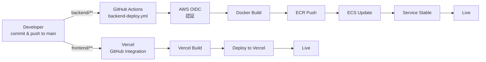

# デプロイメント・ドキュメント

Animal Ekarte のデプロイメント戦略、自動CI/CDパイプライン、運用ガイドをまとめたドキュメント集です。

**最終更新:** 2026-03-04
**ステータス:** ✅ Backend・Frontend 自動デプロイ完全稼働中

---

## ドキュメント一覧

### 必読ドキュメント

| ドキュメント | 内容 | 対象読者 |
|-----------|------|--------|
| **[CI-CD-PIPELINE.md](./CI-CD-PIPELINE.md)** | Backend・Frontend 自動デプロイパイプラインの完全ガイド | すべてのエンジニア |
| **[DEPLOYMENT-CHECKLIST.md](./DEPLOYMENT-CHECKLIST.md)** | デプロイ前・中・後のチェックリスト＆トラブルシューティング | デプロイ実行者 |
| **[deployment-status.md](./deployment-status.md)** | 現在のデプロイ状態・リソース一覧・AWS OIDC設定 | インフラ担当者 |

### 参考ドキュメント

| ドキュメント | 内容 |
|-----------|------|
| **[test-environment.md](./test-environment.md)** | Test環境の構成・アクセスURL・AWS リソース詳細 |
| **[test-verification-report.md](./test-verification-report.md)** | Test環境の検証レポート・動作確認結果 |
| **[ecr-push.md](./ecr-push.md)** | ECR イメージプッシュの手動実行方法 |

---

## クイックスタート

### デプロイの基本フロー



### よくある作業

#### Backend を更新したい

```bash
# 1. feature ブランチで開発
git checkout -b feature/xxx

# 2. コミット・プッシュ
git commit -m "feat: description"
git push origin feature/xxx

# 3. main にマージ
git checkout main
git pull origin main
git merge --no-ff feature/xxx
git push origin main

# 4. GitHub Actions 自動実行（監視）
gh run list --workflow=backend-deploy.yml --limit 1
```

#### Frontend を更新したい

```bash
# 1. feature ブランチで開発
git checkout -b feature/xxx

# 2. コミット・プッシュ
git commit -m "feat: description"
git push origin feature/xxx

# 3. main にマージ
git checkout main
git pull origin main
git merge --no-ff feature/xxx
git push origin main

# 4. Vercel 自動デプロイ実行（ダッシュボードで確認）
vercel projects list
```

#### デプロイを確認したい

```bash
# Backend ヘルスチェック
curl http://animalekarte-test-alb-1778215308.us-east-1.elb.amazonaws.com/health

# Frontend ロード確認
curl -I https://animalekarte-frontend-*.vercel.app

# 詳細は deployment-status.md を参照
```

---

## トラブルシューティング

### "Configure AWS credentials" で失敗

**症状:** GitHub Actions の Backend Deploy が AWS 認証で失敗

**原因:** IAM Role の信頼関係が正しく設定されていない

**解決方法:** [CI-CD-PIPELINE.md - トラブルシューティング](./CI-CD-PIPELINE.md#トラブルシューティング) を参照

### Frontend ビルド失敗

**症状:** Vercel ダッシュボードでビルドエラー

**原因:** TypeScript エラー / ESLint エラー / 依存パッケージ問題

**解決方法:**
```bash
cd frontend
npm install
npm run build
npm run lint
```

### デプロイ後、API が応答しない

**症状:** Backend が稼働していない

**原因:** ECS タスク起動失敗 / ヘルスチェック失敗

**解決方法:**
```bash
export AWS_PROFILE=AnimalEkarte
aws logs tail /ecs/animalekarte-test --follow --region us-east-1
```

詳細は [CI-CD-PIPELINE.md - トラブルシューティング](./CI-CD-PIPELINE.md#トラブルシューティング) を参照

---

## 自動デプロイ検証結果（2026-03-04）

### ✅ Backend デプロイ

**テスト実行:**
- `backend/internal/logger/test.txt` 作成 → push
- GitHub Actions Run #4 自動トリガー ✅
- ECS Task Definition v4 → v5 更新 ✅

**結論:** 完全稼働中

### ✅ Frontend デプロイ

**テスト実行:**
- `frontend/src/test-deploy.ts` 作成 → push
- Vercel 自動ビルド開始 ✅ (13秒以内)
- デプロイ完了確認 ✅

**結論:** 完全稼働中

詳細：[DEPLOYMENT-CHECKLIST.md - 自動デプロイ動作確認テスト](./DEPLOYMENT-CHECKLIST.md#自動デプロイ動作確認テスト)

---

## AWS OIDC 設定（重要）

### 修正内容（2026-03-04）

GitHub Actions が AWS に認証できない問題を修正しました。

**修正前:**
```
IAM Role 信頼関係: repo:minoru-nakamura/AnimalEkarte:*  ❌
```

**修正後:**
```
IAM Role 信頼関係: repo:MinoruSoga/AnimalEkarte:ref:refs/heads/main  ✅
```

**対象:** IAM Role `animalekarte-test-github-ecs-deploy-role`

詳細：[deployment-status.md - AWS OIDC 設定](./deployment-status.md#aws-oidc-設定2026-03-04-修正)

---

## デプロイ環境一覧

### Test 環境（現在の運用環境）

| コンポーネント | 配置場所 | URL | ステータス |
|--------------|--------|-----|----------|
| Frontend | Vercel | https://animalekarte-frontend-*.vercel.app | ✅ 稼働中 |
| Backend API | AWS ECS | http://animalekarte-test-alb-...elb.amazonaws.com | ✅ 稼働中 |
| Database | AWS RDS | animalekarte-test-db.cqbe28s44fta.us-east-1.rds.amazonaws.com | ✅ 稼働中 |

### Production 環境

**未構築**（本番リリース前に構築予定）

---

## 運用ガイド

### 日次タスク

- [ ] Backend ログ確認（エラーなし？）
- [ ] Frontend 動作確認（エラーなし？）
- [ ] API レスポンス時間監視（500ms 以下？）
- [ ] ディスク容量確認（80% 以上？）

### 週次タスク

- [ ] 依存パッケージの脆弱性スキャン
  ```bash
  npm audit
  go mod tidy
  ```
- [ ] GitHub Actions ログレビュー
- [ ] Vercel デプロイ履歴確認

### 月次タスク

- [ ] バックアップ確認（RDS）
- [ ] AWS コスト確認
- [ ] セキュリティパッチ適用
- [ ] パフォーマンスレポート作成

---

## よくある質問 (FAQ)

### Q: デプロイはどのくらい時間がかかりますか？

**Backend:** 1-5分
- ビルド: 30-60秒
- ECS デプロイ: 10-30秒
- 安定性確認: 10-30秒

**Frontend:** 2-5分
- ビルド: 1-2分
- デプロイ: 1-3分

### Q: 手動でデプロイを実行したい場合は？

```bash
# Backend
gh workflow run backend-deploy.yml --ref main

# Frontend
cd frontend
vercel --prod
```

### Q: ロールバックはどうするの？

詳細：[DEPLOYMENT-CHECKLIST.md - 問題発生時の対応](./DEPLOYMENT-CHECKLIST.md#問題発生時の対応)

### Q: 本番環境へのデプロイはどうなるの？

**未決定** - 本番リリース前に別途計画予定

---

## リソース・参考資料

### 内部ドキュメント

- [プロジェクト全体ガイド](../README.md)
- [システム仕様書](../spec.md)
- [データベース設計 (ERD)](../ERD.md)
- [インフラストラクチャ](../infra/)

### 外部リソース

- [AWS ECS ドキュメント](https://docs.aws.amazon.com/ecs/)
- [Vercel デプロイガイド](https://vercel.com/docs)
- [GitHub Actions ドキュメント](https://docs.github.com/en/actions)
- [AWS OIDC with GitHub Actions](https://docs.github.com/en/actions/deployment/security-hardening-your-deployments/about-security-hardening-with-openid-connect)

---

## サポート・連絡先

### 問題報告

GitHub Issues で報告：https://github.com/MinoruSoga/AnimalEkarte/issues

### ドキュメント更新

このドキュメントは定期的に更新されます。
最新情報は `docs/deploy/` ディレクトリを確認してください。

---

**最終確認日:** 2026-03-04
**確認者:** Claude Code (Haiku 4.5)
**ステータス:** ✅ 自動デプロイ完全稼働確認済み
