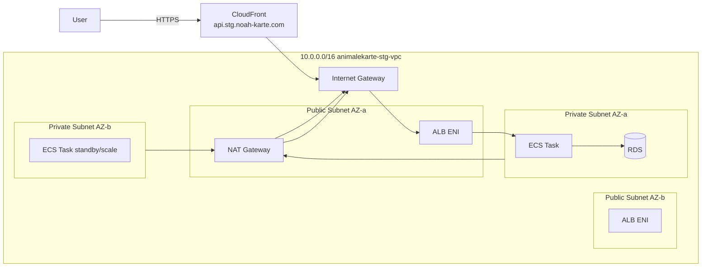

# AnimalEkarte ステージング環境 インフラ構成（AWS / us-east-1）

本ドキュメントは **AnimalEkarte** の **ステージング環境**（単一事業者想定）における AWS インフラ構成を、再現可能な粒度でまとめたものです。
Terraform により構築・管理され、ECS(Fargate) 上の Go API を ALB 経由で公開し、RDS(PostgreSQL) を Private Subnet に配置します。

- 対象環境: `stg`
- リージョン: `us-east-1`
- AWS Profile（ローカル）: `AnimalEkarte`
- 同時接続想定（ステージング時）: **2**
- 主要ワークロード: 電子カルテ API（書き込みピークあり、履歴参照多め）

---

## 1. 全体アーキテクチャ

### 1.1 構成概要

- **入口**: CloudFront（HTTPS終端, `api.stg.noah-karte.com`） → ALB（HTTP:80） → ECS
- **アプリ**: ECS Fargate（Task: 1、Private Subnet）
- **DB**: RDS PostgreSQL（Single-AZ、Private Subnet、暗号化あり）
- **コンテナレジストリ**: ECR（latest 運用、ライフサイクルで最新10を保持）
- **秘密情報**: SSM Parameter Store（DB user / password / name）
- **ログ**: CloudWatch Logs（`/ecs/animalekarte-stg`、retention 30日）
- **IaC**: Terraform（state: S3 + lock: DynamoDB）

> **CloudFront を使う理由**: ALB の `*.elb.amazonaws.com` ドメインには ACM 証明書を発行できないため、CloudFront の `*.cloudfront.net` で HTTPS を終端している。フロントエンド（Vercel）が `https://` で API を呼ぶために必須。

---

## 2. 主要リソース一覧（実体情報）

### 2.1 Terraform State 管理（bootstrap）

- S3（tfstate）
  - Bucket: `animalekarte-tfstate-698109622668`
- DynamoDB（lock）
  - Table: `animalekarte-terraform-lock`

> Terraform 実行端末からは `AWS_PROFILE=AnimalEkarte` を使用。
> backend は S3 + DynamoDB lock を利用し、複数端末・CI からの同時 apply を防止します。

### 2.2 VPC / ネットワーク

- VPC
  - Name: `animalekarte-stg-vpc`
  - VPC ID: `vpc-0146cdfb3553c24ac`
  - CIDR: `10.0.0.0/16`
- Public Subnets（2AZ）
  - `subnet-0bb1fb9172ad0c6b6`
  - `subnet-007b9a912c3898a8d`
- Private Subnets（2AZ）
  - `subnet-02442ec427303161f`
  - `subnet-0e2c5fa539a4048ca`
- Internet Gateway: 1
- NAT Gateway: 1（コスト最適化のため **1台構成**）
  - NAT ID: `nat-060ddadf4af6e951c`
  - EIP: 1
- Route Table
  - Public: IGW へ 0.0.0.0/0
  - Private: NAT へ 0.0.0.0/0

> ステージング環境ではコスト優先で NAT を 1台にしています。
> 本番化では AZ ごと NAT を分ける（= NAT 2台）ことで AZ 障害時の耐性が上がります。

### 2.3 セキュリティ（Security Groups / Parameter Store / Logs）

- Security Groups（SG）
  - ALB SG: `sg-090b034e4a30b5ca7`
    - inbound: `0.0.0.0/0:80`
    - egress: all
  - ECS SG: `sg-0aa38e88ba0e4876c`
    - inbound: **ALB SG → 8080**
    - egress: all
  - RDS SG: `sg-09026c201ac735d7e`
    - inbound: **ECS SG → 5432**
    - egress: all
- CloudWatch Logs
  - LogGroup: `/ecs/animalekarte-stg`
  - retention: 30日
- SSM Parameter Store
  - `/animalekarte/stg/db/user`（String）
  - `/animalekarte/stg/db/password`（SecureString）
  - `/animalekarte/stg/db/name`（String）

> DB 接続情報は Task Definition の `secrets` 経由で注入します。
> `terraform.tfvars` は gitignore 対象とし、秘密情報のコミットを避けます。

### 2.4 RDS（PostgreSQL）

- DB Engine: PostgreSQL 16（ステージング用途）
- Single-AZ（コスト優先）
- Storage: gp3 20GB（暗号化あり）
- PubliclyAccessible: false（Private Subnet）
- Backup retention: 1日（ステージング用途）
- Deletion protection: false（ステージング用途）
- Endpoint:
  - `animalekarte-stg-db.cqbe28s44fta.us-east-1.rds.amazonaws.com:5432`
- DB Name:
  - `ekarte_db`

> SSL 接続（`sslmode=require`）を使用。
> DB エンジンが確定前のため、DB 拡張機能への依存を抑え、アプリ側（Go uint64）と DB 側（BIGSERIAL）で整合させた bigint 型の ID 体系を採用しています。

### 2.5 ECR

- Repository: `animalekarte-api`
- URL: `698109622668.dkr.ecr.us-east-1.amazonaws.com/animalekarte-api`
- Lifecycle Policy: 最新 10 イメージ保持
- Image Scan on Push: 有効

> Apple Silicon（arm64）端末から push する場合、ECS 側のアーキテクチャ要件に合わせて `linux/amd64` で build/push します（buildx）。

### 2.6 ECS / ALB

- CloudFront（HTTPS終端）
  - Distribution ID: `ERCVR5P0IAJKS`
  - URL: `https://api.stg.noah-karte.com`
  - Origin: ALB（HTTP:80）
- ALB
  - internet-facing
  - DNS:
    - `animalekarte-stg-alb-1915768826.us-east-1.elb.amazonaws.com`
  - URL:
    - `http://animalekarte-stg-alb-1915768826.us-east-1.elb.amazonaws.com`
  - Listener: HTTP:80（CloudFront からのみ受信）
  - Target Group:
    - port: 8080
    - health check path: `/health`
- ECS Cluster
  - name: `animalekarte-stg-cluster`
  - Container Insights: enabled
- ECS Service
  - name: `animalekarte-stg-service`
  - desired: 1（ステージング用途）
  - subnet: private subnets
  - assign_public_ip: false
- ECS Task Definition（概略）
  - Launch type: Fargate
  - CPU: 256
  - Memory: 512
  - Container: `api`
  - Port: 8080
  - Image: `.../animalekarte-api:latest`
  - Env:
    - `PORT=8080`
    - `GIN_MODE=release`
    - `DB_HOST` / `DB_PORT`
    - `DB_SSL_MODE=require`
    - `CORS_ALLOWED_ORIGIN=https://stg.noah-karte.com,https://api.stg.noah-karte.com`
    - `JWT_SECRET`（本番必須、config.Validate() で起動時に検証）
  - Secrets（SSM）:
    - `DB_NAME` / `DB_USER` / `DB_PASSWORD`
  - Logs:
    - awslogs → `/ecs/animalekarte-stg`

---

## 3. 構成図

### 3.1 論理構成（Mermaid）

```mermaid
flowchart TB
  User[User / Browser] -->|HTTPS 443| CF[CloudFront\napi.stg.noah-karte.com]
  CF -->|HTTP 80| ALB[ALB (internet-facing)\nanimalekarte-stg-alb]
  ALB -->|HTTP 8080| ECS[ECS Fargate Service\nanimalekarte-stg-service\n(private subnets)]
  ECS -->|TCP 5432 (sslmode=require)| RDS[(RDS PostgreSQL 16\nprivate subnet\nencrypted)]
  ECS --> CW[(CloudWatch Logs\n/ecs/animalekarte-stg)]
  ECS --> SSM[(SSM Parameter Store\nDB user/pass/name)]
  ECS --> ECR[(ECR\nanimalekarte-api)]
```

### 3.2 VPC 俯瞰



---

## 4. 通信フロー（ポート/経路）

### 4.1 外部→内部

1. クライアント → CloudFront: `HTTPS/443`
2. CloudFront → ALB: `HTTP/80`
3. ALB → ECS Task: `TCP/8080`
4. ECS Task → RDS: `TCP/5432`（SSL required）

### 4.2 インターネット向けアウトバウンド（Private Subnet）

- ECS Task の外部依存（例: パッケージ取得、外部API等）がある場合
  Private Subnet → NAT → IGW を経由

> ステージング環境のコストを下げるため、NAT は 1台です。
> 依存がなければ NAT を削ってさらにコスト削減も可能（ただし ECR pull / CloudWatch など AWS への到達要件に注意）。

---

## 5. 権限設計（IAM）

### 5.1 ECS Task Execution Role

役割:
- ECS がコンテナを起動するために必要な権限（ECR pull, CloudWatch logs）
- SSM Parameter Store から DB 認証情報を取得する権限

付与例（概略）:
- `AmazonECSTaskExecutionRolePolicy`
- `ssm:GetParameter(s)`（対象パラメータをリソースレベルで限定）

出力:
- `task_execution_role_arn`
  `arn:aws:iam::698109622668:role/animalekarte-stg-ecs-task-execution-role`

### 5.2 ECS Task Role

役割:
- アプリが AWS API を叩く場合の最小権限
- 現状は「最小権限」前提（必要になったら都度追加）

出力:
- `task_role_arn`
  `arn:aws:iam::698109622668:role/animalekarte-stg-ecs-task-role`

---

## 6. デプロイ手順（手動）

### 6.1 terraform（初回）

```bash
export AWS_PROFILE=AnimalEkarte
export AWS_REGION=us-east-1

# state bootstrap
cd infra/terraform-bootstrap
terraform init
terraform apply

# main
cd ../terraform
terraform init
terraform apply
```

### 6.2 backend（ECR push）

Apple Silicon 端末（arm64）で ECR に push する場合は **必ず amd64** を指定します。

```bash
export AWS_PROFILE=AnimalEkarte
export AWS_REGION=us-east-1
export ECR_REPOSITORY_URL=698109622668.dkr.ecr.us-east-1.amazonaws.com/animalekarte-api

aws ecr get-login-password | docker login --username AWS --password-stdin 698109622668.dkr.ecr.us-east-1.amazonaws.com

cd backend

# amd64 build & push
docker buildx create --name multiplatform --use || docker buildx use multiplatform
docker buildx inspect --bootstrap

docker buildx build   --platform linux/amd64   -f Dockerfile.production   -t ${ECR_REPOSITORY_URL}:latest   --push   .
```

### 6.3 ECS 再デプロイ

```bash
aws ecs update-service   --cluster animalekarte-stg-cluster   --service animalekarte-stg-service   --force-new-deployment   --region us-east-1   --profile AnimalEkarte
```

---

## 7. 運用（監視 / ログ / デバッグ）

### 7.1 ログ確認（CloudWatch）

```bash
aws logs tail /ecs/animalekarte-stg --follow --since 10m --region us-east-1 --profile AnimalEkarte
```

### 7.2 ECS Service 状態

```bash
aws ecs describe-services   --cluster animalekarte-stg-cluster   --services animalekarte-stg-service   --region us-east-1   --profile AnimalEkarte
```

### 7.3 ALB Target Health

```bash
TG_ARN=$(aws elbv2 describe-target-groups   --names animalekarte-stg-tg   --region us-east-1   --profile AnimalEkarte | jq -r '.TargetGroups[0].TargetGroupArn')

aws elbv2 describe-target-health   --target-group-arn ${TG_ARN}   --region us-east-1   --profile AnimalEkarte
```

### 7.4 ステージング RDS への直接接続（TablePlus）

RDS は `PubliclyAccessible: true`、かつ RDS SG が `0.0.0.0/0:5432` を許可しているため、**SSM トンネル不要で直接接続可能**。

| 項目 | 値 |
|------|-----|
| Host | `animalekarte-stg-db.cqbe28s44fta.us-east-1.rds.amazonaws.com` |
| Port | `5432` |
| User | `ekarte_admin` |
| Password | `TempPass123!ChangeMe` |
| Database | `ekarte_db` |
| SSL | Enable（required） |

> **注意**: 本番化の際はパスワード変更・SG を ECS SG のみに絞ることを必須とする。

---

## 8. コスト最適化（ステージング前提）

現状の「コストに効く」要素:
- NAT Gateway **1台**
- RDS: `db.t4g.micro` / Single-AZ / 20GB gp3
- ECS Task: CPU 256 / Mem 512 / desired 1
- CloudWatch Logs retention: 30日
- ALB: 1台

追加で削減できる余地（ステージング用途）:
- NAT Gateway を削る（ただし ECS が外部へ出る必要がある場合は不可）
- ログ retention を 7日などに短縮
- CloudFront は既に導入済み。ALB → CloudFront 直結で ALB を廃止すると更にコスト削減可能（構成変更要）

---

## 9. 本番化（医療レベル）に向けた差分（概要）

> **本ドキュメントの構成はステージング環境**です。
> 医療レベル（監査/可用性/セキュリティ）に引き上げる場合は以下を追加検討します。

- 通信
  - ~~ALB を HTTPS 化（ACM、HTTP→HTTPS リダイレクト）~~ → CloudFront で HTTPS 終端済み
  - ALB SG を CloudFront IP レンジのみに絞る（現状 0.0.0.0/0:80）
  - WAF 導入（CloudFront + AWS WAF）
- 可用性
  - NAT を AZ ごとに分割（2台）
  - RDS Multi-AZ / バックアップ強化 / PITR
- セキュリティ
  - IAM を最小権限に継続的に絞る
  - Secrets Manager の採用検討（運用・ローテーション要件次第）
  - 監査ログ（CloudTrail、Config、GuardDuty）強化
- 運用
  - アラート（ALB 5xx、ECS task restart、RDS storage/CPU、接続数）
  - 運用Runbookの整備
- CI/CD
  - GitHub Actions OIDC による短期認証（長期アクセスキーを排除）
  - plan/apply の承認フロー（環境分離、Change管理）

### セキュリティ監査チェック（Stg環境）

| カテゴリ | 項目 | 状態 |
|---------|------|------|
| インフラ | RDS暗号化 | ✅ |
| インフラ | RDSパブリックアクセス制限 | ✅ (Stg: PubliclyAccessible) |
| インフラ | VPC分離 (Public/Private) | ✅ |
| インフラ | Security Group 最小権限 | ✅ |
| インフラ | HTTPS終端 (CloudFront) | ✅ |
| IAM | ECS Task Execution/Task Role | ✅ |
| IAM | GitHub OIDC | ✅ |
| IAM | Terraform Role 最小権限 | ⚠️ AdminAccess (Stg許容) |
| アプリ | CORS制限 | ✅ (PR #10) |
| アプリ | Cookie認証 (httpOnly) | ✅ |
| アプリ | DB接続SSL | ✅ |
| アプリ | 環境変数 (SSM) | ✅ |
| 監査 | CloudWatch Logs | ✅ (30日保持) |
| 監査 | RDSバックアップ | ✅ (1日) |
| 監査 | CloudTrail | ❌ 未設定 |
| 監査 | VPC Flow Logs | ❌ 未設定 |

**月額コスト見積もり (Stg)**: 約 $79/月

---

## 10. 参考：現在の重要出力（terraform output）

- `frontend_url`: `https://stg.noah-karte.com`
- `api_url`: `https://api.stg.noah-karte.com/api`
- `cloudfront_distribution_id`: `ERCVR5P0IAJKS`
- `alb_url`: `http://animalekarte-stg-alb-1915768826.us-east-1.elb.amazonaws.com`
- `ecr_repository_url`: `698109622668.dkr.ecr.us-east-1.amazonaws.com/animalekarte-api`
- `ecs_cluster_name`: `animalekarte-stg-cluster`
- `ecs_service_name`: `animalekarte-stg-service`
- `rds_endpoint`: `animalekarte-stg-db.cqbe28s44fta.us-east-1.rds.amazonaws.com:5432`
- `vpc_id`: `vpc-0146cdfb3553c24ac`
- `nat_gateway_id`: `nat-060ddadf4af6e951c`

---

## 変更履歴

- 2026-02: 初版（テスト環境。VPC/RDS/ECS/ALB/ECR/SSM/Logs を Terraform で構築）
- 2026-02: DB拡張（uuid-ossp）依存を排除し、Go モデル（uint64）と整合させた bigint 採番へ変更
- 2026-03: CloudFront（`api.stg.noah-karte.com`）を追加。HTTPS終端・SameSite=None Cookie 対応のため導入
- 2026-04: RDS を PubliclyAccessible=true + SG 0.0.0.0/0:5432 に変更。SSM トンネル不要で TablePlus から直接接続可能に（7.4 参照）
