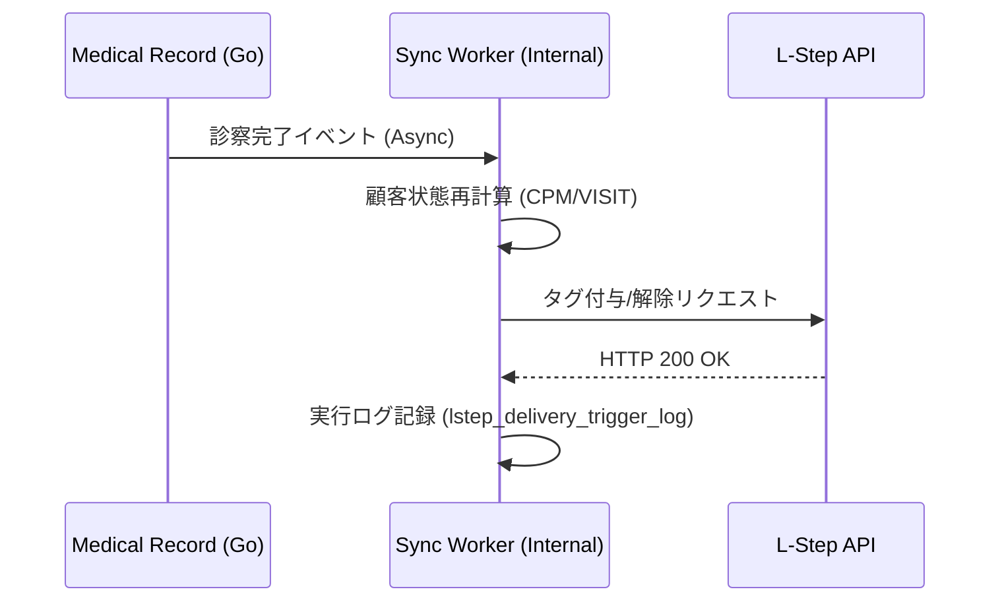

# LINE連携・MA アーキテクチャ (LINE & Marketing Automation)

> **目的**: LINE連携の同期フロー・認証設計を定義する。
> **読者**: バックエンド実装者。
> **タイミング**: 同期フローの実装・確認時。

> **Animal Ekarte**: LINE プラットフォームを活用した顧客体験の最大化
> **最新更新**: 2026-06-12

---

## 1. 二大機能の棲み分け

本システムにおける LINE 連携は、目的の異なる 2 つのサブシステムで構成されます。

### 1.1 LINE 予約システム (Inbound)
- **目的**: 飼い主からの「予約」を自動で受け付ける。
- **技術**: LIFF (LINE Front-end Framework) + React 19。
- **フロー**: LIFF 経由で空き枠を検索し、カルテ側の `appointments` テーブルへ直接書き込み。

### 1.2 Lステップ連携 (Outbound / CRM)
- **目的**: 病院側から「最適な情報」を自動で届ける。
- **技術**: Go Goroutine (非同期同期) + L-Step API + Messaging API。
- **フロー**: 会計や診察などのイベントをトリガーに、Lステップ側のタグを書き換え、シナリオを起動。

---

## 2. 認証・紐付けロジック (Identity Mapping)

顧客の特定は以下の 3 段階で行われます。

1.  **LIFF ログイン**: LINE アプリからの初回アクセス時に `line_user_id` を取得。
2.  **紐付け (Linking)**: 既存の飼主情報の「電話番号」または「飼主No」を用いて名寄せ。
3.  **トークン管理**: `line_link_tokens` テーブルにより、セキュアな紐付けプロセスを保証。

---

## 3. リアルタイム・イベント同期

バックエンドにおける同期処理のライフサイクルです。

---

## 4. データ分離とセキュリティ

- **マルチテナント**: 各クリニックの API キーは AES-256-GCM で暗号化され、`clinic_integrations` テーブルに隔離保存されます。
- **流量制御**: Messaging API のレート制限を考慮し、バッチ処理とリアルタイム処理を動的に調整。

---
