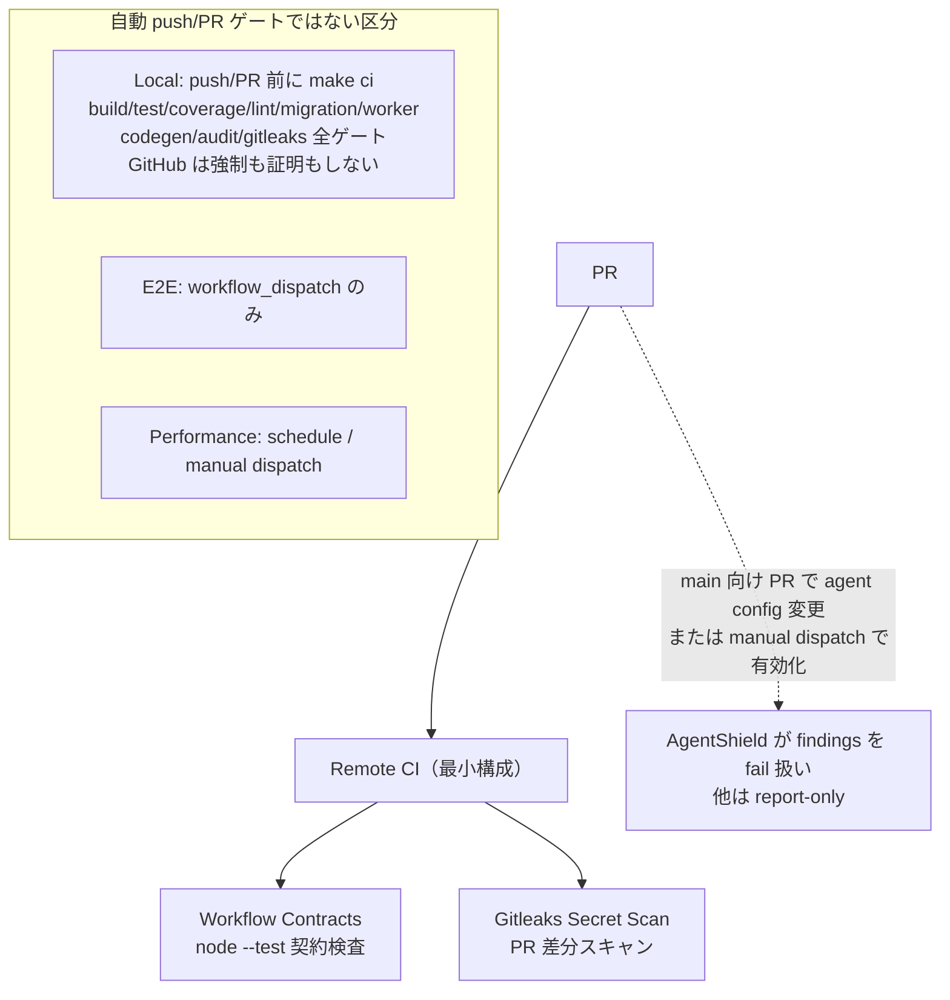

# CI ポリシー — ゲート分担と Actions ピン記法

> `.github/workflows/*.yml` と `scripts/run-local-ci.sh` が実装の正本。この文書は契約を要約し、手作業の action/step inventory は持たない。

## リモートとローカルの分担

| 区分 | 契約 | 実装の正本 |
|---|---|---|
| Remote | **最小構成**: workflow contract 静的検査と gitleaks secret scan のみ。build / test / coverage / migration / worker / codegen / audit はすべてローカル側へ集約した | `.github/workflows/ci.yml` |
| AgentShield | main 向け PR で agent config が変わった場合、または manual dispatch で `force_fail_on_findings` を有効にした場合だけ findings を fail 扱い。他の branch/trigger は report-only | `.github/workflows/security-scan.yml` |
| Local process policy | push/PR 前に `make ci` を実行する。build/test/coverage ratchet/lint/migration verify/worker/codegen/audit/gitleaks 全ゲートを含む。GitHub はこのローカル実行を強制も証明もしない | `scripts/run-local-ci.sh` |
| E2E | `workflow_dispatch` のみ。自動 push/PR gate ではない | `.github/workflows/e2e.yml` |
| Performance | schedule と manual dispatch。push trigger はない | `.github/workflows/performance-tests.yml` |

`make ci` の正確な gate 一覧と順序は `scripts/run-local-ci.sh` の `begin_step` 呼び出しを参照する。現在は inventory/guardrail、STG UAT handoff wrapper、A4 rehearsal isolation、design-system audit、lint/type/codegen、backend/frontend build/test などを含む。件数や列挙をこの文書へ複製しない。



## Remote CI の要点

- **最小構成**（2026-10 縮小）: remote は `Workflow Contracts` と `Gitleaks Secret Scan` の2 job のみ。build/test/coverage/lint/migration/worker/codegen/audit の実行ゲートはすべて `make ci` 側にある。
- workflow contracts は workflow 定義自身の整合検査であり自己参照のため remote に残す（`make ci` でも同一テストを実行する二重配線）。
- gitleaks は PR 差分スキャンとして remote にも残す。`make ci` 側は履歴全体を対象にする上位互換。
- scoped verification（`scripts/ci_scope_plan.py`）は remote ではなく `PREPUSH_VERIFY=1` / `verify-agent-task.py` 経由のローカル利用に限定される。
- `main`、`staging`、`production` 向け PR でこの2 check が走る。required check は staging の branch protection が定義する。

## Actions ピン方針

| 対象 | 記法 |
|---|---|
| GitHub 公式 `actions/*` | major tag **または exact semver** |
| ベンダー公式 action | major tag または exact semver |
| その他の third-party action | commit SHA pin と version comment |
| remote script/artifact | pipe-to-shell 禁止。version と SHA-256 を固定 |

実際の action version は workflow の `uses:` が正本。`scripts/check-actions-version-drift.sh` が同一 action の混在を検出する。古い version inventory は保持しない。

## ブランチ保護

| ブランチ | 保護 | 意図 |
|---|---|---|
| `main` | なし | 直接 push OK・リモート CI は走らない。日々の作業ブランチ |
| `staging` | PR 必須（承認数 0）+ required checks | 直接 push 拒否。main→staging release PR が唯一の CI 検証点・デプロイ入口 |
| `production` | **未作成 — 作成時に staging と同一の保護を適用すること** | 直 push を許すと CI なしで本番デプロイが走る |

staging の required checks: `Workflow Contracts` / `Gitleaks Secret Scan` / `AgentShield`（`enforce_admins` 有効・force push/削除禁止・strict=false）。remote CI 最小化（2026-10）で `Backend` / `Frontend` / `Worker Tests` / `Codegen Sync` / `Migration Verify` の各 check は廃止し、同等ゲートは `make ci` 側にある。release PR の品質担保は「PR 前に main 側で `make ci` を通したこと」への運用依存となる。

`production` 作成時の適用例:

```bash
gh api -X PUT repos/MinoruSoga/AnimalEkarte/branches/production/protection --input - <<'JSON'
{
  "required_status_checks": {
    "strict": false,
    "contexts": ["Workflow Contracts", "Gitleaks Secret Scan", "AgentShield"]
  },
  "enforce_admins": true,
  "required_pull_request_reviews": { "required_approving_review_count": 0 },
  "restrictions": null,
  "required_linear_history": false,
  "allow_force_pushes": false,
  "allow_deletions": false,
  "block_creations": false,
  "required_conversation_resolution": false,
  "lock_branch": false,
  "allow_fork_syncing": false
}
JSON
```

## 静的チェックの enforcement 状態

- `scripts/check-workflow-remote-exec-policy.sh`
- `scripts/check-agent-security-policy.sh`

上記は HEAD では `make ci` や workflow から呼ばれない **manual checks** である。実行せずに「reject/fail される」とは表現しない。enforced gate にする場合はスクリプトと regression test を `scripts/run-local-ci.sh` または workflow へ接続する。

## Historical decision record

2026-07 に remote CI を軽量化し、再現可能な inventory/guardrail を local process policy へ移した。2026-10 には remote を `Workflow Contracts` + `Gitleaks Secret Scan` の最小構成へさらに縮小し、build/test/coverage/migration/worker/codegen/audit も `make ci` へ集約した。これらは当時の設計判断であり、現在の step/action inventory ではない。現在値は必ず workflow と `begin_step` から確認する。
