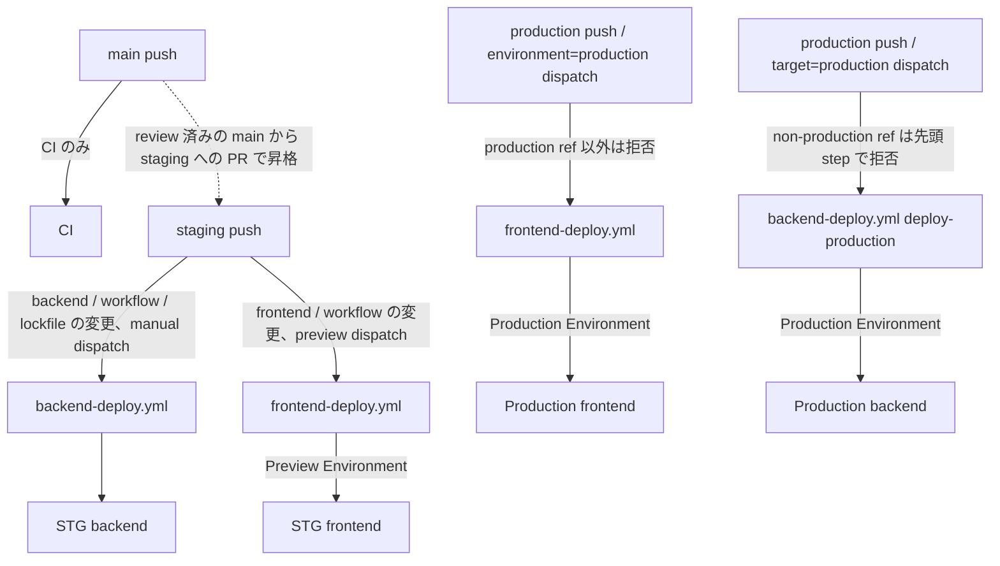

# CI/CD パイプライン構成書

> **目的**: checked-in workflow の実行契約と、実環境で必要な承認・検証を区別する。
> **照合**: 2026-09-06、`7c6592f9f`。EMR-148 で backend production job を追加（外部状態は未確認）。GitHub [#253](https://github.com/MinoruSoga/AnimalEkarte/issues/253) は OPEN。Issue 本文・2026-08-20 コメントは当時の判断であり、現在の workflow 実装や billing/reviewers の実測を代替しない。

## 1. 現行のデプロイ経路

| 経路 | トリガー・設定 | 承認境界 |
|---|---|---|
| STG backend | `staging` push の `backend/**`、backend workflow、root package/lockfile 変更。または manual dispatch | staging job（`deploy`）の deploy 経路は EMR-148 でも不変（GitHub Environment binding なし。job-level `if:` で `target=production` dispatch では起動しない）。共有環境への dispatch / branch 更新は承認済み operator が行う |
| STG frontend | `staging` push の `frontend/**` または frontend workflow 変更。または preview dispatch | job は `Preview` Environment に bind。外部 protection の現在値は別途確認 |
| Production backend | `production` push（同じ path filter）または `target=production` dispatch で `deploy-production` job が起動。先頭 step が `refs/heads/production` 以外を拒否。`PROD_*` Environment secret、`npx wrangler deploy -c wrangler.production.jsonc`、`api.noah-karte.com` | job は **`Production`** Environment に bind。Environment reviewers / secrets / provider は人間前提。設定・検証が済むまで実行不可 |
| Production frontend | `production` push の対象 path 変更。または `environment=production` dispatch | job は **`Production`** Environment に bind。production dispatch は `refs/heads/production` 以外を拒否。Required reviewers と branch protection の現在値は外部確認が必要 |
| main push | CI。STG deploy workflow の直接 trigger ではない | review 済み `main -> staging` PR で昇格する |

正本は `.github/workflows/backend-deploy.yml` と `frontend-deploy.yml`。
[#253](https://github.com/MinoruSoga/AnimalEkarte/issues/253) 本文の「main push → STG」は delivery 方針であり、現行の直接 trigger は `staging`。日常開発 `main` と昇格 `main -> staging` のプロジェクト規約を使う。

2026-08-20 の「frontend に Environment gate 無し」は後続実装で解消している。一方、binding の存在だけでは Required reviewers が有効とは証明できない。**大文字小文字を含む名前一致・reviewers・対象 ref・secret scope を実行時に再確認する。**

本番構築は [setup.md](../infra/production/setup.md)、稼働後の契約は [production runbook](../infra/production/runbook.md)。backend/frontend 両方の acceptance が満たされるまで本番リリース成功としない。

**経路の全体像**:



## 2. Backend pipeline

1. Checkout、pnpm/Node setup、frozen lockfile install。
2. `CLOUDFLARE_API_TOKEN` の存在確認と `wrangler whoami`。
3. `backend/` から `npx wrangler deploy`。
4. `infra/scripts/cf-run-migrate.sh` で `POST /_internal/migrate`（`MIGRATE_RUN_SECRET`）。
5. `/health` が HTTP 200 / `status: ok` になるまで最大12回、30秒間隔で確認。
6. `STG_DEMO_EMAIL` / `STG_DEMO_PASSWORD` がある場合だけ `cf-crud-smoke.sh`。**continue-on-error の optional step** なので workflow green だけでは CRUD PASS を証明しない。

順序は **deploy → migrate → health → optional smoke**。新 binary が旧 schema に到達し得る deploy 完了〜migration 完了（`MIGRATE_TIMEOUT=150s`）の区間は workflow コメントに記録された既知の制約。schema compatibility を release 前に確認する。

CSV seed は全環境で `002_master` のみ。STG は `APP_ENV=staging` を Worker/Container/migrate に渡し、フェーズ3で合成ログインを upsert する。詳細は [seed operations](SEED_MIGRATION_OPERATIONS.md)。health は process liveness であり DB access の証明ではない。

本番経路は `deploy-production` job（EMR-148 で追加）。`Production` Environment に bind し、`PROD_CLOUDFLARE_API_TOKEN` / `PROD_MIGRATE_RUN_SECRET` を deploy 前に検査する。deploy は `npx wrangler deploy -c wrangler.production.jsonc`、対象 URL は `api.noah-karte.com`。本番 DB へ write する自動 CRUD smoke step は持たず、人手 smoke のみ。順序は STG と同じ deploy → migrate → `/health`。

### 手動 dispatch

named owner/approval、review 済み commit、target Worker/config、secret scope、共有環境の利用可否を先に記録する。

```bash
REVIEWED_SHA='<reviewed-commit>'
TARGET_REF='staging'
REMOTE_SHA="$(gh api "repos/{owner}/{repo}/git/ref/heads/${TARGET_REF}" --jq '.object.sha')"
test "$REMOTE_SHA" = "$(git rev-parse "${REVIEWED_SHA}^{commit}")" || exit 1
gh workflow run backend-deploy.yml --ref "$TARGET_REF"
```

dispatch 後も run の `headSha == REVIEWED_SHA` を確認する。不一致、migration/health failure、target 不一致は停止条件。`-f target=production` なしの dispatch は STG を deploy する。production には `--ref production -f target=production` が必要。

## 3. Frontend pipeline（EMR-255: Cloudflare Workers Static Assets へ移行）

1. GitHub Environment `Preview` / `Production` を選び、production ref を検証。
2. `APP_ENV=stg|production` を付けて `pnpm --dir frontend build`（Vite multi-page build → `dist/`）。
3. `npx wrangler deploy -c frontend/wrangler{,.production}.jsonc` で frontend Worker + Static Assets を配信。
4. smoke check で CSP ヘッダと `server: cloudflare`（Vercel 残留との誤検知防止）、SPA fallback、`/line-reserve/` を確認。

`/api/*` は `frontend/worker/index.ts` が `API` service binding 経由で backend Worker へ同一オリジン中継する。`VITE_API_URL` の注入は廃止 — `src/lib/axios.ts` が `"/api"` fallback し、PROD ビルドが STG API を叩く事故を構造的に防ぐ。`APP_ENV=stg` は旧 `VERCEL_ENV=preview` 相当で demo ログイン表示の tree-shake 契約を維持する。

`frontend/vercel.json` は移行期のロールバック経路として残置（rewrite/header 規則は `frontend/worker/index.ts` と `frontend/public/_headers` が引き継ぎ済み）。実デプロイの SHA、API 接続先、cookie/CORS、assets の検証は [Vercel 時代の runbook](VERCEL-FRONTEND-STAGING-TEST.md) を CF 経路へ読み替えて実施する。設定を読んだだけで稼働済みにしない。

## 4. Rollback / monitoring / backup

- rollback は last-known-good Cloudflare artifact/ref と migration 互換性を確認して行う。[#99](https://github.com/MinoruSoga/AnimalEkarte/issues/99) は旧 ECS 経路不在の確認として CLOSED。AWS/ECS は切り戻し先ではない。
- DB 非互換の場合は forward fix または承認済み restore plan。復旧手順は [STG](../infra/staging/runbook.md) / [PROD](../infra/production/runbook.md)。
- health、5xx、Workers/Container logs、Actions failure を監視する。Vercel deployment は rollback 残存期間のみ対象（EMR-255 以降 frontend 通常経路では不使用）。Cloudflare Notification Policy の存在、通知先、実配送は外部検証が必要。Terraform tombstone を有効な通知ポリシーとして数えない。
- backup は owner、target、取得方式、保護された保存先、取得時刻、サイズ、checksum、retention、receipt、隔離 restore rehearsal を記録する。[production runbook §4](../infra/production/runbook.md#4-backuprestore-rehearsal) が正本。RPO/RTO は承認済み目標と rehearsal 実測を用い、推測しない。
- secret/PHI を log、artifact、Issue に出さない。資格情報の投入・rotation は [外部資格情報 runbook](runbooks/BUG_MD_EXTERNAL_OPS_PENDING_APPROVAL.md) の USER 作業。

## 5. #253 の未検証境界

#253 は latest main required CI、STG deploy/health/failure notification、production reviewers、rollback時間、隔離 restore の実証を要求する。2026-07 の billing failure や 2026-08-20 の reviewers 空という記録は履歴であり、現在の failure と断定しない。

実行時に Actions run URL/ID・headSha・required jobs、billing、Environment protection、secret scope、backup/restore を確認する。未確認は **UNKNOWN / HOLD**。本書の静的同期は課金復旧、release acceptance、Issue close を意味しない。
