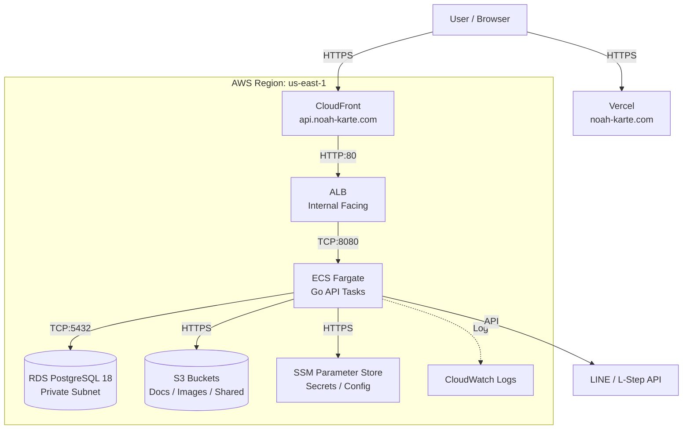

# インフラ・システム構成書 (Infrastructure Architecture)

> **目的**: AWS/Vercelインフラ構成図・ネットワーク設計を定義する（backend設計は`docs/architecture/overview.md`を参照）。
> **読者**: インフラ担当・新規参加者。
> **タイミング**: AWS/Vercel構成を把握したい時。

> **Animal Ekarte**: AWS / Vercel を活用した高可用・低コストなクラウド基盤
> **最新更新**: 2026-07-10 | **対象環境**: Staging / Production

---

> ⚠️ **移行中の注記（2026-07-10 時点）**: STG バックエンドの CI/CD デプロイ先は Cloudflare Workers + Containers
> （`.github/workflows/backend-deploy.yml`、`staging` ブランチ push トリガー）に置き換わっている（Phase 5、2026-07-06）。
> DB は RDS ではなく PlanetScale Postgres へ直結。ただし DNS 切替（NS切替・Phase 7）は未実施のため、
> `api.stg.noah-karte.com` の実トラフィックは本章が記述する AWS 構成（ECS/ALB/RDS）を引き続き経由している。
> AWS ECS への手動デプロイは `backend-deploy-ecs.yml`（`workflow_dispatch` 限定）に残置され、Phase 7〜8（AWS 廃止）
> 完了までのロールバック/並行経路として運用中。移行の最新状況はリポジトリ直下 `migration-cloudflare.md` を参照。
> 以下は現時点で実トラフィックを担う AWS 側構成の記述。

## 1. 全体構成図

本システムは、フロントエンドに **Vercel**、バックエンドに **AWS (us-east-1)** を採用したハイブリッド構成です。

---

## 2. コンポーネント詳細

### 2.1 実行環境 (Computing)
- **Backend (Go)**: AWS ECS Fargate を採用。オートスケーリングとサーバーレス運用により、保守コストを最小化。
- **Frontend (React)**: Vercel によるエッジデプロイ。React 19 の最新機能をフル活用した高速なクライアント体験。

### 2.2 データストレージ (Storage)
- **RDS PostgreSQL 18**: 
    - 強力な ACID トランザクションによる臨床データの完全性保護。
    - `clinic_id` による物理隔離インデックスを業務テーブル（全 108 テーブル中、`clinic_id` を持つもの）に適用。
- **Amazon S3**:
    - **一般アップロード (`S3_BUCKET`)**: ペット写真、検査結果（PDF）等の格納。
    - **共有ファイル (`S3_SHARED_BUCKET`)**: LINE 経由で送信される資料の一次保管。
    - セキュリティ: 全ての参照は有効期限付きの署名付き URL（Presigned URL）経由。

---

## 3. ネットワークとセキュリティ

- **エンドポイント保護**: CloudFront WAF（将来計画）および ALB による負荷分散と TLS 1.3 終端。
- **機密情報の秘匿**: データベースパスワード、JWT 秘密鍵、外部 API キーは全て SSM Parameter Store (`SecureString`) で管理。
- **バックエンド分離**: データベースおよび ECS タスクを Private Subnet に配置し、パブリックインターネットからの直接アクセスを物理的に遮断。

---

## 4. 環境変数・シークレット要件

| 変数名 | 必須 | 用途 |
|:---|:---:|:---|
| `DB_HOST` / `DB_PORT` / `DB_USER` / `DB_PASSWORD` / `DB_NAME` / `DB_SSL_MODE` | ✅ | RDS インスタンス接続（PostgreSQL 18）。接続文字列ではなく個別変数で構成（`DATABASE_URL` という単一変数は実装に存在しない）。 |
| `JWT_SECRET` | ✅ | セッション署名用秘密鍵（32文字以上のユニーク文字列）。 |
| `INTEGRATION_ENCRYPTION_KEY` | ✅ | 病院別 API キー保護用の AES-256 暗号化キー。 |
| `STORAGE_TYPE` | ✅ | `s3` (Production/STG) または `local` (Dev)。 |
| `S3_BUCKET` / `S3_REGION` | ✅ | 一般ファイルの格納先とリージョン。 |
| `S3_SHARED_BUCKET` | ✅ | LINE 連携用共有ファイルの格納先。 |
| `FRONTEND_URL` | ✅ | メールリンク等で使用する正規ドメイン。 |
| `CORS_ALLOWED_ORIGIN` | ✅ | API へのクロスオリジンアクセス許可リスト。 |

---
