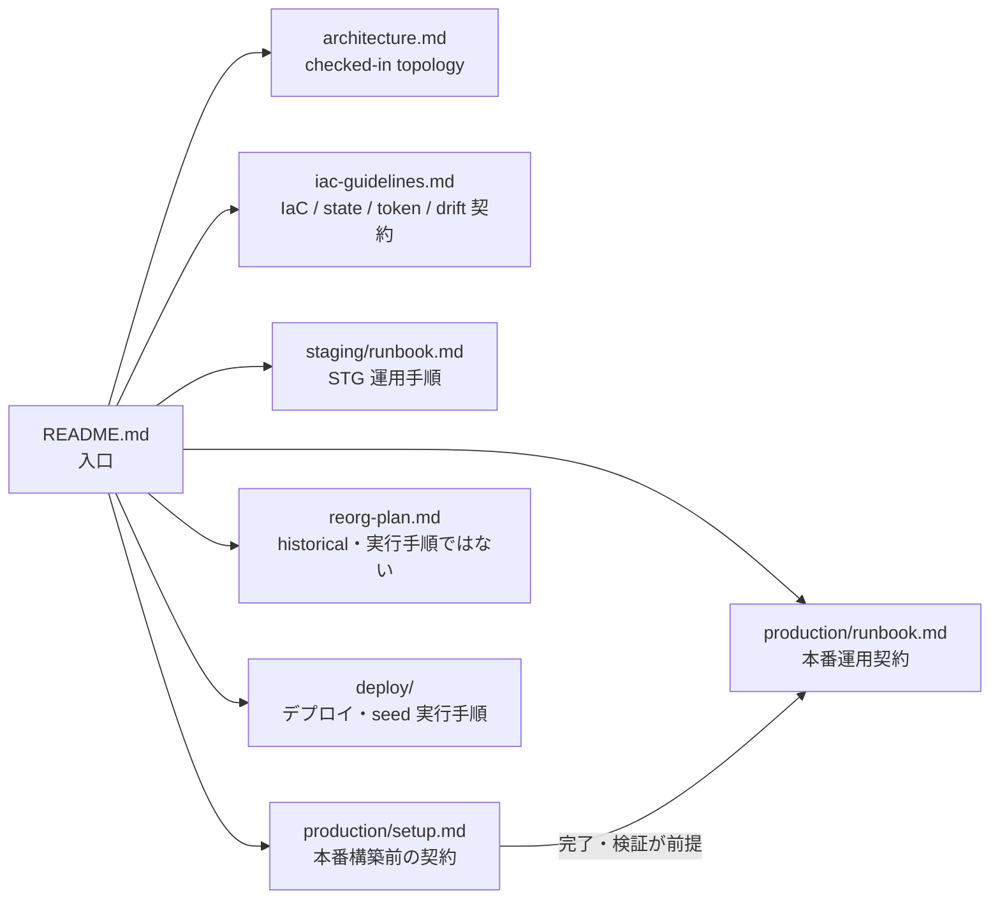

# インフラドキュメント（SSOT）

> 現行の **checked-in configuration** と運用契約の入口。外部 runtime/account 状態は、実作業前に人が確認する。

| ドキュメント | 内容 |
|---|---|
| [architecture.md](architecture.md) | checked-in topology と、外部検証が必要な境界 |
| [iac-guidelines.md](iac-guidelines.md) | Terraform/Wrangler、state、token、drift の契約 |
| [staging/runbook.md](staging/runbook.md) | STG 運用手順 |
| [production/setup.md](production/setup.md) | 本番構築前の契約。すべての runtime 項目は構築時に人手検証が必要 |
| [production/runbook.md](production/runbook.md) | 本番運用契約。setup 完了・検証前は実行不可 |
| [reorg-plan.md](reorg-plan.md) | **historical / unfinished plan。実行手順ではない** |

Terraform は現在 `infra/cloudflare/` の flat STG と `production/` に分かれる。Wrangler は `backend/wrangler.jsonc` と `backend/wrangler.production.jsonc`。未実装の module/env layout を現行構成と呼ばない。

デプロイと seed の実行手順は [deploy/](../deploy/README.md) を参照する。AWS 廃止資料の git-history pointer は [architecture.md](architecture.md) に集約する。
