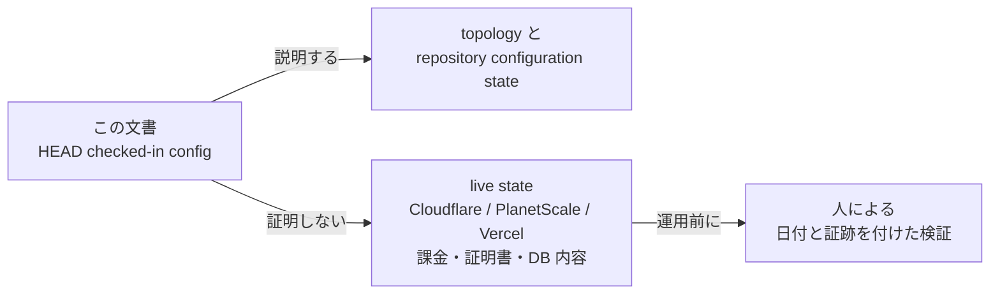

# インフラ構成 — checked-in Cloudflare configuration

> この文書は HEAD の設定を説明する。Cloudflare、PlanetScale、Vercel、課金、証明書、DB 内容などの live state は証明しない。運用前に人が日付と証跡を付けて検証する。



## Topology

```text
STG user
  -> Cloudflare Worker animalekarte-stg-frontend (Static Assets = Vite dist)
  -> /api/* -> service binding -> animalekarte-stg-api Worker
  -> Durable Object -> Container (Go/Gin)
  -> direct PlanetScale Postgres connection (`sslmode=verify-full`, `DB_SSL_ROOT_CERT=system`)
  -> R2 for clinical images

PROD
  -> planned: animalekarte-prod-frontend (apex + www) / api.noah-karte.com topology
  -> production Wrangler/Terraform files remain drafts until external verification
```

EMR-255 で frontend 配信を Vercel から Cloudflare Workers Static Assets へ移行。
`frontend/vercel.json` の rewrite/header 規則は `frontend/worker/index.ts` と
`frontend/public/_headers` が引き継ぐ。`/api/*` は同一オリジンの service binding
経路になり、`api.stg.noah-karte.com` への外部 rewrite は不要になった
(同ホスト名の backend Worker route は引き続き稼働)。`frontend/vercel.json` は
移行期のロールバック経路として残置し、CF 側の安定稼働確認後に削除する。

Hyperdrive は Containers から利用できず、credential を Terraform state に載せるため再導入しない。

## Repository configuration state

| | STG config | PROD config |
|---|---|---|
| Worker | `animalekarte-stg-api` | `animalekarte-prod-api` |
| Frontend Worker | `animalekarte-stg-frontend` | `animalekarte-prod-frontend` planned |
| Frontend route | `stg.noah-karte.com/*` | `noah-karte.com/*` + `www.noah-karte.com/*` planned |
| API route | `api.stg.noah-karte.com/*` | `api.noah-karte.com/*` planned |
| R2 | `animalekarte-stg-images` | `animalekarte-prod-images` planned |
| Container | `basic`, max 3, `sleepAfter = "1h"` | production draft |
| DB pool | direct connection, max open 10 / idle 5 (`DB_MAX_OPEN_CONNS` / `DB_MAX_IDLE_CONNS` vars) | max open 10 / idle 5 in production draft |

（2026-09-29 訂正: Container `sleepAfter` は `"10m"` と記載していたが、現行は `backend/worker/index.ts` の `AnimalEkarteApiContainer.sleepAfter = "1h"`（EMR-213 系・2026-09-22 変更）。`wrangler.jsonc` の keep-alive cron コメントも `sleepAfter=1h` 前提。STG の `vars` にも `DB_MAX_OPEN_CONNS=10` / `DB_MAX_IDLE_CONNS=5` が設定済みのため、pool 行を STG/PROD 両方に展開した）

“STG 稼働中”“PROD 未構築”、DB の存在や内容は runtime observation であり、repo config から断定しない。現行 migrate の seed bundle は全環境で `002_master` のみ。既存 STG データは別途確認する。

## CLI ツール分担（2026-09-30）

Cloudflare の新 CLI `cf`（v1.0.0-beta）を導入済み。分担は次のとおり。

| 用途 | ツール |
|---|---|
| deploy / migrate / `secret bulk` | `wrangler`（正本。`package.json` の `cf:*` scripts と `backend-deploy.yml` が使用） |
| Cloudflare リソースの調査・ops（3000+ API ops、JSON 出力、`cf cli search`） | `cf`（グローバルインストール・`cf auth login` で OAuth 済み） |

`cf migrate --dry-run` の結果、この backend の **Containers と Durable Objects は cf beta 未対応**（containers は未移行・手動レビュー必須、DO migrations は `exports.durableObject()` への手書換えが必要）。deploy 経路を cf へ移すのは cf が containers/DO をサポートしてから再評価する。Wrangler は cf beta 終了後も18ヶ月保守される。

## Historical observations, not current guarantees

2026-07 の certificate、connection-slot、schema-owner の記述は当時の observation だった。価格、certificate coverage、schema ownership、恒久解は現在の公式 provider documentation と runtime evidence を人が再確認するまで運用判断に使わない。

## History

リポジトリ上の決定では AWS ECS/RDS は 2026-07-20 に廃止され、rollback target として使わない。AWS-era docs は 2026-08-20 に削除された。調査時のみ `git show e0260d32f^:docs/ops/infra/_archive/aws-legacy/` を参照し、手順として実行しない。これは repository history であり live AWS account state の検証ではない。
