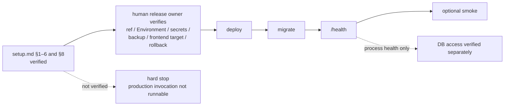

# PROD operations runbook — Cloudflare

> Timeless post-build contract. `backend-deploy.yml` job `deploy-production` is checked in, but **NOT RUNNABLE until [setup.md](setup.md) §1, §6 item 1, and §8 human/provider items are completed and verified.** External resource, billing, Environment, backup, notification, DNS, and database state is verification-required.

Task details and live status belong in Plane. Root [todo.md](../../../../todo.md) is the consolidated entry point, including the `#253` USER gate and [human lane](../../../../todo.md#human-lane); it is not the source of truth for live status.

（2026-09-29 訂正: 実行状態の正本は Linear から Plane へ移行済み（Linear は 2026-09-16 閉鎖・履歴参照のみ）。本書の "Linear" 記述はすべて Plane と読み替える）

## 1. Release gate and order

A human release owner verifies the reviewed ref, exact GitHub Environment name/protection, production secret scope, backup evidence, frontend API target, and rollback candidate. Then the activated workflow contract must run:

**deploy → migrate → `/health` → optional smoke**

Every production invocation is a hard stop until setup acceptance criteria are present in the workflow and verified. `/health` returns process health and does not prove DB access. CRUD smoke uses a deliberately provisioned synthetic account with named owner, expiry, and cleanup; production demo seed credentials are not expected because migrate is master-only.



## 2. Incident triage

1. Declare an owner and timestamp. Record no secret or PHI.
2. Compare configured domain and provider-direct health path.
3. Inspect the bounded Actions/log evidence and provider status.
4. Determine whether the failure is Worker/Container, route/DNS, DB, or frontend target.
5. Stop writes when data integrity is uncertain.
6. Choose forward fix or the reviewed rollback below. AWS is not a rollback target.

## 3. Rollback with `GOOD_SHA`

Branch mutation, approval, and deployment are human-only. A commit merely existing is insufficient. The production job accepts only `refs/heads/production`: that ref must resolve to the reviewed commit, and the resulting workflow run must report the same `headSha`.

```bash
GOOD_SHA='<reviewed-last-known-good-commit>'
git rev-parse --verify "${GOOD_SHA}^{commit}"

# Human-only, under branch protection: perform a reviewed update of the
# `production` branch so it resolves exactly to GOOD_SHA, then verify:
test "$(git ls-remote origin refs/heads/production | awk '{print $1}')" = "$(git rev-parse "${GOOD_SHA}^{commit}")" || exit 1
```

That push triggers `deploy-production` when backend paths changed; otherwise dispatch through the approved operator flow:

```bash
gh workflow run backend-deploy.yml --ref production -f target=production
```

After dispatch, obtain the run metadata through the approved operator flow. **Stop unless the workflow run `headSha` equals `GOOD_SHA`.** Also stop if Environment approval is absent, config is not `wrangler.production.jsonc`, migration compatibility is not reviewed, or the production Worker/route differs. Dispatching `--ref production` deploys whatever `production` currently points to and never pins an older SHA by itself; dispatching from any other ref with `target=production` fails at the reject step; omitting `-f target=production` deploys STG, not production.

Schema rollback is not automatic. If `GOOD_SHA` is incompatible with applied migrations, use a forward-compatible fix or a separately approved restore plan.

## 4. Backup/restore rehearsal

Backup existence and restore success are external facts. Record dated evidence. **Acquisition is HOLD until a human-approved method is recorded.** The acquisition record must name the owner, method (managed backup or reviewed `pg_dump` procedure), exact target identity, protected repo-external destination, acquisition timestamp, size, SHA-256 checksum, retention/expiry, receipt ID, and restore-rehearsal link. Never invent commands, destinations, or credentials from this document. Missing any field means No-Go.

Restore only to a disposable isolated target. Before any destructive restore option, enforce an explicit identity assertion:

```bash
: "${ISOLATED_DB_HOST:?}"
: "${ISOLATED_DB_NAME:?}"
test "$ISOLATED_DB_NAME" = "$EXPECTED_DISPOSABLE_DB_NAME" || exit 1
test "$ISOLATED_DB_HOST" = "$EXPECTED_DISPOSABLE_DB_HOST" || exit 1
# Operator also verifies provider project/id is the approved disposable target.
pg_restore --clean --if-exists -h "$ISOLATED_DB_HOST" -U "$ISOLATED_DB_USER" -d "$ISOLATED_DB_NAME" '<snapshot>'
```

The allowlisted host/database and disposable provider ID must come from the approved rehearsal record, not visual similarity. Stop on mismatch or nonzero exit. Verify schema, representative non-sensitive data, application compatibility, timing, and cleanup. No production restore proceeds solely from this example.

## 5. Secrets, seed, and monitoring boundaries

- Use `npx wrangler secret put <NAME> -c wrangler.production.jsonc` from `backend/`.
- The required secret-name inventory is [setup.md](setup.md). Values never enter docs/logs.
- Worker/Container/migrate pass through `APP_ENV`. Production draft omits it; empty and production values disable login seeding and the demo-password shortcut. CSV seed bundles remain master-only in every environment.
- Notification policies, backup schedules, DNS, certificate, DB, and Environment reviewers are required contracts, not achieved facts. Verify each externally with a date and evidence owner.
- Record Actions run URL/id, `headSha`, approver, health result, and rollback decision without secret/PHI.

## 6. Go-live checklist

- [ ] setup acceptance criteria implemented and verified
- [ ] exact production Environment protection verified
- [ ] required secret **names** reconciled with Wrangler config; values verified through protected channel
- [ ] backup and isolated restore rehearsal evidence reviewed
- [ ] workflow `headSha`, Worker/config/route, migrate, and health verified
- [ ] frontend deployed API target verified
- [ ] optional synthetic smoke account owner/expiry/cleanup recorded
- [ ] live issue/date/billing status verified in Plane/provider systems by a human

Unchecked items mean stop. This document does not assert current external state.
