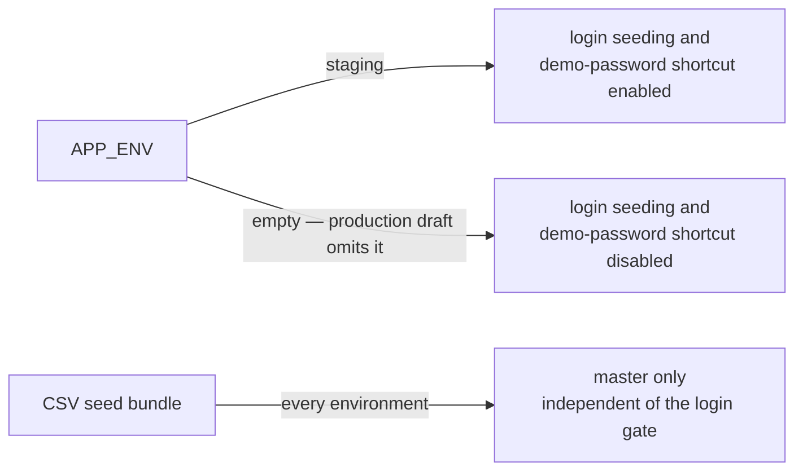

# Production Cloudflare setup contract

> Human-operated checklist for the planned Cloudflare Workers + Containers / PlanetScale production environment. **Do not execute from this document until the currently approved go-live date and Plane delivery item are confirmed.** No external runtime/account/billing state was verified during this update.
>
> （2026-09-29 訂正: 実行状態の正本は Linear から Plane（workspace `baritechllc` / Project `EMR`）へ移行済み。Linear は 2026-09-16 に閉鎖され履歴参照のみ。本書の "Linear" 記述はすべて Plane と読み替える）

Checked-in `backend/wrangler.production.jsonc` and `infra/cloudflare/production/` are drafts. Their presence does not prove that GitHub Environment protection, billing, PlanetScale, Cloudflare, DNS, R2, or Vercel production configuration exists.

## 1. Fail-closed preconditions

A human owner must record dated evidence for all items before deployment:

- target account/zone/project and billing are approved;
- production database, role, backup/restore owner, R2, DNS, and certificate are verified;
- a GitHub Environment with required reviewers exists and its exact case-sensitive name matches the workflows (`frontend-deploy.yml` and `backend-deploy.yml` job `deploy-production` both bind `Production`);
- production secrets are environment-scoped and staging values are not reused unless explicitly approved;
- frontend production settings are verified. `frontend-deploy.yml` binds `Production` and rejects production dispatch from non-production refs. `VERCEL_ENV=production` makes `frontend/vite.config.ts` select the production API; `.env.production` remains STG-valued outside that override. Verify the deployed target and the external Environment reviewers;
- workflow/config tests and `actionlint` are green on the reviewed change;
- current Plane delivery state and go-live date are confirmed externally.

Stop if any item is unknown. Do not infer runtime state from this draft.

## 2. Required production secret **names**

The inventory source is `backend/wrangler.production.jsonc` `secrets.required`. Never put values in docs, shell history, logs, Terraform state, or tickets.

| Category | Required names |
|---|---|
| Database | `DB_HOST`, `DB_USER`, `DB_PASSWORD` |
| R2/S3 binding | `AWS_ACCESS_KEY_ID`, `AWS_SECRET_ACCESS_KEY` |
| Migration | `MIGRATE_RUN_SECRET` |
| Scheduler | `SCHEDULER_OPS_SECRET`, `SCHEDULER_INTERNAL_TOKEN`, `SCHEDULER_ACCESS_TEAM_DOMAIN`, `SCHEDULER_ACCESS_AUDIENCE`, `SCHEDULER_ALERT_ALLOWED_HOST`, `SCHEDULER_ALERT_WEBHOOK_URL`, `SCHEDULER_ALERT_WEBHOOK_SECRET` |
| Application | `JWT_SECRET`, `INTEGRATION_ENCRYPTION_KEY` |
| SMTP | `SMTP_HOST`, `SMTP_USER`, `SMTP_PASS` |

Secret names must be checked against the config again at execution time. For each name, use the protected operator channel from `backend/`:

```bash
npx wrangler secret put <NAME> -c wrangler.production.jsonc
```

Do not use `pnpm exec wrangler`; the effective working directory previously caused a wrong-Worker deployment. For scheduler rollout, create and validate `SCHEDULER_INTERNAL_TOKEN` and its access/alert dependencies **before** the first deploy. Deploy last. Missing scheduler secrets must fail closed.

## 3. R2 credentials

The old generic-token API and “SHA-256 of `result.value`” recipe is removed. Before credential creation, verify the current official Cloudflare R2 S3 credential documentation and use its supported UI/API flow. Confirm the repository is allowed to expose any account identifier; otherwise use `<CLOUDFLARE_ACCOUNT_ID>` from the protected operator store. Do not run copied `curl` commands blindly.

## 4. Seed contract

In the current checkout, only `backend/migrations/seeds/002_master` exists. `seedbundle.BundleOrderForEnv` returns master-only for every environment. `003_demo`, `004_staging`, “seed +3”, and environment-specific demo cleanup are historical behavior and must not be used.

`APP_ENV` is passed through the Worker to the Container and migrate runner. STG config sets `staging`; the production draft currently omits it, so login seeding and the shared demo-password shortcut remain disabled by the empty-value gate. Production configuration must not set a development/test/staging value. CSV master-only selection is independent of this login gate. Production synthetic users require separate approved provisioning with owner, expiry, and cleanup.



## 5. IaC and resource verification

Terraform plan must be reviewed by a human before apply. It currently covers only the checked-in resources; Hyperdrive/notification tombstones are not active resources. Apply/destroy, database creation, credential changes, shared environment writes, billing, and DNS changes are human-only external operations.

## 6. Deployment workflow acceptance criteria

Do not copy an embedded patch from docs. Modify and review the workflow against current HEAD. Production activation is acceptable only when:

1. production trigger is enabled **after** Environment protection exists;
2. production job binds the exact protected GitHub Environment;
3. staging uses `npx wrangler deploy`;
4. production uses `npx wrangler deploy -c wrangler.production.jsonc`;
5. environment-specific Worker URL and secret scope are selected explicitly;
6. workflow tests and `actionlint` pass;
7. execution order is **deploy → migrate → `/health` → optional smoke**.

At EMR-148, `backend-deploy.yml` contains a `deploy-production` job: it triggers on push to `production` with the same path filter, or on `workflow_dispatch` with `target=production`; it binds the `Production` Environment; its first step rejects refs other than `refs/heads/production`; it checks `PROD_CLOUDFLARE_API_TOKEN`/`PROD_MIGRATE_RUN_SECRET` before deploy; it deploys with `npx wrangler deploy -c wrangler.production.jsonc`; it targets `WORKER_URL=https://api.noah-karte.com`; and it runs deploy → migrate → `/health`. Production smoke is intentionally manual (§7).

Mapping to the criteria above: items 2, 3, 4, 5, and 7 are implemented in the YAML. Item 1 is a human precondition — the trigger is checked in but must not be exercised (no push to `production`, no production dispatch) until `Production` has required reviewers and a deployment-branch rule limited to `production`. For item 6, the workflow contract test (`scripts/check-workflow-contracts.test.mjs`) covers the new job; `actionlint` must be green in PR CI (local actionlint run: BLOCKED — `rhysd/actionlint:latest` image not present locally and not pulled). A production invocation remains **not runnable** until this change is merged and all §8 items are verified.

### 6.1 GitHub Actions secrets for `deploy-production`

The job reads two Actions secrets:

- `PROD_CLOUDFLARE_API_TOKEN` — Cloudflare API token for `wrangler whoami` and `wrangler deploy`;
- `PROD_MIGRATE_RUN_SECRET` — bearer for `POST /_internal/migrate` via `infra/scripts/cf-run-migrate.sh`.

Store both only as `Production` Environment secrets, never repository-level. The distinct `PROD_` names prevent fallback to STG repository secrets. `PROD_MIGRATE_RUN_SECRET` must equal the Worker `MIGRATE_RUN_SECRET` set with `wrangler secret put MIGRATE_RUN_SECRET -c wrangler.production.jsonc` (§2). If either is missing, the job fails before deploy — this also fails closed if the Environment were auto-created without configuration.

## 7. Go-live verification

- verify workflow run `headSha`, environment approval, Worker name, route, and config file;
- verify `/health`, then DB-backed behavior separately because `/health` does not query the DB;
- verify frontend production API target from deployed output, not from branch name;
- use only explicitly provisioned synthetic credentials with lifecycle ownership for CRUD smoke;
- record non-secret evidence and rollback owner.

## 8. Remaining provider / human work (not done by the repository)

- [ ] contract/billing approval;
- [ ] Cloudflare account/zone, DNS `api.noah-karte.com`, and certificate;
- [ ] PlanetScale production database and role;
- [ ] R2 bucket, S3 credentials, and `S3_PUBLIC_BASE_URL`;
- [ ] `production` branch creation and branch protection;
- [ ] GitHub Environment `Production`: required reviewers, a deployment-branch rule limited to `production`, and the two §6.1 secrets;
- [ ] Worker secrets from §2 set via `wrangler secret put ... -c wrangler.production.jsonc`;
- [ ] `TRUSTED_PROXY_CIDR` post-deploy measurement and confirmation;
- [ ] backup acquisition and isolated restore rehearsal with measured timings ([runbook §4](runbook.md));
- [ ] PR CI `actionlint` green;
- [ ] go-live date and delivery state confirmed in Plane.

All checkboxes are requirements, not claims of current external state.
