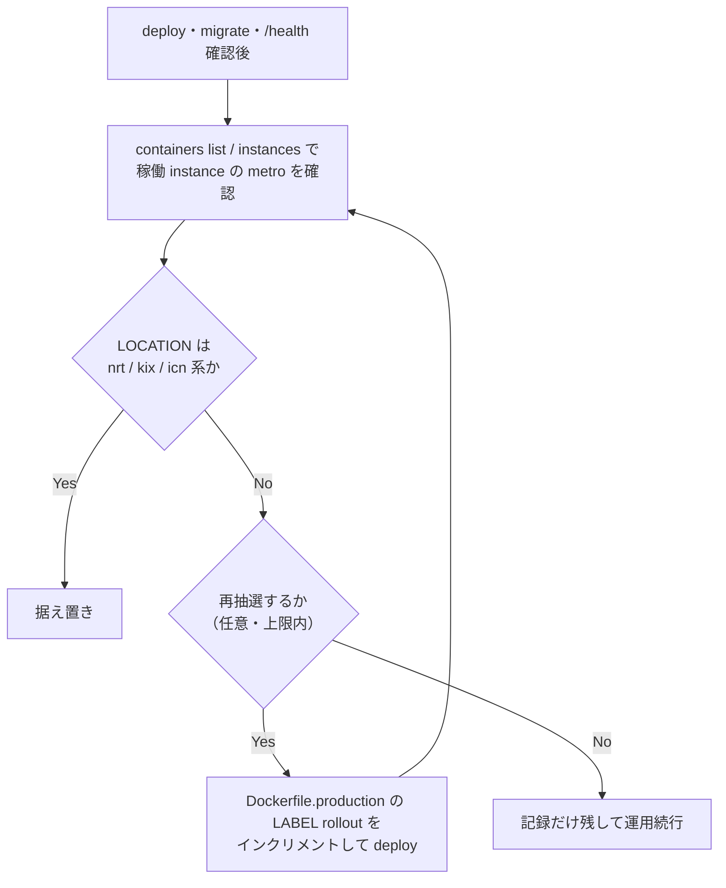

# STG 運用 Runbook（Cloudflare）

> External state is verification-required. この文書は HEAD の workflow/config contract のみを説明する。

## Deploy

- 自動: `staging` pushで`backend/**`、`.github/workflows/backend-deploy.yml`、root `package.json`、root `pnpm-lock.yaml`のいずれかが変わった場合。`infra/cloudflare/**`単独ではtriggerされず、Terraformは別の承認済みplan/apply手順で扱う。
- 順序: **deploy → migrate → `/health` → optional smoke**。optional smoke は `STG_DEMO_*` の CRUD 確認であり、失敗してもジョブは落とさない。
- 手動 dispatch も存在する。実行は人が対象 ref、approval、secret scope を確認して行う。

## DB and seed

- migrate は `POST /_internal/migrate` と `MIGRATE_RUN_SECRET` を使う workflow contract。
- 現行 `BundleOrderForEnv` は全環境で `002_master` のみ。`003_demo` / `004_staging` や full-demo CSV 再投入を前提にしない。画面デモログインは migrate フェーズ3で合成 `一般` アカウントを upsert し、開発/STG は共通デモパスワードで認証する。UAT/clinical data は承認済みの明示 import と lifecycle owner を別途定義する。
- 過去の「public schema 109 objects」「REASSIGN が唯一解」は dated incident observation であり current fact ではない。schema owner と provider-supported remediation を PlanetScale/runtime で再検証してから ALTER migration を行う。
- credential rotation、DB access、shared STG operation は人による明示承認が必要。

## Incident triage

1. workers.dev path と configured domain の `/health` を比較する。
2. deploy直後の rolling update を考慮する。
3. DB connection error は pool/slot metrics を確認する。過去事例を current diagnosis とみなさない。
4. provider status を確認する。
5. AWS rollback target は repository decision 上存在しない。Cloudflare 側の修正または検証済み backup + IaC restore contract を使う。

runtime、DB 内容、credential、provider status は本更新では確認していない。

## Container placement（配置の再抽選）

STG Container の稼働 instance は deploy・instance 入替のたびに再配置され、配置は認証系 API の遅延に直接効く。deploy 後に実配置を確認し、発動条件を満たせば任意で再抽選する。`constraints.regions=["APAC"]` の中での抽選が現行アカウントのケイパビリティ上限であり（下記「確定した仕様」）、`maa01`/`bom`/`sin` への着地も許容する。

```mermaid
flowchart TB
    D["deploy・migrate・/health 確認後"] --> C["containers list / instances で<br/>稼働 instance の metro を確認"]
    C --> J{"LOCATION は<br/>nrt / kix / icn 系か"}
    J -->|"Yes"| KEEP["据え置き"]
    J -->|"No"| LIM{"再抽選するか<br/>（任意・上限内）"}
    LIM -->|"Yes"| BUMP["Dockerfile.production の LABEL rollout を<br/>インクリメントして deploy"]
    BUMP --> C
    LIM -->|"No"| REC["記録だけ残して運用続行"]
```

### 確認と再抽選の手順

1. `cd backend && npx wrangler containers list` で app・version・state を確認する。
2. `npx wrangler containers instances <container-id>` で稼働 instance の配置コード（例 `maa01`）を確認し、`npx wrangler containers info <container-id>` で `scheduling_policy`・`constraints`・instance 状態を照合する。
3. 期待との乖離を記録する。ingress は KIX 系、DB は PlanetScale `ap-northeast-2` のため、`maa01`/`bom09`/`sin14` 系への着地は `container_fetch` を悪化させる。2026-09-23 の観測では `container_fetch` 866–3848ms が client 遅延の支配成分だった（[証拠](../../../../reports/perf-e5-residual-20260923/cf-events/README.md)）。
4. 配置が不利で再抽選すると判断した場合は、`backend/Dockerfile.production` の `LABEL rollout="N"`（:38、再ビルド強制用ダミーラベル）をインクリメントして deploy する。新 image digest → 新 version → instance 入替で再抽選が起き、コード差分は不要。再抽選は任意で、実施しない場合も記録だけ残して運用を続行してよい。

### 運用ルール（発動条件・上限・記録）

- **発動条件**: deploy・migrate・`/health` 確認の後、手順 2 の稼働 instance LOCATION が `nrt`/`kix`/`icn` 系以外（例 `maa`/`bom`/`sin`）なら再抽選を実施してよい（任意運用。必須ではない）。近接 metro 着地なら据え置く。`maa01`/`bom`/`sin` 着地は APAC 制約内の許容範囲であり、それ自体を障害として扱わない。
- **上限**: 再抽選は 1 回の deploy イベントあたり最大 2 回を目安とする。APAC 内抽選である以上追いすぎず、連続して不利なら記録だけ残して運用を続行する。
- **自発再配置の注意**: scheduler が deploy なしに稼働 instance を再作成して配置が変わる事象を観測済み（2026-09-23 `maa01`→`sin14`、v70→v71、観測窓内）。判断は必ず直前に取得した最新の `containers instances` に対して行い、過去の観測値を固定視しない。
- **記録**: 実施時は着地 metro・container version・再抽選回数・観測時刻を作業記録（reports/ または Plane チケット）に残す。
- deploy 後は `containers info` の実値を照合し、config 値を実配備の状態とみなさない。

### 確定した仕様・ケイパビリティ上限（2026-09-23 切り分け・2026-09-28 EMR-202 で確定）

- `constraints.regions: ["APAC"]`（wrangler.jsonc:150-151）は下限であって保証ではない。APAC 内のどの metro に着地するかは scheduler 次第で、KIX ingress・ap-northeast-2 DB の構成で `maa01`/`sin14`/`bom09`/`sin07` へ着地した実績がある（v72 の `maa01`/`bom09` は [2026-09-24 再観測](../../../../reports/perf-lane-all-20260924/placement/README.md)、`sin07` は EMR-213 復旧後の性能台帳 E8）。これらの着地は許容する。
- `constraints.cities`（metro ピン留め）はアカウントに `CITIES_CONSTRAINT` ケイパビリティが無く、deploy が `VALIDATE_INPUT` で失敗する（run 35749806541）。選択肢は regions 粒度まで。
- `scheduling_policy` は **`default` 固定**（wrangler.jsonc:141）。`regional` はこのアカウントでは非対応で、EMR-213 の application 再作成時に create が `VALIDATE_INPUT` で拒否されることを確認済み（許可値は `default`/`fill_metals` のみ）。以前の config=`regional` / deployed=`default` の乖離は、EMR-213 で config を `default` に揃えたことで解消済み。
  - 経緯（2026-09-23 切り分け）: `regional` を宣言していた当時、wrangler は deploy 毎に `PATCH /accounts/{account}/containers/applications/{id}` へ `scheduling_policy: "regional"` を送信し、CI log（run 35765616070・35817156409・35821335301）は `default → regional` の差分と `SUCCESS Modified application` を示したが、`containers info`（GET）は `default` を返し続けた（v69/70/71/72 で再現）。既存 application への PATCH は受理されるだけで永続化されない。
- **まとめ: `constraints.regions=["APAC"]` の中での抽選が現行アカウントのケイパビリティ上限（2026-09-28 確定）。** Japan 着地の再現性を上げる手段（cities 指定・`regional` policy）はいずれもアカウントのケイパビリティ外で、application 再作成でも `regional` は使えない。改善には Cloudflare 側のケイパビリティ付与が必要。再抽選（`LABEL rollout` bump + 再デプロイ）は上記発動条件を満たしたときの任意運用にとどめる。
