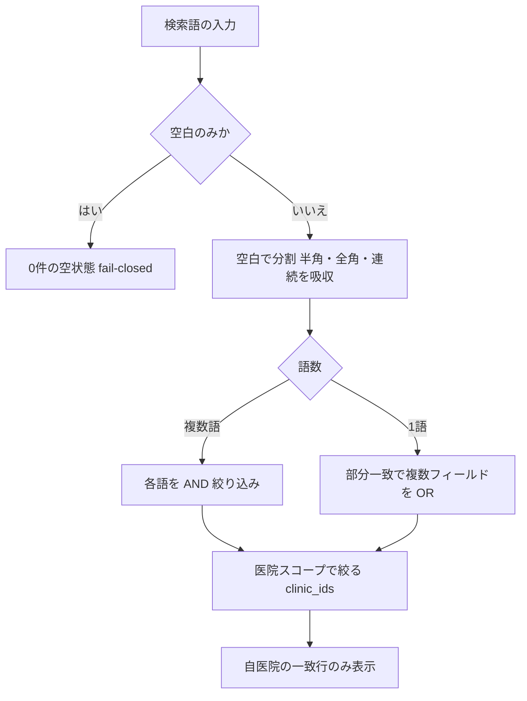

# S14: 飼主・ペット検索 — 複数語 AND と医院スコープ

> **目的**: 飼主一覧の検索が「複数語 = AND 絞り込み」「1語 = 部分一致」「0件 = 空表示」「他医院候補は出ない」という仕様（[03 §1.1](../../../spec/screens/03-owners-list.md)）どおりに動くことを、実画面・実データで納品前に証明する。
> **所要目安**: 10分 / **深度**: 中
> **仕様正本**: [specification.md §1.1](../../../spec/specification.md)・[screens/03-owners-list.md](../../../spec/screens/03-owners-list.md)。検証キュー: `UAT-Q1-SEARCH-AND`（[todo-verification.md](../../../../todo-verification.md)）。

## 前提条件

- ローカルの使い捨て clinic、または USER 管理の STG synthetic lane 専用。本番・未承認の共有 STG clinic・実患者データは禁止する。
- 自医院に検索用 fixture を用意する: 例として飼主姓「山田」+ ペット名「ポチ」の組み合わせが一意に決まる owner/pet と、片方の語だけ一致する別 owner/pet を複数件。固定 ID・汎用 seed は仮定しない。
- actor は対象医院に所属し owners:view 相当の権限を持つ attached account。認証情報は文書に書かない。
- 試験後に作成した fixture を削除する。
- 依存シナリオ: なし。複数医院スコープの網羅は S23 を参照する。

## 手順と期待結果

| # | 操作 | 期待結果 |
|:--|:--|:--|
| 1 | 飼主一覧を開き、検索語なしで一覧を表示する | fixture を含む自医院の owner/pet が件数どおり表示される。他医院のデータは最初から出ない |
| 2 | 「飼主姓 + 半角スペース + ペット名」の複数語で検索する | 全語に一致する行だけが残る（AND 絞り込み）。片方の語だけ一致する行は消える |
| 3 | 語の順序を逆にして同じ 2 語で検索する | 順序に依存せず同じ結果になる（`applyPetListSearch` は `strings.Fields` で空白分割し各語を AND 適用） |
| 4 | 1 語だけで検索する | その語に部分一致する行が複数件返る（1語はフィールド間 OR。複数語より緩い条件で件数が増えることを確認） |
| 5 | 存在しない語で検索する | 0 件になり、エラーや固まりではなく空状態が表示される。検索語を消すと全件に戻る |
| 6 | 空白のみ（全角・半角スペースだけ）で検索する | 0 件の空状態になる。空白のみは fail-closed で全件返ししない（`compactSearchText` が空なら `1 = 0`） |
| 7 | 他医院に同名・類似名の owner/pet がある条件で検索する（複数医院所属 actor で `?clinics=` を絞る場合は絞り込み側のみ） | スコープ外医院の候補は一切表示されない。URL の `clinics` パラメータと表示件数の対応を記録する |

検索語の評価経路:

## 確認観点

- 検索はサーバー側 `applyPetListSearch`（`backend/internal/pet/repository.go`）が `strings.Fields` で半角/全角/連続 Unicode 空白を分割し、各語を AND 適用する（語内は pets.name/name_kana・owners.name/name_kana/phone/id・pets.pet_number への ILIKE OR）。フロントは URL の `search` をそのまま API へ転送する（`frontend/src/features/owners/loaders.ts`）。前方一致ではなく部分一致。
- 「姓 名」の空白差は compact 比較（`regexp_replace` で空白除去）で吸収する（BUG-001）。カナ表記ゆれは `translate()`/`NormalizeKana` で補う。
- 空白のみの検索は fail-closed で 0 件（`1 = 0`）。空フィルタ扱いで全件は返さない。
- 医院スコープは `useClinicScope` の `?clinics=` → API の `clinic_ids` 経路でサーバー側が所属を検証する。クライアント側フィルタだけで他医院を隠す実装ではない（[03 §3.1](../../../spec/screens/03-owners-list.md)「信頼性と真正性」）。
- 複数語 AND・1語・0件・他院非表示の 4 ケースは `UAT-Q1-SEARCH-AND` の必須ケース（空白のみ fail-closed は実装突合で追加）。期待件数と表示件数を run 記録へ対応づける。
- 検索語そのもの（実在の氏名等）は報告に残さない。ケース番号・期待件数・表示件数と機密除去済みの画面証拠だけを `reports/uat-YYYY-MM-DD/` に記録する。
- スコープ外医院を「検索で出ない」ことと「API 直叩きで拒否される」ことは別確認。後者は L2 認可テストまたは S23 の範囲。

## 実装突合

- 変更サマリ:
  - `applyPetListSearch`（`backend/internal/pet/repository.go`）の `strings.Fields` 空白分割 AND・語内 ILIKE OR・空白のみ fail-closed（`1 = 0`）・compact 空白吸収（BUG-001）・カナ正規化を現行コードと突合
  - フロントは `loaders.ts` が `search` を API へパススルー。医院スコープは `useClinicScope`（`?clinics=` / `assignedClinics` / `isMultiClinic`）と `clinic_ids` API パラメータ経由を確認
  - `UAT-Q1-SEARCH-AND` の 4 必須ケース（複数語 AND / 1語 / 0件 / 他院非表示）を手順 2–7 に対応づけ、空白のみ 0 件を手順 6 で追加
