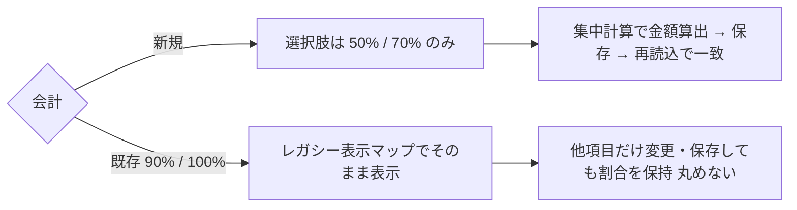

# S15: 会計保険負担割合 — 新規 50/70 と既存 90/100 の保持

> **目的**: 会計の保険負担割合が、新規会計では 50%/70% だけを選択肢として提示し、既存会計の 90%/100% 等のレガシー値をサイレントに丸めずそのまま保持・表示することを納品前に証明する。
> **所要目安**: 15分 / **深度**: 中
> **仕様正本**: [screens/11-accounting-detail.md §1.2](../../../spec/screens/11-accounting-detail.md)。検証キュー: `UAT-Q4-INSURANCE-RATES`（[todo-verification.md](../../../../todo-verification.md)）。

## 前提条件

- ローカルの使い捨て clinic、または承認済みの専用 UAT tenant。実請求・実患者データは使わない。
- 次の fixture を用意する:
  - 新規会計を作成できる owner/pet（保険証情報付き）。
  - 保険負担割合 90% または 100% の既存会計レコード 1 件以上（レガシー値の fixture/import で作成し、実請求を改変しない）。
- actor は会計の作成・参照権限を持つ attached account。
- 試験後に作成した会計 fixture は運用ルールに従い後処理する（精算済みの取消は別フロー。作成レコードを無断取消しない）。
- 依存シナリオ: なし。保険以外の明細・訂正・未収残は S08/S11 を参照する。

## 手順と期待結果

| # | 操作 | 期待結果 |
|:--|:--|:--|
| 1 | 新規会計を開始し、保険負担割合の選択肢を開く | 選択肢は **50% / 70%** のみ。90%・100% は新規の選択肢として出ない |
| 2 | 50% を選択して金額を確認する | 支払い対象が小計の 50% で計算され、画面の内訳と一致する（`calculations.ts` 集中計算） |
| 3 | 70% に切り替えて金額を再確認する | 70% で再計算される。切替で端数・合計が破綻しない |
| 4 | 保険なし（自己負担）に切り替える | 負担割合の扱いが仕様どおり（全額自己負担）に変わる |
| 5 | レガシー 90% の既存会計を開く | 90% がそのまま表示され、50/70 への自動丸め・警告なしの書き換えは起きない。表示は「90%」（レガシー表示マップ経由） |
| 6 | レガシー会計で割合以外の項目（例: 備考）だけ変更して保存 → 再読込 | 保険割合は 90% のまま保持される。保存で 50/70 に強制変換されない |
| 7 | 新規会計を 50% で保存 → 再読込 | 50% が保持され、金額が保存時と再読込時で一致する |

新規と既存（レガシー値）の取り扱い分岐:

## 確認観点

- 新規選択肢は `InsuranceCard` で 50/70 に制限（`{ value: "0.5" }`・`{ value: "0.7" }`）。既存値 0.9/1.0/1 は `LEGACY_INSURANCE_RATIO_LABELS` で 90%/100% 表示へ写像する（`frontend/src/features/accounting/components/InsuranceCard.tsx`）。
- 「新規は 50/70」「既存は値を保持」の2系統を別ケースで証明する。混在させない（`UAT-Q4-INSURANCE-RATES` の要求）。
- 既存値が変更なしの保存で丸められないことは本シナリオの核心。変更した項目だけが変わることを対応づける。
- 金額計算は集中計算エンジン `calculations.ts`（[11 §3.1](../../../spec/screens/11-accounting-detail.md)）が正本。画面内訳と API レスポンスの一致を確認する。
- 保険請求そのもの（レセプト・外部送信）は本シナリオ外。実請求データの作成・変更は禁止。

## 実装突合

- 変更サマリ:
  - `InsuranceCard` の新規選択肢 50/70 と `LEGACY_INSURANCE_RATIO_LABELS`（0.9→90%, 1.0→100%, 1→100%）の表示保持を現行コードと突合
  - `UAT-Q4-INSURANCE-RATES` の「新規 50/70 × 既存 90/100 × 選択/保存/再読込」ケースを手順 1–7 に対応づけ
  - レガシー値の丸めなし保存を手順 6 で明確化（既存の「サイレント丸めなし」条件）
