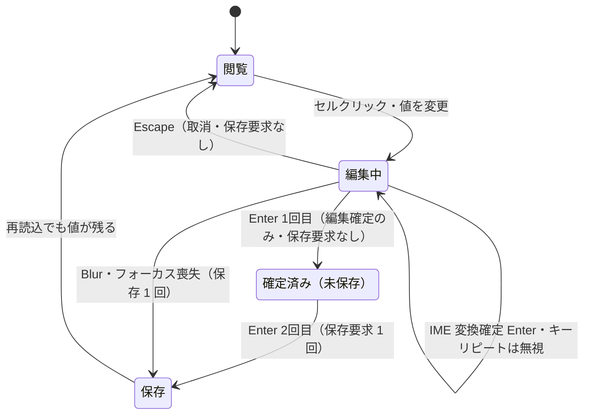

# S17: 治療数量入力 — Enter 2 回・Blur・Escape・IME の確定操作

> **目的**: カルテ治療タブの数量セルが「1回目の Enter = 編集確定」「2回目の Enter = 保存」という2段階確定、Blur 保存、Escape 取消を正しく処理し、IME 変換中・長押し（キーリピート）で誤爆しないことを実ブラウザで納品前に証明する。
> **所要目安**: 15分 / **深度**: 深い
> **仕様正本**: [screens/06-medical-records-form.md](../../../spec/screens/06-medical-records-form.md)。検証キュー: `UAT-R2-TREATMENT-COMMIT`（[todo-verification.md](../../../../todo-verification.md)）。

## 前提条件

- ローカルの使い捨て clinic、または承認済みの対象 build。実機 IME（日本語入力が有効な物理端末）を使う。対象端末・ブラウザ版・ズームを run 記録に残す。
- 治療タブで明細を追加できる medical-records 権限の attached account と生存ペットの fixture。
- 保存回数を数えるため、ブラウザ devtools の Network パネルまたは同等の手段を使う。
- 試験後に作成した治療明細を削除する。
- 依存シナリオ: なし。検索ダイアログの一覧表示は S18、画面全体の表示適合は S19 を参照する。

## 手順と期待結果

| # | 操作 | 期待結果 |
|:--|:--|:--|
| 1 | 治療タブで数量セルをクリックし値を変更し、**Enter を 1 回**押す | 編集が確定するが**まだ保存されない**。ヘルパー「Enterを2回押して確定します。Escapeで変更を取り消します。」どおり保存要求は未発行（Network で確認） |
| 2 | 続けて **Enter をもう 1 回**押す | 保存要求が 1 回発行され、値が確定する。再読込しても値が残る |
| 3 | 値を変更して **フォーカスを外す（Blur / 別セルクリック）** | 編集中の値が保存される（`onBlur` で commit）。保存回数は 1 回で、二重送信しない |
| 4 | 値を変更して **Escape** を押す | 編集が取り消され、表示値が編集前に戻る。保存要求は発行されない |
| 5 | 値を変更後、**Enter を 2 回連打**してから再読込する | 保存は 1 回分だけ。再読込で最後に確定した値が表示される |
| 6 | 日本語 IME で数量以外のテキストセル等を編集中、**変換確定の Enter** を押す | 変換確定の Enter がアプリ側の確定・保存へ誤爆しない（`isComposing` / `keyCode 229` を無視）。変換後も編集中のまま |
| 7 | 数量セルで **Enter を長押し（キーリピート）**する | repeat 中の Enter は確定・保存へ誤爆しない（`repeat` を無視）。離した後の通常 Enter だけが有効 |

数量セルの確定状態遷移（保存要求の発行回数が焦点）:

## 確認観点

- 確定ロジックは `TreatmentQuantityCell`（`frontend/src/features/medical-records/components/TreatmentsTab/`）の `reduceQuantityEnterKey` と `onBlur` commit。1回目 Enter = 編集終了、2回目 = 保存はヘルパーテキストどおりの設計。
- 合成テスト 28 件で Enter/Blur/Escape・repeat・isComposing・keyCode229 の無視は検証済み。本シナリオの目的は**対象 build・物理 IME・実ブラウザ**での受入 receipt で、合成検証の代替にしない。
- 保存回数は Network パネルの要求数または API 呼び出しログで数える。「1回目で未保存」「2回目/Blur で 1 回保存」「Escape で 0 回」を保存回数で証明する。
- 確定後の値が再読込で残ること（永続化）と、未確定の Escape が残らないことの両方を見る。表示だけの確認で保存とみなさない。
- 誤爆の兆候（変換確定で保存が走る、長押しで多重保存）が出たら FAIL。`todo.md#product-bugs` で重複確認のうえ Linear 追跡。

## 異常系

| # | 操作 | 期待結果 |
|:--|:--|:--|
| A1 | 編集中にウィンドウ/タブを切り替えてフォーカスを失う | Blur 扱いで確定・保存（または編集継続）のいずれか一貫した挙動で、半端な状態を残さない。再読込で破綻しない |
| A2 | 数量に空欄・0・負数・非数を入れて確定する | バリデーションの仕様どおり（fieldError または正規化）。不正値がサーバーへ保存されない |
| A3 | 確定処理中にさらに Enter/クリックを連打する | 多重保存・楽観的更新の競合で値が往復しない。最終値が 1 つに収束する |
| A4 | 保存が API エラーで失敗する（ネットワーク断・サーバーエラーを意図的に発生） | エラーがユーザーへ通知され、画面上「保存済みに見えるが実際は未保存」の状態を残さない。再試行で値を失わない |

## 実装突合

- 変更サマリ:
  - `TreatmentQuantityCell` の `reduceQuantityEnterKey`（2段階確定）、`onBlur` commit、Escape cancel、repeat/isComposing/keyCode229 無視、ヘルパーテキストを現行コードと突合
  - `UAT-R2-TREATMENT-COMMIT` の「Enter 1回/2回、Blur、Escape、長押し、IME 確定を別ケース」を手順 1–7 に対応づけ
  - 保存回数を Network 観測で証明する手順を追加（合成 28 tests の代替ではなく対象 build 受入）
