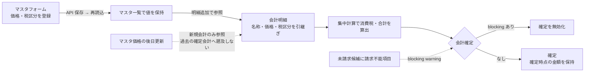

# S20: マスタ登録 → 会計明細への経路（価格・税区分・請求不能）

> **目的**: マスタ（治療・商品・検査・入院等の価格フォーム）で登録した項目が会計明細へ正しく参照され、0 円・未入力・税区分の差異が保存→再読込→会計まで一貫し、請求不能な項目は会計確定をブロックすることを納品前に証明する。
> **所要目安**: 20分 / **深度**: 深い
> **仕様正本**: [screens/11-accounting-detail.md](../../../spec/screens/11-accounting-detail.md)・[screens/20-master-settings.md](../../../spec/screens/20-master-settings.md)。検証キュー: `UAT-R2-MASTER-PATH`（[todo-verification.md](../../../../todo-verification.md)）。

## 前提条件

- ローカルの使い捨て clinic、または承認済みの専用 UAT tenant。
- マスタ系フォーム（治療・商品・検査・入院・その他価格フォーム。合計 12 フォームを対象）の新規/編集権限と、会計の作成・参照権限を持つ attached account。
- 価格 0 円・未入力・税区分（内税/外税/非課税）のバリエーションを含む専用 fixture。固定 ID は仮定しない。
- 試験後に作成したマスタ項目と会計を削除または後処理する。
- 依存シナリオ: なし。会計確定の競合は S21、訂正・未収残は S08 を参照する。

## 手順と期待結果

| # | 操作 | 期待結果 |
|:--|:--|:--|
| 1 | 治療マスタで新規項目を登録する（価格あり・税区分あり） | 保存→マスタ一覧で値が保持される。API request/model で価格・税区分が往復する |
| 2 | 同じ項目を会計の明細追加で選ぶ | 登録した名称・価格・税区分が会計明細へ正しく引き継がれる（`ItemListCard` の `useGetAllMerchandiseItems` 等の参照経路）。参照元のマスタ ID と会計明細の対応を記録する |
| 3 | 価格 0 円の項目を登録して会計へ追加する | 0 円は「0」として扱われ、未入力やエラーと混同しない。合計計算に正しく含まれる |
| 4 | 価格未入力の項目を登録しようとする | 必須なら fieldError で保存不可。任意なら空が明示的に保存され、会計側での扱い（未請求候補または請求不能）が仕様どおり |
| 5 | 税区分（内税/外税/非課税）を変えた項目をそれぞれ会計へ追加する | 消費税・合計が `calculations.ts` の集中計算で正しく算出され、保存→再読込で税区分が保持される |
| 6 | 請求不能な項目（未請求候補の `blocking` warning に該当するもの）を含む会計で確定しようとする | 「未請求候補に請求不能な項目があるため会計を確定できません」等の blocking 表示で確定が無効化される（`AccountingDetailPanels` の `unbilledWarnings`） |
| 7 | 既存項目の価格を更新し、既に確定済みの過去会計と新規会計で挙動を比較する | 過去の確定会計は変わらず（確定時点の金額を保持）、新規会計は更新後価格を参照する。確定済みを遡って再計算しない |

マスタ → 会計明細 → 確定の参照経路:

## 確認観点

- 12 フォーム全てで新規/編集→API 保存→再読込→下流（会計・未請求候補）を通すのが `UAT-R2-MASTER-PATH` の要求。自動連携しない経路は根拠付き N/A とし、未実行を PASS にしない。
- 会計明細の項目参照は `ItemListCard` → `useGetAllMerchandiseItems`（`frontend/src/features/accounting/`）。治療由来の項目は `treatment_id` で親カルテと紐づく（`types/index.ts` の未請求候補）。
- 請求不能ブロックは `use-accounting-detail-state` の `unbilledWarnings`（`blocking && count > 0`）が確定ボタンを無効化する。警告文言と無効化の両方を見る。
- 0 円・未入力・税区分は会計の総額へ直接効くため、期待金額を事前に計算しておき画面・API・再読込の 3 点で照合する。
- マスタ更新が過去の確定会計を遡って変更する場合は FAIL（会計の真正性・[11 §2.1](../../../spec/screens/11-accounting-detail.md)「精算済みデータの保護」に反する）。

## 異常系

| # | 操作 | 期待結果 |
|:--|:--|:--|
| A1 | 会計で参照中のマスタ項目を削除・無効化する | 削除が禁止されるか、参照整合性が保たれる。既存の会計明細が壊れない（名称・金額が消えない） |
| A2 | 同名・同価格のマスタ項目を複製して会計へ追加する | 重複の扱いが仕様どおり（警告または許容）。意図しない二重請求にならない |
| A3 | 価格に負数・巨大数・小数を入力する | バリデーションまたは正規化が仕様どおり。計算が破綻する値は保存されない |
| A4 | マスタ編集の権限がない actor で編集を試みる | UI 非活性または 403。マスタが変わらない |

## 実装突合

- 変更サマリ:
  - `ItemListCard` → `useGetAllMerchandiseItems` の参照経路、`treatment_id` 由来の未請求候補、`unbilledWarnings` の blocking 確定無効化を現行コードと突合
  - `UAT-R2-MASTER-PATH` の「全 12 フォームの新規/編集→API 保存→再読込→下流/会計」を手順 1–7 に対応づけ、0/未入力/税区分を明示
  - 請求不能 blocking（`AccountingDetailPanels`）を手順 6 で独立ケース化
