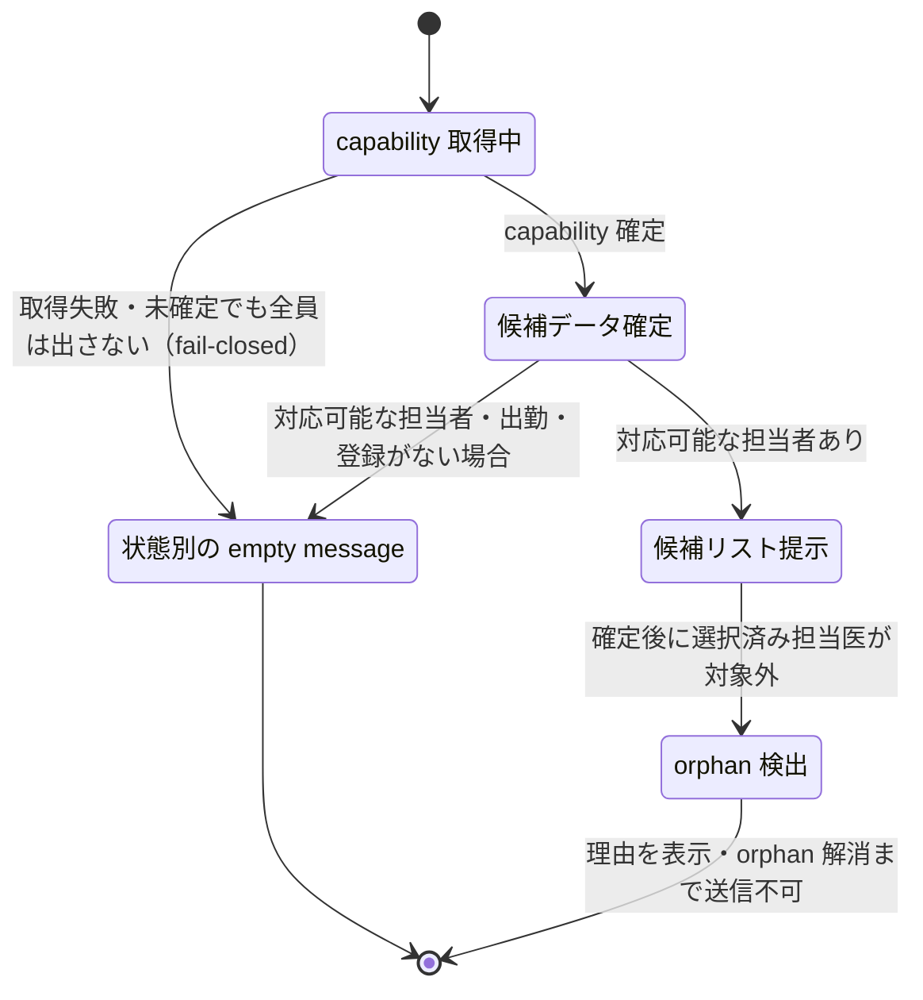

# S22: 予約作成 — 409 理由の表示と担当者候補のフェイルクローズ

> **目的**: 予約作成で時間重複などの 409 が起きたとき理由がモーダル内に表示されて閉じずに修正でき、担当者候補が capability 情報未確定・不在時に「全員出す」へ倒れず fail-closed になることを納品前に証明する。
> **所要目安**: 15分 / **深度**: 中
> **仕様正本**: [screens/02-reservations.md](../../../spec/screens/02-reservations.md)。関連 tracker: Plane `BRT-102`（予約作成 409 の理由非表示）・`BRT-103`（担当者フィルタ）。

## 前提条件

- ローカルの使い捨て clinic、または承認済みの専用 UAT tenant。
- 同じ時間帯に重複する既存予約・出勤医師がいない時間帯・capability（`capable_courses`）が設定された担当者と未設定の担当者の fixture。
- actor は reservations の作成権限を持つ attached account。
- 依存シナリオ: なし。複数ペット一括予約・ステータス連携は V02 を参照する。

## 手順と期待結果

| # | 操作 | 期待結果 |
|:--|:--|:--|
| 1 | 既存予約と同じ時間・同じ担当医で新規予約を作成しようとする | FE 事前チェックまたは API 409 で「指定された時間帯には既に予約が入っています」等の理由がモーダル内に表示され、**モーダルは閉じず入力が残る**（`use-reservation-save-actions` の inline message 面） |
| 2 | 409 の理由を直して（時間または担当医を変えて）再送する | 修正して再送でき、成功すれば予約が作成される。失敗した入力を最初からやり直させない |
| 3 | 担当者を選ぶ際、capability 情報の取得が pending の状態を作る | 候補リストは空/ローディングで、**未確定のまま全員を出さない**（`filterStaffCandidatesByCapability` の fail-closed） |
| 4 | capability 未設定の担当者だけがいる条件で予約タイプを選ぶ | 「この予約タイプに対応できる担当者がいません」系の empty message が出る。query failure・loading・no capable staff・no staff working・no staff registered の各状態が区別される（`staffCandidateEmptyMessage`） |
| 5 | 以前選択していた担当医が、候補データ確定後に対象外（orphan）になった状態を作る | `STAFF_ORPHAN_REASON_MESSAGE` で理由が示され、orphan を解消しないと送信できない（`resolveStaffSelectionEligibility`） |
| 6 | API が 409（例: 出勤医師ゼロ・時間重複）を返すケースを直接発生させる | `extractApiErrorMessage` で API の理由メッセージがモーダル内に表示され、無言の失敗や汎用エラーだけにならない |

担当者候補の状態遷移（fail-closed と orphan 判定タイミング）:

## 確認観点

- 409 の表示面は「FE 事前チェック」と「API 409」が**同じモーダル内の inline メッセージ面**に出る設計（`use-reservation-save-actions.ts`）。モーダルが閉じて入力が消えるのは BRT-102 の症状であり FAIL。
- 担当者候補は `filterStaffCandidatesByCapability` が capability 未確定・候補不在で fail-closed（空を返す）する。「誰でも担当可」へのフォールバックは仕様外。
- `staffCandidateEmptyMessage` は 5 状態（query failure / loading / no capable staff / no staff working / no staff registered）を区別する。全部「担当者なし」に見えるのは FAIL。
- orphan 医師は候補データが確定してから初めて orphan と判定される（`resolveStaffSelectionEligibility`）。pending 中に orphan 誤判定しない。
- 複数ペット一括予約はサーバー側 1 操作（batch create）で、個別 create の連打で意図的重複を 409 にしない設計。本シナリオでは単一ペットの 409 と担当者を主対象とする。
- **実機受入（`SLACK-STAFF-SELECT`）**: 元症状は「候補があるのに iPad・一部 PC で担当者を選べない」。対象端末（報告のあった iPad・PC 相当）で「候補表示 → 選択 → 保存 → 再読込」を別ケースで実施し、端末を記録する。対象端末が用意できない場合は該当ケースを BLOCKED とし、デスクトップ Chrome の合格をもって iPad 受入済みとしない。

## 実装突合

- 変更サマリ:
  - `use-reservation-save-actions.ts` の FE precheck inline message（API 409 と同一面）と `extractApiErrorMessage` を現行コードと突合
  - `filterStaffCandidatesByCapability` の fail-closed、`staffCandidateEmptyMessage` の 5 状態、`resolveStaffSelectionEligibility`/`STAFF_ORPHAN_REASON_MESSAGE` の orphan 検出を現行コードと突合
  - BRT-102（409 理由表示）と BRT-103（担当者フィルタ）の受入を手順 1–6 に対応づけ
  - `SLACK-STAFF-SELECT` の対象端末（iPad・報告 PC）での選択→保存→再読込を実機受入として確認観点に追加
