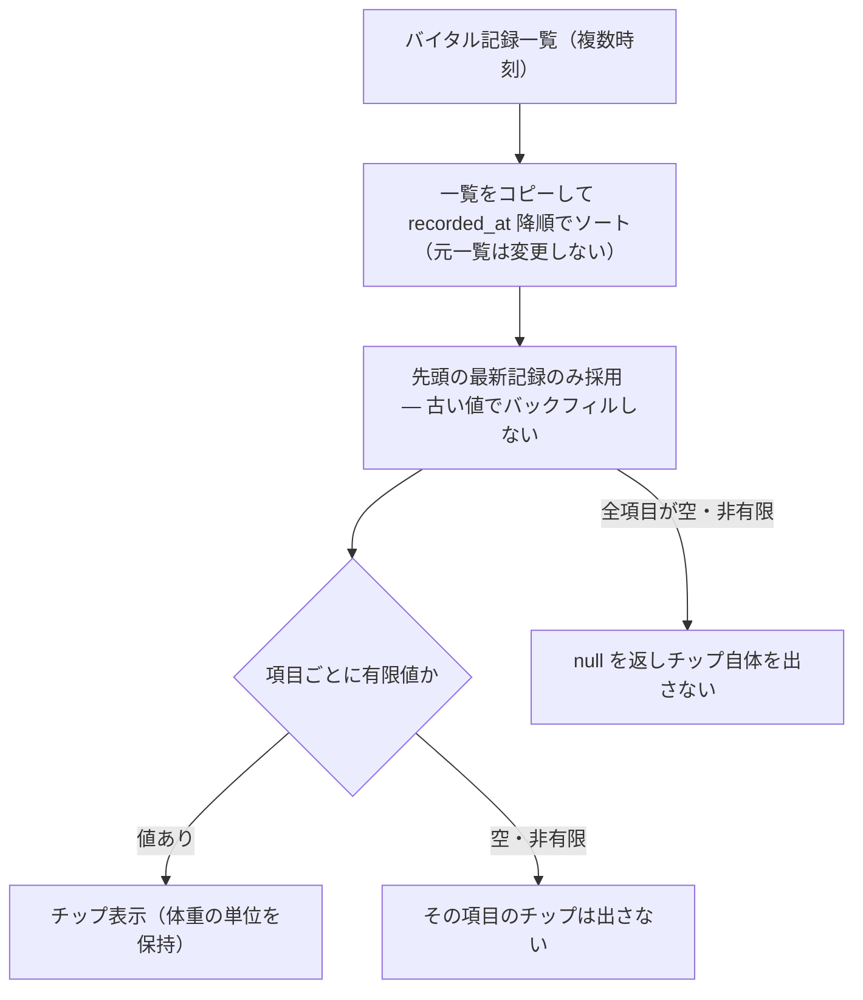

# S24: カルテヘッダーのバイタルサイン — 最新値のみ・バックフィルなし

> **目的**: カルテ編集の患者コンテキストに、最新記録のバイタルサイン（体温・心拍・呼吸・体重）だけがチップ表示され、過去値へのバックフィルや全非有限値での誤表示がないことを納品前に証明する。
> **所要目安**: 10分 / **深度**: 薄い
> **仕様正本**: [screens/06-medical-records-form.md](../../../spec/screens/06-medical-records-form.md)。検証キュー: `SLACK-VITALS`（[todo-verification.md](../../../../todo-verification.md)）。実装参照: `frontend/src/features/medical-records/lib/visit-vital-chips.ts`。

## 前提条件

- ローカルの使い捨て clinic、または承認済みの専用 UAT tenant。
- 同一ペットに**複数時刻のバイタル記録**（古い値と新しい値が明確に違う）と、**一部の項目だけ値がある記録**、**全項目が空/非有限の記録**を持つ fixture。固定 ID は仮定しない。
- actor は medical-records の参照権限を持つ attached account。
- 依存シナリオ: なし。バイタル記録の入力自体は V01 を参照する。

## 手順と期待結果

| # | 操作 | 期待結果 |
|:--|:--|:--|
| 1 | 複数時刻のバイタル記録があるペットのカルテを開く | 最新の `recorded_at` を持つ記録の値だけがチップに出る。古い記録の値は出ない（`latestVisitVitalChips` が降順ソートで最新行を選択） |
| 2 | 一部項目だけ値がある最新記録の状態で開く | 値がある項目だけがチップ表示され、空の項目はチップ自体が出ない（空欄や「—」を表示しない） |
| 3 | 体重の単位（kg 等）を確認する | 記録の体重単位が保持されて表示される。単位が落ちたり別単位に化けたりしない |
| 4 | 全項目が空/非有限の記録だけがある状態で開く | チップ自体が表示されない（`null` を返す）。「0」や空枠の誤表示をしない |
| 5 | カルテを再読込・別タブへ切替→戻る | 表示が安定し、再読込で値が変わったり重複したりしない（元データを変更しない） |

latestVisitVitalChips の処理と表示分岐:

## 確認観点

- `latestVisitVitalChips` は vital 一覧を**コピーして** `recorded_at` 降順でソートし、最新行の有限値（体温・心拍・呼吸・体重）だけを返す。全て空なら `null` でチップ非表示。
- 「最新行の値だけ」で「過去の値で埋める」バックフィルはしない設計。古い値が出る・混ざる場合は FAIL。
- 元の vital 一覧をソートで破壊しない（不変性）。再読込・タブ切替で順序が変わる副作用があれば FAIL。
- チップの値と実際の記録の対応を fixture で固定し、表示された値が最新記録のものであることを対応づける。
- バイタルの入力・編集の保存は V01 の対象。本シナリオはヘッダー/チップの表示契約のみ。

## 実装突合

- 変更サマリ:
  - `latestVisitVitalChips` の最新行選択（`recorded_at` 降順・コピー後ソート）、有限値フィルタ、全空で `null`、体重単位保持を現行コードと突合
  - バックフィルなし・全非有限で非表示・不変性を手順 1–5 に対応づけ
