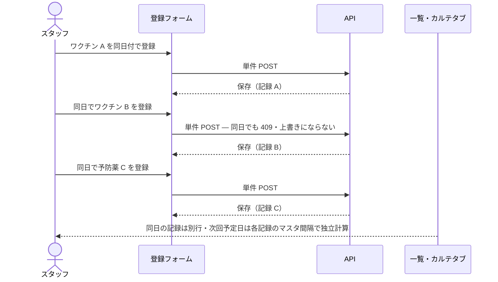

# S29: 同一ペット同日の複数予防接種登録

> **目的**: 同一ペットに同日で複数の予防接種（異なるワクチン・予防薬）を順次登録したとき、各記録が独立して保存・一覧表示され、値が混ざったり重複が弾かれたりしないことを納品前に証明する。
> **所要目安**: 15分 / **深度**: 中
> **仕様正本**: [screens/15-vaccinations-form.md](../../../spec/screens/15-vaccinations-form.md)・[screens/14-vaccinations-list.md](../../../spec/screens/14-vaccinations-list.md)。関連 tracker: `SLACK-VACCINE-MULTI`・Plane 同一ペット同日複数登録の調査。

## 前提条件

- ローカルの使い捨て clinic、または承認済みの専用 UAT tenant。
- 同日に複数接種する想定の異なるワクチン/予防薬マスタ（2〜3 件）と生存ペットの fixture。
- actor は vaccinations の作成権限を持つ attached account。
- 同一ペット・同日の複数登録は調査中の既知論点（Plane 調査 item）。本シナリオは期待される受入を定義し、現状との差分を証拠化する。重複 issue を作らない。
- 依存シナリオ: S03（次回予定自動計算）。

## 手順と期待結果

| # | 操作 | 期待結果 |
|:--|:--|:--|
| 1 | ペットにワクチン A を同日付で登録して保存 → 一覧へ戻る | 1 件目が保存・一覧に出る（S03 の単件登録と同じ） |
| 2 | 同じペット・同日でワクチン B を登録する | **2 件目も保存できる**。同日だからと 409・重複エラー・上書きで弾かれない。保存が失敗する場合は `SLACK-VACCINE-MULTI`/調査 item の症状として記録し、PASS にしない |
| 3 | さらに同日で予防薬 C（フィラリア等）を登録する | 3 件目も独立して保存できる。同日複数接種が業務として許容される |
| 4 | 一覧・カルテの予防接種タブで同日の記録を確認する | 同日の複数記録が**別行**で出る。ワクチン名・ロット・次回予定日が各記録のもので、行間で混ざらない |
| 5 | 1 件目を開いて内容を確認する | A の値が A のまま。B/C の値が混入しない。次回予定日は A のマスタ間隔で計算されている |
| 6 | 同日の 1 件を削除する | その記録だけが削除され、同日の他記録は残る |

同日複数登録は順次の単件 POST（1 リクエストの多重 create ではない）:

## 確認観点

- 各接種は `useCreateVaccination` の単件 POST で独立保存される。同日複数は「順次 POST」を意味し、1 リクエストの多重 create ではない。
- 同日複数が登録できない既知の挙動（Plane 調査 item・`SLACK-VACCINE-MULTI`）は、本シナリオで「期待 = 順次登録できる」を定義し、実測が失敗すれば既存調査 item へ証拠を接続する。新規 duplicate issue は作らない。
- 次回予定日は各記録のマスタ間隔で独立計算（`calculateNextDate`）。同日複数で次回日が共有・上書きされるのは FAIL。
- 一覧・カルテタブの両方で行の独立性を見る。カルテ経路の既定間隔は S03 のとおり `4weeks`、独立画面は `1year`。
- 削除は対象行のみ。同日全消去・誤って他記録を消すのは FAIL。

## 実装突合

- 変更サマリ:
  - `useCreateVaccination` の単件 POST 経路と `use-vaccination-form` の保存フローを現行コードと突合
  - `SLACK-VACCINE-MULTI` の「単件 POST・失敗通知・同日 2〜3 件順次 POST」を手順 1–6 に対応づけ、同日複数の既知調査 item への証拠接続を明記
  - 次回予定の独立計算（`calculateNextDate`）と行の独立性を確認観点に明記
