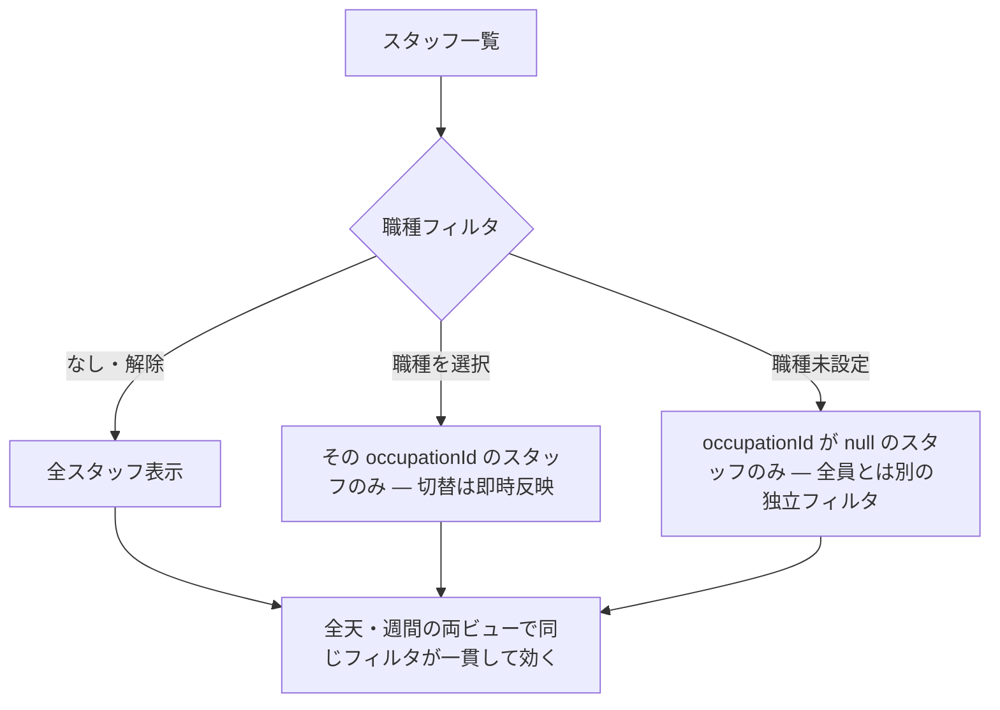

# S30: シフトカレンダー — 職種フィルタと未設定スタッフ

> **目的**: シフト管理カレンダーで職種（occupation）によるスタッフ絞り込みが正しく動き、職種未設定のスタッフだけを出すフィルタと全天/週間ビューで一貫することを納品前に証明する。
> **所要目安**: 10分 / **深度**: 薄い
> **仕様正本**: [screens/24-shift-calendar.md](../../../spec/screens/24-shift-calendar.md)。関連 tracker: Plane `BRT-103`（シフトの職種フィルタ）。実装参照: `frontend/src/features/shifts/components/ShiftCalendar/`。

## 前提条件

- ローカルの使い捨て clinic、または承認済みの専用 UAT tenant。
- 職種マスタ（医師・看護師等）と、職種が設定されたスタッフ・**職種未設定のスタッフ**・シフトが入ったスタッフの fixture。固定 ID は仮定しない。
- actor は shifts の参照権限を持つ attached account。
- 依存シナリオ: なし。シフト登録・休憩・休診日は V02 を参照する。

## 手順と期待結果

| # | 操作 | 期待結果 |
|:--|:--|:--|
| 1 | シフトカレンダーを開く | 全スタッフのシフトが職種フィルタなしで表示される |
| 2 | 職種フィルタで「医師」を選ぶ | `occupationFilteredStaffs` で医師（`occupationId` が医師）だけが残る。他職種・未設定は消える |
| 3 | 「看護師」に切り替える | 看護師だけが出る。切替が即時反映される |
| 4 | 職種未設定のフィルタ（未設定のみ表示）を選ぶ | `occupationId` が `null` のスタッフだけが出る（「職種未設定フィルタで occupation 無しのスタッフだけ出す」）。設定済みは出ない |
| 5 | フィルタを解除/全員に戻す | 全スタッフに戻る |
| 6 | 全天ビュー・週間ビューで同じフィルタを確認する | 両ビューでフィルタが一貫して効く。ビュー切替でフィルタが勝手に外れない |
| 7 | 職種のスタッフ名を確認する | 表示名（`occupationName`）がマスタの職種名と一致する。ID や別職種名に化けない |

職種フィルタの分岐とビュー間の一貫性:

## 確認観点

- 職種フィルタは `ShiftCalendar` の `occupationFilteredStaffs`（`onOccupationChange` で切替）。staff の `occupationId`/`occupationName` で絞り込む（`frontend/src/features/shifts/types/`）。
- 職種未設定は `occupationId === null` のスタッフだけを出す独立フィルタ。「全員」と「未設定」を混同しない。
- フィルタは表示の絞り込みで、スタッフのシフトデータや職種マスタを変更しない。再読込で職種が勝手に変わる場合は FAIL。
- 全天/週間ビューの両方で同じフィルタが効くこと（BRT-103 の受入）。片方だけ効くのは FAIL。
- 職種名の表示はマスタ名と一致。マスタ側の職種管理は V04 の対象。

## 実装突合

- 変更サマリ:
  - `ShiftCalendar` の `occupationFilteredStaffs`・`onOccupationChange`・職種未設定フィルタ（`occupationId === null`）と `occupationName` 表示を現行コード・テストと突合
  - BRT-103 の職種フィルタ受入（全天/週間両ビュー）を手順 2–7 に対応づけ
