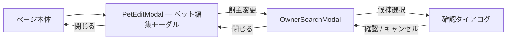

# S34: オーバーレイの積層 — モーダル内ポップアップ・入れ子ダイアログ・トースト

> **目的**: モーダル・ドロップダウン・カレンダー・トーストなどのオーバーレイ要素が、親コンテナから見切れず、入れ子で開いても積層・スクロール・フォーカスが破綻しないことを、対象 viewport で納品前に証明する。
> **所要目安**: 15分 / **深度**: 中
> **仕様正本**: [screens/06-medical-records-form.md](../../../spec/screens/06-medical-records-form.md)・各モーダル仕様。既知欠陥 `BUG-DIALOG-FOCUS-RESTORE`（bug.md）の回帰確認を含む。

## 前提条件

- 対象 viewport は **1366×625 CSS px**（100%/125% ズームを別 run で記録）。
- モーダル内に Select/Popover/カレンダーを持つ画面: 新規予約モーダル（`ReservationFormModal`）、カルテのバイタル記録モーダル（`VitalsModal`）、ペット編集モーダル（`PetEditModal` → `OwnerSearchModal` の入れ子経路）。
- actor は予約作成・カルテ編集・ペット編集の権限を持つ attached account。

## 手順と期待結果

| # | 操作 | 期待結果 |
|:--|:--|:--|
| 1 | 新規予約モーダル内で予約区分の Select を開く | ドロップダウンがモーダルの下端で見切れず、portal 経由で画面内に反転/収まる。選択後に値が保持される |
| 2 | バイタル記録モーダル内の日時入力（カレンダー/Popover）を開く | カレンダーがモーダル境界を越えて表示され、上下端で見切れない。日付選択が可能 |
| 3 | ペット編集モーダル →「飼主変更」→ OwnerSearchModal → 選択 → 確認ダイアログ（入れ子3段） | 各段が前面に表示され背後を誤操作しない。確認→キャンセルで親モーダルに正しく戻る |
| 4 | 入れ子ダイアログを順に閉じる | 各段でフォーカスが呼出元へ戻る（`BUG-DIALOG-FOCUS-RESTORE` の回帰なし）。最終的にページ本体へ戻る |
| 5 | 保存成功・失敗でトーストを出し、直後に画面右下/中央の操作を試みる | トーストが主要操作ボタン・入力欄を覆わない。トースト表示中でも操作可能 |
| 6 | モーダル表示中に背景をスクロール/クリック | 背景がスクロールしない（scroll lock）。モーダル外クリックは仕様どおり（閉じる/閉じないが一貫） |

**入れ子オーバーレイの経路（各段でフォーカスは呼出元へ戻る）:**

## 確認観点

- Radix Dialog/Popover は portal 描画のため、`overflow` のある親内で見切れ・z-index 競合が起きやすい。モーダル内ポップアップは最頻出のずれ箇所。
- 入れ子モーダルでは `aria-modal` とフォーカストラップが段ごとに機能すること。確認ダイアログが親モーダルの背後に回るのは FAIL。
- トースト（sonner）は位置・表示時間・重複時のスタックを確認。操作を遮る配置は FAIL。
- Escape 連打で全段が一気に閉じる/最上段のみ閉じるのどちらかに一貫すること。

## 実装突合

- `frontend/src/components/ui/dialog.tsx`・`select.tsx`・`popover.tsx`・`sonner.tsx` の portal/z-index/スクロールロック配線を現行コードと突合
- `PetEditModal` → `OwnerSearchModal` → 確認 `alertdialog` の3段経路は S32 実測で入れ子が成立することを確認済み
