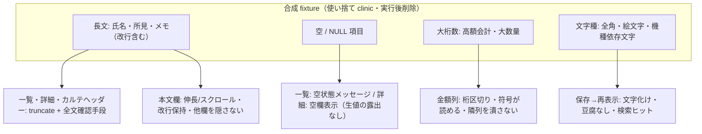

# S35: 極端コンテンツ — 長文・空・NULL・大桁数・全角/絵文字の表示適合

> **目的**: 実データで起こりうる極端な値（長い氏名・メモ、0 件、NULL、大きな金額、全角/絵文字/機種依存文字）を入れても一覧・詳細・ヘッダー・帳票の表示が破綻しないことを納品前に証明する。
> **所要目安**: 20分 / **深度**: 中
> **仕様正本**: 各 screens 正本。ヘッダーの truncate 契約は [S25](S25-microchip-header-display.md)、0 件/多数行は [S32](S32-owner-search-modal-fit.md) と連携。

## 前提条件

- 使い捨て clinic に以下の合成 fixture を用意する:
  - 長文: 50 文字超の飼主名・ペット名・治療名・所見（改行含む）・メモ
  - 空: 0 件の一覧画面、項目未設定（NULL）のペット/飼主/会計
  - 大桁数: ¥1,000,000 超の会計・見積、数量 9999
  - 文字種: 全角カタカナ・絵文字・機種依存文字（髙/﨑等）を含む名称
- 対象 viewport は 1366×625 CSS px。

## 手順と期待結果

| # | 操作 | 期待結果 |
|:--|:--|:--|
| 1 | 長文 fixture の飼主/ペットで一覧・詳細・カルテヘッダーを開く | 名称が truncate + ツールチップ（または折返し）で全文確認可能。レイアウトが押し潰されない |
| 2 | 長文の主訴・所見・メモを保存し再表示 | 本文欄が伸長/スクロールし、保存ボタン・他欄が隠れない。改行が保持される |
| 3 | 0 件状態の一覧（飼主検索・会計履歴・検査履歴等）を開く | 空状態メッセージが中央に表示され、ヘッダー/ページネーションが破綻しない |
| 4 | NULL 項目（電話なし・住所なし・保険なし等）の詳細を開く | 「-」または空欄として描画され、`null`/`undefined`/`Invalid Date` の生表示がない |
| 5 | ¥1,000,000 超の会計・見積を表示 | 金額列が折返し/溢れず、3桁区切り・符号・単位が正しく読める。列幅が隣列を潰さない |
| 6 | 絵文字・機種依存文字を含む名称で保存→再表示 | 文字化け・豆腐（□）・桁落ちがない。検索で該当文字がヒットする |

**極端 fixture と確認面の対応:**

## 確認観点

- 「1 行想定の場所に複数行が入る」「truncate だが全文確認手段がない」はいずれも FAIL。全文確認の手段（title/ツールチップ/詳細画面）があることをセットで見る。
- `toLocaleString`・日付フォーマット・数値の符号表示（負の金額、割引）は崩れやすい。生値（`NaN`・`null` 文字列）の露出は FAIL。
- 帳票側の極端値は S33/S37 と連携（ここでは画面表示のみ）。
- fixture は使い捨て clinic のみで作成し、実行後に削除する。

## 実装突合

- `PatientContextHeader` の truncate 契約（S25）、一覧系の `truncate`/`title` 属性、金額フォーマット（`Intl.NumberFormat` 等）を現行コードと突合
