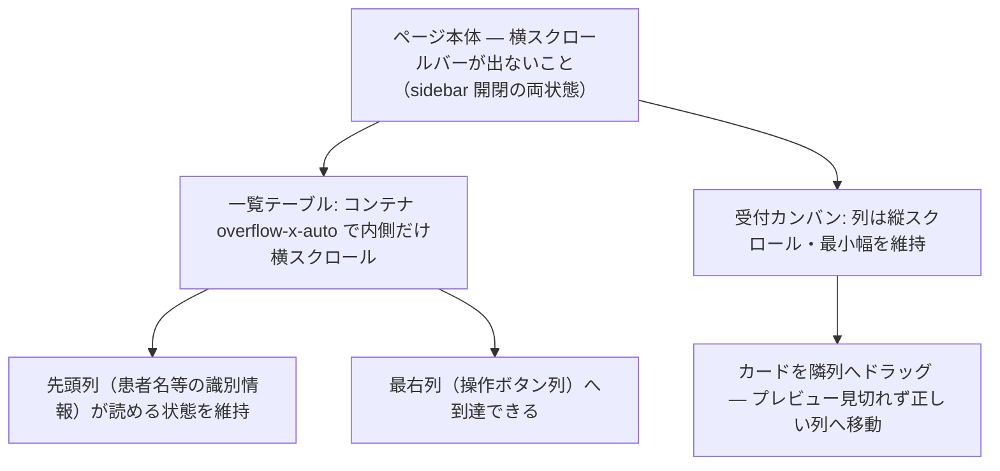

# S36: 一覧テーブル・カンバン — 横方向の収まりと操作到達

> **目的**: 列数の多い一覧テーブルと受付カンバンが、狭い viewport で横方向に破綻せず、横スクロール・最右列の操作・カード密度が使用可能なことを納品前に証明する。
> **所要目安**: 15分 / **深度**: 中
> **仕様正本**: [screens/03-owners-list.md](../../../spec/screens/03-owners-list.md)・会計/受付の各 screens 正本。

## 前提条件

- 対象 viewport は **1366×625 CSS px**（sidebar 開閉の両状態）。
- 列が多い fixture: 明細多数の会計一覧、全タブ列を持つ日次会計、集計ダッシュボード、カード多数の受付カンバン（checked_in / in_consultation / accounting 各列に複数件）。
- actor は会計・受付・集計の参照権限を持つ attached account。

## 手順と期待結果

| # | 操作 | 期待結果 |
|:--|:--|:--|
| 1 | 日次会計タブ・会計一覧を 1366×625 で開く | テーブルがコンテナ内で横スクロール（`overflow-x-auto`）し、ページ全体の横スクロールバーが出ない |
| 2 | 横スクロールして最右列（操作ボタン列）へ到達 | 最右列の操作が押せる。先頭列（患者名等）の識別情報が読める状態を維持（sticky または再スクロールで辿れる） |
| 3 | 受付カンバンで各列にカードを多数入れた状態を開く | 列が縦スクロールし、カードのステータス変更ボタン・ドラッグが全カードで可能。列幅が潰れて内容が読めない状態にならない |
| 4 | カンバンでカードをドラッグして隣列へ移動 | ドラッグ中のプレビューが見切れず、ドロップ後にカードが正しい列へ移動する（BUG-TRIM-KANBAN-IN-CONSULTATION とは別件: ここでは表示のみ） |
| 5 | 集計ダッシュボード（売上ランキング等）を開く | 横長テーブル・カードが viewport 内に収まり、ツールチップ/凡例が画面端で見切れない |
| 6 | sidebar を閉じた状態で 1–5 を再確認 | 幅が広がっても表示が破綻しない（max-width 不整合・余白異常なし） |

**横方向の収まり構造:**

## 確認観点

- `overflow-x-auto` が付いたコンテナの**内側だけ**がスクロールすること。ページ全体に横スクロールが出るのは FAIL（S19 と同基準）。
- 横スクロール時に行高・罫線がずれないこと。仮想スクロール（あれば）で高さ計算がずれて行が重なる/消えるのは FAIL。
- カンバンの列は件数差が大きいときに空列が潰れないこと（最小幅の維持）。
- テキスト量で列幅が極端に振れる場合、最悪ケース（S35 の長文 fixture 併用）でも最右列へ到達できること。

## 実装突合

- `DailyAccountingTab`・`AccountingListTable`・`CheckupsTabTable`・`VitalsTabTable`・`TreatmentsTab`・`AggregationOwnerTable` の `overflow-x-auto`/`min-w` 配線を現行コードと突合
- 受付 `KanbanColumn`・`AppointmentCard`・`ReceptionPagePanels` の列幅・スクロール・DndContext を突合
