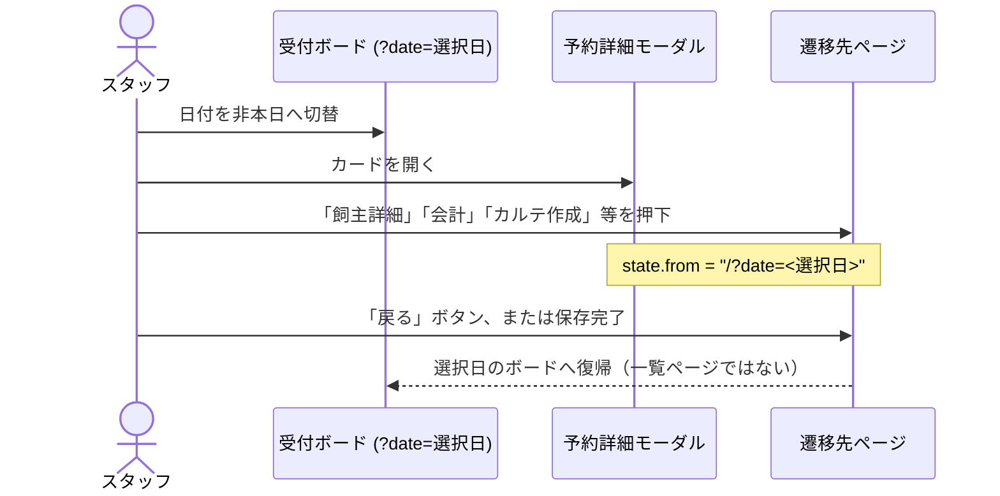

# S40: 受付ボード → 別ページ → 戻る で選択日ボードへ復帰

> **目的**: 受付ボード（特に日付切替で選択した非本日 `?date=<選択日>`）から詳細モーダル・カードのミニアクション経由で別ページへ遷移し、遷移先の「戻る」ボタン・保存後リダイレクトの両方で、選択日の受付ボードへ復帰することを納品前に証明する。
> **所要目安**: 15分 / **深度**: 中
> **仕様正本**: [screens/01-reception.md](../../../spec/screens/01-reception.md)（「戻り先の保持」: `location.state.from = "/?date=<選択日>"`）。

## 前提条件

- ローカルの使い捨て clinic、または承認済みの専用 UAT tenant。
- 当日以外の日付にも受付予約が存在する fixture。以下を含める:
  - 飼主・ペット連携済みの予約（`ownerId`/`petId` あり）
  - 飼主 ID 未連携だが飼主名だけ存在する予約（LINE 予約等の相当データ）
  - トリミング予約と一般診察予約
- actor は reception/owners/accounting/medical-records の参照権限を持つ attached account。
- 依存シナリオ: なし。モーダル操作自体は S34（オーバーレイ積層）、日付切替は受付仕様 §01 を参照する。

## 手順と期待結果

| # | 操作 | 期待結果 |
|:--|:--|:--|
| 1 | 受付ボードで日付を**非本日**へ切り替える | URL が `/?date=<選択日>` になり、その日の予約がカンバンに表示される |
| 2 | 予約カードを開き詳細モーダル →「飼主詳細」→ 飼主編集ページで「戻る」 | `/?date=<選択日>` のボードへ戻る（`/owners` 一覧ではない） |
| 3 | モーダル →「会計」→ 会計詳細ページで「戻る」 | `/?date=<選択日>` のボードへ戻る |
| 4 | モーダル →「カルテ作成」（またはカードのミニアクションのカルテボタン）→ カルテフォームで「戻る」 | `/?date=<選択日>` のボードへ戻る。フォーム未入力でも到達・復帰できる |
| 5 | ペット未確定の予約でカルテ作成 → ペット選択ページで「戻る」 | `/?date=<選択日>` のボードへ戻る（機能一覧ではない） |
| 6 | 飼主 ID 未連携・飼主名ありの予約で「飼主詳細」 | `/owners?search=<飼主名>` の一覧検索へ遷移する（`/pets/:id` のような 404/真っ白にならない） |
| 7 | 手順 4 を保存まで通す（カルテを実際に保存） | 保存後の遷移先も `/?date=<選択日>` のボードになる（`/medical-records` 等へ飛ばない） |
| 8 | 当日ボードで手順 2 を再実行 | 当日 `?date=<当日>` は本日ボードと同じ扱いで復帰する（`/` と等価） |

受付起点の往復:

## 確認観点

- 各遷移元は `location.state.from` に `"/?date=<選択日>"`（または当日なら `"/"`）を入れること。遷移先は `state.from` を検証（`parseInternalPath` で same-origin のみ）して復帰する。
- 「戻る」が機能一覧（`/owners`・`/accounting` 等）へ飛ぶ、または当日ボードへ日付を失って戻る場合は FAIL。
- `ownerId` 未連携で `/pets/:id` のような存在しないルートへ飛ぶ、または真っ白になる場合は FAIL。
- ペット選択ページを挟む経路でも `from` が連鎖し、最終フォームの「戻る」がボードへ戻ること。
- 保存後リダイレクトが `from` を尊重しない場合は FAIL（`todo.md#product-bugs` で重複確認のうえ Plane 追跡）。

## 実装突合

- 変更サマリ:
  - 受付側の送信元: `AppointmentCard`（カードのミニアクション）・`ReceptionDetailModal`（モーダルの各導線）・`use-reception-column-view`（予約作成）が `/?date=<選択日>` を `state.from` に入れることを突合
  - 受信側: `OwnerForm`・`AccountingDetail`・`use-pet-selection-page`・`CheckupForm`・`VaccinationForm`・`HospitalizationDetail`・`EstimateDetail`・`InventoryForm` が `useBackNavigation`（`parseInternalPath` 検証付き）で `from` を消費することを突合
  - `ReceptionDetailModal` の ownerId 未連携 fallback（`/owners?search=`）を手順 6 に対応づけ
  - 保存後遷移: `VaccinationForm`/`use-checkup-form`/`InventoryForm`/`OwnerForm` が `useBackPath` で `from` へ戻ることを手順 7 に対応づけ
