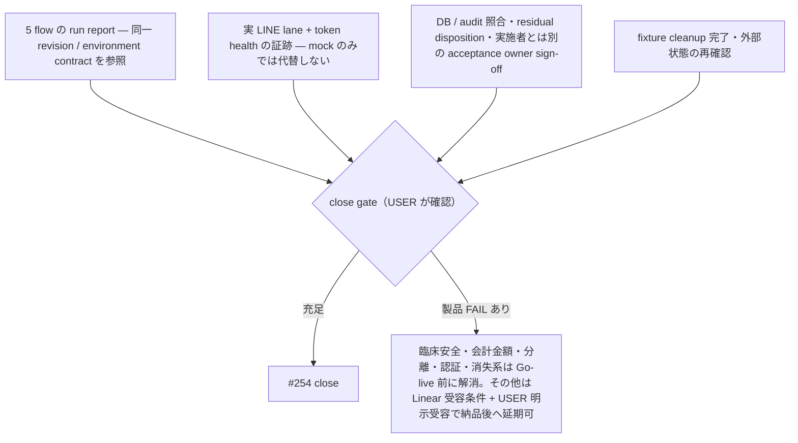

# UAT-254 close checklist

> **目的**: #254 の stable acceptance mapping を定義する。実行結果や外部 ticket 状態はこの source に保存しない。

## Rules

1. local/mock の結果だけで #254 を close しない。
2. 実 LINE、token、別担当 sign-off は USER 管理 lane で実施する。
3. 実行時に Linear/GitHub の外部 status と acceptance owner を確認する。checkout 内の ignored report の有無から外部 status を推定しない。
4. 証跡は `reports/uat-YYYY-MM-DD/` に保存する。確認済み製品 FAIL は root `todo.md#product-bugs` に記録する。環境・権限・fixture BLOCKED は bug にしない。
5. scenario Markdown に PASS/FAIL/sign-off を書かない。

## Stable acceptance mapping

[GitHub #254 本文](https://github.com/MinoruSoga/AnimalEkarte/issues/254) が要求する 5 フローを次に対応付ける。各 scenario の個別 PASS に加え、同じ対象データを引き継ぐ通し結果を run report に残す。入院/health-card の補完確認で、この 5 フローのいずれかを置き換えない。

| Flow | Scenario / 正本 | Required boundary |
|:--|:--|:--|
| 1. 受付 → 診察 → 検査 → 会計 → 締め（AM/PM/EMG） | [V02 §8–9](V02-accounting-reservation-forms.md)、[S06](S06-record-lock-audit-trail.md)、[S02](S02-exam-abnormal-highlight-lock.md)、[S08](S08-accounting-corrections.md)、[S09](S09-closing-time-boundaries.md) | 会計(医師確認)後の finalize/lock/addendum/audit、会計完了と各締め区分まで。同時刻 fixture 不足の S09 を他の PASS で代替しない |
| 2. 予約 → 来院 → 再予約 | [V02 §7–9](V02-accounting-reservation-forms.md)、[予約からカルテの業務仕様](../../../spec/reservation-to-record-flow.md) | 予約と来院時の appointment/カルテ連携を確認し、次回の予約作成・再表示まで通す。LINE 予約のキャンセル確認だけでは再予約を証明しない |
| 3. トリミング受付 → 実施 → 精算（診察併用含む） | [S11](S11-trimming-combined-accounting.md) | 未請求明細統合、単独/併用精算、appointment 解決 |
| 4. LINE 予約 → カルテ反映 | [S04](S04-liff-reservation-journey.md)、[S06](S06-record-lock-audit-trail.md)、[予約からカルテの業務仕様](../../../spec/reservation-to-record-flow.md) | S04 の予約表示だけで止めず、病院側の来院受付・カルテ作成まで引き継ぐ。mock lane と実 LINE lane を区別し、stopped/error maintenance を維持 |
| 5. 月次集計 → 帳票出力 | [月次集計・帳票仕様](../../../spec/screens/32-accounting-reports.md)、[探索ガイド §2.2](../SECTION_14_MANUAL_TEST_GUIDE.md) | `/accounting/reports` の対象月の会計集計と帳票/出力を突合。S10 の顧客別年間 LTV/CSV は別の集計で、月次帳票の代替にならない |

補完確認: 入院サイクルは [S05](S05-hospitalization-cycle.md)（cage、registration-time plan、二重退院拒否）、LIFF health/account link は [S12](S12-liff-pet-health.md)（LIFF ID 両分岐、owner isolation）。

[2026-08-20 の owner comment](https://github.com/MinoruSoga/AnimalEkarte/issues/254#issuecomment-5352193910) は、実 LINE・token health・DB/audit・residual disposition・別 sign-off を close 条件として明示している。close 条件の参照先は [BRT-45](https://linear.app/baritechllc/issue/BRT-45)、実施レーンは [BRT-68](https://linear.app/baritechllc/issue/BRT-68)。外部の現在状態は実行時に再確認する。

## Close gate

close 判断時に USER が次を確認する。

- 5 flow の最新 run report が同じ対象 revision/environment contract を参照する。
- 臨床安全・会計金額・clinic / owner / pet / staff 分離・認証権限・データ消失の製品 FAIL は Go-live 前に解消する。その他の FAIL だけ、Linear に受容条件を記録し USER が明示受容した場合に納品後対応へ延期できる（[`todo.md` の P4 延期例外](../../../../todo.md)）。
- 実 LINE lane と token health の必要証跡がある。mock のみでは代替しない。
- DB/audit の照合、残件の disposition、実施者とは別の acceptance owner の sign-off が記録されている。
- fixture と cleanup が完了し、共有/STG の既存データを変更していない。
- Linear/GitHub の外部状態を実行時に再確認した。

**close 判定の流れ:**

## 禁止

- ignored report が checkout にないことを未実施/完了の根拠にする
- 過去 comment の結果を現在の結果として転載する
- local/mock 結果だけで close する
- scenario source に dated result/sign-off を埋め込む

## 証拠対応表（2026-09-28 時点・EMR-131）

> この節は close 判断に使う記録の**所在の索引**であり、実行結果・sign-off・外部 ticket 状態の記録ではない（Rules 5 を維持する）。repo base は `c6c3cc0a4`。
>
> - `reports/uat-*` は main checkout 上の git 管理外 report で、**repo から確認できない**（下表では「repo 外」と書く）。repo 外 report の有無を未実施/完了の根拠にしない（禁止 1）。
> - 各 report の日付・環境・対象は report 本文の記載を転記しただけで、この節では再実行していない。report に revision の記載がないものは「revision 記載なし」と書く。
> - close 時は USER が最新 report と Linear/Plane/GitHub の外部状態を改めて確認する（Rules 3）。
> - 2026-09-20 時点の先行対応表（9/22 以降の run を含まない）は [LINMIG-231](../../../work/linmig-campaign-20260919/LINMIG-231.md)、実 LINE lane の準備表は [LINMIG-208](../../../work/linmig-campaign-20260919/LINMIG-208.md)。

区分: **あり** = Required boundary を満たす記録の所在を確認した / **一部** = 記録はあるが boundary・対象版・lane のいずれかが欠ける / **なし** = 記録の所在を確認できない。

### 5 業務フロー

| Flow | 区分 | 確認した記録（環境・日付・参照先） | 不足 |
|:--|:--|:--|:--|
| 1. 受付 → 診察 → 検査 → 会計 → 締め | 一部 | local disposable clinic 1・2026-09-22・revision 記載なし: 同一の合成ペットで S02（検査）→ S06（確定 / lock / addendum）→ S08（会計・緊急区分の締め）まで記録がある（repo 外 `reports/uat-2026-09-22/S02-*.md` / `S06-*.md` / `S08-*.md`）。S02 手順7b/8 は権限アカウントがなく未到達、S06 手順9（audit）は USER 確認待ち、S08 はレジ締め権限を UI で補った。S09 #1–#10 は別の合成 clinic で実施（2026-09-22、repo 外 `reports/uat-2026-09-22/S09-*.md`）、#2–#6 は revision `923bb99ba` で再確認（2026-09-23、repo 外 `reports/uat-2026-09-23/s09-fixture-teardown.md`）。V02 は clinic 2・2026-09-06 の記録のみで、締めはプレビューまで（repo 外 `reports/uat-2026-09-06/v02/SUMMARY.md`）。STG 2026-09-25 は S06 手順1（draft 自動作成）で止まった（repo 外 `reports/uat-2026-09-25/zerobase-run.md`） | 受付から AM/PM/EMG 締めまで同じ対象データ・同じ revision で通した run。S02 7b/8。S06 の audit 照合。STG/UAT lane での S06 |
| 2. 予約 → 来院 → 再予約 | 一部 | V02 予約フォーム・受付 walk-in は clinic 2・2026-09-06 で入力検証までで、保存は行っていない（repo 外 `reports/uat-2026-09-06/v02/SUMMARY.md`）。予約作成から病院側カレンダーへの表示は S04 mock lane・2026-09-22 の記録のみ（repo 外 `reports/uat-2026-09-22/S04-*.md`） | 予約 → 来院受付 → カルテ連携 → 次回予約の作成と再表示を通した run（所在なし） |
| 3. トリミング受付 → 実施 → 精算 | 一部 | S11: local clinic 1・2026-09-22〜23・revision 記載なし（repo 外 `reports/uat-2026-09-23/S11-*.md`）。未請求明細の統合、単独 / 併用精算、appointment の解決までの記録がある。トリミングを「診療中」へ進める経路、明細削除後に未請求へ戻らない件、時間帯の部分重複で製品欠陥を記録（`BUG-TRIM-KANBAN-IN-CONSULTATION` / `BUG-BILLING-UNBILLED-MR-EXCLUSION` / `BUG-RES-OVERLAP-500`。Plane への対応は [移行記録](../../../work/plane-md-migration-20260923-receipt.md)）。会計待ちへは直接 PATCH で回避して進めた。STG 2026-09-25 は未実施 | 欠陥修正後に正規経路で会計待ちへ進める再実行。fixture の teardown |
| 4. LINE 予約 → カルテ反映 | 一部 | S04: mock lane・local・2026-09-22（repo 外 `reports/uat-2026-09-22/S04-*.md`）。LIFF 予約から病院側の予約一覧・カレンダー表示、キャンセルと枠の解放までの記録がある。来院受付・カルテ作成への引き継ぎの記録はない。STG 2026-09-25 は実 LINE セッションが前提のため未到達（repo 外 `reports/uat-2026-09-25/zerobase-run.md`） | 実 LINE lane で S04 → 来院受付 → カルテ作成（S06）まで通した記録。stopped/error maintenance の確認 |
| 5. 月次集計 → 帳票出力 | 一部 | `/accounting/reports` の印刷面が白紙だった記録（2026-09-23、repo 外 `reports/uat-2026-09-23/S37-*.md`）と、修正後に印刷面が白紙でないことの確認（local clinic 2・2026-09-24、repo 外 `reports/uat-2026-09-24/README.md` の EMR-205 行） | 対象月の会計集計と月次帳票・出力の突合（所在なし） |

### Close gate 対応

ID は本節で付けた呼び名で、[Close gate](#close-gate) の各項目に対応する。

| ID | Close gate 項目 | 区分 | 確認した記録 | 不足 |
|:--|:--|:--|:--|:--|
| C-MATRIX | 5 flow の最新 run report が同じ revision / environment contract を参照する | なし | 上表の記録は 2026-09-06〜09-25 の別 run で、clinic（1 / 2 / 合成）も lane（local / mock / STG）も異なる。revision の記載は clinical E2E と S09 の再確認（`923bb99ba`）だけ | 同一 revision・同一環境契約での 5 flow run 一覧 |
| C-LINE | 実 LINE lane の証跡（mock で代替しない） | なし | S04 / S12 / V05 は mock lane の記録のみ（repo 外 `reports/uat-2026-09-22/S04-*.md`、`reports/uat-2026-09-23/S12-*.md`、`reports/uat-2026-09-06/v05/SUMMARY.md`）。STG 2026-09-25 では人間レーンとして未実施。LINMIG-208 の実行欄は未記入 | E2 の実施。実 LINE での S04 / S12（実機 2 台による隔離を含む） |
| C-TOKEN | token health の証跡 | なし | S12 手順3後半・手順4 と V05 `liff-account-link` は、mock では idToken の検証より先へ進めない（repo 外の同上 report） | 正規 idToken で link → 再連携 409 → 無効 / 期限切れ linkToken の 400 系をケースごとに残す receipt（token 値・URL は残さない） |
| C-AUDIT | DB / audit の照合 | 一部 | S08 の `audit_logs` 行 ID と S09 の `cash_register_close_adjustments` 行 ID の記録（local・2026-09-22、repo 外）。S06 手順9、S12 の連携 audit、STG の audit は USER 確認待ち | USER による `audit_logs` の read-only 照合（S01 手順6、S03、S06 手順9、S12） |
| C-RESIDUAL | 残件の disposition（製品 FAIL の Go-live 前解消 / 受容つき延期、fixture cleanup） | 一部 | 9/22〜23 の UAT で確認した製品欠陥は [移行記録](../../../work/plane-md-migration-20260923-receipt.md) で Plane の work item に対応づけ済み。延期する場合の受容条件と USER の明示受容は repo 内に記録がない。cleanup 未完の記録: S09 の合成 clinic 2 件、S11・S12 の fixture、STG 2026-09-25 の run sheet（いずれも repo 外 report に記載） | 残件ごとの disposition（Go-live 前に解消 / 受容条件 + USER 受容）。fixture cleanup の完了記録 |
| C-SIGNOFF | 実施者以外の acceptance owner の sign-off | なし | 所在なし | acceptance owner の決定と sign-off |

### 関連シナリオ・関連 ticket

| 対象 | 関連 | 区分 | 確認した記録 | 位置づけ |
|:--|:--|:--|:--|:--|
| [S01](S01-deceased-pet-guard.md) の LSTEP タグ同期 / [V05-13〜17](V05-auth-line-forms.md) | E1 = EMR-132 | なし | S01 手順6（LSTEP）は local 2026-09-22 でも STG 2026-09-25 でも対象外 / USER とされている（repo 外） | 承認済みの実 LSTEP write 対象が必要 |
| [V05](V05-auth-line-forms.md) の実 LINE 連携 | E2 = EMR-133 | なし | V05 は clinic 2・2026-09-06 の mock の記録のみ（repo 外 `reports/uat-2026-09-06/v05/SUMMARY.md`） | C-LINE / C-TOKEN の本体 |
| [S09](S09-closing-time-boundaries.md) | EMR-126 | 一部 | Flow 1 の行のとおり。teardown が失敗する件は `BUG-S09-FIXTURE-TEARDOWN` として記録 | Flow 1 の締め境界。他の PASS で代替しない |
| [V04](V04-settings-master-forms.md) | EMR-127 | 一部 | local clinic 2・2026-09-23 の再テスト。予約区分パネルで製品欠陥 2 件を記録（repo 外 `reports/uat-2026-09-23/v04-retest/README.md`） | 前提マスタの確認で、5 flow の代替ではない |
| clinical E2E（[CLINICAL-E2E-DESIGN](../CLINICAL-E2E-DESIGN.md)） | EMR-60 / EMR-128 | 一部 | revision `923bb99ba`・2026-09-23 の `--clinical` 実行で、40 件中 7 件が spec 側の不一致で green にならなかった（repo 外 `reports/uat-2026-09-23/clinical-e2e-emr128/README.md`）。その後の spec 修正を含めた再実行の記録は所在なし | L4 と 5 flow の代替ではない |

### 不足操作（担当別）

| 担当 | 操作 |
|:--|:--|
| agent（local disposable・合成 fixture。共有 / STG の既存データは変更しない） | 同一 revision で Flow 1・3・5 の通し run を取得し、S02 / S06 / S08 / S09 / S11 と月次帳票の突合を同じ対象データでつなぐ。V02 §7–9 を現行 scenario で実施する。S09 teardown の修正後に合成 clinic を cleanup する |
| QA（人手のブラウザ操作・権限別アカウント） | S02 手順7b/8（view-only と確定解除権限のアカウント）。STG lane での S06 再実行（draft 自動作成が止まった件の切り分け後）。スタッフ職種を設定したあとの STG 予約系（Flow 2）。帳票の実機印刷（S33 / S37） |
| 医院 | 医院 UAT（EMR-109 / EMR-110）で実業務の通し確認 |
| 実 LINE | E1（EMR-132）の実 LSTEP write。E2（EMR-133）の idToken / linkToken ケース。実 LINE で S04 → 来院受付 → カルテ作成。S12 の実機 2 台での隔離 |
| sign-off / USER | `audit_logs` の read-only 照合。残件の disposition と受容記録。fixture cleanup 完了の確認。clinical E2E を CI で手動実行する承認。外部状態の再確認。実施者以外の acceptance owner による sign-off |
