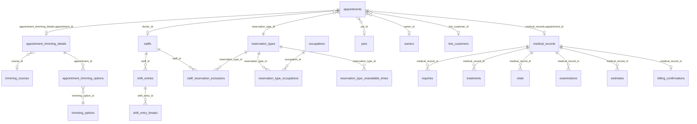

# 予約からカルテ入力までの統合フロー仕様

## 目的

LINE予約、予約管理、当日の受付という3つの予約入口と、通常カルテ、トリミングカルテの記録入力導線を `appointments` を中心に整理し、画面ごとの差分や二重作成をなくす。

この文書は、以下の仕様変更をまとめて扱うための作業ベースとする。

- 一覧から通常カルテ／トリミングカルテを作成したとき、当日の受付に正しく反映する
- 予約一覧からカルテ入力までの導線を一貫させる
- トリミング予約枠、スタッフ対応可能コース、予約時のスタッフ候補絞り込みを同じ設計で扱う

## 1. 基本認識

予約の正式な入口は以下の3つとする。

| 入口 | 利用者 | 主な用途 | 作成される中心データ |
|---|---|---|---|
| LINE予約 | 飼い主 | 外部からの事前予約 | `appointments` |
| 予約管理 | スタッフ | 院内での事前予約登録・変更 | `appointments` |
| 当日の受付 | スタッフ | 予約あり来院、予約なし来院、飛び込み、当日受付 | `appointments` |

通常カルテ一覧やトリミング一覧からの新規作成は、予約入口ではなく記録入力へのショートカットである。ただし、当日の業務として受付カンバンに表示する必要があるため、内部的には当日 `appointments` を作る、または既存 `appointments` に紐付ける。

通常カルテ作成の入口は以下の2つとする。

| 入口 | 主な用途 | 必須コンテキスト |
|---|---|---|
| 当日の受付ページ | 受付済み／診療中の患者に対して当日のカルテを開く | `appointment_id`, `pet_id`, `owner_id`, `date` |
| カルテ一覧の新規登録ページ | 受付を経由しない当日カルテ入力ショートカット | `pet_id`, `owner_id`, `date`, 必要に応じて自動作成した `appointment_id` |

カルテ一覧の新規登録ページから作成する場合も、診療日 `date` / `visit_date` を必ず持つ。日付なしで `medical_records` だけを作ると、受付表示・当日業務・履歴検索の整合性が崩れるため禁止する。

## 2. 用語

| 用語 | 実体 | 説明 |
|---|---|---|
| 予約 | `appointments` | 受付カンバン、予約管理、LINE予約の source of truth |
| 通常カルテ | `medical_records` | 診療記録。必要に応じて `appointment_id` で予約に紐付く |
| トリミングカルテ | `appointment_trimming_details` | トリミング詳細。`appointments.id` を `appointment_id` として持つ |
| 予約区分 | `reservation_types` | 一般診察、再診、トリミング等。`category` に `general` / `trimming` を持つ |
| 予約経路 | `appointments.reservation_route` | LINE、電話、受付、診察室など、予約が入った業務経路 |
| LINE顧客 | `line_customers` | LINE予約の顧客。`owners` と紐付くと appointment に `owner_id` / `pet_id` を補完できる |
| 予約区分対応職種 | `reservation_type_occupations` | 予約区分に対応できる職種。LIFF の日付可否判定に使われている |
| 受付 | reception kanban | `GET /v1/reservations?date=YYYY-MM-DD` の結果をステータス別に表示する |

## 3. 現状仕様

### 3.1 LINE予約から予約を作る

LINE予約は飼い主が外部から予約する入口である。

現状では LIFF 用の予約可能日／予約可能時間 API を使い、公開予約区分、予約ウィンドウ、営業時間、休診日、スタッフ個別シフト、既存予約、予約区分の不可時間を考慮して `appointments` を作成する。

LINE予約で作成された当日分の `appointments` は、受付カンバンの「受付予約」に表示される。

LINE予約は `line_customer_id` と `customer_fields` を持って作成される。LINE顧客が既存の飼主に紐付いている場合、best effort で `owner_id` / `pet_id` が appointment に補完される。紐付かない場合は、受付または事後処理で飼主・ペットを確定する必要がある。

### 3.2 予約管理から予約を作る

`/reservations` の予約管理画面は、共有フォーム `ReservationFormModal` から `POST /v1/reservations` を呼ぶ。

作成されるデータは `appointments` であり、当日の日付であれば受付カンバンに表示される。

現状の制約:

- 予約フォームは時刻を 15 分刻みで直接選択する
- LINE予約向けの空き枠計算 API は使っていない
- 予約区分が選択されている場合、開始時刻候補は `reservation_type_unavailable_times` の週次／特定日設定を除外して表示する
- 院内予約作成・更新 API 側でも、予約時間が `reservation_type_unavailable_times` と重なる場合は拒否する
- 担当者候補は選択日の出勤スタッフに絞る
- 予約区分を選択している場合、`staff_reservation_exclusions` にその予約区分が登録されているスタッフは院内予約フォームの担当者候補から除外する
- 院内予約作成・更新 API 側でも、担当者が選択されている場合は `staff_reservation_exclusions` を最終検証する
- フロント側でも簡易重複チェックをしているが、最終的な競合判定はバックエンドが担う

### 3.3 当日の受付から予約を作る

当日の受付は、予約あり来院を受付済みに進めるだけでなく、予約なし来院や飛び込みを当日業務として登録する入口でもある。

現状の仕様として、受付カンバンは当日 `appointments` を表示し、既存 appointment の status を進める。

現状の課題:

- 予約あり来院は既存 `appointments` の status を進める
- 予約なし来院や飛び込みを受付から作る場合の仕様が弱い
- 通常診療かトリミングかの判定が予約区分名の文字列に寄りやすい
- トリミングカードからのカルテ遷移ステータスが通常カルテと揃っていない

### 3.4 受付カンバン表示

受付カンバンは `appointments` の当日分だけを見る。

| カラム | `appointments.status` |
|---|---|
| 受付予約 | `pending`, `confirmed` |
| 受付済 | `checked_in` |
| 診療中 | `in_consultation` |
| 会計待ち | `accounting` |
| 会計済 | `completed` |

つまり、通常カルテやトリミング詳細だけを作っても受付には出ない。受付に出すには当日 `appointments` が必要。

`cancelled` と `no_show` は appointment の状態としては存在するが、通常の受付カンバン進行列には表示しない扱いとする。受付表示・検索・履歴では、表示対象ステータスを明示する必要がある。

### 3.5 受付から通常カルテを作る

受付カードから通常カルテへ遷移する場合、カードの `appointmentId` を画面 state に載せる。

現状の期待挙動:

- 既存の `appointments.id` を `medical_records.appointment_id` に保存する
- 新しい予約を追加で作らない
- `medical_records.date` は `appointments.start_time` の日付を使う
- `pet_id` / `owner_id` は appointment と一致させる
- 受付カードは「受付済」から「診療中」へ進む

### 3.6 通常カルテ一覧からカルテを作る

従来は `medical_records` だけを作っていたため、受付には出なかった。

通常カルテ一覧からの新規作成は予約入口ではなく、記録入力ショートカットである。

本来この入口では、以下を作成 payload に含める必要がある。

| フィールド | 値 |
|---|---|
| `pet_id` | 選択されたペット |
| `owner_id` | 選択されたペットの飼主 |
| `visit_date` / `date` | JST の当日、またはユーザーが指定した診療日 |
| `appointment_id` | 既存または自動作成した当日 appointment |
| `visit_type` | 初診／再診。未指定時は再診 |
| `status` | `draft` |

既知のバグ:

- カルテ一覧の新規登録ページから作成する場合に、日付などの診療コンテキストが不足することがある。
- `medical_records` だけが作成され、当日 `appointments` に紐付かない場合、受付カンバンに出ない。

### 3.7 トリミング一覧からトリミングカルテを作る

トリミング作成 API は `appointments` と `appointment_trimming_details` を同一トランザクションで作る。

トリミング一覧からの新規作成も予約入口ではなく、記録入力ショートカットである。

期待される挙動:

- 作成された `appointments.start_time` が当日なら受付に表示される
- `reservation_types.category = trimming` の予約区分として扱われる
- 受付では通常カルテではなくトリミングカルテ作成／入力へ誘導する

現状の課題:

- 作成後に受付カンバン側のキャッシュが更新されないと、即時反映されない
- デフォルト日付が UTC ベースになると、JST 早朝に前日扱いになる
- 既存の当日 trimming appointment を再利用する仕様が弱い

### 3.8 空き枠計算

バックエンドには `GenerateTimeSlots` と LIFF 用の `GET /available-times` が存在する。

現状の用途:

- LINE予約向けに予約可能日／予約可能時刻を返す
- 営業時間、休憩、スタッフ個別シフト、既存予約、予約区分の不可時間を考慮する

現状の不足:

- 院内の予約管理フォームはこの空き枠計算を使っていない
- トリミング専用の基本予約時間や予約可能枠設定を、院内 UI で統一的に扱えていない

## 4. 現状の問題

### 1. 作成入口ごとに source of truth が揺れている

予約一覧は `appointments` を作るが、通常カルテ一覧は `medical_records` を直接作っていた。

受付カンバンの source of truth は `appointments` なので、`medical_records` だけの作成では当日受付に出ない。

### 2. 通常診療とトリミングで「受付カードから何を開くか」が曖昧

同じ `appointments` でも、予約区分カテゴリによって遷移先が異なる。

- `general`: 通常カルテ
- `trimming`: トリミングカルテ

この判定を予約区分名の文字列依存にすると壊れやすい。`reservation_types.category` を使うべき。

### 3. 空き枠とスタッフ候補の責務が分散している

予約可能枠、スタッフ出勤、スタッフ対応可能コース、既存予約の競合が別々に扱われている。
院内予約フォームの担当者候補と API の作成・更新バリデーションは既存の対応不可コースを参照するが、空き枠計算とはまだ一体化していない。

予約作成時は、少なくとも以下を同時に満たす必要がある。

- 選択した予約区分が有効
- 選択した日時が予約可能枠内
- 選択したスタッフがその日に出勤している
- 選択したスタッフがその予約区分に対応可能
- 既存予約と競合しない

## 5. 改善すべき仕様

### 5.1 基本方針

改善後の原則:

1. 受付に表示される業務は必ず `appointments` を持つ
2. 通常カルテは `medical_records.appointment_id` で `appointments` に紐付ける
3. トリミングカルテは `appointment_trimming_details.appointment_id` で `appointments` に紐付ける
4. 予約区分の種別判定は `reservation_types.category` を使う
5. 院内予約フォームも空き枠計算を使う
6. スタッフ候補は、出勤状況と対応可能コースの両方で絞る

### 5.2 To-Be フロー

#### A. LINE予約から予約を作成

1. 飼い主が公開予約区分を選択する
2. 予約区分に応じて予約可能日と予約可能時刻を取得する
3. 必要に応じてスタッフを選択する
4. `POST /api/liff/:clinicId/reservations` で `appointments` を作成する
5. 当日予約であれば受付カンバンの「受付予約」に表示される

#### B. 予約管理から通常診療予約を作成

1. ユーザーが予約管理画面で予約区分を選択する
2. 予約区分に応じて予約可能時刻を取得する
3. 選択日・予約区分・時刻に対応可能なスタッフだけを候補表示する
4. `POST /v1/reservations` で `appointments` を作成する
5. 当日予約であれば受付カンバンに表示される
6. 受付済カードから通常カルテを作成する
7. `medical_records.appointment_id = appointments.id` として保存する

#### C. 予約管理からトリミング予約を作成

1. 予約区分カテゴリ `trimming` の予約区分を選択する
2. トリミング用の予約可能枠を取得する
3. トリミング対応可能なスタッフだけを候補表示する
4. `POST /v1/reservations` で `appointments` を作成する
5. 当日予約であれば受付カンバンに表示される
6. 受付済カードからトリミングカルテを作成／入力する
7. `appointment_trimming_details.appointment_id = appointments.id` として保存する

#### D. 当日の受付から予約なし来院を作成

1. 受付画面で新規受付を開始する
2. 患者、予約区分、来院区分、担当者を選択する
3. 当日 `appointments` を作成する
4. 初期 status は運用に応じて `checked_in` または `in_consultation` とする
5. 通常診療なら通常カルテ、トリミングならトリミングカルテへ遷移する

#### E. 通常カルテ一覧から当日カルテを作成

1. ユーザーがカルテ一覧からペットを選択して新規作成する
2. 画面は当日の通常診療 `appointments` を検索する
3. 未完了の既存 appointment があればそれを使う
4. なければ当日の通常診療 `appointments` を自動作成する
5. `visit_date` / `date` は JST の当日、またはユーザーが指定した診療日を使う
6. その `appointments.id` を `medical_records.appointment_id` に保存する
7. 受付カンバンには `in_consultation` または `checked_in` のカードとして表示する

推奨ステータス:

- 受付を経由せずカルテ一覧から直接作る場合は `in_consultation`
- 予約・受付の流れを重視する場合は `checked_in`

現時点の実装方針は、一覧から直接カルテ入力に入るため `in_consultation` とする。

#### F. トリミング一覧から当日トリミングカルテを作成

1. ユーザーがトリミング一覧からペットを選択して新規作成する
2. 画面は当日の trimming appointment を検索する
3. 未完了の既存 appointment があればそれを使う
4. なければ `POST /v1/trimmings` で `appointments` と `appointment_trimming_details` を作成する
5. 予約区分カテゴリは `trimming`
6. 当日分は受付カンバンに表示される
7. 受付カードからは通常カルテではなくトリミングカルテへ遷移する

### 5.3 スタッフ対応可能コース

現状:

現在は `staff_reservation_exclusions` に「対応不可コース」を保存している。

改善後:

UI と仕様上は「対応可能コース」として扱う。

推奨方針:

- DB は段階移行する
- 第1段階では既存テーブルを読み替えるか、新テーブルを追加して移行するかを決める
- 最終的には `staff_reservation_capabilities` のような肯定形テーブルにするのが望ましい

候補テーブル:

| テーブル | カラム |
|---|---|
| `staff_reservation_capabilities` | `staff_id`, `reservation_type_id` |

制約:

- `UNIQUE(staff_id, reservation_type_id)`
- スタッフと予約区分の clinic 整合性を service 層で検証

### 5.4 予約可能枠

既存資産:

- `line_reservation_settings`: 営業時間、休診日、予約ウィンドウ等
- `reservation_type_unavailable_times`: 予約区分ごとの不可時間
- `shift_entries`: スタッフの当日勤務
- `shift_entry_breaks`: スタッフの休憩
- `GenerateTimeSlots`: 空き枠生成エンジン

改善方針:

院内予約フォームも LIFF と同じ空き枠計算を使う。

必要な API:

| API | 用途 |
|---|---|
| `GET /v1/reservations/available-times?reservation_type_id=&date=&staff_id=` | 院内予約フォーム用の空き時間取得 |
| `GET /v1/reservations/available-staffs?reservation_type_id=&date=&start_time=&end_time=` | 選択枠に対応可能なスタッフ取得 |

既存の LIFF API をそのまま使うか、院内用 API として切り出すかは要検討。

## 6. 画面別の改善仕様

### 予約フォーム

変更すること:

- 予約区分を先に選ばせる
- 予約区分選択後、日付と空き枠を取得する
- 時刻は自由な 15 分刻みではなく、予約可能枠から選択する
- 担当者は対応可能かつ出勤中のスタッフだけを表示する
- トリミング予約区分を選んだ場合も同じフォームで扱う

### 受付カンバン

変更すること:

- カードの種別判定に `reservation_types.category` を使う
- `checked_in` のトリミングカードからトリミングカルテへ遷移する
- 通常診療カードは通常カルテへ遷移する
- `in_consultation` から初めてカルテ作成する導線を避ける

### 通常カルテ一覧

変更すること:

- 一覧から新規作成するときは、当日 `appointments` を作る
- すでに当日同ペットの未完了 appointment がある場合は新規作成せず、それに紐付ける
- `appointment_id` があるカルテは受付カードと同一業務として扱う

### トリミング一覧

変更すること:

- 一覧から新規作成するときは、当日 `appointments` を作る
- すでに当日同ペットの未完了 trimming appointment がある場合は新規作成せず、それに紐付ける
- デフォルト日付は JST の当日を使う

## 7. データモデル

### 7.1 現状の主要テーブル

| テーブル | 役割 | 主なカラム |
|---|---|---|
| `appointments` | 予約・受付・当日業務の中心 | `id`, `clinic_id`, `start_time`, `end_time`, `owner_id`, `pet_id`, `visit_type`, `reservation_type_id`, `doctor_id`, `is_designated`, `status`, `source`, `reservation_route`, `actual_reservation_at`, `line_customer_id`, `customer_fields` |
| `reservation_types` | 予約区分マスタ | `id`, `clinic_id`, `name`, `duration_minutes`, `category`, `reservation_visible`, `reservation_day_option`, `is_internal`, `group_id` |
| `reservation_type_occupations` | 予約区分に対応する職種 | `reservation_type_id`, `occupation_id` |
| `occupations` | 職種マスタ | `id`, `clinic_id`, `name`, `is_active` |
| `medical_records` | 通常カルテ | `id`, `clinic_id`, `record_no`, `date`, `owner_id`, `pet_id`, `doctor_id`, `appointment_id`, `status`, `visit_type`, `entered_by` |
| `appointment_trimming_details` | トリミングカルテ詳細 | `id`, `appointment_id`, `clinic_id`, `course_id`, `style_request`, `body_weight`, `body_temperature`, `used_shampoo`, `used_ribbon`, `remarks`, `style_image`, `completed_image` |
| `trimming_courses` | トリミングコース | `id`, `clinic_id`, `name`, `price`, `is_active` |
| `trimming_options` | トリミングオプション | `id`, `clinic_id`, `name`, `price`, `is_active` |
| `appointment_trimming_options` | トリミング予約とオプションの中間 | `appointment_id`, `trimming_option_id` |
| `staffs` | スタッフ | `id`, `name`, `is_active`, `staff_type`, `reservation_visible` |
| `line_customers` | LINE顧客 | `id`, `clinic_id`, `owner_id`, LINEプロフィール情報 |
| `shift_entries` | スタッフの当日勤務 | `staff_id`, `date`, `shift_type`, `start_time`, `end_time` |
| `shift_entry_breaks` | スタッフの休憩 | `shift_entry_id`, `break_start`, `break_end` |
| `staff_reservation_exclusions` | 現状の対応不可コース | `staff_id`, `reservation_type_id` |
| `line_reservation_settings` | LINE予約・空き枠設定 | `status`, 営業時間、曜日別営業時間、休診日、日次/月次上限、予約ウィンドウ、時間枠生成設定、指名なし設定、追加入力項目 |
| `reservation_type_unavailable_times` | 予約区分ごとの予約不可時間 | `reservation_type_id`, `unavailable_type`, `day_of_week`, `specific_date`, `start_time`, `end_time` |
| カルテ配下データ | 通常カルテ入力内容 | `inquiries`, `treatments`, `vitals`, `exams`, `vaccinations`, `checkups`, `estimates`, `billing_confirmations`, `billings` などが `medical_record_id` にぶら下がる |

### 7.2 現状のリレーション

### 7.3 データ上の基本制約

改善後は以下を業務制約として守る。

| 制約 | 内容 |
|---|---|
| 当日業務は appointment 必須 | 当日の受付、通常カルテ入力、トリミングカルテ入力は必ず `appointments` を持つ |
| 通常カルテは appointment に最大1件 | 同じ `appointment_id` に通常カルテを複数作らない |
| トリミング詳細は appointment に最大1件 | 同じ `appointment_id` に `appointment_trimming_details` を複数作らない |
| category で遷移先を判定 | `reservation_types.category = general` は通常カルテ、`trimming` はトリミングカルテ |
| date は JST 基準 | 当日判定、`medical_records.date`, `appointments.start_time` は JST の日付として扱う |
| owner/pet 整合性 | `medical_records.owner_id/pet_id` は紐付く appointment と矛盾させない |
| LINE予約の owner/pet 未確定 | LINE予約では `line_customer_id` が先に入り、`owner_id` / `pet_id` が未確定の場合がある。カルテ作成前に確定させる |
| pet 選択中も予約文脈を保持 | `pet_id` 未確定でペット選択を挟む場合も、`appointment_id` / `visit_date` / 遷移元 state を作成画面まで引き継ぐ |
| 既存 appointment の患者差し替え禁止 | 既に `pet_id` がある appointment に別 `pet_id` の通常カルテ／トリミング詳細を作らない。未確定 appointment のみ作成時に `pet_id` / `owner_id` を補完する |
| clinic 整合性 | appointment、reservation_type、staff、pet、owner、record は同一 clinic に属する |

### 7.4 入口別に作成・更新されるデータ

| 入口 | 作成・更新するデータ | 備考 |
|---|---|---|
| LINE予約 | `appointments`, 必要に応じて `appointment_trimming_details`, `line_customers` の追加項目 | `source = line`。公開予約区分と LIFF 空き枠設定を使う。`owner_id` / `pet_id` は best effort 補完 |
| 予約管理 | `appointments` | `source = manual`。改善後は院内用空き枠計算を使う。`reservation_route` / `actual_reservation_at` を維持する |
| 当日の受付 | `appointments.status` 更新、または新規 `appointments` 作成 | 予約なし来院は `checked_in` または `in_consultation` で作る。受付起点は `reservation_route = reception` |
| 受付から通常カルテ | `medical_records` | 既存 `appointments.id` を `appointment_id` に入れる |
| カルテ一覧から通常カルテ | `appointments` 解決または作成 + `medical_records` | 記録入力ショートカット。`visit_date` 欠落を禁止 |
| 受付からトリミングカルテ | `appointment_trimming_details` | 既存 `appointments.id` を使う |
| トリミング一覧からトリミングカルテ | `appointments` 解決または作成 + `appointment_trimming_details` | 記録入力ショートカット |

### 7.5 改善後に追加・変更を検討するモデル

#### スタッフ対応可能コース

現状の `staff_reservation_exclusions` は「対応不可」を表す。改善後は UI と業務仕様を「対応可能」に寄せる。

既存の `reservation_type_occupations` は「予約区分に対応する職種」を表す。これはスタッフ個人ではなく職種単位のガードであり、LIFF の日付可否判定で使われている。

改善後のスタッフ候補判定は、以下の2段階に分ける。

1. 予約区分に対応する職種かどうかを `reservation_type_occupations` で判定する
2. スタッフ個人がその予約区分に対応可能かどうかを `staff_reservation_capabilities` または既存 `staff_reservation_exclusions` の読み替えで判定する

候補:

| テーブル | 役割 | 主なカラム |
|---|---|---|
| `staff_reservation_capabilities` | スタッフが対応可能な予約区分 | `staff_id`, `reservation_type_id` |

移行方針の選択肢:

| 方針 | 内容 | 注意点 |
|---|---|---|
| 既存テーブル読み替え | `staff_reservation_exclusions` を維持し、UI だけ対応可能表示にする | 意味が反転しており保守しづらい |
| 新テーブル追加 | `staff_reservation_capabilities` を追加し、対応可能を正で保存する | 既存データの移行ルールが必要 |

推奨は新テーブル追加。予約時のスタッフ候補絞り込み、空き枠計算、スタッフ管理 UI の意味が揃う。

#### トリミング予約可能枠

現状の空き枠は `line_reservation_settings` と `reservation_type_unavailable_times`、スタッフシフト、既存予約で計算している。

トリミング固有の基本枠を持つ場合は、以下のいずれかを選ぶ。

| 方針 | 内容 | 注意点 |
|---|---|---|
| 既存モデル拡張 | `reservation_type_unavailable_times` と `duration_minutes` で表現する | 「9:45, 12:30, 日により14:00」のような許可枠は表現しづらい |
| availability テーブル追加 | 予約区分ごとの許可時間枠を明示的に持つ | API・UI の追加が必要だが仕様は明確 |

候補テーブル:

| テーブル | 役割 | 主なカラム |
|---|---|---|
| `reservation_type_available_slots` | 予約区分ごとの予約可能な開始時刻 | `reservation_type_id`, `day_of_week`, `specific_date`, `start_time`, `is_active` |

トリミングの基本予約時間 `9:45`, `12:30`, 日別 `14:00` などは、不可時間より許可枠として持つ方が運用に近い。

#### 予約経路・実予約日時

既存の appointment には `reservation_route` と `actual_reservation_at` がある。

| フィールド | 用途 |
|---|---|
| `reservation_route` | `line`, `phone`, `reception`, `exam_room` など、予約が入った経路 |
| `actual_reservation_at` | 実際に予約を受け付けた日時。予約日時 `start_time` とは別 |

改善後も、一覧ショートカットや当日受付から appointment を自動作成する場合は、どの入口から作られたかを失わないようにする。

## 8. バックエンドの改善仕様

### 予約作成

`POST /v1/reservations` は以下を検証する。

- 予約区分が clinic に属する
- 予約区分が active
- `start_time < end_time`
- 対象日時が予約可能枠内
- staff 指定時、その staff が出勤中
- staff 指定時、その staff の職種が予約区分に対応している
- staff 指定時、その staff が予約区分に対応可能
- 競合予約がない
- LINE予約の場合、`line_customer_id` / `customer_fields` / `is_staff_delegated` を保持する
- 院内予約の場合、`reservation_route` / `actual_reservation_at` を必要に応じて保持する

### カルテ作成

`POST /v1/medical-records` は `appointment_id` がある場合、以下を検証する。

- `appointment_id` が clinic に属する
- appointment に `owner_id` / `pet_id` が入っている
- `pet_id` / `owner_id` と appointment の紐付けが矛盾しない
- 同じ appointment に通常カルテが重複しない

`appointment_id` がないカルテ作成は、過去カルテ移行など明確な例外用途に限定する。通常の当日業務では、当日の受付ページ・カルテ一覧の新規登録ページのどちらから作成しても appointment を解決して紐付ける。

`pet_id` が未確定の予約からカルテ作成へ進む場合は、先にペット選択ページへ遷移する。この場合も選択ページの URL query と navigation state に `appointment_id` / `visit_date` を保持し、ペット選択後の作成画面へ引き継ぐ。

既存 appointment に `pet_id` / `owner_id` が設定済みの場合、カルテ作成 payload の `pet_id` / `owner_id` と一致していることを検証する。appointment 側が未設定の場合に限り、カルテ作成 payload の値で appointment を補完する。

カルテ作成 payload には、少なくとも以下を含める。

| フィールド | 必須度 | 説明 |
|---|---|---|
| `pet_id` | 必須 | 対象ペット |
| `owner_id` | 必須 | 対象飼主 |
| `visit_date` または `date` | 必須 | 診療日。JST 基準 |
| `appointment_id` | 当日業務では必須 | 受付・予約との紐付け |
| `visit_type` | 必須 | `first` / `revisit` |
| `status` | 必須 | 作成時は `draft` |

### トリミング作成

`POST /v1/trimmings` は以下を検証する。

- 予約区分カテゴリが `trimming`
- 既存 appointment に紐付ける場合、同じ appointment に trimming detail が重複しない
- 新規 appointment を作る場合、予約可能枠・スタッフ対応可能コースを検証する

## 9. 実装単位

### Phase 1: 導線の統一

- 受付カードの category 判定を `reservation_types.category` に変更
- 通常カルテ一覧からの作成で appointment を作る／既存 appointment に紐付ける
- トリミング一覧からの作成で appointment が受付に反映されることを保証する
- 作成後に `reception` query を無効化する

### Phase 2: 院内予約フォームの空き枠対応

- 院内用 available-times API を定義する
- 予約フォームで予約区分選択後に空き枠を取得する
- 予約フォームの時刻選択を空き枠ベースに変更する

### Phase 3: スタッフ対応可能コース

- 対応不可から対応可能への仕様変更
- DB 移行方針を決める
- スタッフ管理 UI を予約区分カテゴリごとに表示する
- 予約作成時に対応可能コースを検証する

### Phase 4: トリミング予約枠

- トリミング基本予約時間を設定可能にする
- 日別例外を設定可能にする
- トリミング予約区分で available-times に反映する

## 10. 未決事項

1. カルテ一覧から直接作成した appointment の初期ステータスを `checked_in` にするか `in_consultation` にするか
2. 対応可能コースを新テーブルで持つか、既存の対応不可テーブルを読み替えて段階移行するか
3. トリミング予約枠を `reservation_type_unavailable_times` の拡張で表現するか、新しい availability テーブルを作るか
4. 通常診療とトリミングの同時予約を、1 appointment で扱うか複数 appointment で扱うか
5. LINE予約と院内予約で available-times API を共通化するか、院内用に別 API を切るか
6. `staff_reservation_capabilities` を追加する場合、既存の対応不可データをどう移行するか
7. `reservation_type_available_slots` を追加する場合、LINE予約と院内予約で同じ枠を使うか
8. LINE予約で `owner_id` / `pet_id` が未確定の appointment を、受付でどのタイミングで確定必須にするか
9. 一覧ショートカットで自動作成した appointment の `reservation_route` を `reception` にするか、別値を追加するか
10. 通常カルテ配下データの保存完了と appointment status 遷移をどこまで連動させるか

## 11. 判断メモ

現時点では、受付カンバンの source of truth を `appointments` に固定するのが最も安全。

通常カルテ、トリミングカルテ、会計、入院はすべて appointment にぶら下がる業務データとして扱う。これにより「一覧から作ったものが受付に出ない」「受付カードとカルテが別物になる」問題を避けられる。
