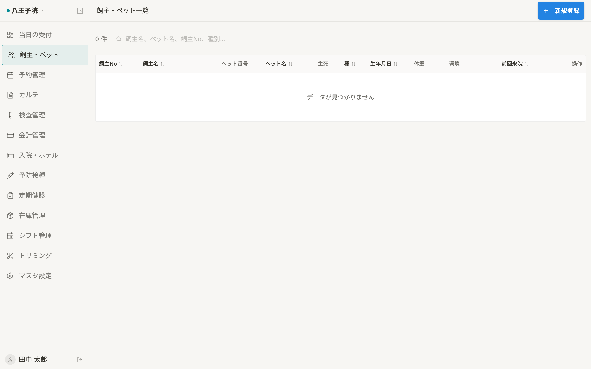

# 飼主・ペット一覧 仕様書 (Owners List)

## 概要
- **画面 of Purpose**: 登録されている飼い主および患者（ペット）の横断検索、および詳細ページへのアクセス。
- **URLパターン**: `/owners`
- **アクセス権限**: 認証済ユーザー全員（`ResourceOwners` 権限が必要）

---

## 1. 画面構成

### 1.1 高機能検索・フィルタ (`NotionFilter`)
膨大なカルテベースから、目的の個体を瞬時に特定するための UI。
- **全文検索**: 飼主名、ペット名、飼主No、ペット番号による部分一致検索。
- **動的フィルタ**: 動物種別、生存/死亡ステータス、来院期間による絞り込み。
- **並び替え**: 全ての主要カラム（No、名前、前回来院日等）での多段階ソート。

### 1.2 統合データテーブル (`DataTable`)
ページネーション（1 ページ 20 件）に対応。

| カラム | 説明 |
|:---|:---|
| **飼主名 / No** | 飼い主の基本属性。危険個体（`danger_level=high`）を飼育している場合、氏名横に **`⚠ 危険`** バッジが表示されます。 |
| **ペット名 / 番号** | ペット独自の管理番号。 |
| **臨床ステータス** | 生存（緑）、死亡（グレー）の視覚的バッジ。死亡個体の行は薄くグレーアウトされます。 |
| **種別 / 性別** | 基本属性。 |
| **最新体重 / 来院日** | 直近のカルテから自動引用。 |

---

## 2. 主要なユーザーアクション

- **詳細へのアクセス**: テーブルの行をクリック、または操作メニューから「編集」を選択。
- **クイック・アクション**: 
    - **カルテ作成**: 該当ペットの新規カルテ (`/medical-records/new`) へ直接遷移。
    - **削除**: `ConfirmDialog` を経て、関連ペットを含む飼主情報の論理削除。

---

## 3. 技術仕様

### 3.1 描画の最適化
- **遅延フィルタリング**: `useDeferredValue` により、タイピング中のリスト更新によるもたつきを完全に排除しています。
- **ステート管理**: 検索条件や現在のページ番号は URL のクエリパラメータと完全に同期。ブラウザの「戻る」ボタンで前回の検索結果を復元可能です。

### 3.2 臨床ロジック
- **危険度バッジ**: ペットマスタの `danger_level` カラムを参照。院内スタッフの安全を守るための最重要インジケータとして機能します。

### API連携
| メソッド | エンドポイント | 用途 | 必須権限 | 必須アクション |
|:---|:---|:---|:---|:---|
| GET | `/api/v1/owners` | フィルタ・ソート済みの飼主データ取得 | `owners` | `view` |
| DELETE | `/api/v1/owners/:id` | 飼主情報の論理削除 | `owners` | `delete` |

---
