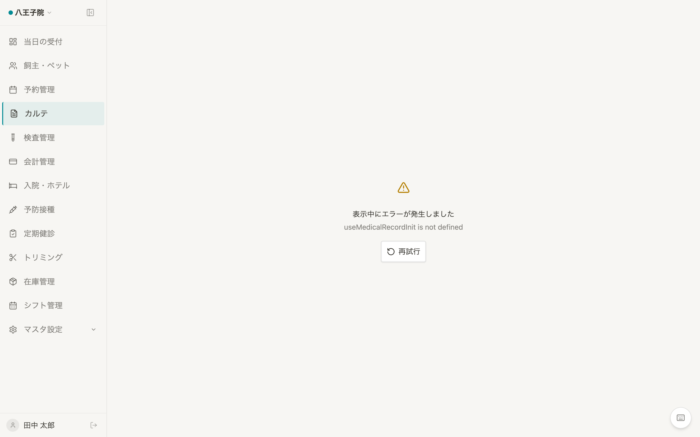

# カルテ入力/編集 仕様書 (Medical Record Form)

## 概要
- **画面の目的**: 患者（ペット）の診療内容を臨床的標準（SOAPS）に基づき詳細に記録し、処置・検査・会計までを統合管理する。
- **URLパターン**: 
  - 新規作成: `/medical-records/new?petId=xxx`
  - 編集: `/medical-records/:id`
- **アクセス権限**: 認証済ユーザー全員（操作権限は `usePermission` で制御）

---

## 1. 臨床的 9 タブ構成

診察の流れを分断することなく、専門的な情報を整理して記録するための多層タブ構造を採用しています。

| No | タブ名 | 主要な入力・機能 |
|:---:|:---|:---|
| **1** | **問診** | 主訴（マスタ連動）、カテゴリ、過去の治療歴の参照。 |
| **2** | **診察/治療プラン** | 身体検査（O）、アセスメント（A）、**次回来院推奨日**の設定。 |
| **3** | **治療** | 処置、処方、物販。ここで入力した項目は会計へ自動転送されます。 |
| **4** | **予防接種** | ワクチン種別、ロット番号、接種証明書の管理。 |
| **5** | **定期健診** | 身体測定、一般健診結果。期限切れアラートと連動。 |
| **6** | **検査** | 血液検査、尿検査等の数値入力。基準値超脱の自動検知。 |
| **7** | **画像** | 患部写真、レントゲン・エコー画像、紹介状（PDF）等の管理。 |
| **8** | **見積書** | 診察室から即座に発行可能な概算見積。 |
| **9** | **会計(医師確認)** | 診療内容の最終確定。ステータスを「確定済」へ移行。 |

---

## 2. 主要な臨床・安全機能

### 2.1 患者情報カード (`PatientInfoCard`)
画面最上部に常駐し、常に臨床背景を視覚化します。
- **臨床アラート**: 死亡 (`deceased`) 状態の強調表示、慢性疾患の有無。
- **属性同期**: 年齢、最新体重、担当医、保険情報を網羅。
- **LINE連携**: Lステップ同期状態をアイコン表示。

### 2.2 ハイブリッド保存ロジック
データの整合性と UI の応答性を両立するため、2 段階の保存プロセスを実行します。
1.  **メイン保存**: React 19 Action により、カルテ本体の状態を保存。
2.  **タブ別同期**: 保存成功をトリガーに、現在開いているタブ固有のデータ（診断名、見積明細等）をバックグラウンドで自動同期。

### 2.3 臨床安全ガード
- **離脱防止 (`NavigationBlocker`)**: 未保存の変更がある状態でページを離れようとすると、破棄の確認を強制。
- **死亡ペット保護**: 死亡済みのペットに対する新規カルテ作成や、誤った予約変更を物理的にブロック。

---

## 3. 技術仕様

### コンポーネント構成
- **`MedicalRecordForm`**: メインコンテナ。
- **`UnifiedTabs`**: タブの状態（マウント状況）を維持しつつ、不要な再描画を抑える隠し制御部品。
- **`VitalsModal`**: バイタル推移グラフのオーバーレイ表示。

### API連携
| メソッド | エンドポイント | 用途 |
|:---|:---|:---|
| GET | `/api/v1/medical-records/:id` | カルテ詳細取得。 |
| POST | `/api/v1/medical-records` | 新規保存（ID発番・URL置換）。 |
| GET | `/api/v1/medical-records/pets/:id/history` | 同ペットの過去履歴の参照表示。 |

---
