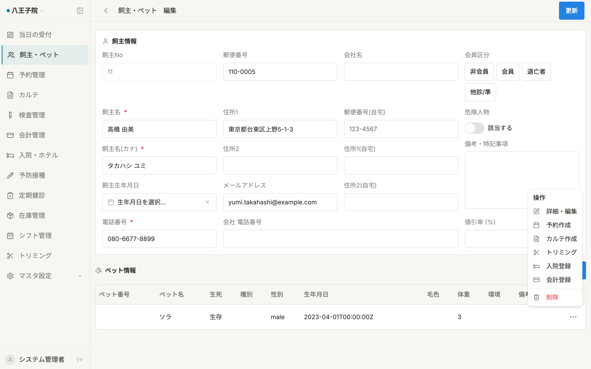

# 共通ダイアログ・共有コンポーネント 仕様書

本ドキュメントでは、複数の画面から呼び出される共有UIコンポーネントおよび、複雑な業務ロジックを持つ共通ダイアログを定義します。

---

## 1. 診療項目検索ダイアログ（`TreatmentSearchDialog`）

### 概要
マスタから「診察・検査・処置・予防・入院・薬剤」を検索し、カルテや入院プラン、見積書等の明細テーブルに追加するための共通検索UI。

### 構成・機能
- **検索**: コードまたは名称によるインクリメンタル検索（`Command` コンポーネントベース）。
- **カテゴリ切替**: 診察、検査、処置、予防、健診、入院、薬品のタブまたはバッジによるフィルタリング。
- **表示項目**: 項目名、単価（税込）、マスタカテゴリ。

---

## 2. 飼主検索モーダル（`OwnerSearchModal`）

### 概要
予約作成や飼主情報の変更時に、既存の飼主データベースから対象を検索・選択するためのモーダル。

### 表示・検索項目
- **検索対象**: 飼主名、飼主No、電話番号。
- **結果リスト**: 飼主No（等幅）、飼主名、電話番号、住所（省略表示）。
- **確認フロー**: 選択時に `ConfirmDialog` を表示し、誤操作を防止。

---

## 3. マスタ選択モーダル（`MasterSelectModal`）

### 概要
マスタデータ（動物種、スタッフ、保険、予約区分等）をリスト形式で表示し、単一項目を選択するための汎用モーダル。

### 特徴
- **Notionスタイル**: クリーンなリスト形式。
- **動的フィルタ**: キーワードによる絞り込み機能。
- **汎用性**: `useMasterItems` フックと連動し、あらゆるマスタカテゴリに対応。

---

## 4. 確認ダイアログ（`ConfirmDialog`）

### 概要
削除、取り消し、状態変更などの破壊的または重要な操作の前に表示される、システム共通の確認用UI。

### プロパティ
- **variant**: `default` (青) または `destructive` (赤) でアクションの重要度を表現。
- **title / description**: 操作内容に応じた具体的な警告文を注入。
- **confirmLabel**: 「削除」「実行する」等の肯定アクションラベル。

---

## 5. ナビゲーションブロック（`NavigationBlocker`）

### 概要
フォームに入力変更（`isDirty`）がある状態でページを離脱しようとした際、ブラウザの離脱および SPA 内の遷移をトラップして確認ダイアログを表示する。

### 実装
React Router 7 の `unstable_useBlocker` を内部で使用。保存中（`isSaving`）はブロックを一時的に無効化する制御を含む。

---

## 6. 患者情報カード（`PatientInfoCard`）

### 概要
カルテや入院詳細、トリミングなどの画面上部に常駐する、対象ペットと飼主の基本情報を集約したスティッキーコンポーネント。

### 表示項目
- ペット名（性別アイコン付）、種別、品種
- 飼主名、前回来院日、次回来院予定、担当医
- 現在の体重（最新バイタル）、保険情報
- **ステータス**: 死亡済みペット、有効期限切れ保険など、臨床上のリスクがある場合にアイコンと警告色（`text-destructive`）で通知。
- **スタッフ選択**: `staffButtonId` プロパティを指定することで、担当スタッフ未選択時のバリデーションエラー時にオートフォーカスを当てることが可能。
- **来院種別（カルテ用）**: `reservationType` プロパティにより、「初診」「再診」「緊急」「往診」のサイクリックな切り替えをサポート。

---

## 7. 品種サジェスト (`BreedSuggestion`)

### 概要
動物種（犬、猫、エキゾチック等）に応じて、代表的な品種名のリストを `Command` コンポーネントで提案する共通入力補助 UI。

### 構成・機能
- **動的リスト**: `useMasterItems("breed")` から取得したマスタデータを種別ごとにフィルタリング。
- **自由入力**: サジェストにない品種も直接入力して保存可能。

---

## 8. フィルタリング・インジケーター (`FilteringIndicator`)

### 概要
`useDeferredValue` による非同期のリスト計算中に、テーブル全体の透過度を下げて「計算中」であることを視覚的にフィードバックするラッパーコンポーネント。

---

## 9. 属性入力 (`PropInput`)

### 概要
Notion スタイルのプロパティ行 (`PropertyRow`) で使用される、背景透過・ボーダーレスの入力コンポーネント。

### 主な利用箇所
- 医院マスタ設定、スタッフマスタ設定などのサイドパネル。

---

## 10. 日付ピッカー（`NotionDatePicker`）

### 概要
Notion スタイルの日付入力コンポーネント。カレンダーポップオーバーで日付を選択。

### 主な利用箇所
- 予防接種フォーム（接種日・次回予定日）
- 検査フォーム
- 定期健診フォーム
- 入院登録フォーム（入院開始日・退院予定日）
- 会計詳細（会計予定日）

---

## 11. バイタル記録ダイアログ (`VitalDialog`)

### 概要
入院管理やカルテ入力中に、患者の体温、心拍数、呼吸数、体重などのバイタルサインを記録するためのダイアログ。

### 入力項目
- **記録時刻**: デフォルトは現在時刻。
- **体温 (℃)**: `NumberInput` (step 0.1)。
- **体重 (kg)**: `NumberInput` (step 0.01)。
- **心拍数 (/min)**: `NumberInput`。
- **呼吸数 (/min)**: `NumberInput`。
- **メモ**: `Textarea`。

---

## 12. 行アクション・ドロップダウン（`RowActionDropdown`）

### 概要
データテーブルの各行の末尾に配置される、編集・詳細表示・削除などのアクションを集約したメニュー。

### 機能
- **動的アクション**: 各データのステータス（確定済/未確定など）に応じてメニュー項目を切り替え。
- **ショートカット**: Notion 風のクリーンな UI で、直感的な操作をサポート。
