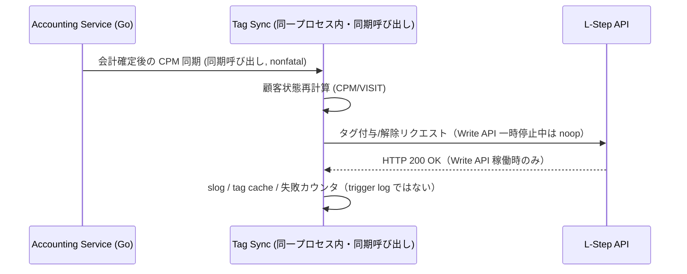

# LINE連携・MA アーキテクチャ (LINE & Marketing Automation)

> **目的**: LINE連携の同期フロー・認証設計を定義する。
> **読者**: バックエンド実装者。
> **タイミング**: 同期フローの実装・確認時。

> **Animal Ekarte**: LINE プラットフォームを活用した顧客体験の最大化
> **最新更新**: 2026-07-30

---

> **注記 (2026-07-10)**: Lステップへの Write API（タグ付与・タグ解除・プロパティ更新）は現在一時停止中（noop）。判定ロジック・アプリ内 DB 更新・監査ログは通常どおり継続するが、Lステップ側の実タグは書き換わらない。詳細: [`docs/ops/deploy/LSTEP_WRITE_API_PAUSE.md`](../../ops/deploy/LSTEP_WRITE_API_PAUSE.md)

---

## 1. 二大機能の棲み分け

本システムにおける LINE 連携は、目的の異なる 2 つのサブシステムで構成されます。

### 1.1 LINE 予約システム (Inbound)
- **目的**: 飼い主からの「予約」を自動で受け付ける。
- **技術**: LIFF (LINE Front-end Framework) + React 19。
- **フロー**: LIFF 経由で空き枠を検索し、カルテ側の `appointments` テーブルへ直接書き込み。

### 1.2 Lステップ連携 (Outbound / CRM)
- **目的**: 病院側から「最適な情報」を自動で届ける。
- **技術**: (a) イベント起因の同一リクエスト内タグ同期、(b) scheduled/cron の multi-resource バッチ、(c) 手動送信後の副次タグ付与、および L-Step API / Messaging API。
- **フロー**: 会計・診察等のイベントや定時バッチでタグ／配信トリガーを更新し、Lステップ側シナリオを起動する。経路ごとに失敗契約が異なる（§3・§4）。

---

## 2. 認証・紐付けロジック (Identity Mapping)

顧客の特定は以下の 3 段階で行われます。

1.  **LIFF ログイン**: LINE アプリからの初回アクセス時に `line_user_id` を取得。
2.  **紐付け (Linking)**: 既存の飼主情報の「電話番号」または「飼主No」を用いて名寄せ。
3.  **トークン管理**: `line_link_tokens` テーブルにより、セキュアな紐付けプロセスを保証。

---

## 3. イベント起因タグ同期のライフサイクル（request-local）

会計確定などの **本処理** に対し、CPM/VISIT 等のタグ同期は同一リクエスト内で同期呼び出しされる（別プロセス/goroutine のワーカーではない）。これは **request-local nonfatal secondary notification** 契約である。

- タグ同期失敗はログするだけで、会計など本処理の成功契約を反転させない。
- 記録先は `slog` とタグキャッシュ（必要時は API 失敗カウンタ）。**`lstep_delivery_trigger_log` には書かない**（当該テーブルは自動配信トリガー専用。`audit_logs` もこの ordinary-sync 経路では書かない）。
- Write API 一時停止中は外部 HTTP write は noop。アプリ内判定・DB 更新は継続する。

---

## 4. 失敗契約の三分法（LSTEP）

LSTEP 周辺の「best-effort」は一語で混同しない。経路ごとに契約を固定する（正本: `backend/CODING_RULES.md` の LSTEP バッチ条項）。

| 契約 | 代表経路 | 失敗時の振る舞い | 耐久計上 |
|:---|:---|:---|:---|
| **1. scheduled multi-resource best effort** | 定時バッチ（delivery / dormant / LTV / health-prevention 等）。multi-clinic・multi-owner・multi-trigger | 必須 dependency 欠落・clinic 一覧取得失敗は fail-closed。1 件失敗後も他 resource は続行 | 必須。`(processed, errs)` と durable 向け `BatchRunResult`（`Processed = Succeeded + Failed`）。error ログ、`processed_count`/`error_count` 監査、Partial/Failed 時の手動 fallback・再実行/idempotency |
| **2. single-owner propagation** | 1 飼主分のタグ同期本体（`SyncCPMStageTag` / VISIT / food 等）。バッチ内の 1 owner 処理も含む | 望ましい Add/Remove の失敗は **呼び出し元へ error 伝播**し、上位の Failed 計上に載せる。stale 除去の部分失敗は desired add を継続しつつ失敗計上を残す | 呼び出し元が batch なら `BatchRunResult`/監査へ。単独呼び出しなら error 返却で観測可能にする（silent `return 0, nil` は新規禁止） |
| **3. request-local nonfatal secondary notification** | 会計確定後の CPM 同期、LINE 手動送信後の purpose タグ付与など、本処理に付随する副次 side-effect | 本処理は成功のまま。副次失敗はログ必須で本処理を rollback しない | 本処理の成功契約を反転させない。副次失敗の収束/補償を短く明示（次回イベント再同期・失敗カウンタ等）。**trigger log は使わない** |

### 4.1 自動配信トリガーバッチと durable 計上

- 10:00 JST の配信トリガー等は契約 1。owner ループは continue-on-error、1 owner の失敗は契約 2 で伝播し上位が Failed に加算する。
- 配信実行・除外・優先度抑制・API 失敗は `lstep_delivery_trigger_log` に残し、配信監視画面の観測源とする。
- 候補 owner に対する owner / 当日 claim / 抑制 / tag-cache 読みは **clinic スコープの bulk-read を必須**とする（owner 数に比例した N+1 読みは不可。メモリは bounded。opt-out・suppression・daily-claim 意味論は維持）。

### 4.2 停止手段

- clinic 単位の `is_sync_enabled=false` で同期・配信バッチ対象から外す。
- Write API は運用判断により全体 noop（[`LSTEP_WRITE_API_PAUSE.md`](../../ops/deploy/LSTEP_WRITE_API_PAUSE.md)）。再開後も `is_sync_enabled=false` の clinic はサービス層で抑止する。

---

## 5. データ分離とセキュリティ

- **マルチテナント**: 各クリニックの API キーは AES-256-GCM で暗号化され、`clinic_integrations` テーブルに隔離保存されます。
- **流量**: Messaging API / Lステップ API のレート制限はクライアント実装の固定方針と運用監視で扱う。**バッチとリアルタイムを動的に切り替える rate adjustment は持たない**（未実装の動的流量調整を前提にしない）。

---
