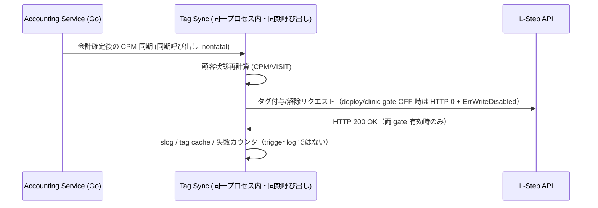

# LINE連携・MA アーキテクチャ (LINE & Marketing Automation)

> **目的**: LINE連携の同期フロー・認証設計を定義する。
> **読者**: バックエンド実装者。
> **タイミング**: 同期フローの実装・確認時。

> **Animal Ekarte**: LINE プラットフォームを活用した顧客体験の最大化
> **最新更新**: 2026-07-30

---

> **注記 (2026-07-10 / 更新 2026-07-31)**: Lステップへの Write API（タグ付与・タグ解除・プロパティ更新）は **deploy gate `LSTEP_WRITE_API_ENABLED`（既定 OFF）+ clinic `is_sync_enabled` の二重 gate** で抑止される。gate OFF 時は外部 HTTP write を送らず `ErrWriteDisabled` を返す（silent nil 成功ではない）。その後のローカル DB / cache / audit / logging は呼び出し元ごとの失敗契約に従い、継続を一律には保証しない。詳細: [`docs/ops/deploy/LSTEP_WRITE_API_PAUSE.md`](../../ops/deploy/LSTEP_WRITE_API_PAUSE.md)

---

## 1. 二大機能の棲み分け

本システムにおける LINE 連携は、目的の異なる 2 つのサブシステムで構成されます。

### 1.1 LINE 予約システム (Inbound)
- **目的**: 飼い主からの「予約」を自動で受け付ける。
- **技術**: LIFF (LINE Front-end Framework) + React 19。
- **フロー**: LIFF 経由で空き枠を検索し、カルテ側の `appointments` テーブルへ直接書き込み。

### 1.2 Lステップ連携 (Outbound / CRM)
- **目的**: 病院側から「最適な情報」を自動で届ける。
- **技術**: (a) イベント起因の同一リクエスト内タグ同期、(b) scheduled/cron の multi-resource バッチ、(c) 手動送信後の副次タグ付与、および L-Step API / Messaging API。
- **フロー**: 会計・診察等のイベントや定時バッチでタグ／配信トリガーを更新し、Lステップ側シナリオを起動する。経路ごとに失敗契約が異なる（§3・§4）。

---

## 2. 認証・紐付けロジック (Identity Mapping)

顧客の特定は次の経路で行われる（**予約時の氏名+電話による自動オーナー紐付けは行わない** — SEC-CS2-F02）。

1.  **LIFF ログイン**: LINE アプリからのアクセス時に ID トークン検証で `line_user_id` / `line_customers` を解決（未登録なら顧客行を作成）。
2.  **スタッフ発行 link token**: `POST /api/v1/owners/:id/line/link-token` で raw token を一度だけ返し、DB には unpadded base64url SHA-256 digest のみ保存（`line_link_tokens`）。
3.  **LIFF 紐付け**: `POST /api/liff/:clinicId/link` が `link_token` + `line_id_token` で自己認証し、飼主へ LINE User ID を紐付け（既存 LINE ID の上書き拒否、token 単回 CAS 消費、監査同一 TX）。
4.  **スタッフ手動リンク**: `PATCH .../line-customers/:id/link-owner` による院内オペレーション。

### Webhook 契約（要約）

Webhook（`POST /api/line/webhook`）の **executable SoT は code/tests**（`backend/internal/lstep/line_link_service.go` の `HandleWebhook` と `line_link_service_test.go` / signature routing tests）。本書は境界の要約と正本リンクのみを持つ（PO FINAL R-01: option B。詳細 event 表は二重管理しない）。

| 項目 | 現行境界 |
|------|----------|
| 処理する event type | `follow` / `unfollow` のみ（business side effect あり） |
| その他 event type | business side effect なしで skip（成功扱い） |
| 署名 | event 処理より先。`destination`（bot user ID）で clinic を一意解決し、当該 clinic の secret で最大 1 回 HMAC。全 clinic 走査・複数 secret 試行・destination 欠落時の推測は禁止 |
| 署名不成立 / setting 欠落 / DB failure | fail-closed（invalid input / 処理拒否） |
| 新規 event / message reply | 本要約から発明しない。set 変更時は code・contract test・本要約を同時更新 |

Provisioning・疎通・停止の gate checklist は [setup.md](./setup.md) を参照。そこでは Messaging API / LINE Login (LIFF) / webhook / destination routing / deploy・clinic gate / rollback を個別に確認する。

---

## 3. イベント起因タグ同期のライフサイクル（request-local）

会計確定などの **本処理** に対し、CPM/VISIT 等のタグ同期は同一リクエスト内で同期呼び出しされる（別プロセス/goroutine のワーカーではない）。これは **request-local nonfatal secondary notification** 契約である。

- タグ同期失敗はログするだけで、会計など本処理の成功契約を反転させない。
- 記録先は `slog` とタグキャッシュ（必要時は API 失敗カウンタ）。**`lstep_delivery_trigger_log` には書かない**（当該テーブルは自動配信トリガー専用。`audit_logs` もこの ordinary-sync 経路では書かない）。
- Write dual-gate 無効時は外部 HTTP write を送らない（`ErrWriteDisabled`）。後続のローカル DB / cache / audit / logging は呼び出し元の失敗契約に従う。たとえば手動タグ追加は外部 AddTag 成功後に cache / audit を更新するため、`ErrWriteDisabled` 時には継続しない。

---

## 4. 失敗契約の三分法（LSTEP）

LSTEP 周辺の「best-effort」は一語で混同しない。経路ごとに契約を固定する（正本: `backend/CODING_RULES.md` の LSTEP バッチ条項）。

| 契約 | 代表経路 | 失敗時の振る舞い | 耐久計上 |
|:---|:---|:---|:---|
| **1. scheduled multi-resource best effort** | 定時バッチ（delivery / dormant / LTV / health-prevention 等）。multi-clinic・multi-owner・multi-trigger | 必須 dependency 欠落・clinic 一覧取得失敗は fail-closed。1 件失敗後も他 resource は続行 | 必須。`(processed, errs)` と durable 向け `BatchRunResult`（`Processed = Succeeded + Failed`）。error ログ、`processed_count`/`error_count` 監査、Partial/Failed 時の手動 fallback・再実行/idempotency |
| **2. single-owner propagation** | 1 飼主分のタグ同期本体（`SyncCPMStageTag` / VISIT / food 等）。バッチ内の 1 owner 処理も含む | 望ましい Add/Remove の失敗は **呼び出し元へ error 伝播**し、上位の Failed 計上に載せる。stale 除去の部分失敗は desired add を継続しつつ失敗計上を残す | 呼び出し元が batch なら `BatchRunResult`/監査へ。単独呼び出しなら error 返却で観測可能にする（silent `return 0, nil` は新規禁止） |
| **3. request-local nonfatal secondary notification** | 会計確定後の CPM 同期、LINE 手動送信後の purpose タグ付与など、本処理に付随する副次 side-effect | 本処理は成功のまま。副次失敗はログ必須で本処理を rollback しない | 本処理の成功契約を反転させない。副次失敗の収束/補償を短く明示（次回イベント再同期・失敗カウンタ等）。**trigger log は使わない** |

### 4.1 自動配信トリガーバッチと durable 計上

- 10:00 JST の配信トリガー等は契約 1。owner ループは continue-on-error、1 owner の失敗は契約 2 で伝播し上位が Failed に加算する。
- 配信実行・除外・優先度抑制・API 失敗は `lstep_delivery_trigger_log` に残し、配信監視画面の観測源とする。
- 候補 owner に対する owner / 当日 claim / 抑制 / tag-cache 読みは通常、clinic スコープの bulk-read を使う。production には bulk failure 時の per-owner day-log / owner / tag-cache read fallback が残る。この degraded mode は owner 数に比例する既知の性能 gap であり、実行上限・metrics を備えた bounded fallback への整理または source からの除去が必要。opt-out・suppression・daily-claim の意味論と bounded memory は維持する。

### 4.2 停止手段

- clinic 単位の `is_sync_enabled=false` で同期・配信バッチ対象から外す。
- Write API は deploy kill switch `LSTEP_WRITE_API_ENABLED` と clinic flag の二重 gate（[`LSTEP_WRITE_API_PAUSE.md`](../../ops/deploy/LSTEP_WRITE_API_PAUSE.md)）。再開後も `is_sync_enabled=false` の clinic はサービス層で抑止する。

---

## 5. データ分離とセキュリティ

- **マルチテナント**: 各クリニックの API キーは AES-256-GCM で暗号化され、`clinic_integrations` テーブルに隔離保存されます。
- **流量**: Messaging API / Lステップ API のレート制限はクライアント実装の固定方針と運用監視で扱う。**バッチとリアルタイムを動的に切り替える rate adjustment は持たない**（未実装の動的流量調整を前提にしない）。

---
