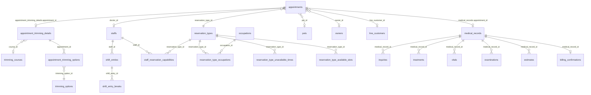

# 予約からカルテ入力までの統合フロー仕様

> **目的**: 予約からカルテ作成までの統合フロー詳細を定義する(詳細は次節)。
> **読者**: 予約/カルテ機能の実装者。
> **タイミング**: 予約統合フローの実装・改修時。

## 目的

LINE予約、予約管理、当日の受付という3つの予約入口と、通常カルテ、トリミングカルテの記録入力導線を `appointments` を中心に整理し、画面ごとの差分や二重作成をなくす。

この文書は、以下の仕様変更をまとめて扱うための作業ベースとする。

- 一覧から通常カルテ／トリミングカルテを作成したとき、当日の受付に正しく反映する
- 予約一覧からカルテ入力までの導線を一貫させる
- トリミング予約枠、スタッフ対応可能コース、予約時のスタッフ候補絞り込みを同じ設計で扱う

## 1. 基本認識

予約の正式な入口は以下の3つとする。

| 入口 | 利用者 | 主な用途 | 作成される中心データ |
|---|---|---|---|
| LINE予約 | 飼い主 | 外部からの事前予約 | `appointments` |
| 予約管理 | スタッフ | 院内での事前予約登録・変更 | `appointments` |
| 当日の受付 | スタッフ | 予約あり来院、予約なし来院、飛び込み、当日受付 | `appointments` |

通常カルテ一覧やトリミング一覧からの新規作成は、予約入口ではなく記録入力へのショートカットである。ただし、当日の業務として受付カンバンに表示する必要があるため、内部的には当日 `appointments` を作る、または既存 `appointments` に紐付ける。

通常カルテ作成の入口は以下の2つとする。

| 入口 | 主な用途 | 必須コンテキスト |
|---|---|---|
| 当日の受付ページ | 受付済み／診療中の患者に対して当日のカルテを開く | `appointment_id`, `pet_id`, `owner_id`, `date` |
| カルテ一覧の新規登録ページ | 受付を経由しない当日カルテ入力ショートカット | `pet_id`, `owner_id`, `date`, 必要に応じて自動作成した `appointment_id` |

カルテ一覧の新規登録ページから作成する場合も、診療日 `date` / `visit_date` を必ず持つ。日付なしで `medical_records` だけを作ると、受付表示・当日業務・履歴検索の整合性が崩れるため禁止する。

## 2. 用語

| 用語 | 実体 | 説明 |
|---|---|---|
| 予約 | `appointments` | 受付カンバン、予約管理、LINE予約の source of truth |
| 通常カルテ | `medical_records` | 診療記録。必要に応じて `appointment_id` で予約に紐付く |
| トリミングカルテ | `appointment_trimming_details` | トリミング詳細。`appointments.id` を `appointment_id` として持つ |
| 予約区分 | `reservation_types` | 一般診察、再診、トリミング等。`category` に `general` / `trimming` を持つ |
| 予約経路 | `appointments.reservation_route` | LINE、電話、受付、診察室など、予約が入った業務経路 |
| LINE顧客 | `line_customers` | LINE予約の顧客。`owners` と紐付くと appointment に `owner_id` / `pet_id` を補完できる |
| 予約区分対応職種 | `reservation_type_occupations` | 予約区分に対応できる職種。LIFF の日付可否判定に使われている |
| 受付 | reception kanban | `GET /v1/reservations?date=YYYY-MM-DD` の結果をステータス別に表示する |

## 3. 現状仕様

### 3.1 LINE予約から予約を作る

LINE予約は飼い主が外部から予約する入口である。

現状では LIFF 用の予約可能日／予約可能時間 API を使い、公開予約区分、予約ウィンドウ、営業時間、休診日、スタッフ個別シフト、既存予約、予約区分の不可時間を考慮して `appointments` を作成する。

LINE予約で作成された当日分の `appointments` は、受付カンバンの「受付予約」に表示される。

LINE予約は `line_customer_id` と `customer_fields` を持って作成される。LINE顧客が既存の飼主に紐付いている場合、best effort で `owner_id` / `pet_id` が appointment に補完される。紐付かない場合は、受付または事後処理で飼主・ペットを確定する必要がある。

### 3.2 予約管理から予約を作る

`/reservations` の予約管理画面は、共有フォーム `ReservationFormModal` から `POST /v1/reservations` を呼ぶ。

作成されるデータは `appointments` であり、当日の日付であれば受付カンバンに表示される。

現状の制約:

- 予約フォームは時刻を 15 分刻みで直接選択する
- 院内用 `GET /v1/reservations/available-times` で LIFF と同じ空き枠計算を使う
- 予約区分が選択されている場合、開始時刻候補は `reservation_type_unavailable_times` の週次／特定日設定を除外して表示する
- 院内予約作成・更新 API 側でも、予約時間が `reservation_type_unavailable_times` と重なる場合は拒否する
- 担当者候補は選択日の出勤スタッフに絞る
- 予約区分を選択している場合、`staff_reservation_capabilities` にその予約区分が登録されているスタッフだけを候補にする
- 院内予約作成・更新 API 側でも、担当者が選択されている場合は `staff_reservation_capabilities` を最終検証する
- フロント側でも簡易重複チェックをしているが、最終的な競合判定はバックエンドが担う

### 3.3 当日の受付から予約を作る

当日の受付は、予約あり来院を受付済みに進めるだけでなく、予約なし来院や飛び込みを当日業務として登録する入口でもある。

現状の仕様として、受付カンバンは当日 `appointments` を表示し、既存 appointment の status を進める。

解消済みの課題:

- 予約あり来院は既存 `appointments` の status を進める
- 予約なし来院や飛び込みを受付から作る場合は、当日 `appointments` を `checked_in` / `reservation_route = reception` として作成する
- 通常診療かトリミングかの判定は `reservation_types.category` に寄せる
- トリミングカードからのカルテ遷移は通常カルテと同じく `checked_in` の受付済カードから行う

### 3.4 受付カンバン表示

受付カンバンは `appointments` の当日分だけを見る。

| カラム | `appointments.status` |
|---|---|
| 受付予約 | `pending`, `confirmed` |
| 受付済 | `checked_in` |
| 診療中 | `in_consultation` |
| 会計待ち | `accounting` |
| 会計済 | `completed` |

つまり、通常カルテやトリミング詳細だけを作っても受付には出ない。受付に出すには当日 `appointments` が必要。

`cancelled` と `no_show` は appointment の状態としては存在するが、通常の受付カンバン進行列には表示しない扱いとする。受付表示・検索・履歴では、表示対象ステータスを明示する必要がある。

### 3.5 受付から通常カルテを作る

受付カードから通常カルテへ遷移する場合、カードの `appointmentId` を画面 state に載せる。

現状の期待挙動:

- 既存の `appointments.id` を `medical_records.appointment_id` に保存する
- 新しい予約を追加で作らない
- `medical_records.date` は `appointments.start_time` の日付を使う
- `pet_id` / `owner_id` は appointment と一致させる
- 受付カードは「受付済」から「診療中」へ進む

### 3.6 通常カルテ一覧からカルテを作る

従来は `medical_records` だけを作っていたため、受付には出なかった。

通常カルテ一覧からの新規作成は予約入口ではなく、記録入力ショートカットである。

本来この入口では、以下を作成 payload に含める必要がある。

| フィールド | 値 |
|---|---|
| `pet_id` | 選択されたペット |
| `owner_id` | 選択されたペットの飼主 |
| `visit_date` / `date` | JST の当日、またはユーザーが指定した診療日 |
| `appointment_id` | 既存または自動作成した当日 appointment |
| `visit_type` | 初診／再診。未指定時は再診 |
| `status` | `draft` |

既知のバグ:

- カルテ一覧の新規登録ページから作成する場合に、日付などの診療コンテキストが不足することがある。
- `medical_records` だけが作成され、当日 `appointments` に紐付かない場合、受付カンバンに出ない。

### 3.7 トリミング一覧からトリミングカルテを作る

トリミング作成 API は `appointments` と `appointment_trimming_details` を同一トランザクションで作る。

トリミング一覧からの新規作成も予約入口ではなく、記録入力ショートカットである。

期待される挙動:

- 作成された `appointments.start_time` が当日なら受付に表示される
- `reservation_types.category = trimming` の予約区分として扱われる
- 受付では通常カルテではなくトリミングカルテ作成／入力へ誘導する

解消済みの課題:

- 作成後に受付カンバン側のキャッシュが更新されないと、即時反映されない
- デフォルト日付が UTC ベースになると、JST 早朝に前日扱いになる
- 既存の当日 trimming appointment を再利用する

### 3.8 空き枠計算

バックエンドには `GenerateTimeSlots` と LIFF 用の `GET /available-times` が存在する。

現状の用途（実装済み）:

- LINE予約向けに予約可能日／予約可能時刻を返す
- 営業時間、休憩、スタッフ個別シフト、既存予約、予約区分の不可時間を考慮する
- 院内の予約管理フォームは `GET /v1/reservations/available-times` 経由で同じ空き枠計算を使う（Phase 2 完了）

現状の不足:

- トリミング専用の基本予約時間や予約可能枠設定を、院内 UI で統一的に扱えていない

## 4. 現状の問題

### 1. 作成入口ごとに source of truth が揺れている

予約一覧は `appointments` を作るが、通常カルテ一覧は `medical_records` を直接作っていた。

受付カンバンの source of truth は `appointments` なので、`medical_records` だけの作成では当日受付に出ない。

### 2. 通常診療とトリミングで「受付カードから何を開くか」が曖昧

同じ `appointments` でも、予約区分カテゴリによって遷移先が異なる。

- `general`: 通常カルテ
- `trimming`: トリミングカルテ

この判定を予約区分名の文字列依存にすると壊れやすい。`reservation_types.category` を使うべき。

### 3. 空き枠とスタッフ候補の責務が分散している

予約可能枠、スタッフ出勤、スタッフ対応可能コース、既存予約の競合が別々に扱われている。
院内予約フォームの担当者候補と API の作成・更新バリデーションは既存の対応不可コースを参照するが、空き枠計算とはまだ一体化していない。

予約作成時は、少なくとも以下を同時に満たす必要がある。

- 選択した予約区分が有効
- 選択した日時が予約可能枠内
- 選択したスタッフがその日に出勤している
- 選択したスタッフがその予約区分に対応可能
- 既存予約と競合しない

## 5. 改善すべき仕様

### 5.1 基本方針

改善後の原則:

1. 受付に表示される業務は必ず `appointments` を持つ
2. 通常カルテは `medical_records.appointment_id` で `appointments` に紐付ける
3. トリミングカルテは `appointment_trimming_details.appointment_id` で `appointments` に紐付ける
4. 予約区分の種別判定は `reservation_types.category` を使う
5. 院内予約フォームも空き枠計算を使う
6. スタッフ候補は、出勤状況と対応可能コースの両方で絞る
7. 通常診療とトリミングを併用する場合は `appointments` を2件作成する
8. 会計は appointment 単位に固定せず、同日同一飼主・ペットの来院会計として集約できるようにする

### 5.2 To-Be フロー

#### A. LINE予約から予約を作成

1. 飼い主が公開予約区分を選択する
2. 予約区分に応じて予約可能日と予約可能時刻を取得する
3. 必要に応じてスタッフを選択する
4. `POST /api/liff/:clinicId/reservations` で `appointments` を作成する
5. 当日予約であれば受付カンバンの「受付予約」に表示される
6. LINE顧客と電子カルテの飼主・ペットが未紐付けの場合、受付済みに進めるタイミングで紐付けを必須にする

#### B. 予約管理から通常診療予約を作成

1. ユーザーが予約管理画面で予約区分を選択する
2. 予約区分に応じて予約可能時刻を取得する
3. 選択日・予約区分・時刻に対応可能なスタッフだけを候補表示する
4. `POST /v1/reservations` で `appointments` を作成する
5. 当日予約であれば受付カンバンに表示される
6. 受付済カードから通常カルテを作成する
7. `medical_records.appointment_id = appointments.id` として保存する

#### C. 予約管理からトリミング予約を作成

1. 予約区分カテゴリ `trimming` の予約区分を選択する
2. トリミング用の予約可能枠を取得する
3. トリミング対応可能なスタッフだけを候補表示する
4. `POST /v1/reservations` で `appointments` を作成する
5. 当日予約であれば受付カンバンに表示される
6. 受付済カードからトリミングカルテを作成／入力する
7. `appointment_trimming_details.appointment_id = appointments.id` として保存する

#### D. 当日の受付から予約なし来院を作成

1. 受付画面で新規受付を開始する
2. 患者、予約区分、来院区分、担当者を選択する
3. 当日 `appointments` を作成する
4. 初期 status は運用に応じて `checked_in` または `in_consultation` とする
5. 通常診療なら通常カルテ、トリミングならトリミングカルテへ遷移する

#### E. 通常カルテ一覧から当日カルテを作成

1. ユーザーがカルテ一覧からペットを選択して新規作成する
2. 画面は当日の通常診療 `appointments` を検索する
3. 未完了の既存 appointment があればそれを使う
4. なければ当日の通常診療 `appointments` を自動作成する
5. `visit_date` / `date` は JST の当日、またはユーザーが指定した診療日を使う
6. その `appointments.id` を `medical_records.appointment_id` に保存する
7. 受付カンバンには `in_consultation` または `checked_in` のカードとして表示する

推奨ステータス:

- 受付を経由せずカルテ一覧から直接作る場合は `in_consultation`
- 予約・受付の流れを重視する場合は `checked_in`

現時点の実装方針は、一覧から直接カルテ入力に入るため `in_consultation` とする。

#### F. トリミング一覧から当日トリミングカルテを作成

1. ユーザーがトリミング一覧からペットを選択して新規作成する
2. 画面は当日の trimming appointment を検索する
3. 未完了の既存 appointment があればそれを使う
4. なければ `POST /v1/trimmings` で `appointments` と `appointment_trimming_details` を作成する
5. 予約区分カテゴリは `trimming`
6. 当日分は受付カンバンに表示される
7. 受付カードからは通常カルテではなくトリミングカルテへ遷移する

#### G. 通常診療とトリミングを同日に併用する

1. 通常診療 appointment とトリミング appointment を別々に作成する
2. 通常診療 appointment は `reservation_types.category = general` として通常カルテへ遷移する
3. トリミング appointment は `reservation_types.category = trimming` としてトリミングカルテへ遷移する
4. 受付カンバンには2つの業務カードとして表示する
5. 会計では同日同一飼主・ペットの未会計項目をまとめて1会計にできる
6. 診療だけ先に会計、トリミングだけ後で会計する分割会計も運用上必要な場合は許可する

### 5.3 スタッフ対応可能コース

現状:

旧実装では `staff_reservation_exclusions` に「対応不可コース」を保存していた。

改善後:

UI と仕様上は「対応可能コース」として扱う。

採用方針:

- 未リリース段階のため DB 変更を許容する
- 予約作成・更新・空き枠の staff 可否判定は `staff_reservation_capabilities` を肯定形の source of truth とする（`SupportsReservationType` / `ValidateReservationStaffCapability`）
- `staff_reservation_exclusions` の読み替えは write 検証の active design ではない
- 残存: スタッフ CRUD の一部 API 表面（`ExcludedTypeIDs` / `excluded_courses` 等）はまだ exclusion 形を持ち、両方の junction を書き得る。候補絞り込みと POST 検証は capabilities のみを見る

候補テーブル:

| テーブル | カラム |
|---|---|
| `staff_reservation_capabilities` | `clinic_id`, `staff_id`, `reservation_type_id` |

制約:

- `UNIQUE(clinic_id, staff_id, reservation_type_id)`
- スタッフと予約区分の clinic 整合性を service 層で検証

### 5.4 予約可能枠

既存資産:

- `line_reservation_settings`: 営業時間、休診日、予約ウィンドウ等
- `reservation_type_unavailable_times`: 予約区分ごとの不可時間
- `shift_entries`: スタッフの当日勤務
- `shift_entry_breaks`: スタッフの休憩
- `GenerateTimeSlots`: 空き枠生成エンジン

改善方針:

院内予約フォームも LIFF と同じ空き枠計算を使う。

実装済み API:

| API | 用途 | 状態 |
|---|---|---|
| `GET /v1/reservations/available-times?reservation_type_id=&date=&staff_id=` | 院内予約フォーム用の空き時間取得 | 実装済み・院内フォームで利用中 |

スタッフ候補の現状経路（`available-staffs` エンドポイントは未実装・導入しない）:

- フォーム側でスタッフ一覧を取得し、選択日の出勤（shift）と `staff_reservation_capabilities` で候補を絞り込む
- 作成・更新時は `POST` 側の `ValidateReservationStaffCapability` が capabilities を最終検証する
- 将来の `GET /v1/reservations/available-staffs` は任意・deferred。現行設計では不要

### 5.5 appointment lifecycle write contract

`appointments`とそのlifecycleのwrite ownerは`internal/reservation`とする。billing、medicalrecord、trimming、lstepは`appointments`を直接永続化せず、各workflowのbusiness intentを表すoperationを呼ぶ。

- 会計完了では、同clinic・同日・同一飼主/ペットの`accounting` appointment、または会計が参照する同clinic medical recordに紐づく非terminal appointmentを`completed`にする。billingが開始したambient transactionを必須とし、billing write、appointment更新、返却状態のreloadは同じtransaction内で成功させてからcommitする。transaction欠落または途中失敗はfail-closedとして一括rollbackする。
- appointmentに紐づく通常カルテCreateは、`reservation_types.category = general`だけを対象とする。補完対象がなくても同じtransaction内でappointmentをrow lockして安定読込し、`appointment_id`による直接の重複判定とmedical record INSERTまで保持する。並行Createは直列化し、同じappointmentには未削除の通常カルテを最大1件だけ作る。duplicate lookupのDB error、transaction/verifier依存の欠落は安全側に失敗させる。補完は未設定のowner/pet/doctorだけを対象とし、既存値との不一致、別clinicのowner/pet/doctor、petが参照するownerのclinic不一致を拒否する。pet/ownerとdoctor所属はcommitまで固定する。`medical_records.date`はappointment開始時刻のJST日付へ正規化し、作成後は`date`も`appointment_id`も通常更新で変更しない。trimming categoryのappointmentへ通常カルテを紐付けない。
- 通常カルテの削除はdraftだけを対象とし、対象カルテを`FOR UPDATE`したtransaction内で同clinicの有効な見積依存を再確認してから、`clinic_id + id + status=draft`を単一のsoft-delete条件にする。見積Createも親カルテ行を先にlockするため、見積が先なら削除をConflict、削除が先なら後続見積を拒否する。確定処理が先行した場合や既に非draftの場合もConflictとし、確定済みカルテを削除しない。
- appointmentに紐づく通常カルテのfinalized Create/Updateとno-show自動検知は、同じappointment単位のlifecycle lockへ参加し、各transactionのcommitまで保持する。finalized Createはlifecycle lockをrow lockより先に取得する。カルテ確定が先なら後続no-showはno-op、no-showが先なら後続カルテ確定はconflictとし、`no_show`/`cancelled`予約を通常カルテ側だけで確定扱いにしない。
- no-show自動検知は、同clinicの`pending`または`confirmed`で、`end_time`から4時間以上経過し、同clinicの確定済みmedical recordが存在しないappointmentだけを`no_show`へ原子的に遷移させる。候補取得後に状態が変わった予約と再実行済み予約は更新・処理件数に含めない。実遷移は1予約単位のsystem監査（直前status、評価時刻、rule version、batch run ID）と同じtransactionでcommitし、監査失敗時はstatus変更もrollbackする。
- トリミングの作成・更新・削除に使うreservationのtyped operationはambient transactionを必須とする。新規作成は同clinicのactiveな`trimming`予約区分だけを許可し、petから同clinic ownerを導出してappointmentの`owner_id`にも保存する。既存予約でownerが欠損していれば、appointment fieldを変更しないdetail-only writeでもtyped updateにより補完する。既存のinactive予約区分に紐づく履歴は同clinic・非削除なら参照可能とする。一般診療appointmentは同じclinicでもtrimming権限で参照・変更・削除できない。petとそのownerは同clinic、doctorは同clinicへの有効な所属、course/optionは同clinicのactive masterであることを同じtransactionで検証し、参照行をcommitまで固定する。course/option/staff検証に必要なrepositoryが欠ける場合はwrite前にfail-closedとする。新規作成、既存appointmentへの詳細追加、日時/担当者変更ではadvisory/row lock後にslot/capacityを再検証する。medical record紐付け後は患者・担当者・日時を変更できず、削除も拒否する。`completed`/`cancelled`/`no_show`ではappointment本体・trimming詳細の変更と削除を拒否し、trimming経由の`no_show`化も拒否する。
- LIFFからの予約作成はtransactor・reservation repositoryを必須とし、LINE顧客が同clinicに属すること、予約区分が同clinicでactive・公開中・非internalであること、明示staffが同clinicに所属してその予約区分へ対応可能かつ`is_active=true`・`reservation_visible=true`であること、trimming course/optionが同clinicでactiveであることをwrite transaction内で再検証する。LINE顧客と参照master/assignment/capability行はcommitまで固定し、appointment、trimming detail、optionsを原子的に保存する。必須依存または詳細・option保存に失敗した場合、appointmentだけを残さない。
- トリミング一覧で予約区分、pet、ownerをJOINするときは、関連行の`clinic_id`が`appointments.clinic_id`と一致することを必須とし、別clinicのmaster/pet/ownerを誤参照する破損データを表示・絞り込み根拠にしない。nested Preloadでは末尾のcourse/optionだけでなく中間の`appointment_trimming_details`にもclinic predicateを付ける。

実装上のpackage境界とtransaction ownershipは[ADR-006](../architecture/adr/006-backend-domain-package-boundaries.md#appointments-write-ownerの実装決定be9-2e-0)、検証gateは[`appointment_write_owner_lint_test.go`](../../backend/internal/reservation/appointment_write_owner_lint_test.go)を正本とする（移行は2026-07-24完了・経緯はgit履歴）。

## 6. 画面別の改善仕様

### 予約フォーム

変更すること:

- 予約区分を先に選ばせる
- 予約区分選択後、日付と空き枠を取得する
- 時刻は自由な 15 分刻みではなく、予約可能枠から選択する
- 担当者は対応可能かつ出勤中のスタッフだけを表示する
- トリミング予約区分を選んだ場合も同じフォームで扱う
- 当日の受付から開いた新規作成は、初期 status を `checked_in`、`reservation_route` を `reception` として作成する

### 受付カンバン

変更すること:

- カードの種別判定に `reservation_types.category` を使う
- `checked_in` のトリミングカードからトリミングカルテへ遷移する
- 通常診療カードは通常カルテへ遷移する
- `in_consultation` から初めてカルテ作成する導線を避ける

### 通常カルテ一覧

変更すること:

- 一覧から新規作成するときは、当日 `appointments` を作る（完了）
- すでに当日同ペットの未完了 appointment がある場合は新規作成せず、それに紐付ける（完了）
- `appointment_id` があるカルテは受付カードと同一業務として扱う

### トリミング一覧

変更すること:

- 一覧から新規作成するときは、当日 `appointments` を作る
- すでに当日同ペットの未完了 trimming appointment がある場合は新規作成せず、それに紐付ける（完了）
- デフォルト日付は JST の当日を使う

## 7. データモデル

### 7.1 現状の主要テーブル

| テーブル | 役割 | 主なカラム |
|---|---|---|
| `appointments` | 予約・受付・当日業務の中心 | `id`, `clinic_id`, `start_time`, `end_time`, `owner_id`, `pet_id`, `visit_type`, `reservation_type_id`, `doctor_id`, `is_designated`, `status`, `source`, `reservation_route`, `actual_reservation_at`, `line_customer_id`, `customer_fields` |
| `reservation_types` | 予約区分マスタ | `id`, `clinic_id`, `name`, `duration_minutes`, `category`, `reservation_visible`, `reservation_day_option`, `is_internal`, `group_id` |
| `reservation_type_occupations` | 予約区分に対応する職種 | `reservation_type_id`, `occupation_id` |
| `occupations` | 職種マスタ | `id`, `clinic_id`, `name`, `is_active` |
| `medical_records` | 通常カルテ | `id`, `clinic_id`, `record_no`, `date`, `owner_id`, `pet_id`, `doctor_id`, `appointment_id`, `status`, `visit_type`, `entered_by` |
| `appointment_trimming_details` | トリミングカルテ詳細 | `id`, `appointment_id`, `clinic_id`, `course_id`, `style_request`, `body_weight`, `body_temperature`, `used_shampoo`, `used_ribbon`, `remarks`, `style_image`, `completed_image` |
| `trimming_courses` | トリミングコース | `id`, `clinic_id`, `name`, `price`, `is_active` |
| `trimming_options` | トリミングオプション | `id`, `clinic_id`, `name`, `price`, `is_active` |
| `appointment_trimming_options` | トリミング予約とオプションの中間 | `appointment_id`, `trimming_option_id` |
| `staffs` | スタッフ | `id`, `name`, `is_active`, `staff_type`, `reservation_visible` |
| `line_customers` | LINE顧客 | `id`, `clinic_id`, `owner_id`, LINEプロフィール情報 |
| `shift_entries` | スタッフの当日勤務 | `staff_id`, `date`, `shift_type`, `start_time`, `end_time` |
| `shift_entry_breaks` | スタッフの休憩 | `shift_entry_id`, `break_start`, `break_end` |
| `staff_reservation_capabilities` | スタッフが対応可能な予約区分 | `clinic_id`, `staff_id`, `reservation_type_id` |
| `staff_reservation_exclusions` | 旧実装の対応不可コース | `staff_id`, `reservation_type_id` |
| `line_reservation_settings` | LINE予約・空き枠設定 | `status`, 営業時間、曜日別営業時間、休診日、日次/月次上限、予約ウィンドウ、時間枠生成設定、指名なし設定、追加入力項目 |
| `reservation_type_unavailable_times` | 予約区分ごとの予約不可時間 | `reservation_type_id`, `unavailable_type`, `day_of_week`, `specific_date`, `start_time`, `end_time` |
| `reservation_type_available_slots` | 予約区分ごとの予約可能な開始時刻 | `reservation_type_id`, `available_type`, `day_of_week`, `specific_date`, `start_time`, `is_active` |
| カルテ配下データ | 通常カルテ入力内容 | `inquiries`, `treatments`, `vitals`, `exams`, `vaccinations`, `checkups`, `estimates`, `billing_confirmations`, `billings` などが `medical_record_id` にぶら下がる |

### 7.2 現状のリレーション

### 7.3 データ上の基本制約

改善後は以下を業務制約として守る。

| 制約 | 内容 |
|---|---|
| 当日業務は appointment 必須 | 当日の受付、通常カルテ入力、トリミングカルテ入力は必ず `appointments` を持つ |
| 通常カルテは appointment に最大1件 | 同じ `appointment_id` に未削除の通常カルテを複数作らない。appointment row lockと同一transaction内の直接duplicate queryで並行作成も1件へ収束させる |
| トリミング詳細は appointment に最大1件 | 同じ `appointment_id` に `appointment_trimming_details` を複数作らない |
| category で遷移先を判定 | `reservation_types.category = general` は通常カルテ、`trimming` はトリミングカルテ |
| date は JST 基準 | 当日判定と`appointments.start_time`はJST基準。appointment-linked `medical_records.date`は開始時刻のJST日付へ正規化し、紐付け後は変更しない |
| owner/pet 整合性 | `medical_records.owner_id/pet_id` は紐付く appointment と矛盾させない |
| LINE予約の owner/pet 未確定 | LINE予約では `line_customer_id` が先に入り、`owner_id` / `pet_id` が未確定の場合がある。カルテ作成前に確定させる |
| pet 選択中も予約文脈を保持 | `pet_id` 未確定でペット選択を挟む場合も、`appointment_id` / `visit_date` / 遷移元 state を作成画面まで引き継ぐ |
| 既存 appointment の患者差し替え禁止 | 既に `pet_id` がある appointment に別 `pet_id` の通常カルテ／トリミング詳細を作らない。未確定 appointment のみ作成時に `pet_id` / `owner_id` を補完する |
| clinic 整合性 | appointment、reservation_type、staff、pet、owner、record は同一 clinic に属する |

### 7.4 入口別に作成・更新されるデータ

| 入口 | 作成・更新するデータ | 備考 |
|---|---|---|
| LINE予約 | `appointments`, 必要に応じて `appointment_trimming_details`とoption junction、`line_customers` の追加項目 | `source = line`。active・公開中の予約区分と LIFF 空き枠設定を使い、明示staffの所属・対応可能種別・active・公開状態も再検証する。appointment/detail/optionsは原子的に保存し、`owner_id` / `pet_id` は best effort 補完 |
| 予約管理 | `appointments` | `source = manual`。改善後は院内用空き枠計算を使う。`reservation_route` / `actual_reservation_at` を維持する |
| 当日の受付 | `appointments.status` 更新、または新規 `appointments` 作成 | 予約なし来院は `checked_in` または `in_consultation` で作る。受付起点は `reservation_route = reception` |
| 受付から通常カルテ | `medical_records` | 既存 `appointments.id` を `appointment_id` に入れる |
| カルテ一覧から通常カルテ | `appointments` 解決または作成 + `medical_records` | 記録入力ショートカット。`visit_date` 欠落を禁止 |
| 受付からトリミングカルテ | `appointment_trimming_details` | 既存 `appointments.id` を使う |
| トリミング一覧からトリミングカルテ | `appointments` 解決または作成 + `appointment_trimming_details` | 記録入力ショートカット |

### 7.5 改善後に追加・変更を検討するモデル

#### スタッフ対応可能コース

旧実装の `staff_reservation_exclusions` は「対応不可」を表す。改善後は UI と業務仕様を「対応可能」に寄せ、write 検証の source of truth は `staff_reservation_capabilities` とする。

既存の `reservation_type_occupations` は「予約区分に対応する職種」を表す。これはスタッフ個人ではなく職種単位のガードであり、**LIFF の日付可否判定（`applyOccupationGuard`）専用**である。院内 `POST /v1/reservations` の staff 検証には使わない。

スタッフ候補・可否の現行経路:

1. **職種ガード（LIFF のみ）**: `reservation_type_occupations` で日付可否を絞る
2. **個人 capability（院内候補 + POST 検証）**: `staff_reservation_capabilities` のみ。exclusions の読み替えは active design ではない
3. **残存 dual surface**: スタッフ CRUD の一部は `ExcludedTypeIDs` / `excluded_courses` 形のまま両方の junction を書き得る。予約候補絞り込みと `ValidateReservationStaffCapability` は capabilities だけを読む

候補:

| テーブル | 役割 | 主なカラム |
|---|---|---|
| `staff_reservation_capabilities` | スタッフが対応可能な予約区分（write 検証 SoT） | `staff_id`, `reservation_type_id` |

移行方針の選択肢（履歴）:

| 方針 | 内容 | 注意点 |
|---|---|---|
| 既存テーブル読み替え | `staff_reservation_exclusions` を維持し、UI だけ対応可能表示にする | 意味が反転しており保守しづらい — **不採用** |
| 新テーブル追加 | `staff_reservation_capabilities` を追加し、対応可能を正で保存する | 採用済み。CRUD 残存 exclusion 表面の整理は別途 |

採用方針は新テーブル追加済み。予約時のスタッフ候補絞り込み・空き枠・POST 検証は肯定形 capabilities で揃える。スタッフ管理 CRUD の exclusion 形 API 表面は残存し得る。

#### トリミング予約可能枠

現状の空き枠は `line_reservation_settings` と `reservation_type_unavailable_times`、スタッフシフト、既存予約で計算している。

トリミング固有の基本枠は `reservation_type_available_slots` に許可開始時刻として保存する。

| 方針 | 内容 | 注意点 |
|---|---|---|
| 既存モデル拡張 | `reservation_type_unavailable_times` と `duration_minutes` で表現する | 「9:45, 12:30, 日により14:00」のような許可枠は表現しづらい |
| availability テーブル追加 | 予約区分ごとの許可時間枠を明示的に持つ | 採用済み。予約区分マスタ UI、available-times、予約作成/更新バリデーションに反映する |

採用テーブル:

| テーブル | 役割 | 主なカラム |
|---|---|---|
| `reservation_type_available_slots` | 予約区分ごとの予約可能な開始時刻 | `reservation_type_id`, `day_of_week`, `specific_date`, `start_time`, `is_active` |

トリミングの基本予約時間 `9:45`, `12:30`, 日別 `14:00` などは、不可時間より許可枠として持つ方が運用に近い。

#### 予約経路・実予約日時

既存の appointment には `reservation_route` と `actual_reservation_at` がある。

| フィールド | 用途 |
|---|---|
| `reservation_route` | `line`, `phone`, `reception`, `exam_room`, `record_shortcut` など、予約または業務レコードが作られた経路 |
| `actual_reservation_at` | 実際に予約を受け付けた日時。予約日時 `start_time` とは別 |

改善後も、一覧ショートカットや当日受付から appointment を自動作成する場合は、どの入口から作られたかを失わないようにする。

カルテ一覧・トリミング一覧から自動作成した appointment は、予約入口ではなく記録入力ショートカットで作られたことを明示するため `reservation_route = record_shortcut` とする。

## 8. バックエンドの改善仕様

### 予約作成

`POST /v1/reservations` は以下を検証する。

- 予約区分が clinic に属する
- 予約区分が active
- `start_time < end_time`
- 対象日時が予約可能枠内
- staff 指定時、その staff が `staff_reservation_capabilities` 上で予約区分に対応可能（`ValidateReservationStaffCapability`）
- 競合予約がない
- LINE予約の場合、`line_customer_id` / `customer_fields` / `is_staff_delegated` を保持する
- 院内予約の場合、`reservation_route` / `actual_reservation_at` を必要に応じて保持する

職種・出勤との役割分担:

- **職種（`reservation_type_occupations`）**: LIFF の日付可否ガード専用。院内 POST create/update では検証しない
- **出勤（shift）**: 空き枠計算・フォーム側の候補絞り込みで扱う capacity 関心。POST の staff capability 検証とは別
- **capability**: staff 指定時の POST 最終検証は `staff_reservation_capabilities` のみ

ただし、当日の受付・診察室・カルテ一覧・トリミング一覧から作る実来院中の appointment は、予約枠を確保する操作ではなく業務状態を表すレコード作成である。そのため `checked_in` / `in_consultation` などの実来院ステータスでは、予約可能枠・予約競合の制約を予約作成時に適用しない。スタッフ対応可能コースの検証は引き続き適用する。

### カルテ作成

`POST /v1/medical-records` は `appointment_id` がある場合、以下を検証する。

- `appointment_id` が clinic に属する
- appointment に `owner_id` / `pet_id` が入っている
- `pet_id` / `owner_id` と appointment の紐付けが矛盾しない
- 同じ appointment に通常カルテが重複しない

`appointment_id` がないカルテ作成は、過去カルテ移行など明確な例外用途に限定する。通常の当日業務では、当日の受付ページ・カルテ一覧の新規登録ページのどちらから作成しても appointment を解決して紐付ける。

`pet_id` が未確定の予約からカルテ作成へ進む場合は、先にペット選択ページへ遷移する。この場合も選択ページの URL query と navigation state に `appointment_id` / `visit_date` を保持し、ペット選択後の作成画面へ引き継ぐ。

LINE予約で `owner_id` / `pet_id` が未確定の場合、受付済みにする前に LINE 顧客と電子カルテの飼主・ペットを紐付ける。LINE予約時点では未紐付けのユーザーが存在するため、LIFF 上での紐付けは必須にしない。

既存 appointment に `pet_id` / `owner_id` が設定済みの場合、カルテ作成 payload の `pet_id` / `owner_id` と一致していることを検証する。appointment 側が未設定の場合に限り、カルテ作成 payload の値で appointment を補完する。

カルテ作成 payload には、少なくとも以下を含める。

| フィールド | 必須度 | 説明 |
|---|---|---|
| `pet_id` | 必須 | 対象ペット |
| `owner_id` | 必須 | 対象飼主 |
| `visit_date` または `date` | 必須 | 診療日。JST 基準 |
| `appointment_id` | 当日業務では必須 | 受付・予約との紐付け |
| `visit_type` | 必須 | `first` / `revisit` |
| `status` | 必須 | 作成時は `draft` |

### ステータス連動

カルテ作成と appointment status は以下の粒度で連動する。

- **`POST /v1/medical-records` は appointment status を自動 promote しない**（BE 側で `in_consultation` へ進めない）
- 一覧ショートカットで appointment が無い場合、FE が `POST /v1/reservations` で `status=in_consultation`・`reservation_route=record_shortcut` の appointment を先に作る（§5.2 E / Phase 1）
- 既存 appointment は受付由来で既に `checked_in` / `in_consultation` 等の場合がある。カルテ作成はその status を書き換えない
- 下書き保存だけでは `accounting` に進めない
- 明示的な診療完了・トリミング完了操作（promote-to-accounting）で `accounting` に進める
- 会計完了で、同日・同一飼主・同一ペット・`accounting` の appointment を `completed` に進める
- 併用予約では通常診療 appointment とトリミング appointment がそれぞれ status を持つ

### トリミング作成

`POST /v1/trimmings` は以下を検証する。

- 予約区分カテゴリが `trimming`
- 既存 appointment に紐付ける場合、同じ appointment に trimming detail が重複しない
- 新規 appointment を作る場合、予約可能枠・スタッフ対応可能コースを検証する（完了）

## 9. 実装単位

### Phase 1: 導線の統一

- 受付カードの category 判定を `reservation_types.category` に変更（完了 — `use-reception-modal-handlers.ts` が `reservationCategory` で遷移先を判定）
- 通常カルテ一覧からの作成で appointment を作る／既存 appointment に紐付ける（完了）
- トリミング一覧からの作成で appointment が受付に反映されることを保証する（完了）
- トリミング一覧からの作成では seed ID に依存せず、active な `trimming` 予約区分を使う（完了）
- 作成後に `reception` query を無効化する（完了 — `create-trimming.ts` / `create-medical-record.ts` が `invalidateQueries({queryKey: ["reception"]})` を実装済み）

### Phase 2: 院内予約フォームの空き枠対応

- 院内用 available-times API を定義する（完了）
- 予約フォームで予約区分選択後に空き枠を取得する（完了）
- 予約フォームの開始時刻選択を空き枠ベースに変更する（完了）
- 終了時刻を選択枠に合わせて自動更新する（完了）

### Phase 3: スタッフ対応可能コース

- 対応不可から対応可能への仕様変更（完了: 予約 write 検証・候補絞り込みは `staff_reservation_capabilities` を肯定形 SoT とする）
- DB 移行方針を決める（完了: `staff_reservation_capabilities` を追加。旧 `staff_reservation_exclusions` は write 検証の SoT ではない）
- スタッフ管理 UI を予約区分カテゴリごとに表示する（完了。CRUD の一部 API 表面は exclusion 形が残存し得る）
- 予約作成時に対応可能コースを検証する（完了: `ValidateReservationStaffCapability` は capabilities のみ）

### Phase 4: トリミング予約枠

- トリミング基本予約時間を設定可能にする（完了: 予約区分ごとの週次 `reservation_type_available_slots`）
- 日別例外を設定可能にする（完了: 特定日 `reservation_type_available_slots`）
- トリミング予約区分で available-times に反映する（完了）
- `POST /v1/trimmings` で新規 appointment を同時作成する場合も、予約区分カテゴリ `trimming` を必須にする（完了）
- `POST /v1/trimmings` で新規 appointment を同時作成する場合も、予約可能枠・スタッフ対応可能コースを検証する（完了）

## 10. 確定した仕様判断

1. 対応可能コースの write 検証 SoT は `staff_reservation_capabilities`（肯定形）。職種ガード（`reservation_type_occupations`）は LIFF 日付可否専用。スタッフ CRUD に exclusion 形 API 表面が残存しても、候補絞り込みと POST 検証は capabilities のみを読む
2. 通常診療とトリミングの同時予約は appointment を2件作成する
3. LINE予約で `owner_id` / `pet_id` が未確定の場合、受付済みにするタイミングで紐付けを必須にする
4. 一覧ショートカットで自動作成した appointment の `reservation_route` は `record_shortcut` とする
5. 一覧ショートカットで appointment を新規作成する場合、FE が `POST /v1/reservations` で `status=in_consultation` を指定する。`POST /v1/medical-records` 自体は appointment を promote しない。既存 appointment は受付由来 status を維持し、`accounting` への promote は明示操作、会計完了で `completed`
6. 併用予約でも会計は appointment 単位に固定せず、同日同一飼主・ペットの未会計項目を1会計に集約できる

補足:

- 当日の受付ページの新規作成導線は `reservation_route = reception` として実装済み。
- カルテ一覧／トリミング一覧の記録入力ショートカットは、予約入口ではなく記録入力入口として扱うため、`reservation_route = record_shortcut` とする。
- 会計確定時は `billings.scheduled_date` と同じ JST 日付の `accounting` appointment を、同一飼主・同一ペット単位でまとめて `completed` に進める。
- 未請求明細 API は通常カルテの処置明細に加えて、`accounting` 状態のトリミング appointment からコース・オプション価格も返す。通常カルテ明細は `billing_items.treatment_id`、トリミング明細は `billing_items.appointment_id` + `billing_items.trimming_course_id` / `billing_items.trimming_option_id` で紐付け、コース・オプション単位で会計済み候補の再表示を防ぐ。

## 11. 判断メモ

現時点では、受付カンバンの source of truth を `appointments` に固定するのが最も安全。

通常カルテ、トリミングカルテ、会計、入院はすべて appointment にぶら下がる業務データとして扱う。これにより「一覧から作ったものが受付に出ない」「受付カードとカルテが別物になる」問題を避けられる。
