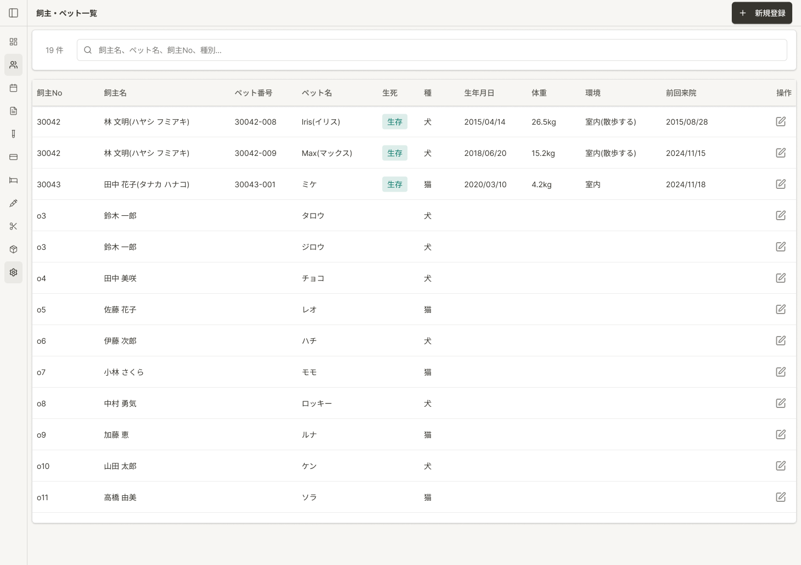

# ペット選択 仕様書

## 概要
- **画面の目的**: 診療記録、入院、トリミング、会計等の各機能において、新規データ作成の対象となるペットを検索・特定するための中間ページ。
- **URLパターン**: `/:feature/select-pet`
  - 例: `/medical-records/select-pet`, `/hospitalization/select-pet` 等
- **アクセス権限**: 遷移元機能の `<Resource>:create` 権限（`RequirePermission` によるルートガード）。例: `/medical-records/select-pet` は `ResourceMedicalRecords` の `create` アクションを要求。

---

## 画面構成

### 1. 検索契約（実装正本）

- **入力**: 単一フリーテキスト `search`、任意の `ownerId`、種別はマスタ id の select（種別名テキスト部分一致ではない）。住所フィールドは無い（BUG-451）。
- **取得**: サーバ側 page + debounce 検索（テナント全ペット初期ロードではない）。
- **権限**: 遷移元機能の `<Resource>:create`（`RequirePermission`）。

