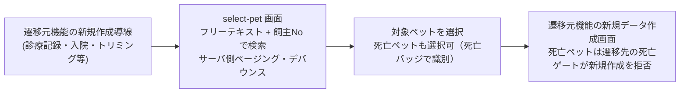

# ペット選択 仕様書

## 概要
- **画面の目的**: 診療記録、入院、トリミング、会計等の各機能において、新規データ作成の対象となるペットを検索・特定するための中間ページ。
- **URLパターン**: `/:feature/select-pet`
  - 例: `/medical-records/select-pet`, `/hospitalization/select-pet` 等
  - 対象 feature: medical-records / hospitalization / trimming / examinations / checkups / accounting / vaccinations
- **アクセス権限**: 通常は遷移元機能の`<Resource>:create`権限。例外としてcheckupsは`ResourceMedicalRecords:create` **かつ** `ResourceMedicalRecords:edit`を要求する（`RequirePermission`）。

**中間ページとしての役割:**

---

## 画面構成

### 1. 検索契約（実装正本）

- **入力**: ラベル「検索（ペット名・飼主名・よみ・電話）」の単一フリーテキスト `search`、任意の「飼主No」（`owner_id` = owners.id）、種別はマスタ id の select（種別名テキスト部分一致ではない）。住所フィールドは無い（BUG-451）。
- **取得**: サーバ側 page（20 件）+ 300ms debounce（テナント全ペット初期ロードではない）。死亡ペットも一覧に出す（`includeDeceased: true`）。死亡ペットは生死列の「死亡」バッジと行のグレーアウトで識別する。危険度高は Popover。
- **死亡ペットの選択（EMR-177）**: 死亡ペットも選択可能。亡くなった後も飼い主との連絡・記録参照が必要なため、選択は許可する。ただし選択は新規記録の作成を許可しない — 新規作成可否は遷移先フォームと BE（`ValidatePetNotDeceased` 等）の死亡ゲートが拒否し、死亡ペットへの新規カルテ・処置・検査・入院・会計・予防接種等は作成できない。生死が「不明」等の既知外 status の個体は引き続き fail-closed で選択不可。
  - 例外: カルテ登録の selector（`/medical-records/select-pet`）で死亡ペットを選択すると、新規作成画面ではなく `/medical-records?pet_id=<id>`（そのペットのカルテ一覧）へ遷移する。一覧から既存カルテを開けば閲覧でき、確定済みカルテには追記（addendum）で連絡記録を残せる。
- **結果列**: 飼主No／飼主名／ペット番号／ペット名／生死／種／生年月日／体重／環境／前回来院／操作。
- **権限**: 通常は遷移元機能の`<Resource>:create`。checkupsは`ResourceMedicalRecords:create` **かつ** `ResourceMedicalRecords:edit`。

