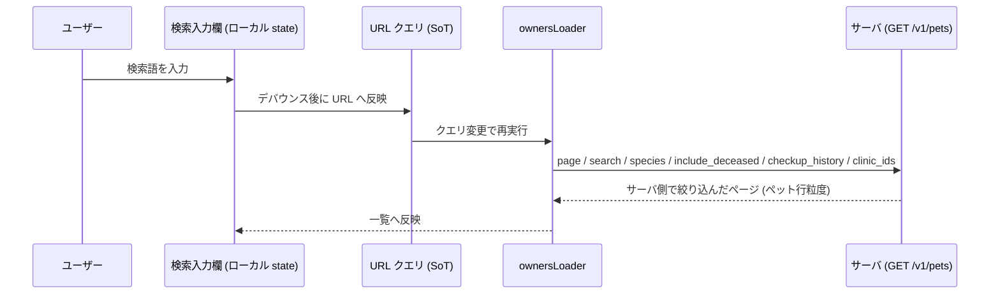

# 飼主・ペット一覧 仕様書 (Owners List)

## 概要
- **画面の目的**: 登録されている飼い主および患者（ペット）の横断検索、および詳細ページへのアクセス。
- **URLパターン**: `/owners`
- **アクセス権限**: `owners:view`（`RequirePermission` によるルートガード。デフォルト action は `view`）。

---

## 1. 画面構成

### 1.1 高機能検索・フィルタ (`PropertyFilter`)
膨大なカルテベースから、目的の個体を瞬時に特定するための UI。
- **フリーテキスト検索 (`search`)**: 飼主名・ペット名（各カナ含む）・電話番号の部分一致（ひらがな↔カタカナ正規化あり）。飼主フルネームは半角/全角/連続空白を無視した順序保持一致（前後空白も無視）。検索欄は 1 つ。半角/全角/連続空白で分割した**複数語は AND**（各語が既存フィールドのいずれかに一致）。1 語は従来どおりフィールド間 OR（飼主フルネームの空白除去一致を含む）。**飼主No** は `owners.id`（レスポンス `owner_number` のエイリアス）の文字列一致、**ペット番号** は `pets.pet_number` の部分一致。いずれも clinic スコープ内のみ。**種別名は対象外**（種別は下の動的フィルタ / `species` クエリを使う）。空白のみの検索は 0 件（全件返却しない）。医療記録一覧の検索とは独立。
- **動的フィルタ**: 動物種別、生存/死亡ステータス、健診受診履歴による絞り込み（`OWNER_FILTER_PROPERTIES`。来院期間フィルタは未実装）。
    - **健診受診履歴 (`checkup_history`)**: ペット自身の健診受診履歴で絞り込む select フィルタ（条件は「次と一致」のみ）。選択肢は `within_1y` / `within_2y` / `within_3y`（直近 N 年以内に受診あり）、`not_within_1y` / `not_within_2y` / `not_within_3y`（直近 N 年以内に受診なし）、`none`（受診履歴なし）の 7 値。期間窓は JST 当日起点 N 年前の暦日を含む（境界包含）サーバ側絞り込み。未指定はフィルタ無し。
- **並び替え**: 一覧の列ソートは #266 サーバサイドページネーション化に伴い**撤去**（ページ内ソートの誤認を防ぐ）。

### 1.2 統合データテーブル (`DataTable`)
ページネーション（1 ページ 20 件）に対応。

| カラム | 説明 |
|:---|:---|
| **飼主No** | 飼主の管理番号。 |
| **飼主名** | 飼主 `is_dangerous` の場合、氏名横に **`⚠ 危険人物`** マークが表示されます（EMR-173、共有 `DangerBadge`）。危険個体（`danger_level` 高/中）を飼育している場合はさらに **`⚠ 危険`**（高=赤）/ **`⚠ 注意`**（中=黄）バッジが表示され、Popover で理由を開示します。 |
| **医院**（拠点横断表示時のみ） | #86 拠点横断フィルタで複数医院を選択した場合に表示。 |
| **ペット番号** | ペット独自の管理番号。 |
| **ペット名** | ペットの名称。 |
| **生死** | 生存/死亡の視覚的バッジ。 |
| **種** | 動物種別。 |
| **生年月日** | 基本属性。 |
| **体重** | ペットマスタの `weight` カラム（ペット編集フォームで更新。カルテからの自動引用ではない）。 |
| **環境** | 室内/室外等の飼育環境。 |
| **前回来院** | 最終診療日。 |
| **操作** | 編集/レポート/削除のドロップダウンメニュー。 |

※ 性別カラムは一覧には存在しない（詳細フォームでのみ編集可能）。

### 1.3 拠点横断フィルタ (`ClinicScopeFilter`)
複数医院に所属するユーザーにのみ表示（`assignedClinics.length >= 2`）。URL の `?clinics=1,2` で選択医院を保持し、選択変更時にローダーが再実行される（所属検証はサーバ側）。別医院の行では飼主名リンクと編集・レポート・削除を抑止し、閲覧用データのみ表示。

---

## 2. 主要なユーザーアクション

- **詳細へのアクセス**: 飼主名リンク、または操作メニューの「編集」から詳細へアクセス。
- **クイック・アクション**（行右端の操作メニューから）:
    - **編集**: 飼主・ペット編集フォームへ遷移。
    - **レポート**: 飼主レポートを別ウィンドウで表示（`medical-records` の閲覧権限が必要）。
    - **削除**: `ConfirmDialog` を経て飼主情報を論理削除。ペットが紐付いている飼主はサーバ側で削除を拒否（409 Conflict、先にペットの削除が必要）。

---

## 3. 技術仕様

### 3.1 一覧取得と URL 同期
- **ロード**: `ownersLoader` が `GET /v1/pets` をペット行粒度で呼び、**サーバ側**で `page` / `limit`（20）/ `search` / `species` / `include_deceased` / `checkup_history`、任意で `clinic_ids` を適用する（クライアント全件取得・クライアント側フィルタではない）。
- **検索入力**: 入力欄はローカル state。URL 反映は **300ms デバウンス**（`SEARCH_DEBOUNCE_MS`）。`useDeferredValue` は owners feature では使わない。
- **SoT**: `page` / `search` / `species` / `include_deceased` / `checkup_history` / `clinics` は URL クエリと同期し、変更時に loader が再実行される。

**検索から一覧描画までのデータ流れ:**

### 3.2 臨床ロジック
- **危険度バッジ**: ペットマスタの `danger_level` カラムを参照。院内スタッフの安全を守るための最重要インジケータとして機能します。共有 `DangerBadge` で描画（EMR-173）: `danger_level` 高=赤 `⚠ 危険`（Popover で `危険理由`）、中=黄 `⚠ 注意`（Popover で `注意理由`）、低・未設定は非表示。理由（`danger_reason`）が空なら `理由未登録`。
- **危険人物マーク**: 飼主マスタの `is_dangerous` が true の場合、氏名横に `⚠ 危険人物` を表示します。ペット危険度（動物取扱注意）とは別概念で、理由 Popover はありません。いずれもスタッフ向け表示で、LIFF・owner 向け契約には出しません。

### API連携
| メソッド | エンドポイント | 用途 | 必須権限 | 必須アクション |
|:---|:---|:---|:---|:---|
| GET | `/api/v1/pets` | ペット行粒度の一覧（サーバ側 page/limit/search/species/include_deceased/checkup_history、任意 clinic_ids）。画面ルート権限は `owners:view` | `owners` | `view` |
| DELETE | `/api/v1/owners/:id` | 飼主情報の論理削除 | `owners` | `delete` |

---
