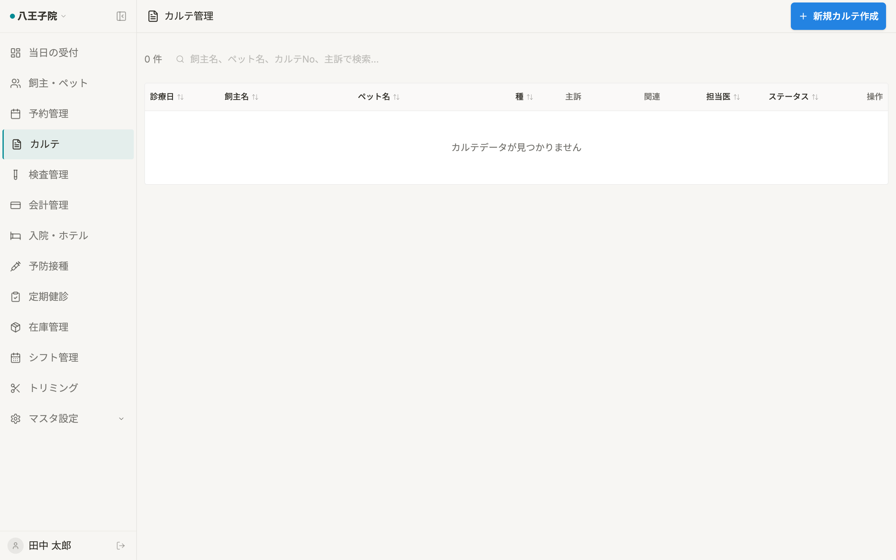

# カルテ一覧 仕様書 (Medical Records List)

## 概要
- **画面の目的**: 院内で行われた全診療記録（電子カルテ）の時系列検索、および診察内容の参照。
- **URLパターン**: `/medical-records`
- **アクセス権限**: `medical-records:view`（`RequirePermission` によるルートガード。デフォルト action は `view`）。行編集・削除・新規カルテ登録は `usePermission` によりさらに `edit`/`delete`/`create` 権限で出し分け。

---

## 1. 画面構成

### 1.1 インテリジェント検索・フィルタ (`PropertyFilter`)
- **全文検索**: 飼主名（かな）、ペット名（かな）、カルテNo、主訴、治療内容、治療メモ、処置名、薬剤名、診察名、在庫品名による横断検索（サーバサイド。病名は検索対象外）。検索・担当医・種・期間・ステータスはローカル state（URL 非同期）。
- **時系列フィルタ**: 診療実施期間での絞り込み。
- **属性フィルタ**: 担当医、動物種、ステータス（作成中/確定済）による抽出。
- **拠点横断フィルタ (`ClinicScopeFilter`)**: 複数医院所属ユーザーのみ、`?clinics=` で選択医院を横断表示。
- **URL**: `page` / `sort` / `order` / `pet_id` / `clinics`。サーバソートは `date` / `owner_name` / `pet_name` / `status`。既定順は診療日降順。

### 1.2 診療履歴テーブル (`DataTable`)
| カラム | 説明 |
|:---|:---|
| **診療日** | 診療が行われた日付。 |
| **飼主名 / ペット名 / 種** | 飼主名、ペット名、動物種（それぞれ独立カラム）。 |
| **主訴 (CC)** | 来院理由の要約。 |
| **関連** | 会計レコードが紐付く場合は「会計」ボタンを表示し、会計詳細へ遷移。未紐付けは「—」表示。 |
| **担当医** | 診察を実施した獣医師。 |
| **ステータス** | **「作成中」**: 臨床内容の追記が可能。 / **「確定済」**: 内容がロックされた法的記録。 |
| **医院** | 複数医院所属時のみ。 |
| **操作** | 編集・削除（権限時）。 |

---

## 2. 主要な臨床連携フロー

- **診察室への誘導**: 予約が「予約確定」または「受付済み」になった時点でカルテが best-effort で自動作成され（トリミング・入院/ホテル予約を除く）、この一覧にも「作成中」として最上位に出現。
- **過去履歴の参照**: 診察中に同ペットの過去カルテをサイドパネルで開き、これまでの経過を確認しながら当日の記録を付けることが可能です。
- **会計への橋渡し**: カルテの「会計(医師確認)」タブで診療内容・費用の医師確認（チェック完了）を行います。

---

## 3. 技術仕様

### 3.1 信頼性と真正性
- **ステータス・ロック**: ステータスが `finalized` となった記録は、サービス層（`medical_record_crud.go`）が更新・削除リクエストを拒否（更新: `確定済みカルテは編集できません。訂正追記 (addendum) を使用してください`／削除: `確定済みまたは下書き以外の診療記録は削除できません`）。DB レベルの制約ではなくアプリケーション側のガードであり、訂正が必要な場合は訂正追記（addendum）で対応する。

### 3.2 パフォーマンス
- **データローディング**: TanStack Query によるキャッシュ管理により、リストと詳細の往復を高速化。
- **ページネーション**: ページ単位の分割表示により、大量の履歴データでも一覧の応答性を維持。

### API連携
| メソッド | エンドポイント | 用途 | 必須権限 | 必須アクション |
|:---|:---|:---|:---|:---|
| GET | `/api/v1/medical-records` | 条件に応じた診療記録の一括取得 | `medical-records` | `view` |
| DELETE | `/api/v1/medical-records/:id` | 誤作成カルテの論理削除 | `medical-records` | `delete` |

---
