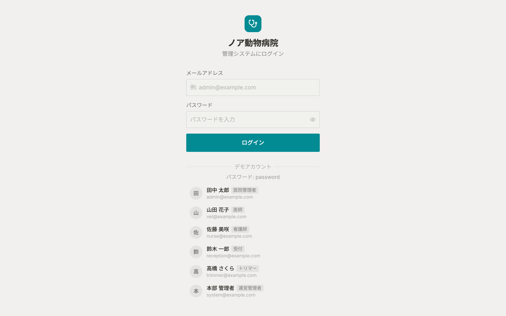

# ログイン 仕様書 (Login)

## 概要
- **画面の目的**: システムを利用するスタッフの本人確認（認証）を行い、セキュアなセッションを開始する。
- **URLパターン**: `/login`
- **アクセス権限**: 全ユーザー（未ログイン時）

---

## 1. 認証機能とプロセス

### 1.1 ログインフォーム
Notion 風のミニマルなデザインを採用。
- **メールアドレス**: 登録済みのスタッフメールアドレス。
- **パスワード**: 8 文字以上の英数字。

### 1.2 ブルートフォース対策
- **レート制限**: 連続したログイン試行に対して制限（5 回 / 分）を適用し、総当たり攻撃を防御します（`middleware/rate_limit.go`）。

---

## 2. アカウント復旧 (Forgot Password)

パスワードを忘れた場合、以下のフローで再設定が可能です。

1.  **申請**: `/forgot-password` にてメールアドレスを入力。
2.  **メール送信**: 有効期限 1 時間のワンタイムトークン（ランダム生成、サーバー側は SHA-256 ハッシュのみ保存）が送信されます。
    - **セキュリティ**: アドレスが存在しない場合でも成功メッセージを表示し、アカウントの存在有無を隠蔽します。
3.  **再設定**: 受信したリンクから `/reset-password` へアクセスし、新しいパスワードを確定。

---

## 3. 技術仕様

### 3.1 認証方式
- **方式**: dual-token (Access/Refresh Token) 方式。
- **セッション維持**: `httpOnly`, `Secure` Cookie により XSS 攻撃からトークンを防護。`SameSite` は開発環境で `Lax`、本番（release モード）ではクロスサイト構成対応のため `None` を使用しています（`backend/internal/auth/http_types.go`）。

### 3.2 パスワードポリシー
- **構成**: 最小 8 文字、英字 1 文字以上・数字 1 文字以上の混在が必須（`backend/internal/auth/http_password.go`）。
- **ハッシュ化**: `bcrypt` (cost=12) による不可逆な暗号化保存。

### API連携
| メソッド | エンドポイント | 用途 | 必須権限 | 必須アクション |
|:---|:---|:---|:---|:---|
| POST | `/api/v1/login` | 認証情報の検証と Cookie 発行 | なし | なし |
| POST | `/api/v1/auth/refresh` | アクセストークンの自動延長 | なし | なし |
| POST | `/api/v1/auth/forgot-password` | パスワード再設定用リンクの送信 | なし | なし |
| POST | `/api/v1/auth/reset-password` | トークン検証と新パスワードの確定 | なし | なし |

---
