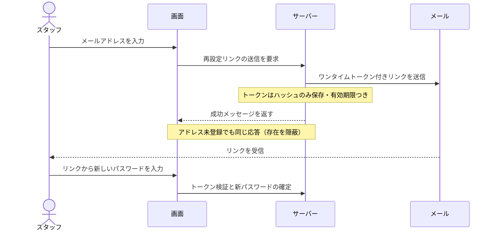

# ログイン 仕様書 (Login)

## 概要
- **画面の目的**: システムを利用するスタッフの本人確認（認証）を行い、セキュアなセッションを開始する。
- **URLパターン**: `/login`
- **アクセス権限**: 全ユーザー（未ログイン時）

---

## 1. 認証機能とプロセス

### 1.1 ログインフォーム
Notion 風のミニマルなデザインを採用。
- **メールアドレス**: 登録済みのスタッフメールアドレス。placeholder「例: admin@example.com」。
- **パスワード**: placeholder「パスワードを入力」。HTML `minLength=6` は submit を止めない。空欄以外の長さ・英数字混在は BE（最小 8 文字）。form は `noValidate`。401 等は `axios` 本体の `isAxiosError` で日本語化する。

### 1.2 ブルートフォース対策
- **レート制限**: 二段構成（`middleware/rate_limit.go`）。いずれも**失敗応答（status >= 400）のみ**が予算を消費し、成功したログインはカウントしません。院内で複数スタッフが同一の外向き IP を共有する運用でも、正当なログインでバケットが枯渇しない設計です。
  - **IP 単位**: 30 回 / 分（burst 30）。NAT 配下の一斉ログインを許容しつつ、失敗の連打を抑制します。
  - **アカウント単位**: 正規化済みメールアドレスごとに 5 回 / 分。IP を跨いだ同一アカウントへの総当たりを抑制します。
- **429 応答**: `Retry-After` ヘッダを返します。画面は「アクセスが集中しています。N秒後に自動で再試行します…」を表示し、Retry-After 待機後に 1 回だけ自動再試行します。再試行も拒否された場合は「アクセスが集中しています。しばらくしてから再度お試しください」を表示します。

---

## 2. アカウント復旧 (Forgot Password)

パスワードを忘れた場合、以下のフローで再設定が可能です。

1.  **申請**: `/forgot-password` にてメールアドレスを入力。
2.  **メール送信**: 有効期限 30 分のワンタイムトークン（ランダム生成、サーバー側は SHA-256 ハッシュのみ保存）が送信されます。
    - **セキュリティ**: アドレスが存在しない場合でも成功メッセージを表示し、アカウントの存在有無を隠蔽します。
3.  **再設定**: 受信したリンクから `/reset-password` へアクセスし、新しいパスワードを確定。

```mermaid
sequenceDiagram
    actor U as スタッフ
    participant F as 画面
    participant S as サーバー
    participant M as メール
    U->>F: メールアドレスを入力
    F->>S: 再設定リンクの送信を要求
    S->>M: ワンタイムトークン付きリンクを送信
    Note over S: トークンはハッシュのみ保存・有効期限つき
    S-->>F: 成功メッセージを返す
    Note over S,F: アドレス未登録でも同じ応答（存在を隠蔽）
    M-->>U: リンクを受信
    U->>F: リンクから新しいパスワードを入力
    F->>S: トークン検証と新パスワードの確定
```

---

## 3. 技術仕様

### 3.1 認証方式
- **方式**: dual-token (Access/Refresh Token) 方式。
- **セッション維持**: `httpOnly`, `Secure` Cookie により XSS 攻撃からトークンを防護。`SameSite` は開発環境で `Lax`、本番（release モード）ではクロスサイト構成対応のため `None` を使用しています（`backend/internal/auth/http_types.go`）。

### 3.2 パスワードポリシー
- **構成**: 最小 8 文字、英字 1 文字以上・数字 1 文字以上の混在が必須（`backend/internal/auth/http_password.go`）。
- **ハッシュ化**: `bcrypt` (cost=12) による不可逆な暗号化保存。

### 3.3 ログイン後のパスワード変更
サイドバーのアカウントメニューから開く `ChangePasswordDialog` は `axios` 本体の `isAxiosError` でエラーを判定する。`Axios.create()` インスタンスに `isAxiosError` は無い。BE が 400/401 を返してもダイアログ内にエラーを出し、アプリ全体をクラッシュさせない。

### API連携
| メソッド | エンドポイント | 用途 | 必須権限 | 必須アクション |
|:---|:---|:---|:---|:---|
| POST | `/api/v1/login` | 認証情報の検証と Cookie 発行 | なし | なし |
| POST | `/api/v1/auth/refresh` | アクセストークンの自動延長 | なし | なし |
| POST | `/api/v1/auth/forgot-password` | パスワード再設定用リンクの送信 | なし | なし |
| POST | `/api/v1/auth/reset-password` | トークン検証と新パスワードの確定 | なし | なし |

---
