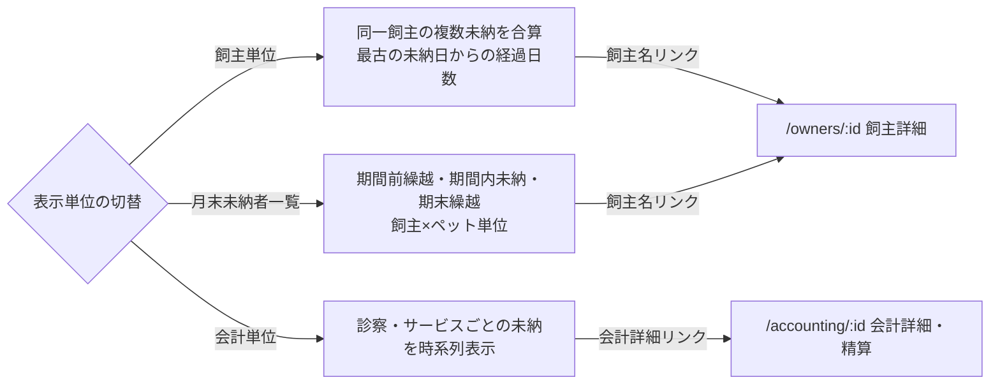

# 未納者一覧（売掛管理） 仕様書 (Unpaid List)

## 概要
- **画面の目的**: 指定した期間内に支払予定日がある未納の売掛金を把握し、督促や回収業務を支援するための管理ビュー。
- **URLパターン**: `/accounting?tab=unpaid`
- **アクセス権限**: 会計管理権限が必要（`ResourceAccounting`）

---

## 画面構成

### 1. 売掛金サマリー
抽出された条件における財務リスクを即座に確認できます。
- **売掛金総額**: 税込の未納累計額。
- **対象件数 / 人数**: 該当する会計の総数と飼主の人数。

### 2. 管理ツールバー
- **期間指定**: 開始日・終了日の2つの日付で支払予定日の範囲を絞り込み（飼主単位・会計単位・月末未納者一覧の全モード共通）。未指定時は JST 当月を既定にして API を発火する（空のまま「未納者はいません」と出さない）。
- **表示単位の切替**: 用途に応じて集計軸を変更。
    - **飼主単位**: 同一の飼い主が抱える複数の未納分を合算。
    - **会計単位**: 個別の診察・サービスごとの未納分を時系列で表示。
    - **月末未納者一覧**: 期間前繰越・期間内未納・期末繰越を飼主×ペット単位で表示。

---

## 表示項目と操作

### グルーピング別の詳細
- **飼主単位表示**: 最古の未納日から終了日までの経過日数を算出し、回収の優先順位判断を助けます。
- **会計単位表示**: ペット名や具体的な診療日を確認でき、詳細な内訳の把握に適しています。
- **月末未納者一覧表示**: 期間前繰越額（期間開始前の未納）・期間内発生した未納額・期末繰越額を飼主×ペット単位の一覧で確認できます。

### 直接ナビゲーション
- **飼主詳細へ**: 飼主単位・月末未納者一覧表示で飼主名リンクをクリックすると、連絡先や全履歴を確認できる `/owners/:id` へ遷移します。
- **会計詳細へ**: 会計単位表示で飼主名セルの会計詳細リンクをクリックすると、精算処理を行える `/accounting/:id` へ直接遷移します。

---

## 技術仕様

### パフォーマンスと拡張性
- **URLパラメータ同期**: 期間（`start_date`/`end_date`）・表示単位（`group_by`）は URL と同期され、共有やブックマークが可能です。`group_by=period` が月末未納者一覧で、旧 `group_by=monthly` の URL はレガシーエイリアスとして同モードで開きます。
- **ページネーション**: `page` は URL ではなくローカル `useState` で管理し、1ページ20件で表示します。

### API連携
| メソッド | エンドポイント | 用途 | 必須権限 | 必須アクション |
|:---|:---|:---|:---|:---|
| GET | `/api/v1/accountings/unpaid` | 期間・表示単位に応じた未納データの集計取得 | `accounting` | `view` |
| GET | `/api/v1/accountings/unpaid-period` | 月末未納者一覧の期間集計（`start_date`/`end_date` 必須）取得 | `accounting` | `view` |
| GET | `/api/v1/accountings/unpaid-balance` | 特定飼主の未入金残高と件数の取得（本画面からは未呼出。実際は会計詳細画面 `/accounting/:id` の `OwnerUnpaidBalanceCard` から呼び出される） | `accounting` | `view` |

---

